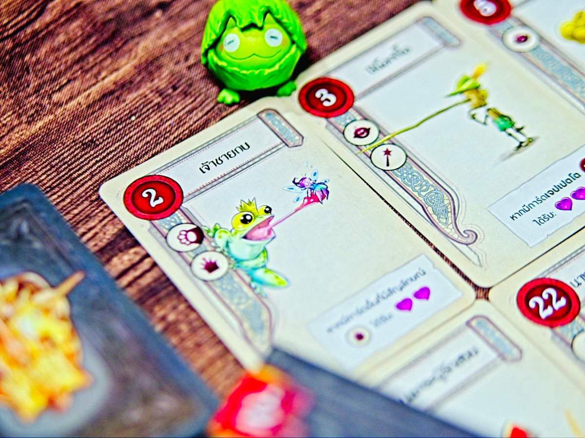

3 Chapters - การ์ดเกมเล่นง่ายคั่นเวลาธีมว่าด้วยเหล่าตัวละครเอกในนิทานที่จะมาจับคู่รวมพลังกันผลิตแต้มให้กับเรา

ไอเดียหลักของเกมนี้คือการทำคอมโบระหว่างการ์ด ซึ่งมันจะแนวๆว่าถ้าเล่นใบนี้แล้วมีใบนั้นคุณจะได้แต้มเท่านั้นเท่าที่นี้ ถ้าเล่นใบนี้แล้วคุณจะได้แต้มตามไอคอนซักอย่างที่คุณมีอะไรทำนองนั้น 

พอเราเก็ทภาพว่าจะทำคอมโบยังไงเกมก็จะแบ่งออกเป็น 3 องก์ (เป็นที่มาชื่อ 3 Chapters) ในตอนแรกจะให้เรา draft การ์ดกันก่อนจนได้ครบ 8 ใบ 

จากนั้นองก์ที่ 2  จะให้เราผลัดกันเอาการ์ดที่เก็บมาก่อนหน้ามาวัดกันทีละใบ หลักๆก็คือเราอยากวางเรียงลำดับให้มันออกคอมโบทำแต้มแบบที่เราคิดไว้นั้นแหละ แต่ตรงนี้มันมีกิมมิคว่าใครลงเลขเยอะสุดจะได้โบนัสเพิ่ม มันก็เลยมีจุดที่แบบจะทำคอมโบดีหรือจะลงเลขสูงไปกินแต้มใหญ่ดี แต่ใดๆการ์ดจะอยู่กับเราเหมือนเดิมไม่เปลี่ยนมือไปหาคนอื่นแล้ว

พอมาองก์ที่ 3 ก็คือเอาการ์ดที่มีมาตั้งแต่ตอนแรกนั้นแหละมานับคะแนนแบบโยงกันไปมาผลิตพลังอีกรอบนึง เกมก็สั้นๆง่ายๆแค่นี้เลย

---
🐸 ME - #กบโอเค เล่นตอนแรกเนี่ยไม่คิดอะไรมาก แต่พอลองรอบสองแล้วเริ่มจำการ์ดได้ว่าอะไรมันต้องคู่กับอะไร เวลา draft การ์ดนี้เราจะเริ่มคิดเยอะละ แบบเก็บไอ้นี้ไว้แล้วรอบหน้ามันจะมาไหม ตอนจะเล่นก็แบบจำใครเก็บการ์ดมังกรเลขใหญ่ไปฟระจะบิดทำคะแนนตานี้เลยดีไหม คือมันสนุกกว่าที่คิดนะ 

แต่ในขณะเดียวกันข้อพึงระวังมันก็คือเกมมันไม่ได้มี depth เยอะ การ์ดมันก็จะ fixed ประมาณนึงว่าใบไหนต้องคู่กับใบไหน (ตามธีมในนิทานเลย) อารมณ์หลักที่ชอบเลยออกไปในแนวกั๊กการ์ดตอน drafting มากกว่า แต่เกมมันง่ายดีกติกาไม่ต้องรื้อมาอ่าน เอาไว้เล่นเพลินๆได้

🔴 expert  | 🟠 regular | 🟢casual/family | 🧸newbie : เกมสั้นคั่นเวลาอ่านน้อยคอมโบเพลินๆ

---
> 🐸 ME - ความเห็นส่วนตัวสำหรับตัวเองเพื่อตัวเอง
> 🔴 expert - ผ่านเกมมาเยอะ อ่านเกมใหม่ตลอด
> 🟠 regular - เล่นบ่อยเล่นประจำออกตระเวนเล่น
> 🟢casual/family - เล่นที่ร้านเล่นหรือกับครอบครัว
> 🧸newbie - มือใหม่พึ่งเข้าวงการผ่านเกมตามร้านมานิดหน่อย

---  
this is a gifted product from Tower Tactic Games no money changed hand for this content. ได้รับสินค้าโดยไม่มีค่าใช้จ่าย คอนเทนต์ทำเพื่อแสดงความเห็นส่วนตัวเกี่ยวกับเกมโดยไม่มีการจ้างวาน]()