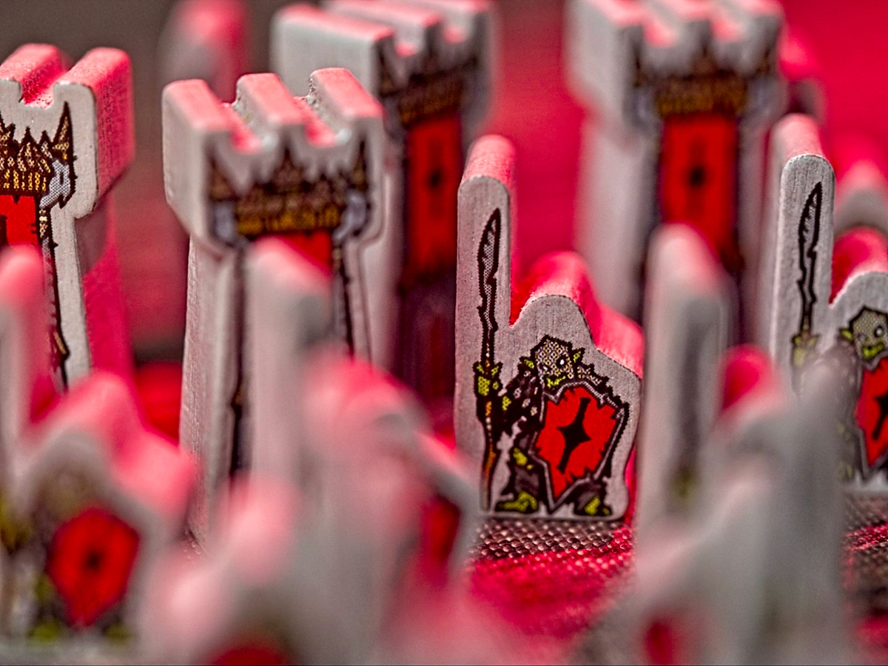
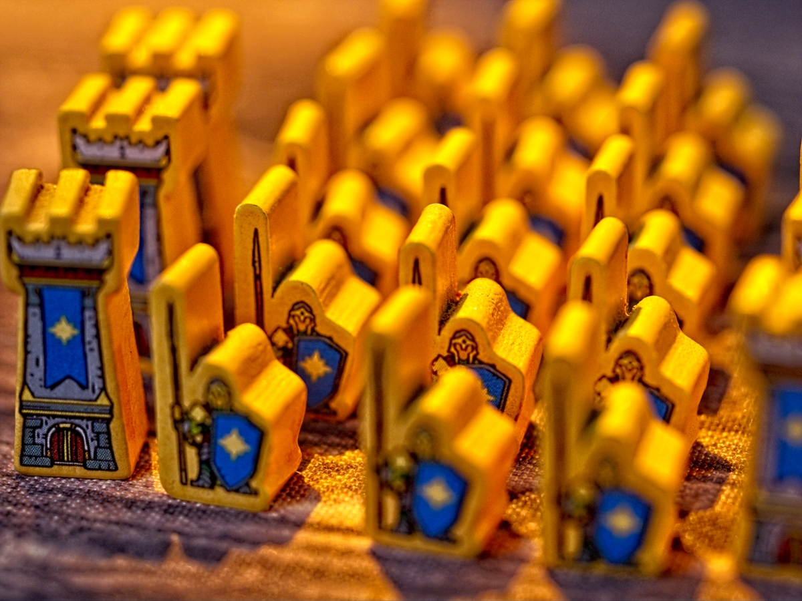
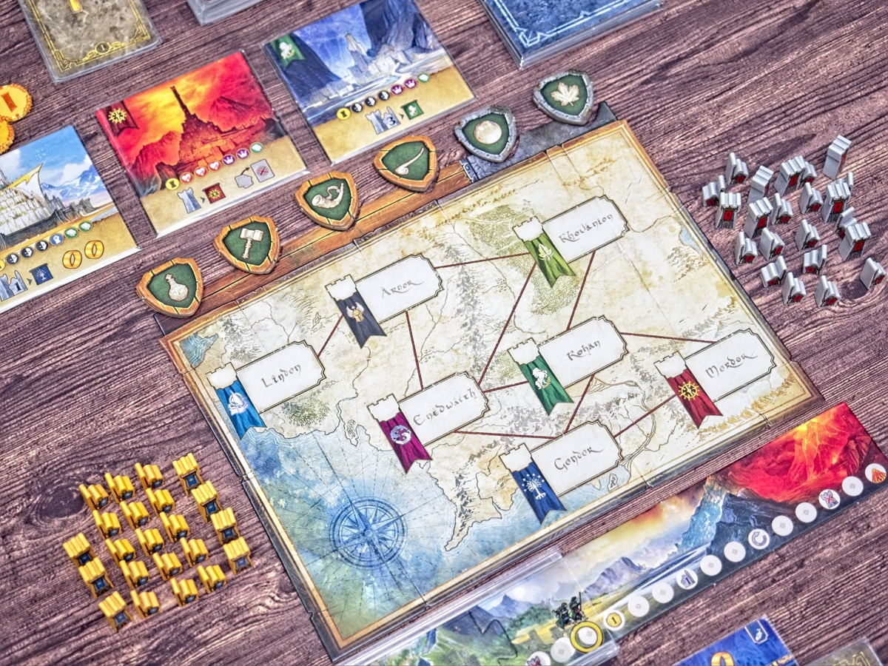
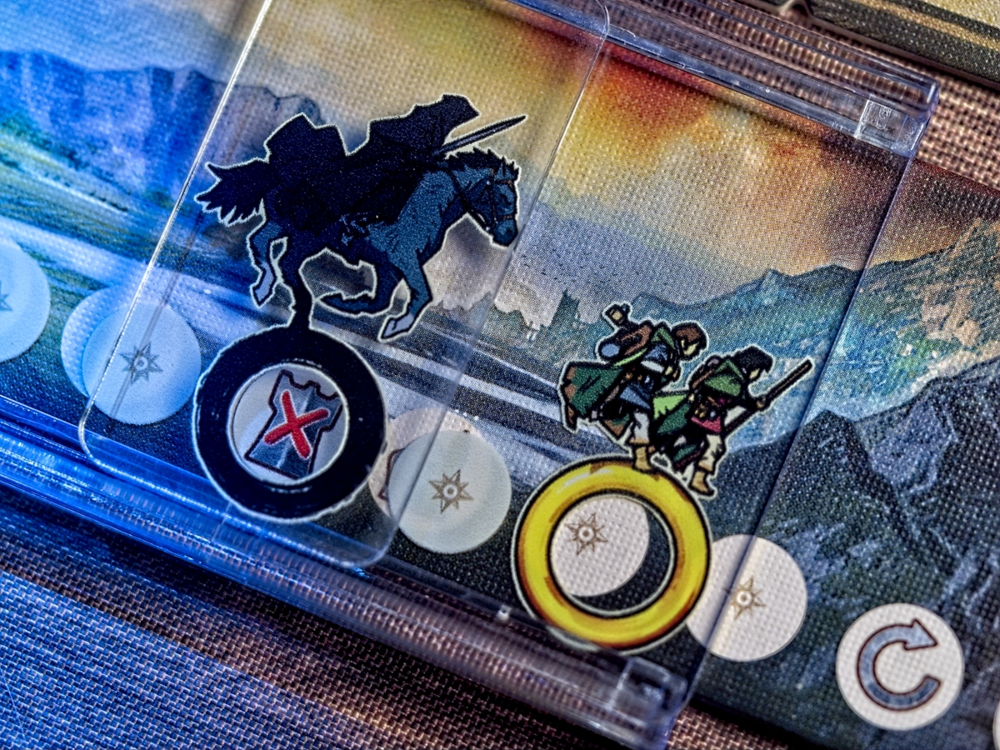
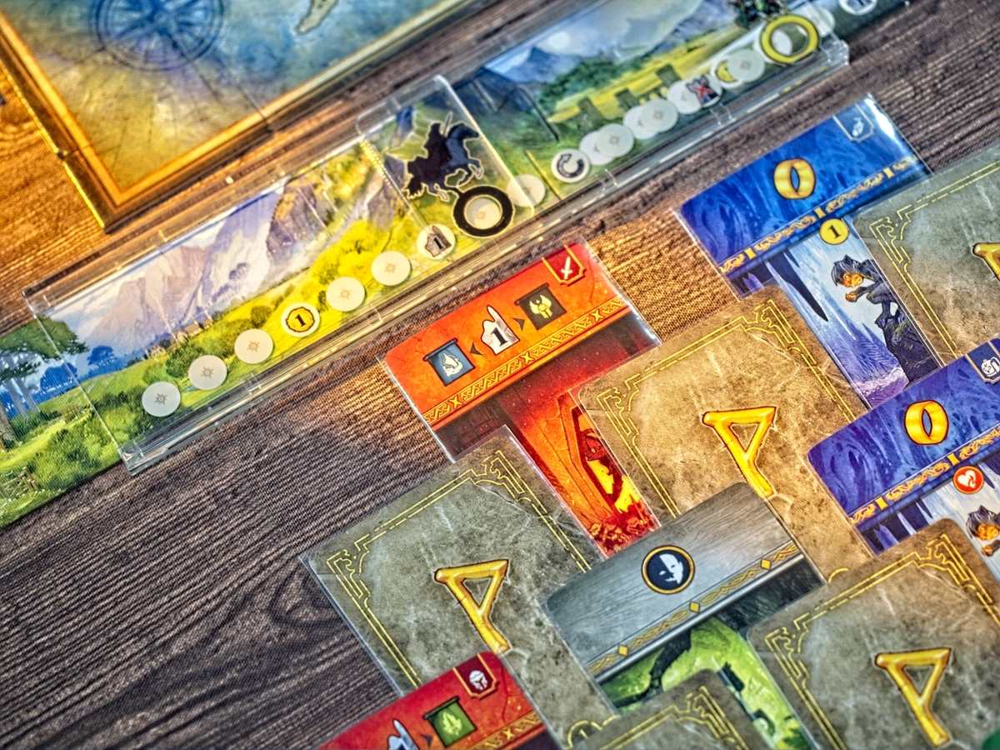

The Lord of the Rings Duel for Middle-earth + Allies expansion -สงครามระหว่างความดีและความเลวร้ายที่ปะทุ ณ มัชฌิมโลก จากรางวัล 2024 Golden Geek Best 2 Player ที่ได้รับการโหวตจากชุมชนเกมกระดานที่ใหญ่ที่สุดในโลก ขายดีจนแม่ง sold out ในระดับผู้จัดจำหน่ายไปเรียบร้อย (แต่ของเติมกำลังมา) สู่ตัวเสริม Allies ที่ทำเกมสมบูรณ์ยิ่งขึ้นไปอีก 

---
โพสนี้ขอเปลี่ยนวิธีเล่าหน่อย แบบมันมีสตอรี่นิดนึง คือผมไม่เคยเล่นเกมนี้มาก่อนเลยจนกระทั้งเมื่อเร็วๆนี้ เหตุผลง่ายๆคือปกติมี 2 คนผมไม่ค่อยเล่นบอร์ดเกม ก็เลยไม่ได้สนใจเท่าไร แต่พอตัวเสริม(คู่มือ)ภาษาไทยมาค่ายเค้าติดต่อมาว่าอยากรีวิวไหม ก็เลยโอเครับมาได้ แต่บอกเค้าว่าผมมะมีตัวหลักนะส่งมาได้ไหม ค่ายเค้าก็หายไปซักพักพร้อมกับบอกว่ามีตัวเดโมอยู่ส่งมาให้ยืมก่อนได้ ผมก็ชิลลลเดี๋ยวผมไปซื้อตัวหลักเองได้ไม่ซีๆอยากหาเรื่องเล่นมานานล่ะ ก่อนจะพบว่าไม่มีที่ไหนขายเลย....... sold out ทุกที่ ทุกแอป... โอเคเชื่อล่ะขายดี คือค่ายเค้าไม่ได้งกหรือประหยัดงบอะไร แต่เค้าก็ไม่มีของเหมือนกัน.... แต่ผมก็แก้ปัญหาโดยการไปหยิบยืมเพื่อนมาก่อน รอดตัวไป

ค่ายก็บรีฟมาอีกนิดว่าขอให้ช่วยรีวิวตัวเสริมก่อนตัวหลักได้ไหม ปากก็บอกครับๆแหละ แต่ผมก็แบบเห้ยตัวหลักยังไม่เคยเขียนถึงจะไปโม้ได้ไงว่ะว่าตัวเสริมดี ก็เลยจะเขียนถึงตัวหลักไปด้วยนะเผื่อใครกำลังรอซื้อตอนของมาเติม ส่วนรีวิวตัวเสริมแบบสรุปคือ --- ซื้อๆไปเหอะ เติมการ์ดนิดเดียวแต่ทำเกมสมบูรณ์ขึ้น ไม่แพงด้วย --- จบรีวิวตัวเสริมก่อนตามสัญญา.....

---
เกมยกไอเดียจาก 7 Wonder Duel มาตีความใหม่ เปลี่ยนผู้เล่นเป็นฝ่ายเสรีชน กับ ฝ่ายจอมมารเซารอน เกมไม่มาแข่งคะแนนแต่มาแข่งกันทำเงื่อนไขเพื่อชนะแทน

เกมแบ่งเป็น 3 ยุค จะใช้ระบบวางการ์ดแบบใน 7 Wonder Duel นั้นคือการวาง หงาย/เปิด สลับกันเป็นพีระมิด คือผู้เล่นจะเห็นการ์ดที่จะหยิบได้ล่วงหน้าบางส่วน ในตาเราก็แค่เลือกว่าจะหยิบการ์ดใบไหน หรือจะเลือกหยิบเพื่อทิ้งเอาเงินแทนก็ได้ จั่วหมดก็จบยุคง่ายๆแค่นั้น พวกการ์ดบางใบจะต้องจ่ายทรัพยากรแต่ก็สามารถอัพเกรดจากของเดิมได้ฟรีด้วยถ้ามันรองรับกัน

การ์ดมันก็จะมีกลุ่มที่เป็นทรัพยากรให้เราเอาไปแลกซื้อการหอคอยไว้ยึดพื้นที่ มีกลุ่มส่งทหารไปสู้ (เจอกันก็ 1:1 แลกกัน) กลุ่มสะสมไอคอนพันธมิตรที่เอาไปแลกความสามารถพิเศษได้ แล้วก็แหวนที่เอาไว้เดินโฟรโด้กับแซมหรือเอาไว้เดินนาซกูล

เกมจบกันที่ใครยึดดินแดนได้ครบ หรือรวมพันธมิตรได้ทุกกลุ่ม หรือโฟรโด้เอาแหวนไปทิ้งที่มอร์ดอได้ก่อน / โฟรโด้โดนนาซกูลจับ

---
ส่วนตัวเสริม Allies เนี่ยจะเพิ่มการ์ดมาให้ฝ่ายละ 7 ใบ ในแต่ละเกมจะสุ่มมาให้คนละ 3 ใบ ซึ่งมันก็จะเพิ่มลูกเล่นแบบใช้ครั้งเดียวมาให้ ก็จะตามธีมหน่อยๆแบบถ้าเล่นบัลร็อคก็จะวางโทเคนขวางไม่ให้ฝ่ายศัตรูเดินข้ามไปมาได้ไรงี้ กับทุกตัวมันมีท่าแบบแรงด้วย แต่การจะใช้ท่าแบบแรงมันจะบังคับให้เราไปหยิบการ์ดที่มีโทเคนพลังที่วางไว้ตอน setup ด้วย 

คือมันอาจจะดูไม่มากแต่พอเกมมันจากเดิมมันมีความสมดุลย์แล้วก็ต้องอ่านเกมดักทางกันการมีตัวเลือกที่แบบ element of surprise ก็ช่วยให้เกมมีมิติกับดักทางยากขึ้น

---
🐸 ME - #กบชอบ อย่างที่บอกคือปกติไม่ค่อยเล่นเกมสองคนเท่าไร ตอน 7 Wonders Duel ตัวเสริมครบก็รู้สึกมันจุกจิกไปหน่อยสำหรับเกม 30 นาที (แต่มันก็มีบอดี้ที่หนักกว่านะ) ส่วนเกมนี้ผมชอบที่มันจูนกติกาให้คลีนขึ้นมาก อ่านกติกาแป๊บเดียวก็เล่นได้ละ แต่ weight กำลังสวย มิติการนำเสนอแผนที่แล้วมาทำการแข่งกันก็ให้อารมณ์การชักเย่อหลายแกนที่เราต้องเลือกว่าจะทำอะไรดีอยู่ในที

ส่วนที่น่าตั้งข้อสังเกตไว้คือมันเล่นแล้วไม่ได้ฟีล LotR อะไรนะ คือมันมีแค่ตอนไล่จับโฟรโด้แหละ แต่ไอ้ความมีแผนที่รบกับตามหาพันธมิตรมันดู abstract ไปหน่อย แต่ใดๆก็ไม่ใช่ข้อเสียอะไร แค่ไม่อยากให้คาดหวังว่าจะแบบเห็นฉากโน้นนี่โผล่มาในหัวแบบ War of the Ring อะไรแบบนั้น

🔴 expert  | 🟠 regular | : เกมสั้นคั่นเวลาสำหรับขายูโรเกมเล่นง่ายกติกาคลีน จูนระบบ 7 Wonders Duel ในคลีนขึ้นแต่ยังคงมิติการตัดสินใจเอาไว้ได้ดี

🟢casual/family | 🧸newbie : เล่นง่าย กติกาไม่ซับซ้อน การ์ดมีแต่ไอคอนที่ทำไม่กี่อย่าง แรกๆอาจจะงงเรื่อง concept ทรัพยากรกับอัพเกรดหน่อย แต่คู่มือเขียนค่อนข้างเข้าใจง่ายนะ

---
> 🐸 ME - ความเห็นส่วนตัวสำหรับตัวเองเพื่อตัวเอง
> 🔴 expert - ผ่านเกมมาเยอะ อ่านเกมใหม่ตลอด
> 🟠 regular - เล่นบ่อยเล่นประจำออกตระเวนเล่น
> 🟢casual/family - เล่นที่ร้านเล่นหรือกับครอบครัว
> 🧸newbie - มือใหม่พึ่งเข้าวงการผ่านเกมตามร้านมานิดหน่อย

---  
this is a gifted product from Well Designed Game - WDG Distributor - no money changed hand for this content. ได้รับสินค้าโดยไม่มีค่าใช้จ่าย คอนเทนต์ทำเพื่อแสดงความเห็นส่วนตัวเกี่ยวกับเกมโดยไม่มีการจ้างวาน