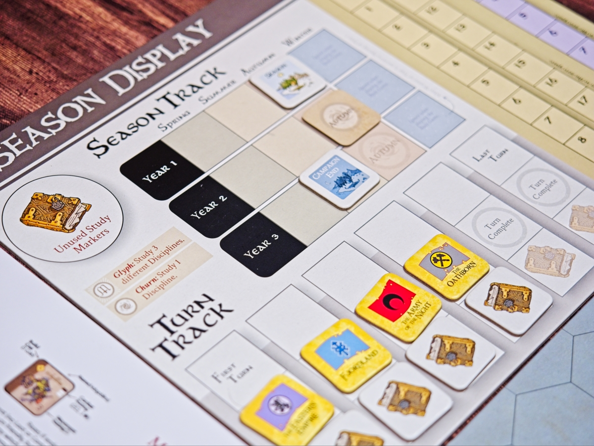
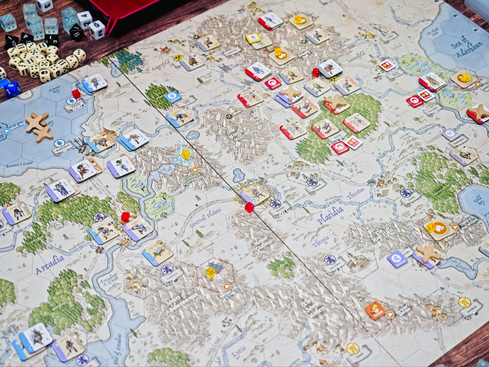

Burning Banners - เกมสงครามแฟนตาซีที่เล่าถึงการต่อสู้และพันธมิตรของเผ่าพันธ์ทั้งสี่ในอาณาจักรแห่ง Kalar 

ถึงจะมีหน้าตาเป็น Wargame ตามขนบแบบ Hex & Counter แต่ผมเล่นแล้วรู้สึกเหมือนเราได้ไปอยู่ในยุคที่บอร์ดเกมกำลังเริ่มต้นแล้วเราได้ขยับตัวละครแฟนตาซีของเราเดินทางไปในโลกกว้างบนแผนที่แบบตารางหกเหลี่ยมมากกว่านะ เพราะตัวแผนที่มีรายละเอียดที่สวยงามเอามากอยู่

เกมมีหลายซีนารีโอ้ที่เงื่อนไขชนะแตกต่างกันแต่หลักๆก็คือไปตีเมืองฝ่ายอื่นในแตกนั้นแหละ ระบบหลักของเกมคือ 1 ไทล์จะแทนทหาร 1 กอง และสามารถมีไทล์ฮีโร่วางซ้อนได้ 1 ตัว ความสามารถหลักของตัวไทล์จะมีหลักๆก็คือระยะทางที่เดินได้ กับจำนวนเต๋าที่จะใช้ตอนทอยสู้ บางตัวจะมีความสามารถพิเศษนิดหน่อยพวกบินได้หรือชนะ tie-break

ระบบการต่อสู้คือจะใช้เต๋า d6 หรือ d8 จำนวนก็แล้วแต่ตัวทหารทอยได้ 5 ขึ้นไปก็จะถือว่าได้ 1 hit ทั้งสองฝ่ายก็เอา hit มาชนกันใครเยอะกว่าก็ไปลงฝ่ายตรงข้ามแต่ละทหารโดน 2 hit ก็ตาย ง่ายๆแค่นั้น

แต่สิ่งที่เป็น highlight จริงๆของเกมก็คือออออ ระบบเวทมนต์ที่จะมีทั้งเวทย์ประจำเผ่าแล้วก็เวทย์ส่วนกลางที่ทุกฝ่ายก็ใช้ได้ ก็มีหลากหลายดีทั้งแบบเพิ่มเต๋าตัวเอง ลดเต๋าชาวบ้าน เสกโน้นนี่ก็มี แผ่นดินไหวก็มา ตรงนี้ทำให้เกมมี element of surprise เยอะอยู่ แล้วก็ในแผนที่จะมีพวกดันเจี้ยนให้เราแวะไปตีมอนเพื่อหาอาวุธในตำนานมาใช้เพิ่มความสามารถได้ด้วย

จุดที่ต้องระวังของเกมมีสองเรื่อง หนึ่งคือมันเป็นแบบผู้เล่นคนเดียวทำแอคชั่นตัวเองให้หมดก่อนที่จะส่งต่อไปให้คนอื่น หมายความว่าถ้าระหว่างเล่นไม่มีใครมาตีเราเราก็จะเหงาเอามากๆ แต่เกมจะยังมีจังหวะในเราแทรกได้ผ่านการเล่นการ์ดเวทย์มนต์ ตรงนี้คือถ้าเป็นคนที่ไม่สนใจมองรอบการเล่นชาวบ้านก็อาจจะไม่เหมาะกับเกมนี้เท่าไร

จุดที่สองที่ไม่ใช้ข้อเสียโดยตรง เพราะต้องเข้าใจธรรมชาติของ 'เกมสงคราม' คือมันดวงเยอะครับ คือ mindset คุณต้องเข้าใจว่าสงครามมันก็แบบนี้ ทอยดี ทอยกากสมองก็ต้องคิด narrative เป็นเรื่องเป็นราวมารองรับ คือเกมน่ะต้องเล่นให้ชนะนี่แหละแต่ดวงไม่มาก็ช่วยบ่ดั่ย แต่สิ่งที่เราจะได้คือการที่คนทั้งวงมาร่วมกันร้อยเรียงสร้างเรื่องราวในฉากของเกมกัน

---
🐸 ME - #กบโอเค เป็นเกมที่ฉีกความเฉิ่มของ hex & counter เรียบๆเอามาได้ทะลุกระดานเอามากๆ ตอนเล่นด้วย mindset แบบเกมสงครามแฟนตาซีนี้ก็เพลินอยู่ ระบบการเล่นแทบไม่มีจุดที่จุกจิกเกินจำเป็นและมีเงื่อนไขที่ make sense ทำให้จำได้ง่าย เรียกว่าหลักๆคือ เดิน-ตี-ร่ายเวทย์ ก็ได้  ช่วงแวะไปฟาร์มเก็บสมบัติตอนสงครามกำลังอุบัติทั่วดินแดนนี้ก็ฉายภาพ RPG หลุดกรอบเกมสงครามแท้ๆได้อย่างงดงาม

🔴 expert  | 🟠 regular | : เกมสงครามที่การวางแผนภาพใหญ่อาจจะไม่สำคัญนักเน้นการปรับเปลี่ยนแผนเอาทุกรอบเพราะไม่รู้ว่าจะทอยตีได้ไหม ระบบการเล่นคลีนเป็นส่วนมาก ความสามารถไม่รุงรัง

🟢casual/family | 🧸newbie : เกมสงครามแฟนตาซีที่ระบบการเล่นจริงๆไม่ได้ยุ่งยาก แต่รูปแบบการนำเสนอมันจะเนิร์ดหน่อย ตั้งใจอ่านรูลหรือถ้ามีคนนำเกมกับอ่านการ์ดเองได้จริงๆก็เล่นได้นะ

---
> 🐸 ME - ความเห็นส่วนตัวสำหรับตัวเองเพื่อตัวเอง
> 🔴 expert - ผ่านเกมมาเยอะ อ่านเกมใหม่ตลอด
> 🟠 regular - เล่นบ่อยเล่นประจำออกตระเวนเล่น
> 🟢casual/family - เล่นที่ร้านเล่นหรือกับครอบครัว
> 🧸newbie - มือใหม่พึ่งเข้าวงการผ่านเกมตามร้านมานิดหน่อย

