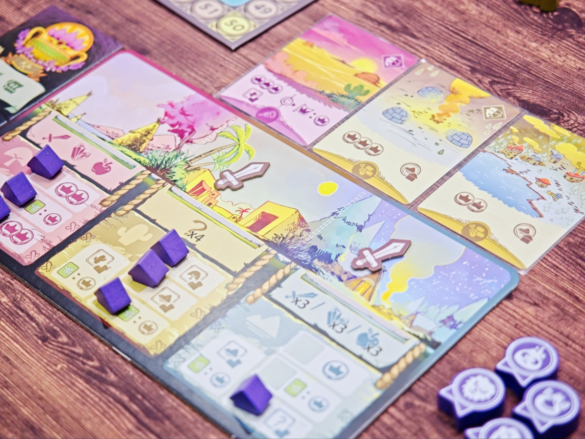
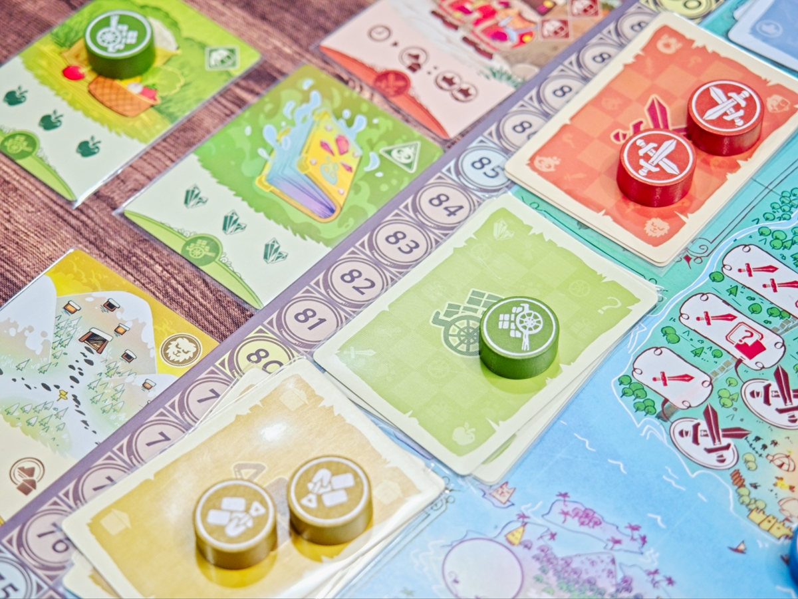
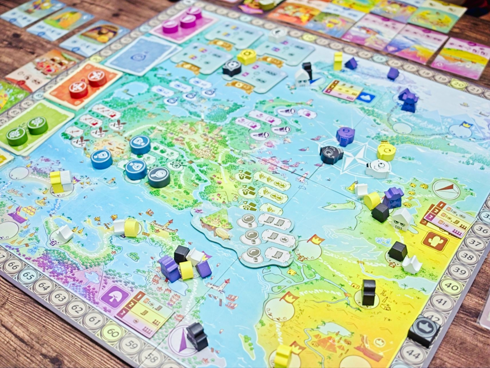

Explorers of Navoria - เกมยูโรระดับ (พยายามจะ) เบาที่เล่าถึงดินแดน Navoria และเหล่าเผ่าต่างๆที่จะออกสำรวจพื้นที่และพัฒนาเผ่าตัวเองให้ดีขึ้น

เกมเดินด้วยระบบ draft action 2 ขยักที่มีกิมมิคเยอะอยู่ โดยขยักแรกจะเป็นการดราฟการ์ด ที่เราไปเลือกหยิบเลยไม่ได้ แต่ต้องล้วงถุงหยิบโทเคนมาสองอันก่อนแล้วค่อยเลือกว่าจะหยิบสีไหนจากของที่เราหยิบมา หรือถ้ารอบก่อนหน้ามีโทเคนสีที่เราต้องการทิ้งไว้ก็หยิบอันนั้นแทนก็ได้ พอเราผลัดกันหยิบจนครบคนละสามใบจะเข้าสู่การดราฟ์ขยักที่สอง

รอบนี้จะเอาโทเคนที่เราวางดราฟ์ในช่วงแรกนั้นแหละมาผลัดกันหยิบไปลงทำแอคชั่นแบบ worker placement ส่วนแอคชั่นทั้งหมดทั้งมวลในเกมหลักๆก็คือเอาไว้เดินทางตามเกาะต่างๆ (เดินแทรคนั้นแหละ) มี 3 เกาะ ก็เหลือก็จะเป็นการเปิดช่องสร้างหมู่บ้านแล้วก็สะสมทรัพยากรทำโบนัสจากช่องที่เราเปิดไว้

---
🐸 ME - #กบเฉย จุดดีและจุดอ่อนของเกมเป็นเรื่องเดียวกันคือมันมีวิธีการทำคะแนนหลายจุดทั้งการอยากหยิบสะสมสีการ์ด หรือสะสมไอคอนเพื่อปลดตัวคูณแต้ม หรือสะสมการ์ดแนวสร้างเงื่อนไขทำคะแนนจากการ์ดที่มี หรือกระทั้งการ์ดที่ให้ทรัพยากร/แต้มในตอนจบรอบ คือมันหลากหลายมาก ออกจะมากเกินไปสำหรับเกมเดินแทรคที่มีเป้าหมายคือกลุ่มผู้เล่นระดับครอบครัว แต่ในขณะเดียวกันมันก็มอบตัวเลือกในการตัดสินใจที่มากมายให้ผู้เล่นระดับครอบครัวได้ลองหยิบโน้นผสมนี้หาส่วนประกอบสนุกๆไปกับเกมได้ ไม่รู้ว่าเพราะความอยากจะทำเกมยากแต่โดนค่ายบีบให้เกมง่าย หรือว่าเพราะอยากทำเกมให้มันแตกต่างก็เลยยัดของลงไปเยอะๆจนเกินบอดี้ที่ตั้งใจไว้

แต่ส่วนตัวผมชอบอะไรที่แบบ family ก็ family จะ gamer ก็ gamer ไปเลยสิ

🔴 expert  | 🟠 regular | : ระบบถึงจะดูเยอะแต่ก็คลีนดี draft 2 จังหวะอาจจะมีตัวแปรที่ควบคุมไม่ได้อย่างไทล์ที่จั่วได้ แต่พอเอามาร่วมกับการหยิบไทล์ทำแอคชั่นก็คิดว่าเกลี่ย turn order มาสวยอยู่

🟢casual/family | 🧸newbie : ในภาพรวมไม่ใช่เกมที่ยุ่งยากปวดหัวแต่อย่างใด สามารถค่อยๆหยิบของทดลองท่าหรือค้นหาวิธีเล่นไปเรื่อยๆได้นานเลยกว่าจะรู้สึกว่าลองครบ

---
> 🐸 ME - ความเห็นส่วนตัวสำหรับตัวเองเพื่อตัวเอง
> 🔴 expert - ผ่านเกมมาเยอะ อ่านเกมใหม่ตลอด
> 🟠 regular - เล่นบ่อยเล่นประจำออกตระเวนเล่น
> 🟢casual/family - เล่นที่ร้านเล่นหรือกับครอบครัว
> 🧸newbie - มือใหม่พึ่งเข้าวงการผ่านเกมตามร้านมานิดหน่อย

---  
เกมนี้เล่นกล่องของบอร์ดก่อนนอน ที่ค่ายเค้าส่งของไปให้ แต่เค้าไม่ได้ส่งมาให้ผมนะ ได้เล่นแล้วหยิบมาเล่าต่อเฉยๆ

