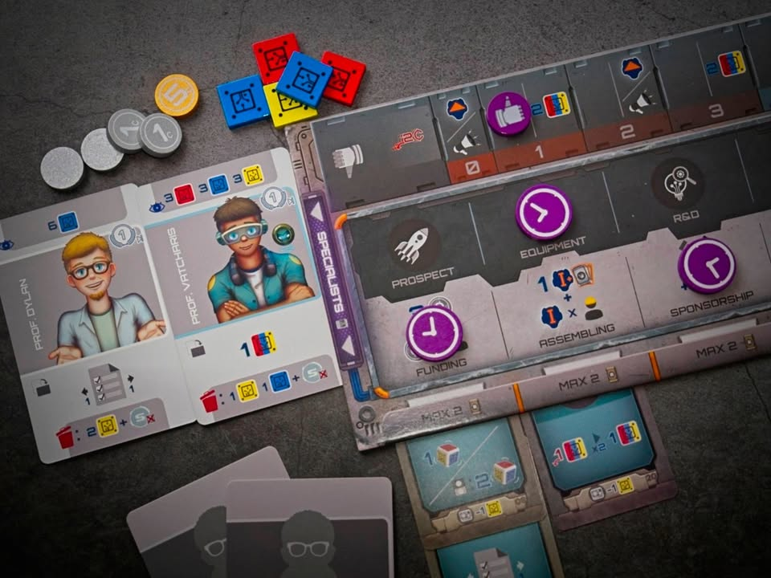
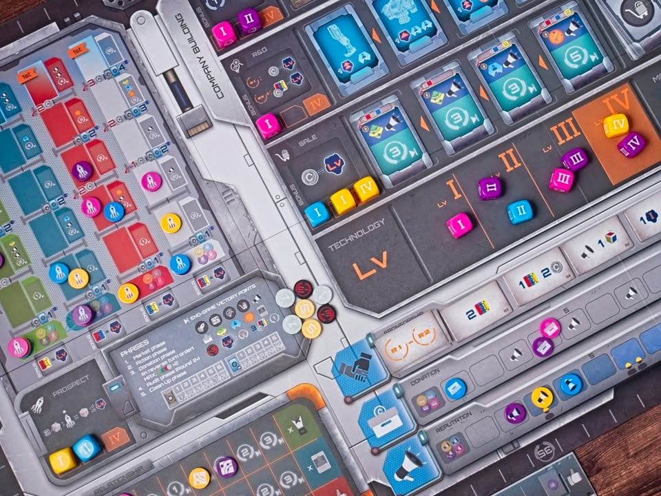
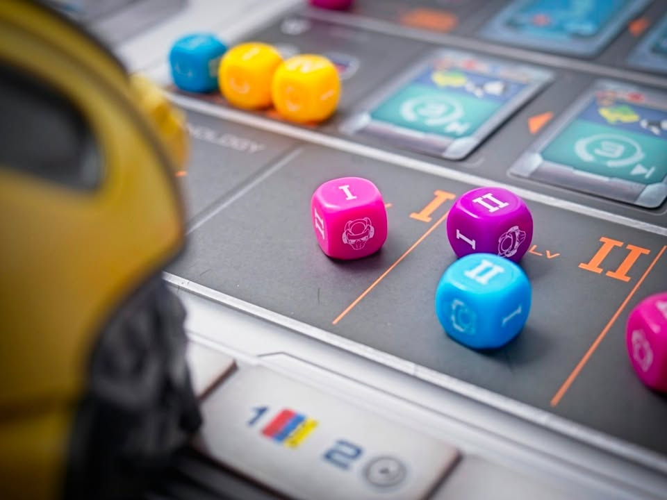
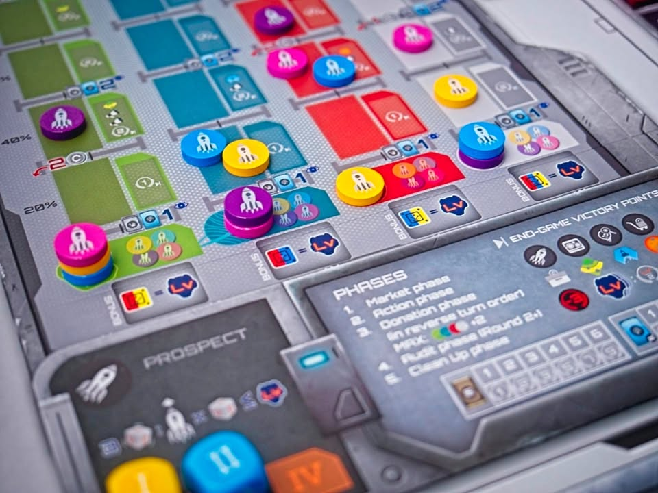
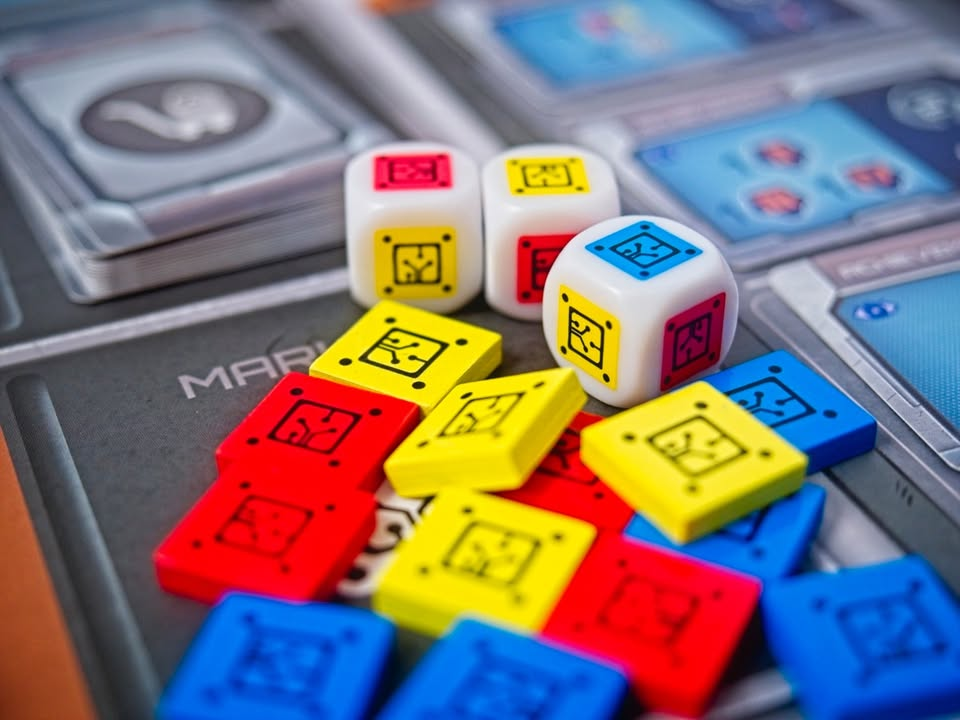
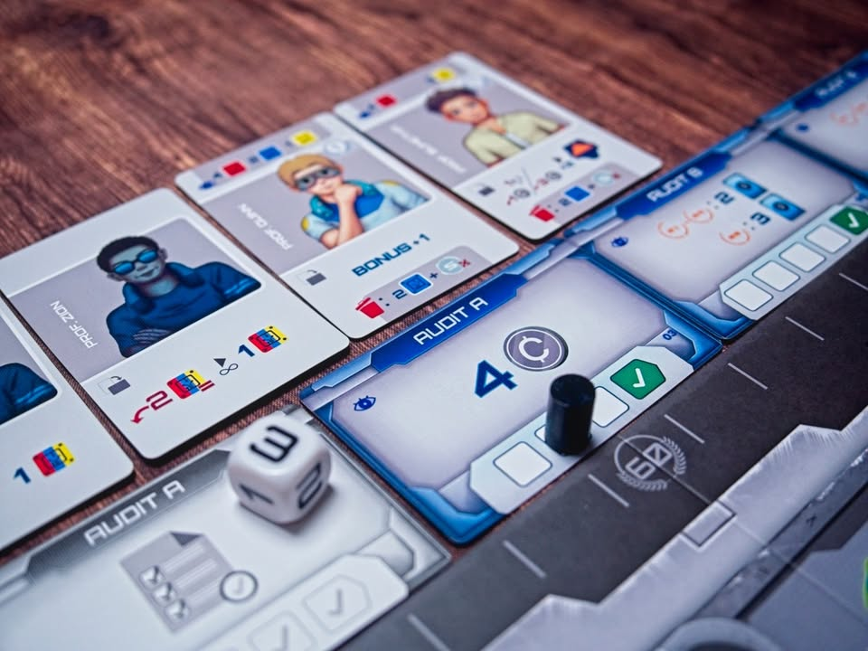

Age of Automaton

---
My Impression - ยูโรที่ไม่ต้องไปสนใจว่าธีมคืออะไรเพราะคุณจะได้ใช้เวลาทั้งเกมจมจ่ออยู่กับการหาทางแก้ puzzle แบบเชนต่อเนื่องที่จะรีดเอาโบนัสชิ้นเล็กชิ้นน้อยมาร้อยเรียงต่อกันเพื่อผลักนำไปสู่การปลดล็อกคะแนนจากหลากทิศทาง (และคุณต้องทำ)

เหมือนคุณอยู่ท่ามกลางเกมของ Vital ที่แอคชั่นน้อยสัดแต่บีบรัดให้เราทำมากสิ่ง แต่วินาทีที่คุณกำลังจะรู้สึกท้อว่าทำยังไงดีเกมก็จะมีตัวเลือกให้คุณดิ้นหลบออกท่านิดบิดทางหน่อยแล้วก็แก้ปัญหาได้เฉยอยู่ตลอดเวลา แบบบีบยังไงก็เหมือนดินน้ำมันที่เราจะหาทางรอดได้ตลอด 

นี้คือเกมที่บดปั่น (คำว่ายำ/คลุกนี้ถือว่าน้อยไปมาก) ระบบเด่นๆของเกมยูโรเจ๋งๆมารวมเข้าด้วยกันแล้วตีออกมาได้เนียนนุ่มจนไม่น่าเชื่อ ซึ่งไม่น่าแปลกใจเพราะเป็นเกมที่ทดสอบในดงมือดงเท้าสายยูโรมา ระดับ 'คำแนะนำเยอะใช่ไหมเดี๋ยวกูใส่แม่งทุกอย่างให้ดู!!' ของนักออกแบบคือบ้าคลั่งมากเพราะออกมาเป็นเกมที่ลงตัวได้จริงๆ

---
Game Overview - ก่อนอื่นต้องเข้าใจก่อนว่าเกมนี้ไอเดียหลักคือจะมีคนงาน (ธีมคือหุ่นยนต์) แบบใช้แล้วทิ้งที่เราจะต้องผลิตและอัพเลเวลให้กับมัน พอจะใช้มันก็จะไปลงช่องแอคชั่นแบบเกม worker placement นี้แหละ ซึ่งแต่ละช่องก็จะมีมินิเกมเป็นของตัวเอง แต่ที่สำคัญคือยิ่งหุ่นเราเลเวลสูงก็ยิ่งได้ประโยชน์เยอะ กับพอตอนกลับบ้านหุ่นจะถูกทิ้งไปเลยเราต้องไปวนสร้างแล้วก็อัพเวลใหม่ 

ทีนี้ในรอบของเราเกมจะให้วาง disc คำสั่งทำแอคชั่นในบอร์ดของเราเอง (ในแง่หนึ่งก็คือ worker placemet แต่ในบอร์ดตัวเอง) ซึ่งตัวแอคชั่นจะมีสองกลุ่มคือแบบที่ได้รับทรัพยากร กับแบบที่ถ้าทำแล้วเราจะได้เอาหุ่นจากย่อหน้าก่อนไปวางตามโซน

หนึ่งใน puzzle แรกๆที่เราจะเจอในเกมก็คือเกมมีจำนวนแอคชั่นให้ทำ 8 แบบแต่ว่ามันจะวางเรียงกันเป็นสองแถว (ตาราง 4x2) ถ้าเราอยากทำแอคชั่นแล้วมันดันอยู่คอลั่มเดียวกันเราจะต้องจ่ายเงินเพิ่ม และใช่คุณจะบังเอิญอยากทำซ้ำคอลั่มกันบ่อยมาก (วางคำสั่งได้กวนจัดๆ) และใช่เงินหายากเหี้ยๆจนกำหมัด และที่หนักเข้าไปอีกคือเกมนี้ห้ามทำแอคชั่นซ้ำกัน

---
พวกแอคชั่นตามโซนจะมี 4 แบบ อย่างแรกคือวางแล้วเราจะได้เดินทางสำรวจดาวก็จะมีแทรคให้เลือกแยกกัน (นึกถึงซัก... เดินขึ้นเสาในเกม Terra Mystica หรืออะไรแนวๆนั้นละกัน) ประโยชน์หลักระหว่างเกมคือมันจะให้เราไปเพิ่มแทรคกลางที่ช่วยเพิ่มความสามารถในการทำแอคชั่นอื่นๆต่ออีกที (เริ่มเห็นความพัวพันของเกมยัง?) แน่นอนว่าเอาหุ่นแรงค์สูงมาก็เดินได้ไกลกว่า แถมเราจะได้ทรัพยากรสี (ในเกมมี 3 สี แต่ไม่มีความหมายอะไรแค่สีต่างกัน) ตามแรงค์หุ่นด้วย

ที่เหลืออีก 3 อันจะเป็นแนวซื้อการ์ดในหมวดตัวเอง ก็ทำงานคล้ายๆกันคือส่งหุ่นแรงไปก็ได้ของติดมือกลับบ้านเยอะขึ้น กับเพิ่มเติมคือหยิบการ์ดได้ไกลขึ้น (คือเอาหุ่นกระจอกมาก็หยิบได้แค่ใบแรก)

ช่องแบบแรกก็จะเป็นแนวซื้อเพื่อสะสมพาร์ทหุ่นไปทำชุดแลกแต้ม (ให้โบนัสเป็นอัพแรงค์หุ่นฟรี กับได้เดินแทรคดาว ที่จะนำไปสู่การเดินแทรคกลางต่อ...) แบบที่สองจะเป็นแนวแต้มจบเกมที่จะให้คุณเดิน 'แทรคตัวคูณแต้มจบเกม' ซึ่งมีอีกสามแบบ แนวๆว่าระหว่างเกมทำท่าอะไรไว้ก็ต้องมาคูณแทรคนี้เอาคะแนนเพิ่มอีกทาง 

อันสุดท้ายนี้ลีลาหน่อยคือเวลาซื้อเนี่ยจะต้องจ่ายทรัพยากรเพิ่มแต่ว่าใบที่เราซื้อมันจะทำให้เรามีส่วนลดในการซื้อครั้งต่อๆไป (แบบ Splender น่ะ) และการ์ดที่เราซื้อมันจะให้เราหยิบมาวางอัพเกรดบอร์ดผู้เล่นเรา ทำให้เวลาทำแอคชั่นเราได้เอฟเฟคเพิ่ม (ซึ่งนำไปสู่การอยากทำให้คุ้ม ทำให้วางแอคชั่นซ้อนแถว และต้องใช้เงินที่หายาก => ปวดหัว)

---
Game Flow & Experience - เกมเล่นกัน 5 รอบจบ ความเข้มของนอกจากการบริหารแอคชั่นแล้วยังเป็นลูปการผลิต 'กระสุน' คนงานหุ่นยนต์แบบใช้แล้วทิ้งเพราะว่าสร้างมาก็ต้องหาจังหวะใช้ เอาไปใช้หมดเราก็จะต้องเสียเวลามาผลิตใหม่ แต่อย่างอื่นก็อยากทำไง!!

จุดบีบคั้นอีกอย่างคือเกมมีระบบ 'แทรดเดินเพื่อ check เป้าหมายตอนจบรอบด้วย' อันนี้จะคล้ายเกมอย่าง Lorenzo/Kanban รู้ล่วงหน้าว่าจะมีการเช็คอะไรแต่อันนี้มันจะมีลีลาทอยเต๋านิดหน่อยแบบตานี้อาจจะยังไม่เช็ค ก็ไม่มีอะไรแค่ถ้าเคลียร์เงื่อนไขไม่ได้ก็เสียแต้ม ไม่ได้มี negative effect ลงโทษติดตัวอะไร

ส่วนที่มาทรง Lorenzo อีกแบบคือการ์ดนักวิทย์ในมือที่เราจะลงเล่นได้ต่อเมื่อสะสมทรัพยากรบางอย่างครบ ได้มาก็เอามาทำโน้นนี้เพิ่ม หรือถ้าไม่อยากใช้ก็ discard ทิ้งเพื่อรับทรัพยากรแทนก็ได้ โดยที่มีกิมมิคว่าการ์ดที่เราทิ้งมันจะกลายเป็นของส่วนกลางที่ทุกคนสามารถใช้ได้ด้วย

แต่ถึงแม้จะฟังดูเยอะแยะงึมงำแต่ตอนเล่นจริงไม่ได้รู้สึกว่านานนะ ปัจจัยสำคัญคือเกมมันเสนอตัวเลือกที่ช่วยให้เราได้ของมาหมุนต่อเรื่อยๆนั้นเองทำให้สายคิดเยอะไม่หัวแตกไปก่อน และสายมือใหม่ก็ไม่โดนบีบจนไม่สนุก

---
What I Enjoyed
-  pure fun ; ความหงุดหงิดของการอยากทำมันทุกอย่าง จากตัวเลือกที่ถาโถมเข้ามา อยากลงไอ้นี้แล้วจะได้ไอ้โน้นจะได้มีของอย่างที่ไปเคลมอันโน้น ซึ่งเกมทำ sweet spot มาดี ได้บ่นตลอดว่าของไม่พอขาดอีกนิด ต้องยอมสละอะไรนิดหน่อยเพื่อให้มันเล่นต่อได้

---
Not Good, Not Bad—Just Things I Noticed

- แต้ม ;  แม้ puzzle จะสวยแต่ประสบการณ์การเล่นรู้สึกว่าเกมมันถูกเกลี่ยให้ใกล้เคียงกันจนน่าเบื่อ ได้แต้มแบบตรงโน้นนิดตรงนี้หน่อย คือมันไม่ใช่เล่นแบบเน้นสายแบบที่ผมชอบแต่จะออกไปทางโดนบังคับทำเกือบทุกอย่างเพราะแต้มมันอยู่กระจัดกระจายแบบไม่ค่อย satisfied เท่าไร (นี่ไม่ใช่ข้อเสียนะ แต่ไม่คลิกกับผมเท่าไร)

- ความสามารถพิเศษ ; จริงๆก็คล้ายๆเรื่องแต้มคือเห็นได้ชัดว่ามันเป็นเกมที่ระบบเสริมที่เห็นมามากมายทำมาเพื่อ 'อุดรอยรั่ว' จุดต่างๆระหว่างพัฒนา แบบยากไปก็แก้ใส่ระบบเสริมให้มันลื่นอีกนิดแต่ไม่ตัดของเก่า ซึ่งสิ่งนี้สะท้อนออกมาจากตัวความสามารถเลยว่าเป็นแนวเบาบางงงงงงงง ได้โน้นนิดนี้หน่อย ไม่ได้เป็นเกมคอมโบน่ะ ออกแนวดีจังได้ของเพิ่มด้วย

- เกมมีการทอยเต๋าเช็ค risk management ; ส่วนตัวคิดว่าอยู่ในระดับโอเคนะคือใส่มาไม่ได้แบบสุ่มจ๋าแต่ออกแนวการบริหารจัดการ แต่ก็มีความรู้สึกในทางแบบจะใส่มาทำไมว่ะเนี่ยอยู่จางๆ

---
What Didn’t Click for Me 

- rule complexity, คู่มือ ; ข้อมูลครบมี index ช่วยให้ย้อนมาหาอ่านได้ แต่ซอยหัวข้อแปลกๆ ทำสีอ่านยาก ยัด text มาเยอะ แต่มีการวาง hints เสริมความเข้าใจระหว่างบรรทัดน้อย ไม่ค่อยเป็นมิตรกะมนุษย์ adhd เท่าไร ด้วยความที่ระบบย่อยมันเยอะคู่มือเลยจัดเต็มเลย 30 กว่าหน้ากับเกม weight ระดับกลางก็ถือเยอะไปนิส

- ไอคอน ; น่าจะทำได้ดีกว่านี้ โทนดูกระจัดกระจายทั้ง look & feel อย่างโทรโข่งในยุคหุ่นยนต์? แต่หลักๆคือพวกความสามารถมันเห็นแล้วไม่เก็ททันทีค่อนข้างเยอะ (ซึ่งก็ไม่ได้แย่ขนาดนั้น เพราะเกมดังๆระดับโลกที่ไอคอนงั้นๆก็มีเยอะแยะ)

---
Who Would Like This Game? - ผมคิดว่าสายยูโรทุกคนก็น่าจะ enjoy กับเกมนี้นะ ถ้าเล่นมาเยอะก็จะรู้สึก feel at home เพราะระบบคุ้นๆเต็มไปหมดแต่เล่นมาน้อยก็ยังตามเล่นได้สบายเพราะระบบหลักมันไม่ได้ซับซ้อน สนแค่เล่นรอบต่อรอบไปเรื่อยๆก็ได้เดี๋ยวเก็ทเอง โดยเฉพาะสายชอบนั่งคิดหาทางไหลทำแต้มจุดโน้นนี้ไปตลอดทาง  แต่เกมไม่เหมาะกับ mindset เล่นแบบมี victory path ลองท่าเข้มๆหรือ punishment ข้นแค้น

---
Final Thought - ปกติผมไม่ชอบใช้คำว่า 'เกมคนไทย' เพราะส่วนมากมันคือการขอความเห็นใจมากกว่าจะบอกว่าเกมดี และนี้คือเกมที่ไม่ได้ต้องการคำๆนั้นเพราะนี้คือ world class mid-heavy euro ไม่กี่เกมที่คุณสามารถซื้อได้ในราคาถูกกว่าฝรั่ง 

--
Disclaimer - I received this game as a gift from 4 Comma Game (ของแท้ไม่เติม s...), but I am not being paid to create this content. All opinions are my own and reflect my honest thoughts about the game.

