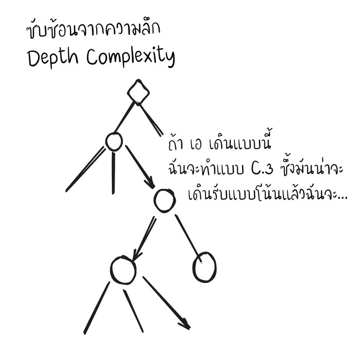
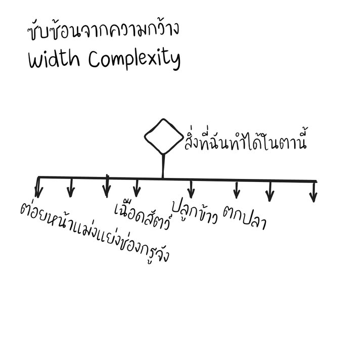
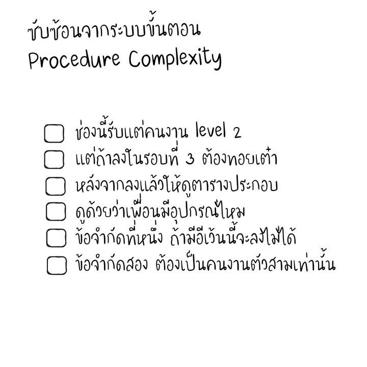

Complexity แบบใดย์....

เกมยากไหม? เป็นคำถามที่เราเจอกันบ่อยในการเล่นเกมกระดาน แต่คำตอบนั้นก็มักใช้ประโยชน์อะไรไม่ค่อยได้เพราะเอาแค่ว่ายากไหมทักษะในการทำความเข้าใจของคนก็ต่างกันมากแล้ว แล้วไอ้คำว่ายากมันคืออะไรหว่าก็ค่อนข้าง abstract อีกต่างหาก

ที่นี้กระทู้หนึ่งใน BGG  ก็มีคนถามในหัวข้อที่ชื่อ แนะนำเกมหนักที่สอนง่ายให้หน่อยสิ (Heaviest game that's easy to teach) ก็มีความคิดเห็นที่แนะนำเกมไปตามเรื่อง โดยมักจะชี้ว่าเกมที่ซับซ้อนสูง (High Complexity) ก็อาจสอนยากหน่อย จนกระทั้ง David Turczi นักออกแบบดังได้ออกมาตั้งคำถามและแสดงความเห็นว่าไอ้ความซับซ้อนที่คุยๆกันเนี่ยมันคืออะไรกัน?

.....แต่อย่าว่าอย่างนั้นอย่างนี้เลย ตั้งแต่ David Turczi เค้าพยายามพูดตู่ว่า Voidfall ที่เค้าเป็น 4X ยังไงผมก็ไม่ชอบเคยหน้าเค้าอีกเลย (อย่ามาดูถูกจิตวิญญาณ 4X นะสึด!!) แต่ความเห็นอันมีค่านั้นมันคนละเรื่องกันอ่ะนะ.......

ซึ่ง David Turczi เค้าก็แบ่งความซับซ้อนออกเป็น 4 มุมมอง (ซึ่งสามารถทับซ้อนและผสมผสานกันได้) ตามนี้
- ความซับซ้อนจากระบบ System Complexity
.
- ความซับซ้อนจากความลึกและการวางแผน Depth/Planning Complexity 
.
- ความซับซ้อนจากความกว้างและตัวเลือก  Width/Choice Complexity 
.
- ความซับซ้อนจากขั้นตอน Procedure/Exception Complexity 

*ต่อจากนี้อาจจะไม่ได้แปลมาตรงๆ ถ้าอยากอ่านความเห็นต้นฉบับไปอ่านได้จากลิงค์แนบนะครับ

---
ความซับซ้อนจากระบบ System Complexity

สิ่งนี้เราจะพบเจอได้บ่อยในเกมยูโรระดับกลาง-กลางหนักขึ้นไป คือถ้าเราจำกัดหรือแบ่งสโคปของพวกกลไกออกเป็นหมวดย่อย จะพอมองออกได้ว่าหลายๆส่วนของเกมนั้นมีมินิเกมที่เล่นอยู่ในพื้นที่ตัวเองอยู่ ซึ่งผลของการเปลี่ยนแปลงในมินิเกมนั้นๆก็มักจะส่งผลต่อเนื่องไปสู่ system หรือมินิเกมอื่นๆที่อยู่รอบๆ ซึ่งความซับซ้อนของเกมแบบนี้คือต้องใช้เวลานานในการอธิบายแต่ละระบบย่อยรวมไปถึงความสัมพันธ์ของแต่ละระบบ ซึ่งมันยากเพราะเราต้องทำความเข้าใจในหลายๆสิ่งพร้อมๆกัน

---
ความซับซ้อนจากความลึกและการวางแผน Depth/Planning Complexity

เกมที่มีความ 'ลึก' คือเกมที่คุณสามารถวางแผนไปข้างหน้าได้ไกลลลลลลลล แต่ว่าความลึกนั้นไม่ได้จำเป็นต้องสอนยาก เนื่องจากมันเป็นเรื่องของการวางแผนในการเล่น ตัวอย่างที่ดีคือพวกเกม abstract ทั้งหลาย

---
ความซับซ้อนจากความกว้างและตัวเลือก  Width/Choice Complexity

เกมที่มีความ 'กว้าง' คือมันมีหลากหลายวิธีในการทำสิ่งหนึ่งๆในลุล่วง สิ่งนี้ทำให้สอนยากขึ้นเพราะเราต้องสอนทุกสิ่งที่เป็นไปได้ในการเล่น อย่างเช่นการหาอาหารใน Agricola หรือความเป็นไปได้ของแอคชั่นในเกมอย่าง Civolution ที่ไม่ได้เพียงแค่เยอะ แต่ยังต้องให้เวลาผู้เล่นในการจำทุกสิ่งอย่างได้ด้วย ในหลายๆเกมนั้นแม้กติกาจะไม่ยาก แต่การอธิบายว่าทำไมแต่ละมูฟนั้นดีหรือไม่ดีอาจจะเป็นเรื่องที่ต้องอธิบายกันยาววววว เนื่องจากความซับซ้อนของตัวเลือกที่ดีในเกม

---
ความซับซ้อนจากขั้นตอน Procedure/Exception Complexity 

เป็นหัวข้อที่เข้าใจง่าย นั้นคือยิ่งจำนวนขั้นตอนเช็คลิสรวมไปถึงข้อห้ามยิ่งเยอะก็ยิ่งทำให้เกมซับซ้อนมากขึ้น  (จริงๆวัดเอาจากขนาดรูลบุ๊คต่อ section ก็ได้อยู่) อย่างเช่นบางเกมเราแค่ลงคนงานไปช่องที่ว่างก็พอแล้วก็หยิบของ แต่บางเกมอาจจะมีเงื่อนไขเรื่องสีและชนิดของตัวลง รวมไปถึงอาจจะมีข้อกำหนดเรื่องค่าพลังและการที่จะต้องทำแอคชั่นต่อเนื่องไปอีก.... ซึ่งเกมแนวนี้ถ้าได้ธีมที่สมเหตุสมผล รวมไปถึง UI และ player aid ที่ดีก็จะช่วยให้อธิบายเกมได้ง่ายขึ้นมาก 

---
ซึ่ง  David Turczi  เค้าก็บอกแหละว่า เกมหนักที่สอนได้ง่าย ก็คือเกมที่มีสัดส่วนของความกว้างและลึกที่ดี (ลึกไปก็ AP คิดนานน่ะ) โดยที่ควรจะมีสัดส่วนของ system complexity ที่เยอะหน่อย (เพื่อให้รู้สึกหนัก) รวมไปถึงการที่เราจะบอกว่า 'เกมก็ไม่ยากเท่าไรนิ' นั้นต้องดูให้ดีว่าเราพูดถึงความซับซ้อนแบบเดียวกันหรือปล่าว (ผมเองก็เคยเจอคนบอกเกมไม่ยาก แต่เพราะมี GM คอยจัดการเรื่อง Procedure/Exception Complexity ทำให้ลดโหลดไปได้เยอะงี้) และแน่นอนว่าเกมที่มีไอคอนและเส้นสายที่ดีก็ช่วยทำให้เกม 'ง่ายขึ้น' ได้อีก เนื่องจากสมองคนเล่นไม่จำเป็นต้องแบกภาระที่ไม่จำเป็น

ที่มา - [Heaviest game that's easy to teach]https_://boardgamegeek.com/thread/3447836/article/45550371#45550371 -

photo : Bing AI

