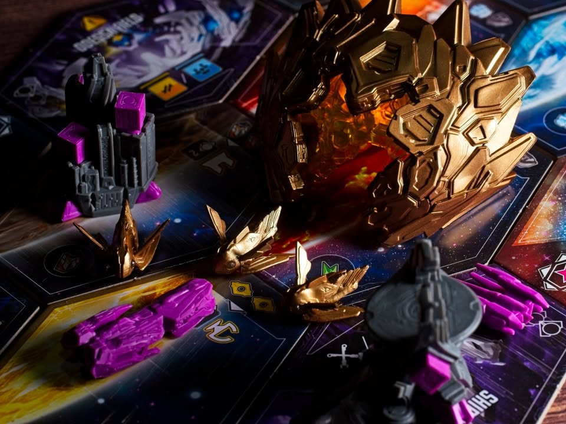
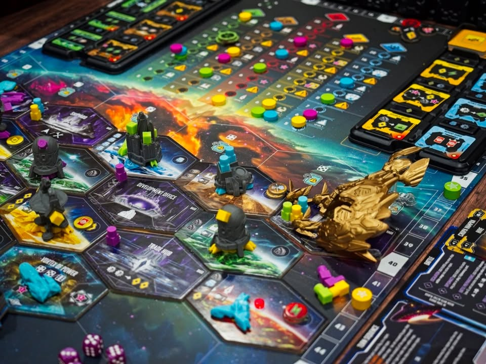
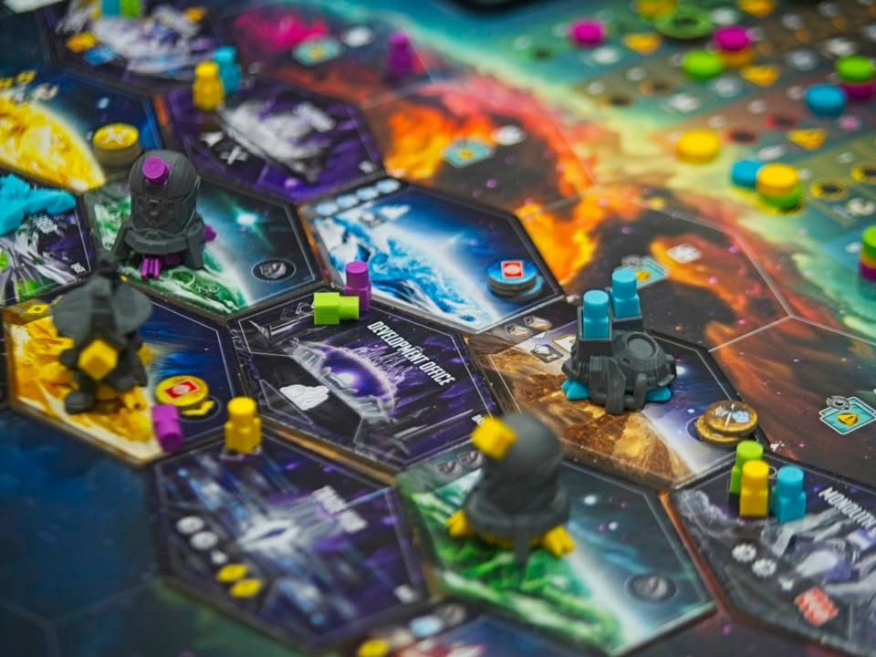
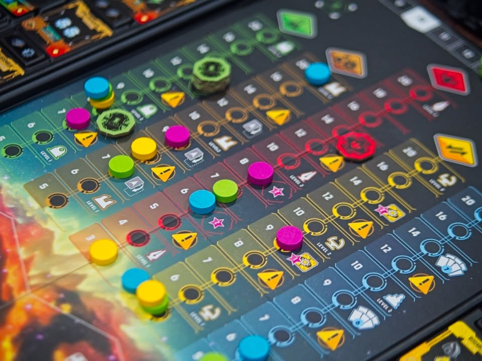
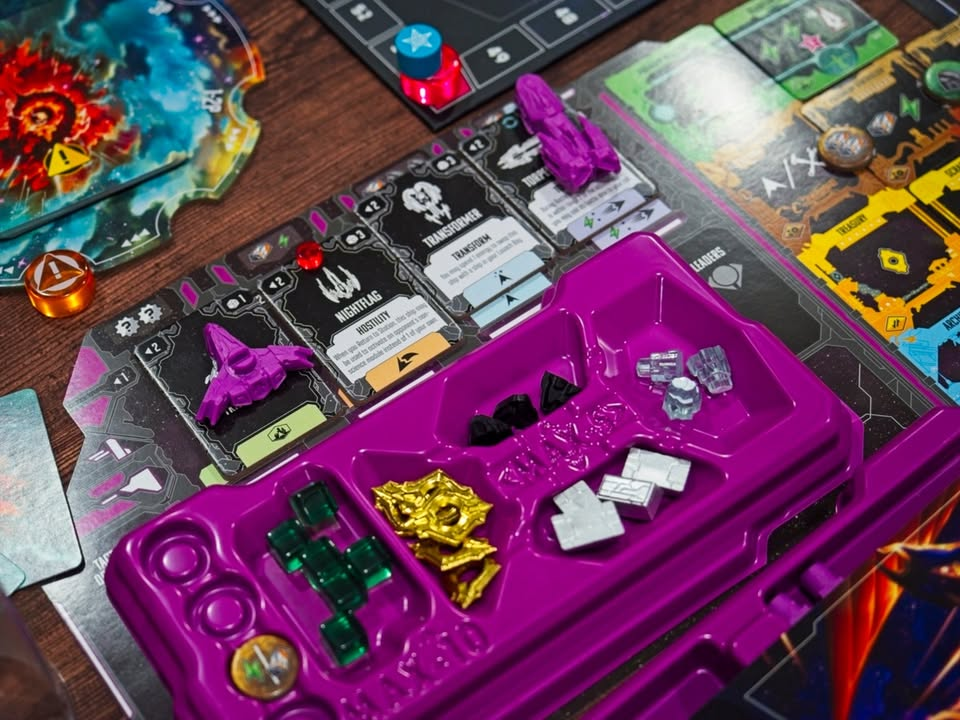
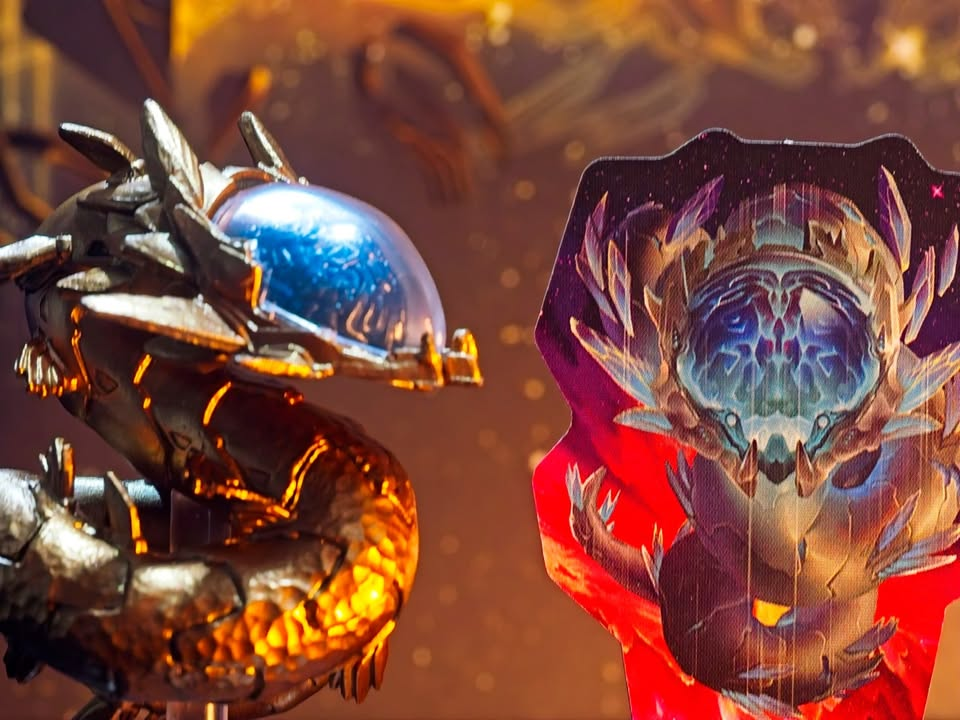

Andromeda's Edge
--- 
My Impression - เกมสไตล์ยูโรปั้น engine เดินวนไปวนมาทำแอคชั่น optimal path เพื่อทำคะแนนให้มากกว่าคนอื่นในรอบที่พอๆกัน  และด้วยแอคชั่นมันทำกันบนกระดานกลางแน่นอนว่าต้องมาเบียดแย่งกัน ซึ่งเกมนี้นำเสนอส่วนของ interaction ในมาเล่าในแบบว่า เห้ยผู้เล่นตีกันแย่งช่องเว้ย!! ซึ่งพอโดนตีแล้วแพ้ก็มีอารมณ์โดนสกัด optimal path ชาวบ้านไปทั่ว แต่เกมมันก็ไม่ได้เป็นเกมตีกันในเชิงถล่มยับให้ดับดิ้นอ่ะนะ แพ้ก็หยิบของเตรียมวนมาทำ engine ใหม่

เป็นเกมที่ position สำหรับผมก็ค่อนข้างแปลก คือตอนเล่นก็สนุกเพลินแบบเยอะกว่าค่าเฉลี่ยนิดหน่อย (will play sporadically if in the right mood) แต่ไม่ได้ชอบมากขนาดนั้น คงเพราะเกมมันมี depth น้อยกว่าที่ชอบ คือมันเป็นเกมที่ให้อารมณ์แบบเล่นเกมระดับกลางที่ของมันอลังเกินเบอร์ ไอเดียการเล่นก็วนๆดิ้นไม่ได้มากแต่ได้เผ่าที่หลากหลายจัดๆมาให้เล่นชนกันไปมาก็ให้อารมณ์หลากหลายดี เป็นเกมที่ตอนแรกว่าจะขายเพราะชั้นวางเกมเต็มจัดๆกล่องก็ใหญ่ฉิบแต่ก็ดูเพื่อนๆจะชอบกันแล้วเราก็ไม่ได้เกลียดอะไรมันไรงี้ก็เลยยังอยู่กับตัวน่ะ แล้วก็คงไม่ได้ส่งไปทำสี

---
Game Overview - ธีมเราก็เป็นเอเลี่ยนไปยึดครองพัฒนาจักรวาล ไอเดียคือเราจะมีคนงานอยู่จำนวนหนึ่งเป็นยาน 4 แบบความสามารถแตกต่างกันนิดหน่อย ในตาหนึ่งทำแค่ 2 แบบ อย่างแรกคือเอายานบินไปลงกระดานกลางเพื่อทำแอคชั่น พอยานเราหมดสต็อกก็ทำแอคชั่นเพื่อเรียกยานในกระดานกลับมา จากนั้นก็วนลูปไปเรื่อย อันนี้ก็ concept เกมแนวทำแอคชั่นไปเรื่อยๆแล้วรอ reset นะ

ไอเดียการนำเสนอในฝั่งทำแอคชั่นของเกมคือตอนวางลำแรกเนี่ยต้องไปลงที่ว่างๆ แต่ลำต่อไปต้องวางต่อจากของเดิม (หรือห่างมาหน่อยก็ได้ถ้ายานที่เอาไปลงมีระยะทำการไกล) ทีนี้ไฮไลท์คือมันเอาไปวางตรงที่ๆคนอื่นอยู่ได้ด้วย แถมไม่พอใครที่มียานระยะทำการถึงก็สามารถโดดเข้ามาจอยการต่อสู้ได้ด้วยนะ พอเราทำแอคชั่นช่องนั้นจบก็มาทอยเต๋าสู้กัน

---
ระบบต่อสู้เป็นแบบทอยเต๋าแข่งรอบเดียวรู้ผลไม่ลีลา จำนวนเต๋าที่ทอยได้ขึ้นอยู่กับคุณภาพยาน (แบบยานรบทอยได้ 3 ลูก ยานสร้างบ้านได้ 1 ลูกไรงี้ แต่มากสุดรวมกันไม่เกิน 6 ลูก) และเกมมีสิ่งที่เรียกว่า target value คือการการันตีเลขขั้นต่ำให้ไม่ต่ำกว่าจำนวนยานที่เข้าสู้ อย่างถ้าเราเอายานเข้าไป 3 ลำ ถ้าทอยต่ำกว่า 3 ก็ให้เรา re-roll ลูกนั้นไปเรื่อยๆจนกว่าทุกลูกอย่างน้อย 3 ก็คือไปเยอะยิ่งได้เปรียบทั้งปริมาณและคุณภาพนั้นแหละ

แต่การต่อสู้เกมนี้ใช้ระบบวัดผลแบบเทียบมูลค่า คือเอาเต๋าที่ดีที่สุดของทุกคนมาวัดกัน ถ้าชุดแรกเท่ากันก็ให้เทียบลำดับถัดไปเรื่อยๆจนกว่าจะมีคนชนะ พูดแบบง่ายๆถ้าทอยมาแล้วคุณมีเลข 6 แต่คนอื่นไม่มี คุณก็ชนะไปเลย แต่ถ้าคนอื่นมี 6 เหมือนกันก็คัดเต๋าออกแล้วเอาเลขที่ดีสุดมาเทียบกันไปเรื่อยๆ

แต่เกมนี้แพ้แล้วยานไม่ได้หายไปนะ มันจะไปนอนกองในหลุมกลางพอเรา reset รอบมันก็จะกลับมาให้พร้อมใช้ต่อ

ระบบ reset เรียกยานกลับก็จะเสนอ puzzle ของตัวเองเพราะว่ามันจะมีโมดูลเสริมที่เราสามารถซื้อเพิ่มมาเติมกระดานเราได้ระหว่างเกม แต่ไอเดียหลักๆคือมันจะผลิตทรัพยากรให้กับเรา ตรงนี้มีกิมมิคว่าเราต้องเอายานที่ยังไม่พังของเรามาวางเพื่อ activate โมดูลนั้นๆด้วย แปลว่ายานที่โดนเค้าตีพังไปก็จะเอามาช่วยตรงนี้ไม่ได้

---
Game Flow & Experience - เป็นเกมที่ไอเดียจริงๆง่ายมากแค่ส่งคนงานเข้าไปหยิบของวนทำแอคชั่นง่ายๆเลย การสอนเองก็ไม่ได้ยุ่งยากอะไรเพราะเกมมันมีแค่ส่งคนงานไปใช้หมดหยิบกลับ player aid ทำมาได้ครบถ้วนดี เล่นๆไปเปิด event ไปตามเรื่อง จุดที่ทำให้เกมมันหลากหลายดีคือระบบโมดูลที่ให้เรามาแต่งบอร์ดตัวเองแล้วมันมีระบบที่ให้เราเอา token มาใส่เพื่อเปลี่ยนชนิดของที่ได้รับอีกทำให้มันดูมีอะไรทำเล็กๆน้อยๆที่ไม่รกตลอด

ส่วนที่คิดว่าฉลาดดีอีกอย่างคือเกมเนี่ยยานทุกคนเริ่มมาหน้าตาเหมือนกันก็จริง แต่มันจะมีการสุ่มไทล์อัพเกรดของยานแต่ละชนิดให้ทุกคน พอเราทำแอคชั่นอัพเกรดยานเราก็จะต่างจากคนอื่นละ ซึ่งพวกเผ่าต่างๆในเกมที่มีหลักสิบมันก็จะมีตัวอัพเกรดประจำเผ่าตัวเองด้วย

พวก NPC ความสามารถก็หลากหลายพอควรแต่เอาจริงๆแอบรู้สึกหยิบย่อยไปหน่อยแต่มันทำให้ระบบการเล่นมีมิติเพิ่มเพราะบางทีก็ไม่อยากลงไปบางช่องเพราะจะโดน NPC โดดมาตีไรงี้

---
What I Enjoyed 
- ทวิสเอาเกมแนวงึมงำทำแอคชั่นตัวเองที่ปกติต้องมารอชาวบ้านว่าเมื่อไรจะถึงตาฉันซักทีให้มี interaction แบบเอ้าแม่งมาตีกรูอีกแล้วววว

- ระบบ combat ที่ทำ risk management มาสมเหตุสมผล คือดวงดีมันก็ชนะและแต่รู้สึกเข้ดวงดีสัดๆ คนแพ้ก็โอเคฉันทำเต็มที่ละซวยเอง 

- ระบบ combat แบบไม่ได้ destructive คือทำคนอื่นเล่นได้ช้าลงแต่ยานไม่หาย เป็นการทำให้อีกฝ่ายทำแอคชั่นช้าลงเฉยๆ

- เผ่าเยอะความสามารถดูมีเอกลักษณ์ 

- ระบบโมดูลอัพยานที่ทำให้แม้จะเล่นเผ่าเดิมแต่ยานธรรมดามันก็ไม่ได้นิ่งเหมือนเดิมทุกเกม

- ระบบ moon token ที่เอามาเสริมโมดูลได้รับของ

- ตัว deluxe miniature สวยอลัง (เกิ๊น)

---
Not Good, Not Bad—Just Things I Noticed
- ตัว deluxe กล่องใหญ่กว่าตัวหลัก ของสวยก็จริงแต่ไม่ได้จำเป็นอะไรนะ ไม่ต้องมีก็ได้ แต่ถ้าไม่มีตัวไทล์ตึก ไทล์ npc มันก็จะดูแบนๆรกๆหน่อย ซึ่งดูไม่ค่อยสวยเท่าไร

- เกมมีพวกการ์ดความสามารถแทรกกติกาเยอะแยะ ถ้าชอบก็ดีเลยแต่ถ้าไม่ชอบอาจจะคิดว่ามันทำเกมสวิงเยอะอยู่

- ตัว NPC มันมีกติกาจุกจิกนิดหน่อย ตัวใหญ่เกะกะแต่ไม่ได้รู้สึกแตกต่างโคตรธีมเท่าที่มันทำ miniature มาอลังๆ

---
What Didn’t Click for Me
- ไม่รู้สึกว่ามีอะไรขนาดที่ต้องยกมานะ

---
Who Would Like This Game? - คิดว่าเหมาะกับสายยูโรกลางๆนะ ที่มีความอยากได้เกมของดูอลังหน่อย (น่าจะกลุ่มแถวๆ happy กับ Scythe, Vindication, Endless Winter อะไรแบบนั้น) คือถ้าฝั่งเกมหนักก็มีไว้เล่นกับกลุ่มเกมกลางนั้นแหละ มันเป็นเกมยูโรแนว engine building ที่ขายภาพว่าเป็นเกมแนวสำรวจอวกาศ ถ้าคาดหวังว่าจะมาเจอเกมตีกันยับๆก็มาผิดที่ละ พอๆกับคนที่นึกว่าจะได้ทำคอมโบสวยๆส่วนตัวเกมนี้มันไม่ได้ให้พื้นที่ปลอดภัยไร้กังวลกับคุณ

---
Final Thought - เกมนี้จริงๆมันคือเอา Dwellings of Eldervale มาทำใหม่เปลี่ยนจากธีมแฟนตาซีมาเป็นธีมอวกาศ ส่วนตัวผมเล่น เกมโน้นมาทีสองทีคิดว่ามันคล้ายแค่เรื่องส่งตัวไปกับเรียกตัวกลับ นอกนั้นก็ไม่ได้เหมือนกันขนาดนั้น ผมชอบ Andromeda's Edge มากกว่าตรงที่ระบบ combat มันสั้นกระฉับและให้ผล risk management ที่ยอมรับได้ง่าย สัดส่วนระหว่างการทำ engine กับโมบอร์ดตัวเองพร้อมกับความหลากหลายของเผ่าและยานพิเศษก็ทำมาได้กำลังดีไม่ลึกไปแล้วก็ไม่ได้ง่อยแบบแค่เพิ่มระยะ หรือเพิ่มเต๋า

---
Disclaimer - ซื้อเองจ่ายเอง

