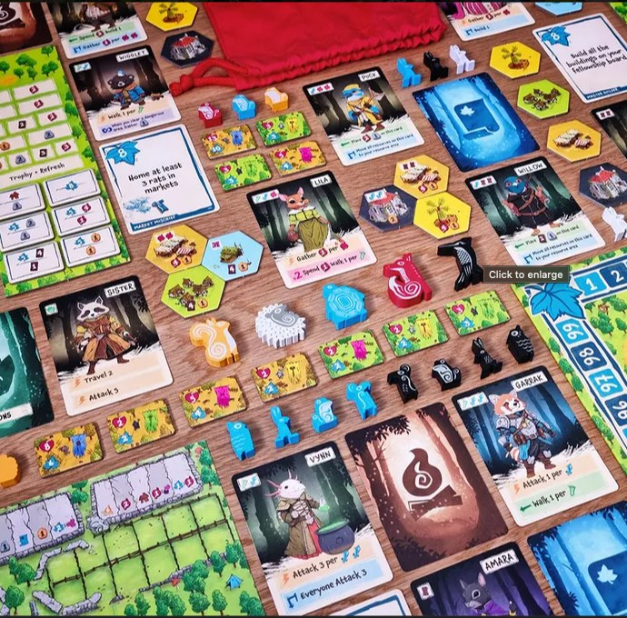

เดี๋ยวคนจะคิดว่ามีแต่เรื่องเครียด เล่าเรื่องตลก(มั้ง?)บ้าง คือผมเป็นคนที่ซื้อเกมแบบค่อนข้างวู่วามพอดู โดนเค้าหลอกด้วยคำโปรยสวยๆอยู่บ่อยๆ 

อันที่ชอบมากแบบจำไปเล่าได้เสมอก็คือ Argent: The Consortium ที่เป็นเกมที่โคตรชอบ ที่ซื้อตอนนั้นคือเพราะมันเขียนแค่นี้เลยว่า 

Argent: The Consortium is a cutthroat worker-placement/engine-building game 

แบบโอเค you got my attention พร้อมกดมาลองจากเมืองนอกแบบไม่ได้คิดอะไรเลย เพราะมีทุกสิ่งที่อยากได้เนื้อๆเน้นๆกระแทกตาเล่นแล้วก็ เข้ โคตรมันส์

---
อีกอันที่พึ่งเจอไม่รู้จะสนุกไหมเพราะเกมยังไม่ออก แต่ได้ my attention แน่นอนคือ Emberleaft เป็นเกมที่ตอนแรกเฉยๆดูมันน่ารักเกินไปหน่อย แต่คือมันเขียนงี้ 

Emberleaf is a competitive card-dancing and tile-placement board game for 1-5 players. 

อ่านละเอ๊ะ... อะไรว่ะ card-dancing 

อ่านต่ออีกหน่อย 

Card Dancing: Place hero cards within your moving grid to activate skills and enhance your fellowship. Slide cards to trigger powerful combinations and charge them at the perfect moment for even greater effects. 

ตามด้วย Tile Placement, Engine Building, Resources Management 

โอเคที่เหลือขี้เกียจอ่านละ กดๆมาก่อนโดน keyword ประหลาดกล่อมเฉย

---
จริงๆก็เป็นอีกเหตุผลที่ผมเกลียดพวกเกมที่เขียนคำโปรยขี้โม้มากๆ (ถึงมากๆ) เพราะเราเชื่อคำโปรดง่ายพอเล่นละไม่เหมือนก็แบบหลอกกันนิหว่า คือไม่สนุกไม่ว่านะ แต่อย่าโม้ ตัวอย่างเช่น Voidfall บอกว่าตัวเองเป็นเกม 4X.......... สึด....

