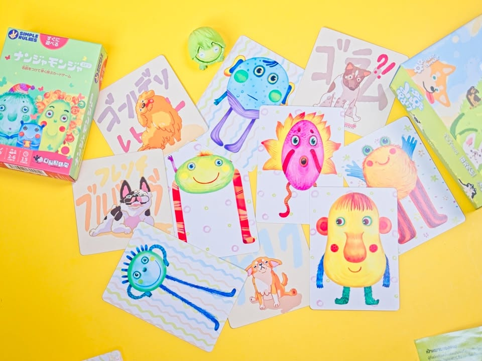
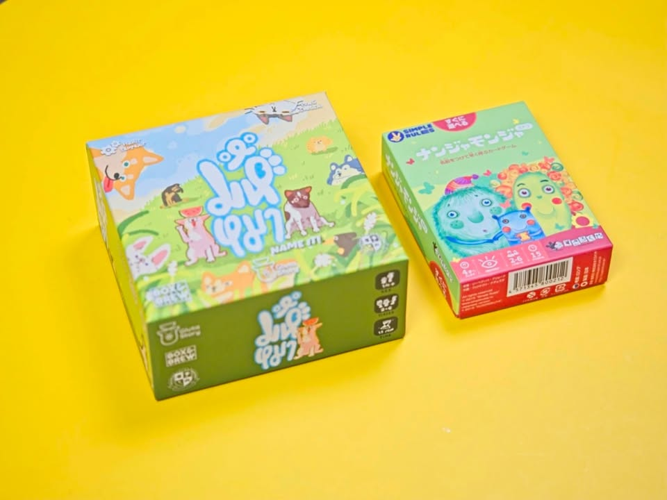
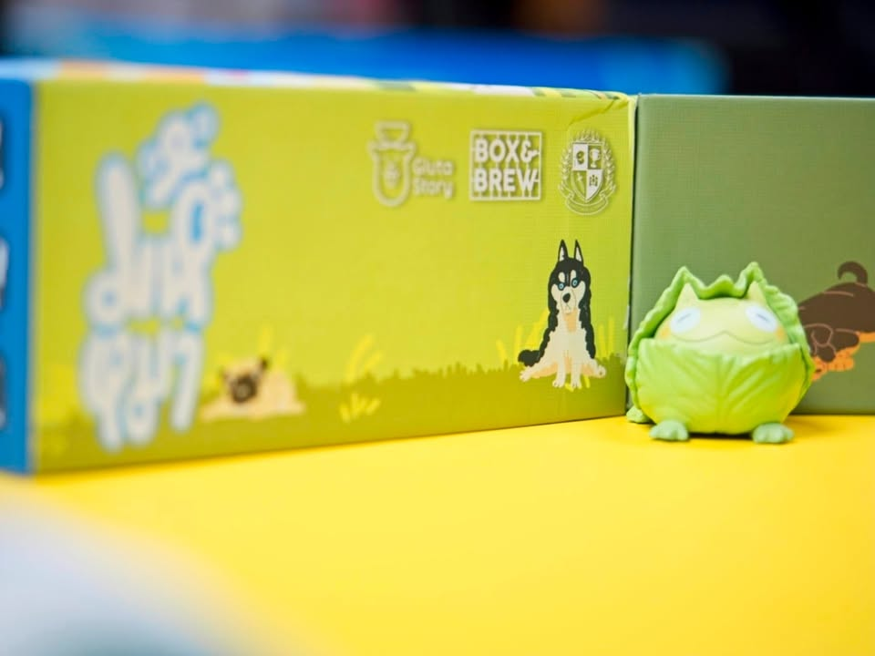

เอ๊า!! ตกลงหมามึงชื่อไรนิ? - Name it! มหึหมา x Gluta Story Edition

---
เกมปาร์ตี้สุดคิ้วที่ไม่ต้องสอนอะไร กติกามีแค่ เปิดรูปมาถ้าเจอหมาพันธ์ที่ยังไม่เคยเห็นก็ให้เรียกชื่อพันธ์จริงๆ พร้อมกับชื่อเล่นเรียกน้องซักหน่อย หลังจากนั้นถ้าเปิดเจอซ้ำก็ให้เรียกชื่อน้องแทน แต่มันจะดักเราอีกนิดว่าถ้าเป็นน้องพร้อมสายจูงเราต้องเรียกชื่อเจ้าของแทน..... จบละเกมใครเรียกถูกเยอะกว่าก็ชนะไป

ฟังดูมันง่ายๆโง่ๆ ซึ่งก็ใช่เลยเพราะคือมันเหมาะเอาไว้หยิบกางเล่นเอาฮาในหมู่คนทั่วไปน่ะ ยิ่งถ้ารู้จักน้องๆจาก Gluta Story ก็ยิ่งเข้าทางเพราะเค้าทำงานร่วมกัน ซึ่งเรื่องตั้งชื่อเนี่ยอย่าดูถูกไปเชียวนะ ลองคิดชื่อแปลกๆแล้วเล่นหลายๆรอบแม่งมั่วแบบเฮฮาเอามากๆ เหมาะกับเอาไปเปิดตัวทุกงานปาร์ตี้

---
แล้วทีนี้คุณอาจจะมีคำถาม เห้ยมันเหมือน Nanja-Monja เกมการ์ดตั้งชื่อมอนสเตอร์สไตล์ติสๆของฝากสุดฮิตตอนไปญี่ปุ่นเลยนิหว่า ผมก็ยกมาเทียบให้ละกัน เรื่องกติกาเนี่ยของ มหึหมาจะมีลีลาเพิ่มนิดนึงตรงต้องเรียกสายพันธ์ก่อนกับต้องตาไวเพิ่มเรื่องจะเรียกชื่อเจ้าของหรือเรียกชื่อน้อง ส่วนของ Nanja-Monja เนี่ยจะได้เปรียบเรื่องขนาดกล่องที่เล็กกว่ามาก แต่ใดๆก็คือมองเรื่องอาร์ทสไตล์แหละราคามันไม่แพงไปตามๆซื้อให้หมดได้ mix&match กติกากันเองได้เลย

---
สิ่งเดียวที่ไม่ชอบในเกมมหึหมาคือแบบผมเป็น Cat Guy อ่ะ.......

อ่านในเวบและดูข้อเขียนอื่นๆได้ที่ https://forum.tinymeepletalk.com/d/26-name-it-x-gluta-story-edition

---
this is a gifted product from Box & Brew Café and Board Games, no money changed hand for this content. ได้รับสินค้าโดยไม่มีค่าใช้จ่าย คอนเทนต์ทำเพื่อแสดงความเห็นส่วนตัวเกี่ยวกับเกมโดยไม่มีการจ้างวาน

