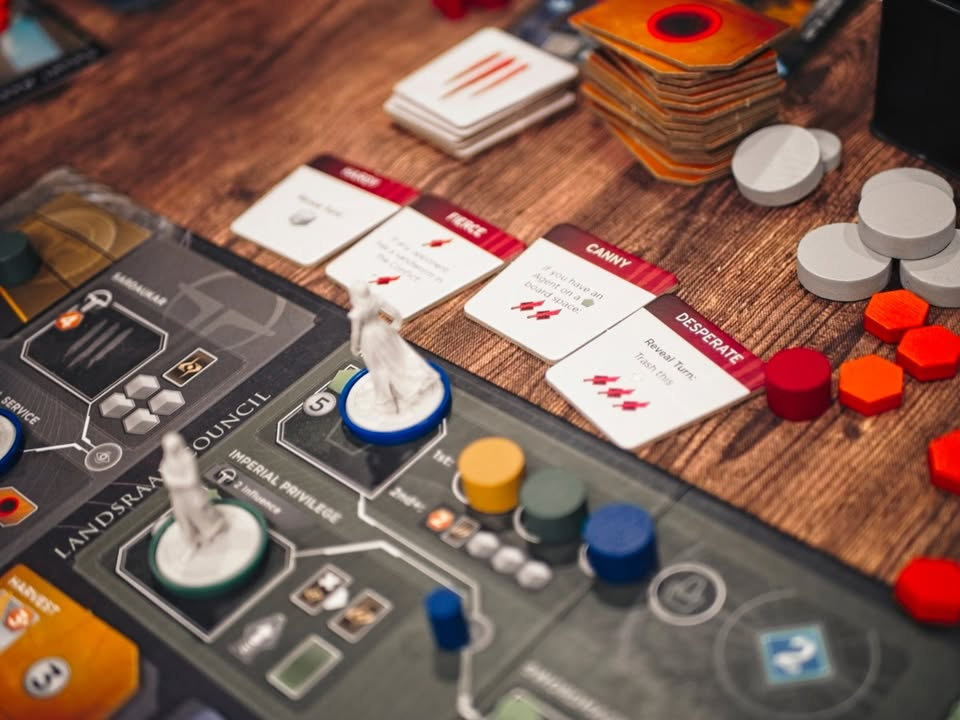
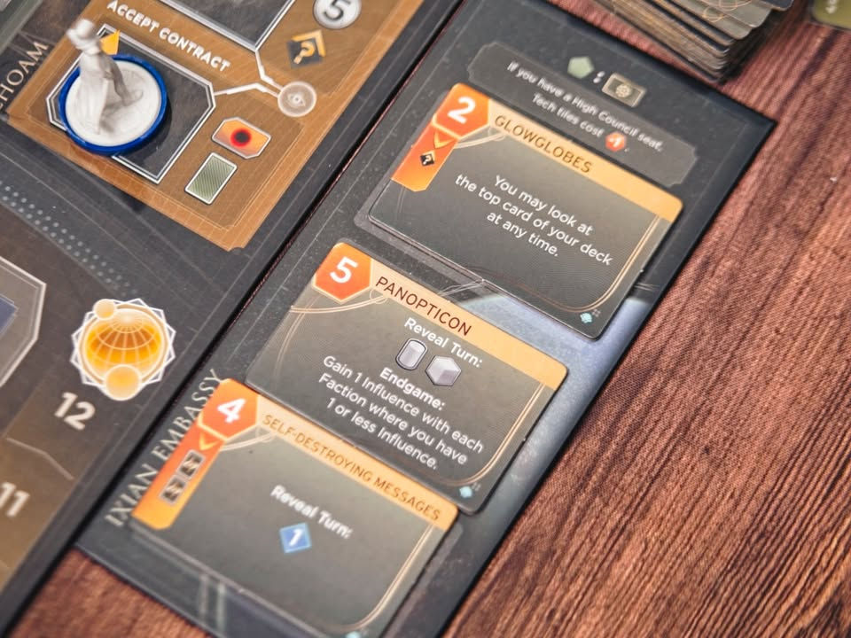

Dune: Imperium – Bloodlines - การกลับมาอีกครั้งของอีซาน อัลไกอีบ

ตัวเสริม _แรก_ ของ Dune : Uprising มีของเล่นใหม่เป็นกองทหารประจำตัวของฝ่ายจักรพรรดิที่ชื่อซาดูคาร์ แล้วก็มี choam ไทล์ให้ซื้อเอาไว้เป็นลีลาออกท่าเพิ่ม 

---
> ในทัศนะของผมแล้ว Dune: Imperium + XI + Immortality เนี่ยมันคือตัวที่ถูกแทนที่ไปแล้วเรียบร้อย แน่นอนว่ามันยังเป็นเกมที่สนุกมากๆอยู่แต่ลืมๆมันไปแล้วเริ่มที่ Dune : Uprising เลยดีกว่าจูนมาแบบพอดีละ แน่นอนว่าตัวเสริม Bloodlines ทำมาให้ใช้ร่วมกับชุดก่อนๆหน้าได้แต่ผมมองว่ามันจุกจิกเกินไปหน่อย 

---
ตัว choam ไทล์เนี่ยจริงๆก็เป็นของที่ตัวเสริม Rise of Ix เคยเอามาใช้ละ แต่ภาคนี้ออกไทล์มาให้เพิ่มแล้วก็งอกกติกามาว่าแค่ลงแอคชั่นโซนเขียวอันไหนก็ได้ก็ซื้อได้เลย ทำให้หยิบได้ง่ายขึ้นแล้วก็เป็นการดึง balance ให้พื้นที่เขียวเพิ่มไปอีก

---
ส่วน Sardaukar เนี่ย ตอนเริ่มเกมมันจะวางไว้ตามช่องแอคชั่นถ้าเราไปลงช่องนั้นก็จ้างมาเก็บไว้กับตัวได้ การใช้งานก็เหมือนทหารทั่วไปแต่เพิ่มเติมว่าดาบเยอะกว่านิดนึง พ่วงกับจะมีไทล์ความสามารถ passive ให้หยิบติดตัวมาเพิ่มด้วย ถึงแม้จะไม่ได้เก่งแบบโหดเว่อร์แต่ในการต่อสู้ที่มันเบียดเสียดกันแล้วไหนหนอนจะเลื้อยกันไปทั่วทุกดาบก็มีความหมายเสมอ แต่ความเก่งของ Sardaukar ก็มีราคาที่ต้องจ่ายคือต้องเสียเงินเพิ่มด้วยเวลาใช้งานมัน

---
Impression สำหรับตัวเสริมนี้คือสนุกครับ ชอบที่มันไปดึง balance ในพื้นที่เขียวเพิ่มเข้าไปอีกแล้วก็เสริมพื้นที่การใช้เงิน คือในตัวหลักหลายครั้งคือพอได้เงินมาจ้างเอเจ้นตัวที่สามก็ไม่ค่อยมีที่ใช้เงินละ แต่อันนี้เอามาจ้าง Sardaukar เพิ่มได้ แล้วก็ทำให้มิติตอนเล่นเกมมันไม่ต้องมามุ่งเป้าอยู่ที่การขี่หนอนอย่างเดียว

---
ส่วนที่แอบขัดใจนิดหน่อย แต่ก็เป็นมาตั้งแต่ตัวหลักเดิมก็คือธีมมันแปลกๆหว่ะ.... แบบ Uprising ใครๆก็ตีซี้กับเฟรเมนให้สอนขี่หนอนกันได้หมด มาภาคนี้พวก Sardaukar ที่เป็นทหารของจักรพรรดิก็ดันยืนเต๊ะให้จ้างไปทั่วอีก แบบดูศักดิ์ศรีมันไม่ตรงธีมเท่าไรยิ่งพยายามขับเน้นว่าแต่ละตัวมีความสามารถต่างกันก็ยิ่งไม่ลงล็อกเข้าไปอีก แต่ใดๆคือที่พูดมาไม่เกี่ยวไรกับเกมเพลย์......

---
ถ้าถามว่าจำเป็นต้องมีไหม? คือถ้าชอบ Dune ยังไงก็ซื้อใส่ได้เลย ทำให้เกมมันมีบอดี้เพิ่มขึ้น เสริมมิติในการตัดสินใจแล้วก็มีแนวทางในการเล่นที่ดิ้นได้อีกหน่อย ไม่ใช่จ้องแต่ไปหาทางเอาหนอนมาลงเล่นอย่างเดียวแล้ว ถ้ามีแล้วก็ใส่ตลอดแน่ๆ พวกความสามารถในตัวละครใหม่ๆก็คิดว่าสนุกดี แต่ถ้าถามว่าต้องซื้อต้องมีให้ได้ไหมผมคิดว่า _ไม่_ ครับ เพราะถึงไม่มี Dune : Uprising มันก็จบในตัวอยู่แล้ว ถ้าเป็นสายลองเกมที่งบจำกัดตัวนี้ก็ไม่ต้องรีบอะไร

