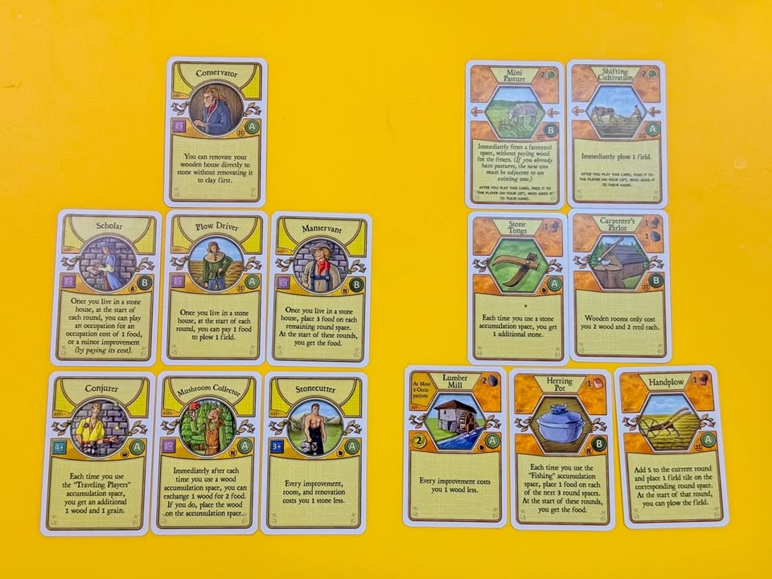
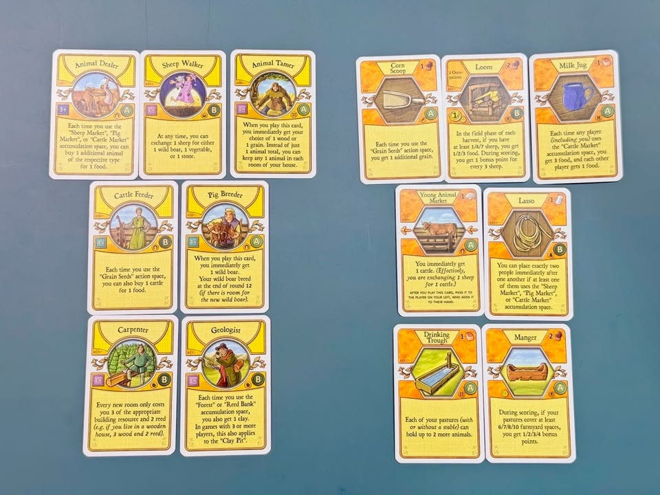

Agricola เป็นเกมอันดับหนึ่งในใจผมเสมอ และ Agricola ที่ไม่ใช้การ์ดนั้นไม่ใช่ Agricola เพราะว่าเกมนี้ครึ่งหนึ่งของเกมคือการวางแผนหยิบดราฟการ์ดและอีกครึ่งคือการเล่นเพื่อให้แผนที่คิดไว้ออกผลมาได้จริง แต่ในขณะเดียวสำหรับคนที่พึ่งเล่นเกมนี้ครั้งแรกการรับข้อมูลมันก็เยอะจริงๆใบไหนเก่งก็ไม่รู้ แค่หาข้าวก็จะตายละ ผมก็เลยมีไอเดียการเตรียมเด็คมือแรกให้ทุกคนตอนเริ่มเกมให้ทุกคนได้ใช้กันครับ เพราะสุ่มแจกมั่วก็ไม่สนุกอีกคอมโบแตกกระจาย

---
แต่เอาจริงๆความสนุกของเกมนี้มันก็คือการได้ลองคิดลองมองคอมโบเอาหน้างานนะ ยิ่งการ์ดใช้ยากเงื่อนไขเยอะทำได้จะรู้สึกโคตรดี ขาดตรงนี้ไปอรรถรสความสนุกตื่นเต้นก็ลดไปเยอะเหมือนกัน ใดๆก็คิดว่าลองปรับใช้ดู จะทำแค่ให้คนเดียวเล่น fixed hand หรือเอาชุดที่คัดมาแล้วไปสับให้ดราฟ์ก็ได้เหมือนกัน เพราะหยิบมาแต่การ์ดที่เงื่อนไขไม่ยุ่งยากแต่พร้อมคอมโบมาให้แล้ว

---
ผมตั้งใจใช้ชุดการ์ดที่มีอยู่ในกล่องหลักตัว Revised ฉบับภาษาอังกฤษนะครับเพื่อให้ครอบคลุมคนมากที่สุด ใครใช้ภาษาไทยก็เอารหัสการ์ดไปเทียบได้เลย ตอนจัดมือคือมีไอเดียว่าทุกมือจะมีคอมโบโกงๆของตัวเองแต่ก็แซมวิธีการเอาตัวรอดท่าอื่นผสมๆกันไปด้วยเพื่อให้มีการขัดขากันนิดหน่อยมือแต่ละอันก็จะไม่ใช่แนวทางการ maximized อะไรนะ เน้นให้มือใหม่มีแนวทางการเล่นกับเข้าถึงตัวเกมได้ง่ายกับมีพื้นทื่ให้ดิ้นนิดหน่อยไม่บังคับเล่นท่าเดียวลงการ์ดดีย์แค่ใบสองใบจนจบเกมก็เล่นได้ คือเน้นให้ enjoy กับความรุนแรงของการ์ดที่คนเล่นจริงก็ยากนะที่จะได้ของแบบนี้ครบๆเข้ามือ

---
เอาจริงๆคิดว่าพวกการ์ดมันน่าจะอธิบายตัวเองได้อยู่แล้วแต่เขียนทิ้งไว้หน่อยละกัน

Deck - 1 : สายทำไร่เน้นใช้คอมโบขี้โกง Seasonal Worker + Assistant Tiller ทำให้เราลงช่องแรงงานรายวันแล้วได้ของแบบโกงสัด เสริมด้วยการ์ดสร้างบ้านราคาถูกในช่วงท้ายเกมอย่าง Frame Builder และเพื่อลดช่องว่างการสร้างบ้านช้าก็มี Caravan มาช่วยเร่งการโต

---
Deck - 2 : สายเทคนิคบ้านรวย อันนี้ถือว่าแหกจากสายปกติของเกมเพราะทำแต้มจากจำนวนบ้าน มันเน้นให้เรารีบใช้ Conservator แปลงบ้านเราให้เป็นบ้านหินเร็วที่สุด ระหว่างนั้นเอาตัวรอดด้วย เห็ดคลุกปลาร้า Mushroom Collector กับ Herring Pot และเติบโตอย่างรวดเร็วด้วย Capenter's Parlor พร้อมกับเสกหินจำนวนมากจาก Stone Tongs + Stonecutter

---
Deck - 3 : สายเลี้ยงสัตว์ ใช้ประโยชน์จาก Animal Dealer เพิ่มจำนวนสัตว์ให้เร็วและแปลงสัตว์ส่วนเกินสร้างที่ว่างให้เป็นของมีประโยชน์ด้วย Sheep Walker พร้อมกับประหยัดไม้ทำรั้วช่วงแรกด้วย Animal Tamer ฝั่งทรัพยากรจะใช้ Geologist กับ Carpenter เพื่อเร่งการเติบโต แม้จะไถทำไร่ได้ช้ากว่าเดคอื่นแต่ว่าด้วย Corn Scoop ก็จะช่วยทำให้ไม่ตามหลังในการเก็บเมล็ดพืช

---
Deck - 4 : สายผสม เด็คนี้เน้นการหาข้าวจาก Harpooner + Canoe แล้วก็ใช้ Wood Cutter ในการหาไม้สร้างบ้าน ความพิเศษของเด็คนี้คือ Loam Pit ที่ช่วยให้เราเก็บดินเหนียวได้เยอะแล้วเอาไปถมสร้างรั้วดินด้วย Rammed Clay ในการสร้างบ้านเราจะหลบการแย่งต้นกกด้วย Brushwood Collector ที่ทำให้จังหวะเก็บของเราลื่นไหลขึ้น ทำคะแนนพิเศษสู้เด็คอื่นด้วย Braggart + Bottles  หรือจะสลับไปลองเล่นท่าปลูกผักมาต้มกินต้นเกมด้วย Greengrocer + Beanfield ก็ได้เหมือนกัน

---
ลองดูแล้วคิดยังไงก็คุยกันนะครับ หวังว่าจะมีประโยชน์สำหรับทั้งคนเล่นใหม่และคนเผยแพร่ลัทธิทำฟาร์ม

update v1.01 -> สลับการ์ด Caravan ของเดค 1 กับ Acorn Basket ในเดค 4

---
ใส่ไว้ในเวบนี้นะมีบทความอื่นด้วย https://forum.tinymeepletalk.com/d/28-agricola-4-deck

