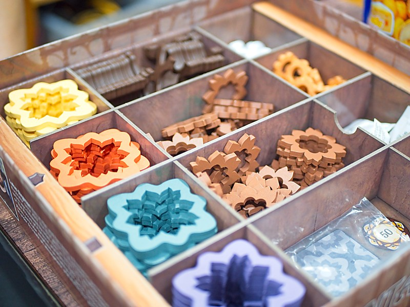
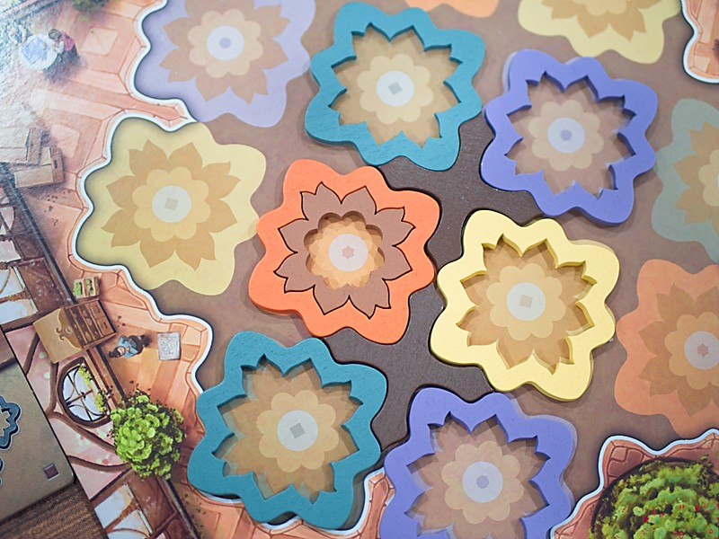

Intarsia - เร่งมือปูกระเบื้องให้งดงาม

เกมระดับครอบครัวที่จะให้เรามาหยิบแผ่นกระเบื้องเพื่อปูพื้นแข่งกัน พี่เล็กลานละเล่นหยิบมาสอนบอกเกมแฟมมิลี่ใสๆ แต่เล่นจริงแล้วกริบกันทั้งวง ไม่ใช่ไม่สนุกนะแต่เกมมันไม่มีดวงไงเล่นแล้วเครียดเฉ๊ย!!

---
ไอเดียเกมคือในตอนต้นเกมเราจะหยิบการ์ดกระเบื้องสีสี่มาเข้ามือจำนวนหนึ่งจากนั้นรอบที่เหลือเราเล่นแค่ทิ้งการ์ดในมือแบบจับเซ็ตสีไปเรื่อยๆหมดมือก็ผ่านแล้วก็จั่วการ์ดเข้ามือแล้วเริ่มรอบใหม่ สอนง่ายเข้าใจง่าย ระบบการวางคือเราต้องปูกรอบกระเบื้องจากข้างนอกมาข้างใน เริ่มจากวางกรอบสีใช้การ์ดหนึ่งใบ และถ้าอยากวางวงในก็ต้องจ่ายการ์ดสีซ้ำกันแพงขึ้นเรื่อยๆเป็น 2.. 3.. และ 4 ใบ

---
ระบบที่เกมนี้นำเสนอจะเป็นการทอนการ์ดสี คือเวลาเราจ่ายสีไปเท่าไรจะได้ทอนมาน้อยลงใบนึงแต่จะเป็นสีอื่นเสมอ อย่างถ้าเราจ่าย สีเขียว 4 ใบเพื่อล้อมวงในสุดเราก็จะได้การ์ดคืนมา 3 ใบแต่ต้องเลือกเป็นสีอื่นแทน แล้วก็วนลูปกันไป

---
แต่การแข่งขันจริงๆของเกมนี้จะมาจากการที่เราต้องแข่งกันขึ้นรูปทรงสีตามไทล์เป้าหมายกลางเพื่อทำคะแนนเพิ่ม อย่างเช่นถ้ามีวงเขียวสองวงระดับ 1 ทั้งคู่จะได้เคลมใบนี้ อะไรแบบนั้นแต่จุดเข้มของเกมคือการจะหยิบเราต้องมีเหมือนเป๊ะเท่านั้น อย่างถ้าเราทำพื้นที่สีเขียวไปถึงระดับ 3 แล้วมาทำสีเขียวเพิ่มอีกอันก็จะเคลมไม่ได้แล้ว ทำให้การจะหยิบไทล์สีมาวางต้องคิดเรื่องลำดับการเคลมเอาไว้ด้วย และเกมที่นี้ไทล์มีจำกัดผู้เล่นต้องไปแย่งกัน

---
ตอนอยู่วงครอบครัวจะเป็นไงไม่รู้แต่ในวงเกมเมอร์เกมนี้เดือดกว่าที่ตาเห็นเยอะ เพราะด้วยความที่มันไม่ดวงแล้วมันต้องแย่งไทล์เป้าหมายตรงกลางแข่งกันเพราะมันมีจำนวนน้อยกว่าผู้เล่นทำให้ในวงผมเนี่ยนั่งนับนั่งดูตลอดว่าใครจั่วไปอะไปบ้างรอบมันจะมาถึงเราไหม มีจังหวะโยกไปหยิบใบอื่นหรือยัง... and so on

---
ในระยะยาวคิดว่าเกมมันนิ่งไปหน่อย ในแง่ว่าแต่ละรอบมันก็เล่นแก้ puzzle แบบเดิมๆ ถ้าไม่แข่งไม่มองคนอื่นมันก็จะเป็นเกมแลกทอนการ์ดสีเหงาๆนิดนึง ตอนเล่นครั้งแรกถูกวงก็สนุกแหละแต่หลังจากนั้นรู้สึกไปทางพวกเกมตระกูล Azul จะดีกว่า

---
อ่านบทความนี้และข้อเขียนอื่นๆได้ที่ https://forum.tinymeepletalk.com/d/29-intarsia

