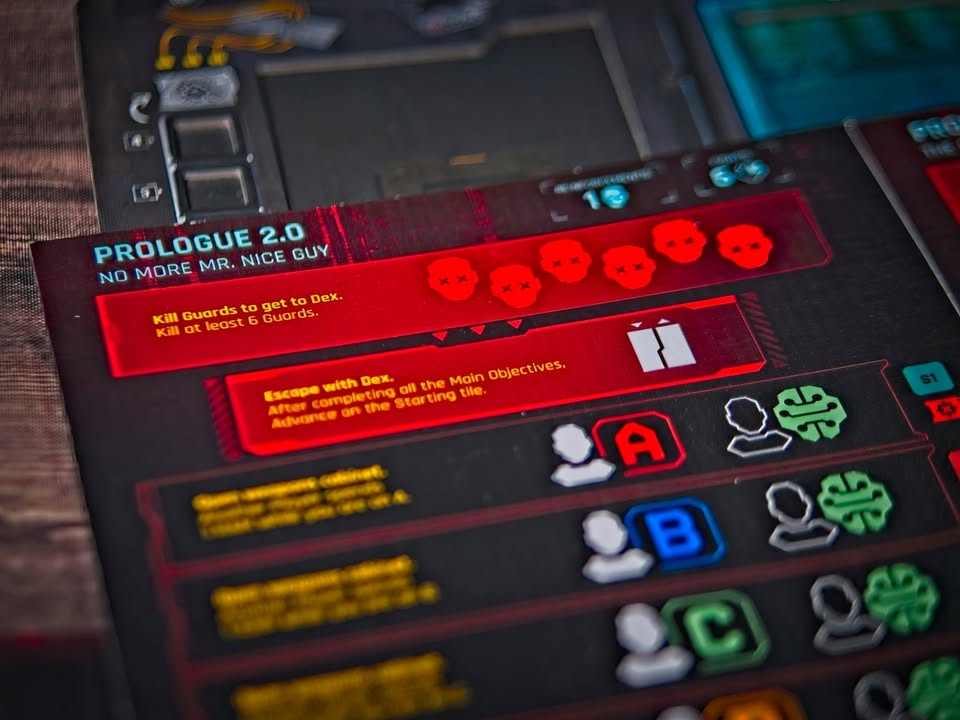
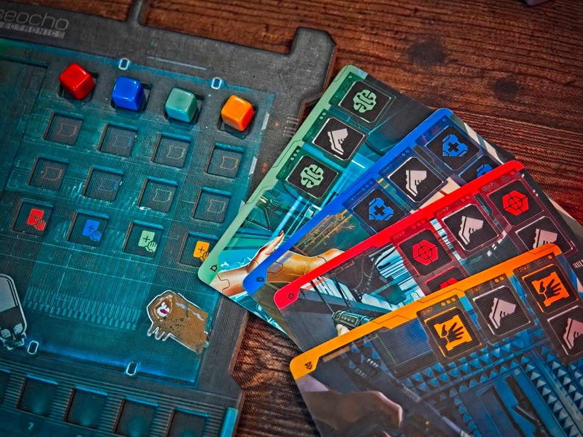

Cyberpunk 2077: The Board Game (prototype copy, first impression)

ผมเล่น Cyberpunk 2077: The Board Game ที่คนนำเข้าบอกว่ามีแค่กล่องเดียวใน Southeast Asia ( ณ ตอนที่เขียน ส่วนโม้ไหมม่ายรู้นะ ฮา ) เลยจะมาเล่าให้ฟังละว่าลองไปแตะๆดูแล้วเป็นยังไง

> I played the only copy of Cyberpunk 2077: The Board Game in Southeast Asia, and I will tell you how I feel.

> ของที่เห็นยังไม่ใช่รุ่นผลิตจริงทุกอย่างสามารถเปลี่ยนแปลงได้หมด

---

แน่นอนว่ามันทำมาจาก IP ของเกมชื่อเดียวกัน ก็หยิบๆเอาคาแรคเตอร์ในเกมนั้นแหละไปทำภาระกิจที่ (ผมเข้าใจว่า) ไม่ได้มีอยู่ในเกมต้นฉบับแต่ก็ยังเป็นการสำรวจเมืองและเนื้อเรื่องในเซ็ทติ้งเดียวกับตัวเกมต้นฉบับนะ

---

เกมจะแบ่งตัวเองออกเป็นหลายๆตอน แต่ละตอนเราจะเอาตัวละครของเราเดินไปมาทำภาระกิจประจำฉากให้ลุล่วงไป ซึ่งหลักๆก็จะวนๆอยู่กับการกำจัดศัตรูและการแวะเข้าไปทำแอคชั่นบางอย่างในพื้นที่ที่ฉากนั้นกำหนดไว้

ระบบการทำแอคชั่นมีแค่เล่นการ์ดหนึ่งใบ จั่วในครบแล้วจบตาให้คนถัดไป ง่ายๆแค่นั้นเลย ตัวแอคชั่นบนการ์ดจะมีเบสิคๆ 5 อย่างให้ทำคือ 

- เดิน
- ยิง
- เติมเลือด(เรียกเพิ่มระดับพลังงานเกราะละกัน)
- เพิ่มแรม (ประมาณว่ามานาเอาไว้ปล่อยท่า)
- แล้วก็เอามือไปปฏิสัมพันธ์กับของต่างๆในฉาก (เบสิคๆก็เปิดประตู) 

ซึ่งการ์ดใบนึงมันจะมีไอคอนให้ทำอยู่ 4 บรรทัด เราจะใช้ไอคอนได้มากน้อยก็ให้ดูว่าการ์ดนั้นสีอะไรแล้วเราอัพสกิลสายนั้นมาสูงแค่ไหน อัพมาเยอะก็ใช้ไอคอนได้เยอะ

เราก็ผลัดๆกันเล่นจนชนะเพราะทำภาระกิจสำเร็จครบทุกอันหรือว่ามีใครตายไปก่อน หรือว่าหมดเวลาในรอบนั้นก็ต้องมาพักเตรียมตัวสำหรับรอบต่อไป แต่ถ้าครบที่ฉากนั้นให้มาแล้วยังไม่ชนะก็แพ้ไปเหมือนกัน

ว่าแต่อะไรนะ... เวลาหมดเหรอ?

---

ไอเดียที่เกมนี้ทำมาได้ดีและผมชอบมากๆคือระบบ **จับเวลา** คือในหนึ่งรอบของเกมมันจะให้เวลาเรามา 3 นาที (จำเลขเป๊ะๆไม่ได้แต่ประมาณนี้แหละ) ผู้เล่นก็ทำการทำเล่นการ์ดใบนึงทำแอคชั่นวนๆกันไปเรื่อย พอหมดเวลาก็จะเข้าช่วงเบรคให้ NPC มันเดินกับทำโน้นนี้ ถ้าหมดแล้วหมดอีกจนใช้หมดตามที่ฉากให้มาก็แพ้ไป

ที่ชอบมากๆคือผมไม่ชอบรอไง โคตรดีมีเกมมาเร่งให้พวกลีลาคิดลำใย เล่นลนพลาดไปนิดหน่อยก็ไม่เป็นไรน่าเป็นสีสันของเกมไป แต่เท่าที่ดูก็คือมีฉากที่อาจจะต้องเล่นซ้ำหลายรอบอยู่พอควรด้วยเงื่อนไข setting ที่ซับซ้อนต้องการความ _คล่อง_ ในการตัดสินใจของผู้เล่นเพื่อให้ทำเวลาทัน

---

ซึ่งความดีของระบบนี้มันก็ส่งเสริมให้การทำแอคชั่นที่กระฉับอยู่แล้วมีความตื่นเต้นมากขึ้น ผมกล้าบอกได้เลยว่าถ้าไม่มีการจับเวลามันก็จะกลายเป็นเกมขาย ip เรียบๆไม่มีอะไรน่าสนใจเท่าไร แต่พอมันเบลนส่วนนี้เข้ามาได้แบบเหมาะเจาะก็ทำให้เกมสนุกขึ้นมาก แถมยังทำให้ระยะเวลาการเล่นเกมมีความนิ่งเอามากๆด้วย

กิมมิคเรื่องเวลาอีกอันที่เจอคือมันมีไอคอนแอคชั่นอารมณ์ _bullet time_ ที่ทำให้ทุกอย่างสโลโมชั่น แล้ววิธี implement มันคือกดปุ่มเพิ่มเวลาในแอป (น่าจะได้เพิ่มมาซัก 10-15 วิ) แต่ที่แบบไม่เจอกับตัวจะไม่ว้าวคือเพลงมันก็ยืดสโลโมตามให้เว้ย คือแบบ simulate ว่าเราเร็ว คนอื่นช้าได้แบบเจ๋งว่ะ ถ้าคิดว่ามันดูง่อยๆก็บอกเลยคุณไม่เหมาะจะเล่นเกมสายธีมหรอกพี่ชาย

---

ระบบต่อสู้ของเกมค่อนข้างง่ายและไวคือถ้าเริ่มตาเราแล้วเราอยู่ใน line of sight ของศัตรูให้ทอยเต๋าคู่ของเราเลย ลูกนึงจะบอกว่าเราเสียเลือดเท่าไร อีกลูกบอกว่าเรายิงใส่มันเท่าไร ง่ายๆแค่นั้นเลย ตัวฐานศัตรูจะมีตัวนับเลือดหมุนๆให้ด้วยสะดวกมากแต่ถ้าเรามีปืนพิเศษที่ไปเก็บมาระหว่างเล่นหรืออะไรก็ว่าไปอาจจะมีเต๋าแปลกๆมาให้ทอยเพิ่ม อย่างปืนบางอันคือเป็นปืนกล (ที่หยิบมาจากในเกม digital ) ถ้ายิงติดมันจะให้ทอยยิงใหม่ได้รัวๆจนกว่าจะยิงไม่โดนไรงี้ แต่อย่าลีลาเยอะเดี๋ยวเวลาในการเล่นรอบของเราจะหมดซะก่อน

---

ส่วนที่ยังไม่ได้ลองแต่ฟังมาคือตัว app มันจะทำซับแปลไทยมาให้ (เท่าที่ถามคือไม่มีพากษ์) กับฉากที่มาในตัวหลักหลายสิบฉาก รวมเสริมไปมีร่วมร้อย ที่คิดว่าต้องรอดูกันต่อไปว่าจะทำได้ดีไหมก็คือระบบเนื้อเรื่องนี้แหละ เพราะเท่าที่เล่นคือมันยังถือของข้ามฉากไม่ได้ (ได้แค่เดินเก็บแล้ว level up เอาระหว่างรอบ) 

ข้อดีอีกอย่างที่อยากชมคือมันทำ tutorial แบบค่อยๆคายระบบออกมาได้สวยดี ยังเล่นไม่หมดแต่ฉากแรกก็จะแบบให้เราเล่นแค่ใช้ไอคอน interaction เปิดแค่ประตู แต่หลังๆมันจะเริ่มซับซ้อนและเล่นกับระบบเกมมากขึ้น จุดที่ดีคือทำให้ผู้เล่นค่อยๆเข้าใจกับการทำงานของเกม แต่จุดที่ผมกังวลไว้ก่อนคือ ณ จุดๆหนึ่งมันจะเยอะจนใช้เวลาไม่ทันไหมนะ? หรือว่าจุดๆหนึ่งมันจะไม่ได้ซับซ้อนมากพอจนน่าสนใจหรือปล่าวกลายเป็นช่วงตอนท้ายๆจะดูน่าเบื่อไม่มีอะไรทำไหม? อันนี้ก็ต้องรอดูตอนตัวเติมออกมา แต่ first impression ผมคิดว่าดีมากครับ

กลับมาที่เนื้อเรื่องต่อก็เท่าที่ฟังเค้าว่ามาผลการตัดสินใจต่างๆในฉากมันจะ carry ข้ามไปตอนต่อๆไปด้วยนะ ตรงนี้คิดว่า _ถ้า_ ทำออกมาได้ดีก็ยิ่งทำให้คุณค่าในการเล่นซ้ำหรือการอยากไปเล่นฉากโน้นนี้เพื่อทำอะไรบางอย่างมันก็ดูน่าสนใจมากขึ้น

---
ส่วนตัวคิดว่าเกมวาง position มาได้ดีคือใส่ใจรายละเอียดให้เกมกระชับในแบบที่สาย digital มาเล่นง่าย ไอคอนคลีนโดยที่ไม่ได้ทำให้สาย analog มานั่งหาวว่าเกมเชี้ยไรเนี่ย คือมันมีหลายเกมเลยที่หยิบ ip มาแล้วยากจนฝั่ง digital ซื้อตามแล้วกลายเป็นตั้งโชว์เพราะเยอะไป๊ หรือไม่ก็ง่อยจนคนสาย analog บอกระบบงั้นๆมาใส่ ip ขายของไรงี้ 

ระบบจับเวลาจริงคือดีงาม ใส่มาสวย แต่ถ้ามาสายอยากได้ระบบเกมเข้มๆรายละเอียดเยอะอ่าน lore ยาวๆระหว่างเล่นเกมนี้ก็ไม่ได้ตอบโจทย์นะ 

ผมลองเกมนี้ที่ 2 คนค่อนข้าง happy นะ คิดว่าพอคนเพิ่มมันจะรู้สึกหนึดขี้นนิดหน่อย แต่ turn มันสั้นแล้วก็มีเวลาจำกัดก็คงไม่มีปัญหาอะไร ช่วงเบรคก็สามารถคุยวางแผนกันได้ว่าคนไหนจะไปทำอะไรหรือแบ่งคนยังไงดี
---

> ข้อเขียนจากประสบการณ์และความเห็นส่วนตัว ไม่ได้รับเกม/สิ่งของ/ค่าจ้าง ใดๆจาก _สยามบอร์ดเกม_ ผู้นำเข้าในการทำโพสนี้

> อ่านข้อเขียนนี้และข้อเขียนอื่นๆในเวบได้ที่ https_://forum.tinymeepletalk.com/d/30-cyberpunk-2077-the-board-game-prototype-copy-first-impression

