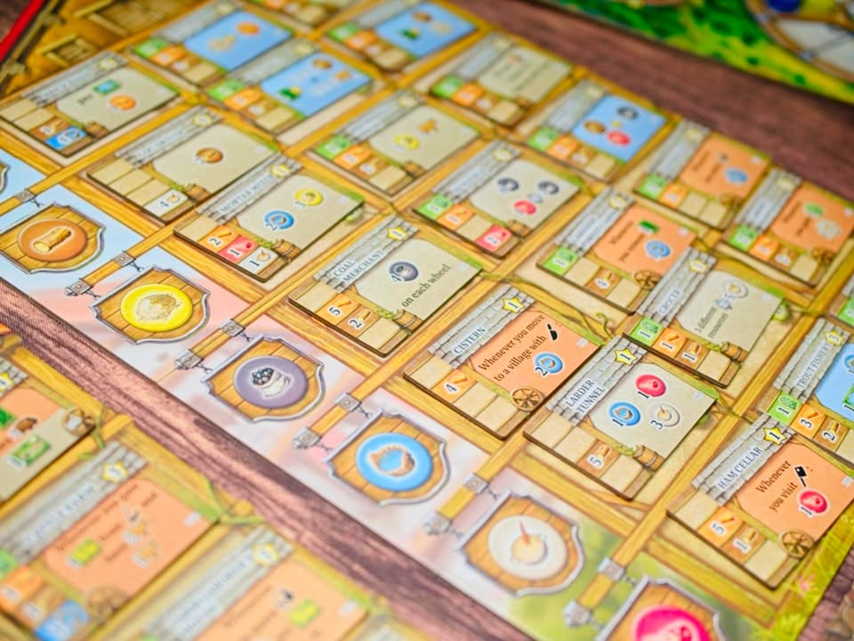

Black Forest - เวียนตัดไม้ไปเผาทำแก้ว

เกมประจำปีของสุดยอดนักออกแบบเกมวิถีชาวบ้านอย่าง Uwe Rosenberg ที่มาจับมือกับ Tido Lorenz (เอาจริงผมว่า Tido ทำแล้วเอาชื่อ Uwe มาพ่วงๆทำ co-design ขายของแหละ) ทำเกมธีมเกี่ยวกับหมู่บ้านที่มีวิถีชีวิตในการทำแก้ว ซึ่งเป็นกิจกรรมที่ต้องใช้ไฟจากการเผาถ่านเยอะมาก ทำให้พอตัดป่าที่หนึ่งหมดชาวบ้านก็จะ ย้ายไปตั้งแคมป์พื้นที่ใหม่วนเวียนกันไป

---
แม้โดยแกนแล้วมันจะค่อนข้างเรียบง่ายคือเกมส่งคนงานไปหยิบเก็บของแล้วก็วนๆซื้อตึกเข้าเงื่อนไขแล้วก็จบเกมก็เถอะ แต่เกมก็มีกลเม็ดที่น่าสนใจหลายอย่าง 

อย่างแรกคือเรามีคนงานเดียวทั้งเกมแต่ว่าจะตัวแอคชั่นจะถูกจับอยู่เป็นกลุ่มๆตามหมู่บ้าน คือมันมีหมู่บ้านอยู่ 5 ที่อยากทำแอคชั่นอะไรถ้าอยู่ในหมู่บ้านเดิมก็ไม่เสียอะไร แต่ถ้าจะเดินข้ามหมู่บ้านเราต้องเสียทรัพยากรเสบียงด้วยซึ่งมีไม่เยอะ ทำให้เราต้องวางแผนการทำแอคชั่นไว้ล่วงหน้าประมาณหนึ่ง และมันสำคัญกับเกมนี้มากขนาดที่มีกติกาเพื่อบอกให้เรา 'หยุด' ไป 1 ตาฟรีๆถ้าอยากผลิตเสบียงมาใช้กรณีที่ไม่มี

ทวิสที่ซ้อนมาแบบน่าสนใจดีคือช่องแอคชั่นในเกมจะแทนคนทำอาชีพแบบต่างๆ หนึ่งในนั้นคืออาชีพพ่อค้าที่เราสามารถสลับช่องแอคชั่นอันนี้กับช่องแอคชั่นอะไรก็ได้ เวลาเล่นจริงมันเลยทำให้เกมไม่ได้มีแค่ fixed puzzle นิ่งๆให้เราเดินวนไปวนมา ก็มีจิ๊ปากหน่อยๆเวลาเพื่อสลับของที่เราไม่อยากได้แล้วเสบียงเราไม่มี

---
ระบบที่สองที่ถือว่าเป็นพัฒนาการที่ Uwu ชอบใช้มากคือล้อเติมของ ซึ่งเป็นระบบที่จะต่างกับเกมแนวเก็บสะสมของเกมอื่นตรงที่เวลาได้ของมันจะให้เราขยับแทรคแทนเพื่อบอกว่ามีสินค้าชนิดนั้นๆอยู่กี่ชิ้น แต่ทวิสที่ล้ำมากของเกมนี้คือในหนึ่งวงล้อจะแบ่งเป็นสองส่วนคือสินค้าพื้นๆ (น้ำ,ไม้,ข้าว,ถ่าน) กับสินค้าแปรรูป (กระจก) ซึ่งส่วนมากเราก็อยากได้กระจกและตามธีมเกม เพราะตึกเกือบทุกอันในเกมต้องใช้กระจก 

ในเกมส่วนมากพวกของ level 2 เนี่ยมันจะต้องไปทำแอคชั่นแปลงซักวิธี แต่ความ 'เท่' ของเกมนี้คือในวินาทีที่เราขยับเติมทรัพยากรเกมจะให้ดูว่า 'เข็ม' ของวงล้อนั้นขยับได้ไหม ถ้าขยับได้ให้ขยับไปจนชนมาร์คเกอร์ และด้วยความที่สินค้าแปรรูปมันอยู่ในอีกส่วนหนึ่งของวงล้อมันก็จะได้รับการเติมเต็มอัตโนมัติเพราะเข็มมันขยับ

ความเจ๋งในเชิงการออกแบบคือมันทำกับว่าผู้เล่นถูกบังคับให้แปลงทรัพยากรทันทีที่สามารถจ่ายทุกอย่างอย่างละ 1 ได้ ตอนฟังอาจจะไม่เท่าไร แต่ตอนเล่นจริงมันทำให้เราไม่สามารถใช้กลยุทธ์พื้นฐานอย่างวนเก็บของไว้เยอะๆแล้วใช้ได้ต้องมีการทิ้งบางชิ้นไว้ที่ 0 เพื่อยันไม่ให้เข็มมันเดินไรงี้

---
กิมมิคเรื่องการทำไร่เผาถ่านเลื่อนลอยในเกมก็ทำมาน่าสนใจดี คือเกมนี้เราจะเริ่มจากไร่เล็กๆส่วนตัว ก็ตัดไม้ ทำรั้วเลี้ยงสัตว์ เอาตึกมาวางทำแอฟเฟคไป แต่ถ้าอยากได้ที่เพิ่มหรือป่าเราถางหมดล่ะเราก็ต้องไปทำแอคชั่นเป่าแก้วพอแทรคขึ้นเต็มเราก็จะได้ไทล์ไร่อันใหม่มาพร้อมกับป่าและพื้นที่ใหม่เพิ่ม ตรงนี้กิมมิคก็คิดว่าดีนะล้อไปกับระบบได้สวย

ที่เหลือไม่มีอะไร ตึกมีเยอะสัดอ่านตาแตกในตาแรก มีให้พลิกสลับหน้าหลังเพื่อความไม่จำเจ เกมเล่นกันจนผู้เล่นผลักเข็มเดินหน้าไปถึงจำนวนที่กำหนด

---
ในมุมส่วนตัวคือมันก็แบบ typical Uwe หน่อยๆแบบเกมเกมชีวิตชาวบ้านวนเก็บของไปมา ส่วนตัวคงให้ on par กับ Hallertau (ถ้านับเกมเด็กปั้นของลุงเกมอื่นด้วยก็มี Lowlands) ทั้งในแง่ weight และระดับความสนุก ซึ่งผมก็คิดว่ามันกำลังลงตัวดีนะ แต่ถ้าอยากใหญ่กว่านี้ก็จะไปทาง A Feast of Odin, Fields of Arle อะไรประมาณนั้นแทน (ถ้าอยากได้เล็กลงนิดๆก็ Nusfjord, Grass Road)

---
**What I like:** เกม Uwe style ที่มีบอดี้ให้คิดโน้นนี้ระหว่างเล่นเพลินดี ไอเดียการบริหารทรัพยากรที่แตกต่างจากขนบเกมเก็บของทั่วไปทำให้ต้องปรับวิธีคิด ตอนเล่นแล้วเห็นฟาร์มมีพัฒนาการก็ฟีลกู๊ดดี
  
**What I dislike:** รอนาน..... อย่าเล่น 4 คนเลย 2-3 พอละ  คือมันไม่ใช่เกม WP แบบแย่งช่องแล้วมีคนโอดครวญด้วยไง ไม่มีอันนี้ก็ไปหยิบอันนี้รอได้ กับแอบรู้สึกรำคาญนิดๆที่ต้องมานั่งอ่านตึกความสามารถเต็มพรืดพร้อมกันตั้งแต่เริ่มเกม พวกตึกมันก็  typical Uwe แบบหยิบแล้วก็แลกของไปมาซึ่งไม่ใช่ข้อเสียอะไรแต่ก็จืดๆตามธีม ไม่รู้สึกระเบิดพลัง แล้วเกมมันก็จะคีพโทนสร้างวนๆไปเรื่อยทั้งเกม
  
**I think this game might be a good fit for...:** แฟนเกมของ Uwe ในกลุ่มเกมขนาดกลาง คือหลายครั้งอยากจะกางซัก Fields of Arle แต่มันจุกจิกไปหน่อย Black Forest ก็เป็นการย่นขนาดมาในแบบที่คิดว่าย่อยง่ายกว่า
  
**I think this game might NOT fit for...:** ถ้าอยากหา WP ตัดกันเข้มๆของ Uwe มันได้หายจากเราไปนานตั้งแต่ Agricola / Caverna ละ

อ่านข้อเขียนนี้และข้อเขียนอื่นๆได้ที่ https_://forum.tinymeepletalk.com/d/37-black-forest

