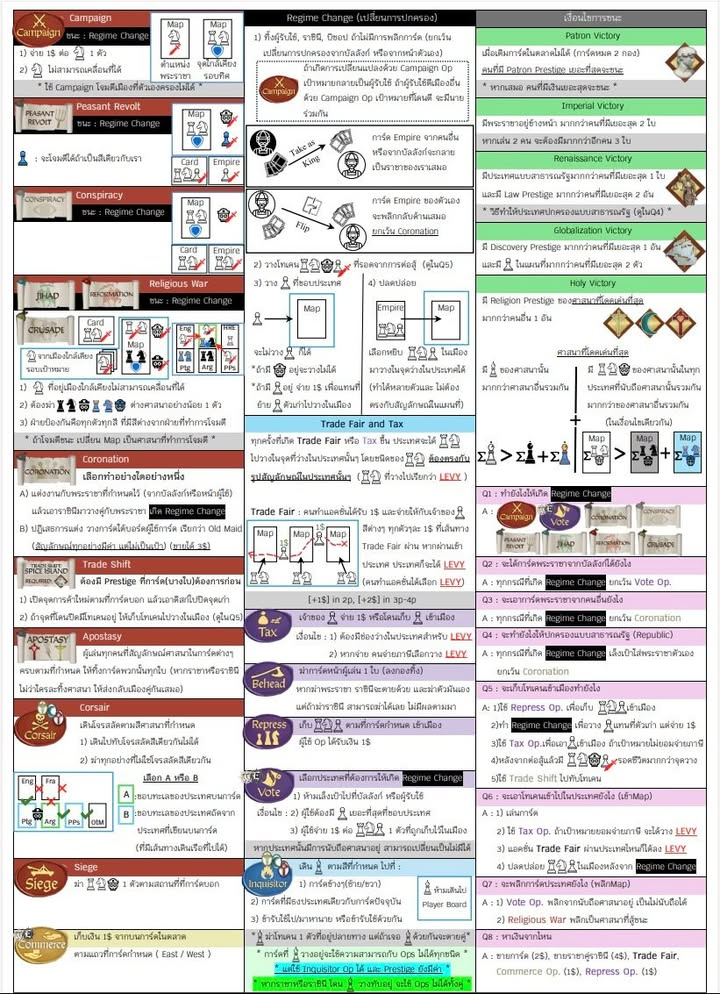
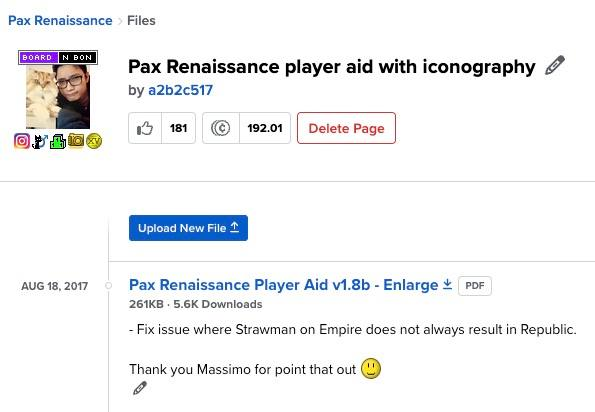
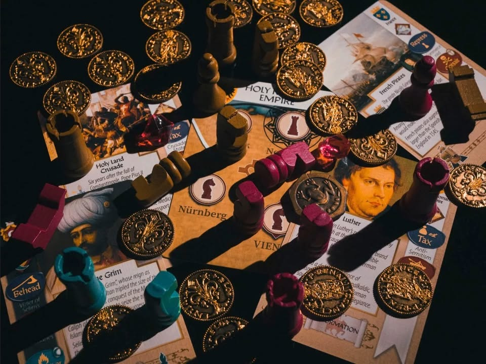

Pax Renaissance เป็นเกม Top 10 of All Time ของผมเกมเดียวที่แทบไม่ค่อยหยิบมาแนะนำคนอื่นนอกจากดูหน้าแล้วโอเคเจ้าคือผู้ถูกเลือก เป็นเกมที่ใครอินประวัติศาสตร์ยุโรปซักหน่อยจะชื่นชอบถึงการเล่าเรื่องที่เราคือนายธนาคารที่จะโยงใยชักนำเหตุการณ์ในประวัติศาสตร์ผ่านการควบคุมเงินตรา

แต่มันก็มีรูปแบบเกมที่ถ้าอธิบายด้วยวิธีการปกติแล้วรับประกันการตาลอย ด้วยรายละเอียดที่หยุบหยับไปไหน แต่ทว่าจริงๆมันเป็นเกมที่ไม่ได้ยุ่งยากอะไรขนาดนั้นหยิบการลงตัวหมากบนแผ่นที่เท่านั้นเอง ที่เหลือคือถ้า 'คลิก' อินกับธีมเมื่อไรกติกาทุกอย่างก็จะสมเหตุสมผลขึ้นมาทันที

---
หนึ่งในความภูมิใจสุดๆของชาวเนิร์ดแบบผมคือไฟล์ player aid ที่ผมทำให้กับตัว 1st Edition นั้นมียอดโหลดสูงถึง 5600+ ครั้ง คือคุณเข้าใจใช่ป่ะเกม niche ฉิบหายแต่เกือบทุกคนมองว่า player aid เราแม่งเจ๋งอ่ะ ยอดโหลดคือมากกว่าจำนวน copy เกมอีกมั้ง

ส่วนตัวอาจจะแนะนำให้ลองเล่น Pax Pamir 2nd Edition ก่อนเพราะมันมีความเป็น 'เกม' สูงสุดละ ถ้าชอบแล้วอยากลอง Pax อันต่อไปก็แนะนำ Pax Renaissance 2nd Edition เป็นเกมต่อไปครับ

ใดๆมันก็เป็น series เกมเฉพาะทางหน่อยๆ ถ้าเล่นแล้วรู้สึกไม่สนุกก็ไม่ต้องตกใจ แต่ก็อยากให้ลองเล่นซักสามสี่รอบก่อนนะ มันเป็นเกมแนวที่ต้องค่อยๆอินกับมันนิดนึง

---
เกริ่นมายาวเพื่อบอกว่ามีคนเอาไปแปลไทยสำหรับ 2nd edition แล้วนะ โดยคุณ Pong Puttamasung สามารถโหลดไปใช้ได้จากลิงค์นี้ครับ เกมมันสนุกจริงๆนะ แค่ต้องใช้ mindset เฉพาะทางหน่อย ซึ่ง player aid ดีๆก็ช่วยให้คุณข้ามกติกาหยิบย่อยน่ารำคาญของเกมนี้ได้เยอะอย่างไม่น่าเชื่อเลยล่ะ

https://onedrive.live.com/?id=49426D4CBB3AEC4E%21se7d46eb18ff74b8dad1b881287eafded&cid=49426D4CBB3AEC4E&redeem=aHR0cHM6Ly8xZHJ2Lm1zL2IvYy80OTQyNmQ0Y2JiM2FlYzRlL0ViRnUxT2YzajQxTHJSdUlFb2ZxX2UwQlRnR2NacF9RREVCaVozbTc2aUdHbkE%5FZmJjbGlkPUl3WTJ4amF3S3JmVDlsZUhSdUEyRmxiUUl4TUFCaWNtbGtFVEZRVEZFeVdWTXdVV1ZOVldOWWRUSkNBUjZHbURERDhHYzRTRDZlVTlMaXlzQWtXVDV3ZHgzTmMzUTRqQ2xfUU1LSzVEUzBUb3lmbWRQcTZDd0pOd19hZW1fRl9sOWhRdEhEd0QxUFpqbWQ2dGhpUQ

---
เกล็ด: 

pre 2015 - ในระหว่างที่ Phil (คนออกแบบ Pax R ) กำลังพัฒนาทำตัว 1st edition อยู่ เค้าก็เอาไอเดียไปคุยกับ Cole (คนทำ Root นั้นแหละ) 
.
2015 - ไปๆมาๆเลยได้ Pax Pamir 1st Edition ออกมาขายก่อน 
.
2016 - PaxRen 1st Edition วางขายโดยหยิบเอาไอเดียการทำแผนที่บนการ์ดของ Pax P มาใช้
.
2019 - Cole ก็ขอหยิบเอา Pax P ไปทำต่อเองออกมาเป็น Pax Pamir 2nd Edition
.
2021 - Pax Ren 2nd Edition วางขาย (เอาจริงๆส่วนตัวชอบ 1st edition กล่องเล็กมากกว่านะ)์ด

