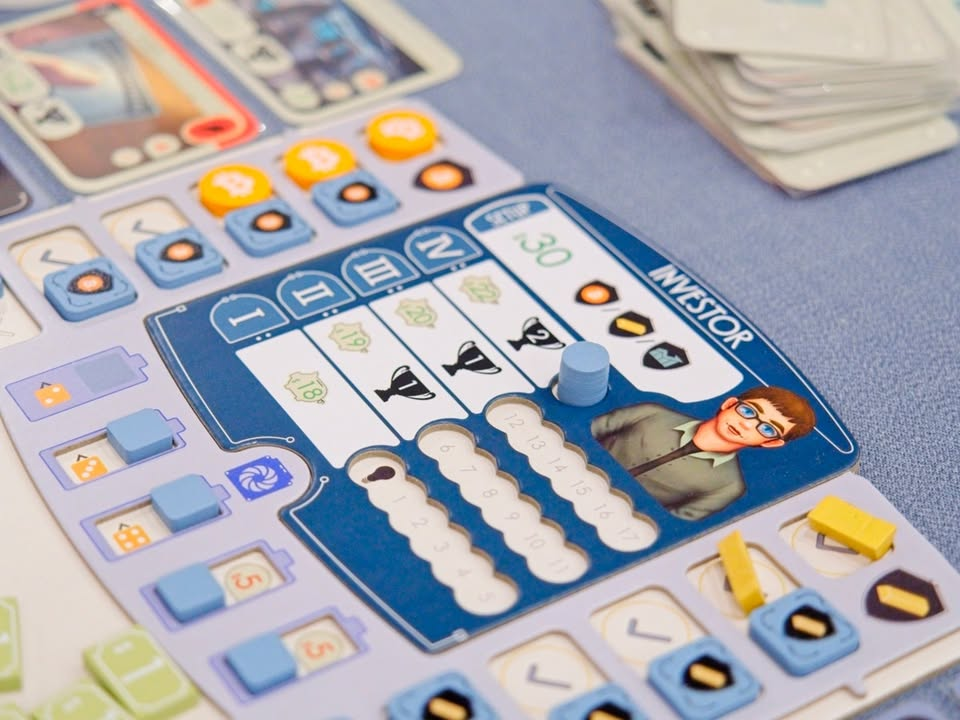
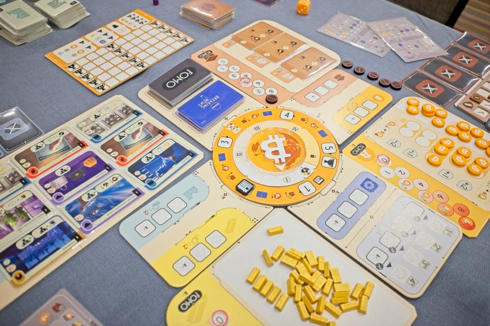
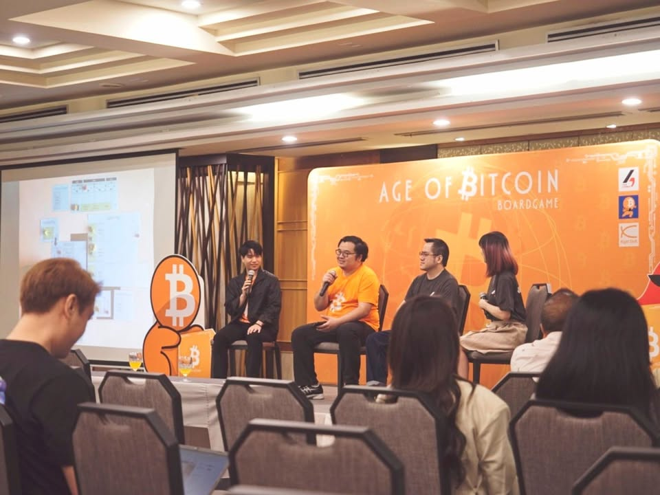

Age of Bitcoin #first_impression จากงานเปิดตัว

>เป็นเกมที่ตอนเล่นมีความรู้สึกแปลกประหลาดนิดหน่อย เพราะตอนที่เค้าเอามาเดโมให้เล่นช่วงกลางๆระหว่างพัฒนาเนี่ยโดนเราสับไปเยอะอยู่ แต่ด้วยสปิริตทีมเค้าก็ไปแก้ๆๆๆๆๆๆๆ จนออกมาเป็น version ที่กำลังจะเข้าสู่การระดมทุนละ

ความน่าสนใจในเชิงเป้าหมายคือความทะเยอะทะยานที่อยากจะทำเกมที่ Bitcoiner (ที่ส่วนมากไม่ได้เล่นบอร์ดเกม) เล่นได้และคนเล่นบอร์ดเกมก็ไม่สับว่าเกมเหี้ยไรเนี่ย ซึ่งผมก็คิดว่ามันทำได้นะ แต่ก็มีข้อสังเกตห้อยท้ายตามมาเยอะเหมือนกัน เดี๋ยวไปอธิบายเพิ่มตอนท้ายนะ

กับพูดถึง Bitcoin ซักหน่อย เอาแบบความเข้าใจผมละกัน (ผิดพลาดขออภัย) ว่าเราต้องมองเรื่องนี้แยกเป็นสองอย่าง อย่างแรกคือระบบทางเทคโนโลยีของ Bitcoin ว่าเหรียญมายังไงแล้วทำไมถึงน่าเชื่อถือ (ว่าไม่มีการปลอมแปลงและมีมูลค่า) อย่างที่สองคือแนวคิดเรื่อง Decentralized การเงินที่ไม่มีตัวกลางอย่างธนาคารหรือรัฐบาลมาควบคุม ซึ่งสองเรื่องนี้ถ้ามองแยกกันแล้วไม่ได้เกี่ยวกันเลย เพียงแต่ Bitcoin มันไปด้วยกันได้ดีกับแนวคิดการ Decentralized การเงินจากส่วนกลางก็เท่านั้น 

เพราะงั้นการเล่าเรื่อง Bitcoin มันเลยมี 2 แกนให้พูดถึง แล้วมันแตกต่างกันมากเกินไปสำหรับการเล่าพร้อมกัน โดยเกมนี้จะเอียงไปทางโลกจะเป็นอย่างไรถ้าเราเอา Bitcoin มาใช้เป็นตัวกลางในการแลกเปลี่ยน โดยไม่ได้ลงลึกในเชิงเทคโนโลยีของ crypto currency นะ

---
ว่าด้วยระบบกันก่อน เกมนี้อยู่แถวๆ medium light (weight น่าจะแบบ 2.6-2.8 ไรงี้) เดินเกมด้วยระบบ worker placement ที่มีแอคชั่นให้ทำอยู่ 4 แบบ

ไอเดียการเล่าเรื่องมันจะมี bias setting ว่าเดี๋ยว Bitcoin มาจะเป็นอีกทรัพสินที่ใช้ในการแลกเปลี่ยนได้และมีความน่าใช้มากกว่าทองคำ (ก็มัน Age of Bitcoin จาก Bitcoiner อ่ะนะ)

อย่างที่บอกคือตัวแอคชั่นจะมี 4 แบบเข้าใจง่ายๆ สามอันคือลงไปเพื่อ ซื้อ/ขาย Bitcoin/ทอง/ตึก อีก 1 อย่างคือลงแอคชั่นเพื่อพัฒนาความรู้หลักๆก็เพื่อเปิดช่องเก็บของสินทรัพย์ 3 แบบ ก็เอาเงินสดไปวนหาจังหวะซื้อขาย กับลงทุนในรูปแบบต่างๆที่ต้องดูทางลมเพื่อนเอาหน้างาน

---
ฟังดูไม่มีอะไรแต่เกมนี้ไม่ง่ายตรงที่มันมีความ resource management สไตล์ยูโรจ๋าๆเลยล่ะ ตั้งแต่การเก็บบริหารช่องเก็บของ เกมนี้ไม่ได้ใช้ระบบตลาดแบบซื้อปุ๊บราคาตก หรือขายปั๊บราคาขึ้นแบบเกมบ้านๆ  แต่ใช้ระบบแทรค FOMO ที่จะเพิ่มขึ้นทุกครั้งที่มีคนทำแอคชั่นในหมวดนั้นๆ ถ้าเป็นฝั่งเงินก็จะมีจังหวะทำราคาขึ้น แต่เมื่อมันไปจนสุดก็จะมี effect จะบ่งบอกว่าตลาดได้ greed สุดๆจนราคาร่วงตกลงมา 

ความโหดร้ายของการที่ราคาตกคือผู้เล่นทุกคนจะโดนบังคับ downgrade ช่องเก็บของ โดยที่ถ้ายังมีของวางอยู่จะโดนบังคับ force sell ด้วยราคาที่โดนกดลงมา 

ส่วนฝั่งอสังหาริมทรัพย์จะเป็นพวกตึกสไตล์ยูโรเกมแนวๆมี effect โน้นนี้ มีตึกนี้ลดราคาตึกนั้น ถือไว้มี passive income อะไรก็ว่าไป ตึกยุคท้ายเกมก็จะคูณแต้มจากตรงโน้นตรงนี้ต่อ

ส่วนกิมมิคในการพรีเซ้นที่น่าสนใจดีก็คือการเอาแม่เหล็กมาทำเป็นกราฟแท่งเทียนบอกราคา

---
ในเชิงมุมมองตอนเล่นเนี่ยพบว่าแก๊ง gamer กับแก๊ง bitcoiner นี้เล่นกันคนละแบบ คือฝั่งเกมเมอร์มันจะแบบคิดทุกสิ่งเป็นแต้มเพื่อคำนวนว่าคุ้มไหม แล้วก็พร้อมจะตัดทุบชาวบ้านตลอดเวลารวมไปถึงพยายามเลี้ยงเกมดึงจังหวะตลอด แต่ฝั่ง bitcoiner อาจจะไปในแนวมีธีมการลงทุนหรือมีแนวคิดมาร่วมมือกันรอราคาให้มันสูงๆกันเถอะไรงี้

---
overall ผมคิดว่ามันเป็น mid-light euro ที่ก็เล่นสนุกดี แต่มันอาจจะติดปัญหาเรื่องพลังในการดึงดูดในซ้ำอยู่เหมือนกันสำหรับสายเกมเมอร์ เพราะ weight มันไม่สูงด้วยล่ะ วิธีการแก้ปัญหาที่ดีที่สุดมันมักจะมองออกไม่ยากอยู่แล้ว ยิ่งเกมนี้มีช่อง = player-1 โดยไม่มีบทลงโทษของการมาช้าทำให้เกมมันไหลไปเรื่อยๆได้สบาย แต่ผมไม่คิดว่ามันง่ายแบบน่าเบื่อนะเพราะมันต้องมีการจัดการ turn order กับการมองกระดานผู้เล่นคนอื่นตลอดเวลา ในมุมของการบริหารทรัพยากร 3-4 ชนิดวนไปมาผมคิดว่าทำได้ดีนะ

ในแง่มุมของการสื่อสารเรื่องการบริหารสินทรัพย์ที่ยังเล่นสนุกอยู่ไม่น่าเบื่อผมคิดว่าวางเฟรมมาได้แบบประนีประนอมดี ไม่ได้อวย Bitcoin ไส้แตก มีจังหวะที่ต้องกระจายการลงทุน แต่ถ้ามองแค่เกมล้วนๆจะอยู่ในระดับผ่านเส้น ไม่ได้มีอะไรให้ชมแบบว้าวจัด แต่ไม่มีอะไรให้ติจริงจัง

---
ที่นี้ปัญหาใหญ่ของเกมนี้สำหรับผมคือ position ของมัน คือด้วยความที่พยายามทำเกมให้รับกับฝั่ง gamer ด้วย 'แผล' ของเกมคือระบบ phase หยิบย่อยที่แอบจุกจิกต้องคอยดู player aid ตลอด ซึ่งมันเยอะเกินไปสำหรับเกม mid-light แล้วยิ่งเยอะแบบมันจะทำเองได้เหรอว่ะสำหรับ non-gamer

คือระบบการขยับโน้นนี้มัน make sense หมดเลยนะ ทำให้เกมออกมาดีด้วย แต่ความจุกจิกนิดๆหน่อยของมันทำให้ดูจะเป็นเกมที่ต้องการวิทยากรสำหรับ non-gamer อยู่เหมือนกัน

ส่วนที่รู้สึกว่า 'ดื้อ' ของงานออกแบบคือการ ทอยเต๋าดูผลการขุด .... โอเค non-gamer มันก็ดูเฮฮาเข้าใจได้ง่ายๆดี ระบบลดความเสี่ยงก็มาจากการลงทุนซื้อเครื่องขุดในเกมได้ แต่ในมุม gamer แล้วมันดู 'ง่อย' ไปหน่อย imho ถ้ามีโมดูลขยายให้มีการบริหารความเสี่ยงที่ make sense กว่านี้จะดีกว่ามาก

---
แล้วเกมนี้เหมาะกับใคร? สำหรับผมก็คิดว่าเหมาะกับแนว 'อยากสอนลูกเล่นบอร์ดเกมที่มีการจัดการทรัพยากรธีมการเงิน' ละมั้ง? ผม happy กับฝั่งเกมของมันนะไม่คิดว่ามันจะต้องซับซ้อนกว่านี้ มีความเป็นเกมเต็มที่โดยที่ยังเล่าเรื่องที่ตัวเองอยากสื่อโดนไม่ฝืนนัก แต่ด้วยเป้าหมายของเกมทำให้ weight มันอยู่นอกเรดาห์ผมไป ส่วนเรื่องที่มันอาจจะแอบจุกจิกไปนิดก็เป็นจุดที่ถ้ามีคนรันเกมที่เข้าใจมาช่วยแนะนำหรือถกถึงประเด็นที่อยากจะสื่อได้เพิ่ม

---
เกมพึ่งเปิดตัว กำลังจะเข้าสู่ช่วงการเปิดระดมทุน สนใจก็ไปกดติดตามไว้ได้ครับ https_://www.kickstarter.com/projects/whiteelephants/age-of-bitcoin

---
> ค่าย 4Comma (ของแท้ไม่เติม s) x เพจ Bittoon เค้าชวนไปงานเปิดตัว มีเลี้ยงข้าวบุฟเฟ่โรงแรม แต่ไม่ได้ให้สิ่งตอบแทนอื่นใด (เอากรูไปขึ้นสไลด์ด้วยนะว่าขอบคุณมากที่เผาเวอร์ชั่นเก่าซะเกรียมทำให้มีฉบับใหม่โผล่ขึ้นมา....) และเกมนี้อยู่ในช่วงกำลังจะเริ่มระดมทุนกติกาและอุปกรณ์ใดๆยังเปลี่ยนแปลงได้อีก

---
อ่านข้อเขียนนี้และอื่นๆได้ที่ https_://forum.tinymeepletalk.com/d/42-age-of-bitcoin-first-impression

