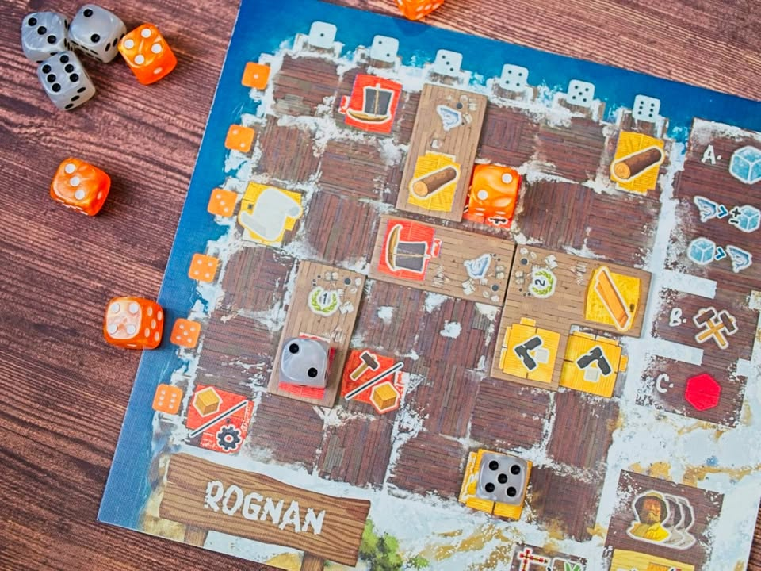
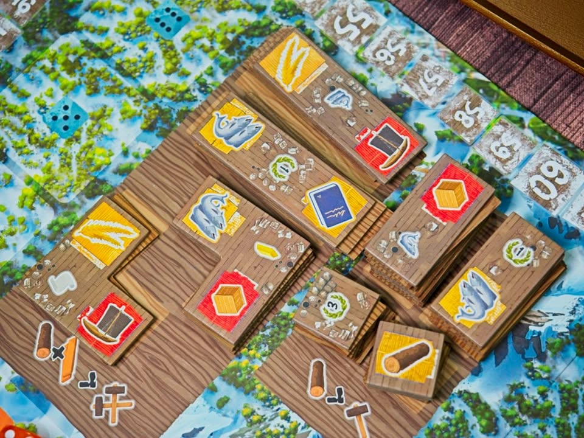

Saltfjord - หมู่บ้านชาวประมง

เกมยูโรระดับกลางที่จะให้เรามาขยับขยายกับพัฒนาหมู่บ้านของชาวบ้านในนอร์เวย์ โดยที่จริงๆแล้วเกมที่เอา Santa Maria มาทำใหม่อีกทีโดยที่ก็มีจุดแตกต่างเป็นของตัวเองไม่ได้แค่เปลี่ยนจากธีมสเปนยึดดินแดนหลบกระแสโลก

---
จุดเด่นที่เป็นเอกลักษณ์ของเกมคือแผ่นบอร์ดของผู้เล่นจะเป็นตาราง 6x6 ที่มีเลขเต๋ากำกับอยู่ สีส้มสำหรับแนวนอน และสีขาวสำหรับแนวตั้ง หลังจากเกมทอยสุ่ม pooling เต๋าตรงกลางแล้ว ผู้เล่นจะผลัดกันหยิบเต๋ามาทำแอคชั่น

ระบบทำแอคชั่นก็คือถ้าเราหยิบเลข 3 สีขาวเราจะมาไล่ resolve ช่องของเมืองเราว่ามีของอะไรให้เก็บบ้างก็ทำไปเรื่อยๆ เสร็จแล้วเราก็เอาลูกเต๋าวางทิ้งไว้ในเมืองมีผลให้เวลาเราหยิบเบอร์เดิมมาทำแอคชั่นเราจะได้ของน้อยลงเพราะช่องเก่ามีเต๋าบังอยู่

อีกแอคชั่นก็นั้นแหละคือการไปสร้างหยิบไทล์จากส่วนกลางมาโมบอร์ดของเรา มันเลยเป็นเกมที่ต้องทำสมดุลย์ระหว่างการจ่ายทรัพยากรเพื่อพัฒนาช่องในบอร์ดแล้วก็การมองจังหวะแย่งหยิบเต๋าเพื่อมาทำแอคชั่น

---
ในเชิงการเล่นเกมมันมีกลยุทธ์ท่าหลายแบบอยู่ คือมีทั้งการเลื่อนแทรคความสามารถ มีการออกเดินเรือหาปลาเพื่อทำคะแนน แล้วก็ระบบส่งของเพื่อเก็บแต้มกับทำโบนัสแอคชั่นต่อ

---
ส่วนที่ชอบของเกมคือระบบมันค่อนข้างคลีนแล้วก็แน่นดี คือเมื่อก่อนแก๊งผมกาง Santa Maria บ่อยเพราะมันเป็นเกมที่ไม่ต้องคิดอะไรมากแต่มีจังหวะคิดตลอด puzzle ในการต่อไทล์เพื่อจะให้มัน worked กับเต๋าที่เหลืออยู่ก็สนุกดี 

จุดที่คิดว่าโบ๊ะบะคือต้องปั้น engine free action ที่น่าสนใจดี คือพอเราส่งของสำเร็จเราจะได้ไทล์มาสะสมตามหมวดไว้ ตอนจบรอบจะได้เป็นโบนัสแอคชั่นมาใช้ฟรี ยิ่งซ้ำหมวดยิ่งแรง แต่ก็รู้สึกว่าบางหมวดมันเก่งกากต่างกันเยอะอยู่

---
ส่วนที่ไม่ค่อยชอบเท่าไรคือเกมนานเฉ๊ย.... แบบตอนเล่น Santa Maria เนี่ยมันจะประมาณเกม 60-90 นาที แต่เกมนี้แม่งล่อไป 120+ เฉยเพราะคนมัวแต่งึมงำวนแปลงของของหยิบนี้ทอนโน้นส่งนั้น กับเกมมีระบบเก็บแต้มจากการเดินเรือที่มันให้เปิดไทล์หาของแบบสุ่มที่ถ้าดวงดีก็แต้มบานเลยในขณะที่ถ้าดวงไม่ดีอาจจะได้แค่ปลาด๋อยๆที่ทำเอารู้สึกไม่ค่อยคุ้มค่าเท่าไร

กับเกมนี้มันมีทรงอยู่กับตัวเองพอควร หน้าเต๋าที่จะแย่งหยิบไม่ได้แบบอยากหยิบตัดคนอื่นแค่พอคนอื่นหยิบแล้วเราดันของไม่พอเฉยๆ กับพอมีสองสีไอเดียมันดีนะ แต่เล่นจริงคำนวนยากกว่าเดิมว่าจะรีบหยิบอันไหนก่อนดีฟระ

---
ถ้าเทียบกับ Santa Maria เท่าที่นึกออกคือมันเพิ่มแทรคเทคโนโลยีมาทำให้เกมมีมิติมากขี้้น ทรัพยากรในเกมโน้นมันแปลงไม่ได้แต่เกมนี้ทำได้ซึ่งข้อดีคือเกมไหลลื่นมากขึ้นแต่ข้อเสียก็นั้นและคนมันแปลงของวนไปจนเกมแอบนานเพราะท่าดิ้นมันเพิ่ม กับระบบเดินแทรคเก็บทองเกมนี้ให้ไปเก็บปลาแทนซึ่งต่างกันเยอะเหมือนกัน ส่วนตัวชอบแทรคเดินทองง่ายๆของเดิมมากกว่า แต่อันใหม่ก็ไม่ได้แย่อะไร

เรียกว่าถ้าเล่น Santa Maria มาแล้วเกมนี้แตกต่างกันมากพอที่จะลอง แต่ถ้าบอกจะให้ซื้อมาอัพเกรด replace กันไหมก็คงไม่มีกล่องเดียวก็พอละ position มันซ้อนทับกันไปหน่อยแต่ใดๆคือ Saltfjord มันสวยกว่านะ 

---
🐸 ME : คิดว่ามันเบากว่าที่ชอบแล้วก็งึมงำไปหน่อย ระบบเรือหาปลาสวิงเกิ๊นยิ่งช่วงท้ายเกมได้แต่ปลานี้ตัดสินผลแพ้ชนะกันได้เลย รอนานกว่าที่ชอบ  แต่ก็ไม่ได้แย่มากเพราะมันต้องคิดอะไรหลายอย่างระหว่างรอ เกมแรกซัดไปสองชั่วโมงกว่า นานไป๊! แต่ด้วยความที่มันกางง่าย คู่มืออ่านสบาย กับระบบมัน unique จากเกมอื่นก็คงเก็บๆไว้ก่อน แต่แบบประมาณนี้ก็แอบอยากกางเบอร์กันดีย์มากกว่าแฮะ

🟠 regular | 🔴 expert : เกมระดับกลางไม่มี overhead rule เยอะ ก็หยิบมากางง่ายอยู่ ระบบ resolve action ถือว่า unique เอาไว้เปลี่ยนบรรยากาศได้

🧸newbie | 🟢casual/faimly : อาจจะโดนถาโถมด้วยตัวเลือกที่มากกับความเชื่อมโยงในการแก้ปัญหากับทำคะแนน ถ้าจับทางไม่ทันอาจจะโดนน็อกรอบได้ง่าย แต่ด้วยกติกาหลักที่ไม่ซับซ้อนก็น่าจะยังสนุกกับการสำรวจท่าไปได้เรื่อยๆ 

---
🐸 ME - ความเห็นส่วนตัวสำหรับตัวเองเพื่อตัวเอง
🔴 expert - ผ่านเกมมาเยอะ อ่านเกมใหม่ตลอด
🟠 regular - เล่นบ่อยเล่นประจำออกตระเวนเล่น
🟢casual/faimly - เล่นที่ร้านเล่น หรือกับครอบครัว
🧸newbie - ใหม่จัด

---
อ่านข้อเขียนนี้และอื่นๆได้ที่ https://forum.tinymeepletalk.com/d/47-saltfjord

