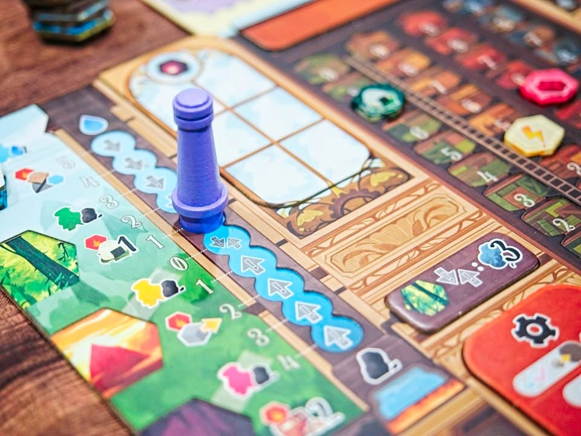
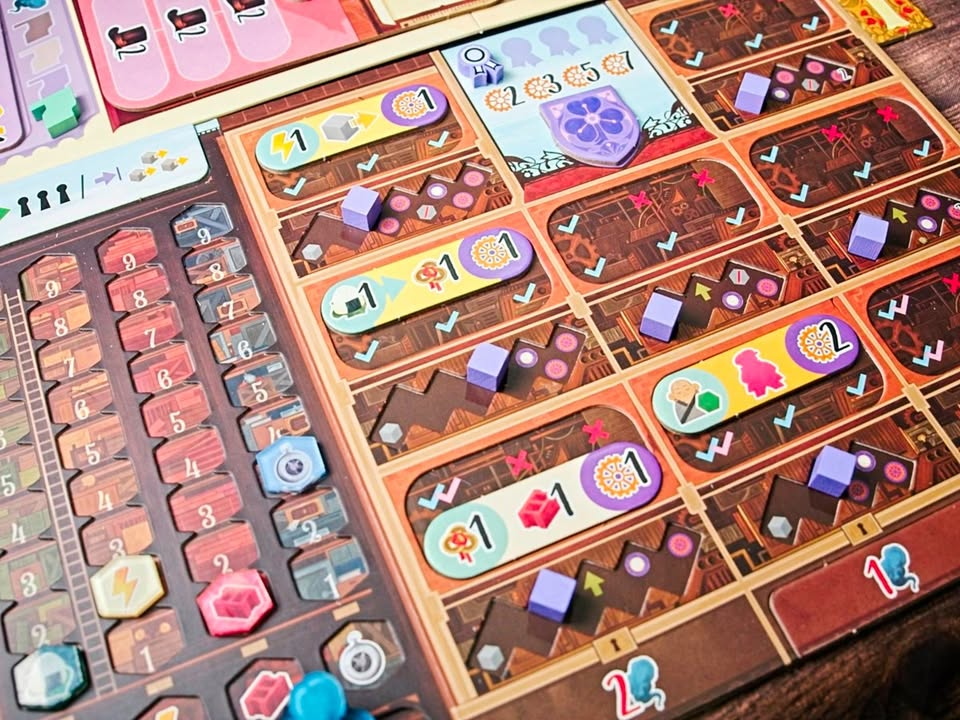
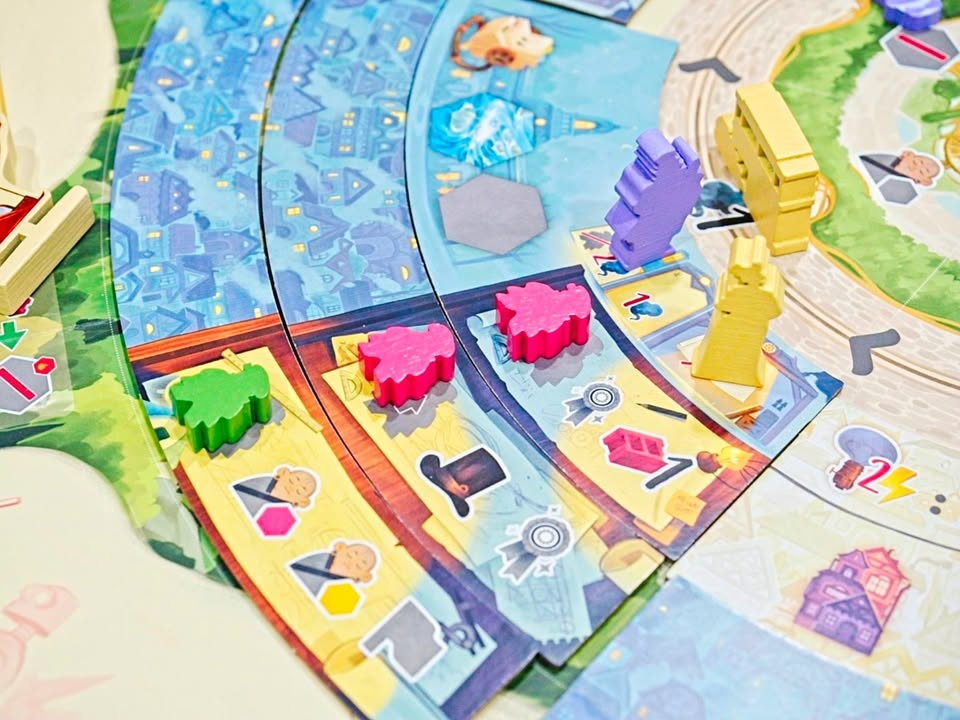

Daitoshi

เกมยูโรระดับกลางหนักที่เล่าเรื่องของการพัฒนาเมืองที่เริ่มรุกล้ำเข้าไปรบกวนเหล่าจิตวิญญาณธรรมชาติดั้งเดิมผลงานของ Dani Garcia (Arborea, Barcelona, Windmill Valley)

---
ไอเดียแบบกว้างๆคือมันเป็นเกมแบบ Rondel ที่ช่องแอคชั่นจะวางเรียงกันเป็นวงกลมถึงตาเราก็เดินวนๆทำแอคชั่นไปจนจบเกมเนี่ยแหละ แต่ทวิสของเกมคือในแต่ละ sector ของช่องทำแอคชั่นจะสามารถอัพเกรดขึ้นไปได้อีก 2 ขั้นผ่านการหยิบไทล์เสี้ยวกลมมาต่อที่วงนอกของแอคชั่นนั้นๆอีกที (ประมาณว่าต่อขยายเมือง) และในแต่ละชิ้นส่วนของเมืองก็สามารถผลิกกลับด้านได้อีกหากได้รับการจ่ายไฟฟ้า

flow ในเกมก็ตามยูโรทั่วไปแต่เกมจะให้อิสระเราในการหยิบสร้างตัวผลิตทรัพยากรได้เอง คือบอร์ดเราจะมีแผงโรงงานอยู่ 3 คอลั่มเราก็สามารถไปหยิบไทล์แบบที่เราอยากได้จากตลาดกลางมาใส่ไว้ เวลาทำแอคชั่นผลิตเราก็ได้ของตามโรงงานที่เรามีนั้นแหละ

---
สิ่งที่ทำให้เกมนี้มีจุดเด่นอีกอย่างคือระบบภูติผี คือธีมเกมเนี่ยมันอยู่ในจักรวาลเดียวกับ Bitoku แต่ตอนนั้นมันเป็นป่าธรรมชาติมาตอนนี้โดนเมืองรุกรานเวลาเราทำแอคชั่นในเกมที่มันทรงอุตสาหกรรมจ๋าๆเนี่ย มันจะต้องไปเปิดไทล์พื้นที่ธรรมชาติรอบๆเมืองมาเก็บไว้ก็จะมีไทล์น้ำ ไทล์ป่า ไทล์ถ้ำ ไทล์ภูเขา ซึ่งมันจะหยิบมาไว้กับบอร์ดเรา ซึ่งไอ้ตอนเก็บมาชิ้นแรกไม่เป็นไรแต่พอเก็บชิ้นมาซ้ำชนิดก็คือธรรมชาติพิโรธละ ก็จะมีผลทำให้เราเก็บทรัพยากรได้น้อยลงหรือต้องจ่ายแพงขึ้นขึ้นอยู่กับว่าไปทำภูติตัวไหนโกรธ แน่นอนว่าเกมมันจะมีพวกกระบวนการให้เราทิ้งไทล์ที่ว่า แต่ว่ามันจะมีจำกัดจำเขี่ยแล้วผู้เล่นก็ต้องมาแย่งกันใช้ แล้วเกือบทุกแอคชั่นในเกมมันจะต้องหยิบไทล์ที่ว่ามาตลอดทำให้ไอเดียหลักของเกมวนอยู่กับบริหารตรงนี้เยอะ

ส่วนที่น่าสนใจอีกอย่างคือพอเราหยิบไทล์พวกนี้ออกมาเรื่อยๆมันจะกลายเป็นทางเดินแทรคให้กับผู้เล่น ซึ่งยิ่งเราเดินไปในทางนั้นๆเราก็จะได้ตัวคูณเพิ่มแต้มในตอนจบเกมหมวดต่างๆเพิ่ม ตรงนี้มันเลยมีไดนามิคที่น่าสนใจดีระหว่างการทำแอคชั่นแล้วต้องโดนบังคับหยิบไทล์และการที่ไทล์เปิดมันช่วยสร้างทางในการเดินแทรคทำคะแนนเพิ่มตัวคูณ

---
อุปกรณ์เกมนี้ถือว่าสวยมาเป็นอะคริลิคใสพร้อมสกรีน แบบเทียบราคาแล้วถือว่าคุ้มมากๆ ระบบการเล่นในภาพรวมคลีนแล้วก็มีการรับส่งของระบบกลไกที่ดี ระยะเวลาต่อการทำแอคชั่นค่อนข้างต่ำเพราะไม่มีการเชนแอคชั่นลากยาว จริงๆมีกิมมิคเล็กๆเรื่องการแลกเปลี่ยนถ่านหินกับน้ำแล้วกลายเป็นไอน้ำที่คิดว่าฉลาดดีคือมีแทรคเดียวอยู่คนละฝั่งเวลาเลื่อนไปด้านตรงข้ามเราจะได้ไอน้ำที่เป็นทรัพยากรหลักของเกมออกมาแบบ by product เรื่องง่ายๆแต่ธีมสวยดี อีกอันคือเวลาจ่ายไฟเข้าเมืองแล้วมันจะให้พลิกไทล์แล้วมันจะเป็นด้านเมืองที่มีไฟส่องสว่างคือชอบในความใส่ใจ

ส่วนที่ไม่ชอบเท่าไรคือรู้สึกว่าคู่มืออ่านยากกว่าที่ควรจะเป็นทั้งๆที่เกมก็ไม่ได้ยุ่งยากอะไร เป็นเกมที่ต้องยอมดูคลิปสอนเพราะอ่านแล้วต้องพลิกข้ามไปมาจนรำคาญ แต่สุดท้ายก็ต้องให้เพื่อนมาสอนยู่ดี กับวิธีการที่มันเอาธีมมาผูกมันแปลกในแบบที่ทำให้เกิดการเล่าเรื่องยากเกินจำเป็น ในเชิง ux/ui ระบบวางช่องทำแอคชั่นชวนสับสนมากไปหน่อยดูแทบไม่ออกอันไหนที่วางคนงานอันไหนช่องแอคชั่นอันไหนแอฟเฟค กับไม่รู้ทำไมตอนเล่นจบมันเหมือนไม่ได้ทำอะไรสำเร็จขนาดนั้นทั้งๆที่ทำมูฟมากมาย อาจจะเป็นเพราะเกมมันเปิดช่องให้ไหลลื่นได้ง่ายแล้วไม่ค่อยเครียดในเกมนับทำแอคชั่นให้เป๊ะๆมั้ง?

---
🐸 ME - อยู่ในกลุ่มยูโรประเภททำอะไรให้มันยากๆคิดเยอะๆไว้ก่อนแต่เกมนี้อยู่ในกลุ่มที่ขยับได้ลื่นกว่า ด้วยความที่ downtime ไม่สูงเลยยังพอเล่น 4 คนได้โดยไม่เหนื่อยมาก puzzle ตอนเล่นสนุกจิ๊ปากบ่อยเวลาโดนแย่งแต่เกมดูล่องลอยทำเก็บของวนไปแบบไม่ค่อยรู้สึกว่าได้ทำแกรนด์มูฟเท่าไร อยู่ในกลุ่มสนุกมีความหวือหวาที่กำลังดีไม่ล้นแต่ไม่รู้ทำไมถึงไม่ได้ตราตรึง

🔴 expert: เป็น Rondel ที่มีทวิสที่สวย ระบบรับส่งกันต่อเนื่อง
🟠 regular: เกมไม่ได้ยากแค่อาจจะดูตาลายนิดหน่อย เทียบกับเกมระดับกลางหนักอื่นๆถือว่าค่อนข้างคลีน
🧸newbie | 🟢casual/faimly : ซับซ้อนเกินไปไม่แนะนำ

---
> 🐸 ME - ความเห็นส่วนตัวสำหรับตัวเองเพื่อตัวเอง
> 🔴 expert - ผ่านเกมมาเยอะ อ่านเกมใหม่ตลอด
> 🟠 regular - เล่นบ่อยเล่นประจำออกตระเวนเล่น
> 🟢casual/family - เล่นที่ร้านเล่น หรือกับครอบครัว
> 🧸newbie - ใหม่จัด

more on - https_://forum.tinymeepletalk.com/d/49-daitoshi

