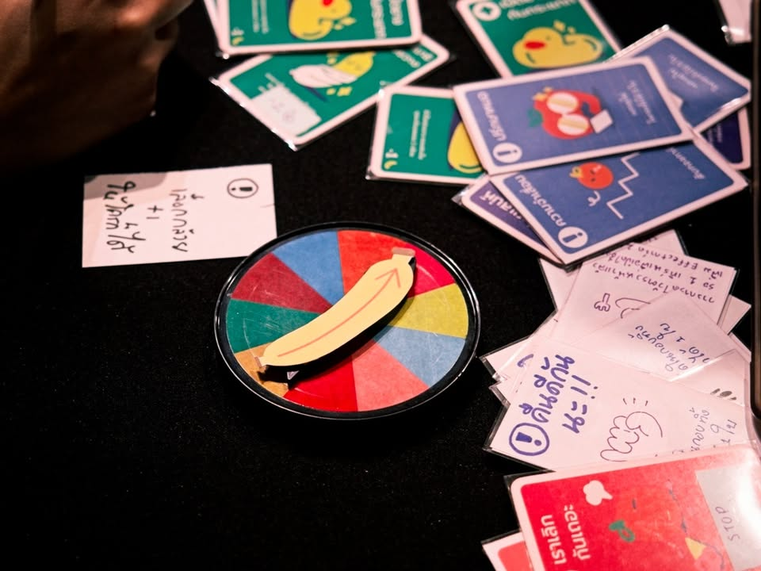
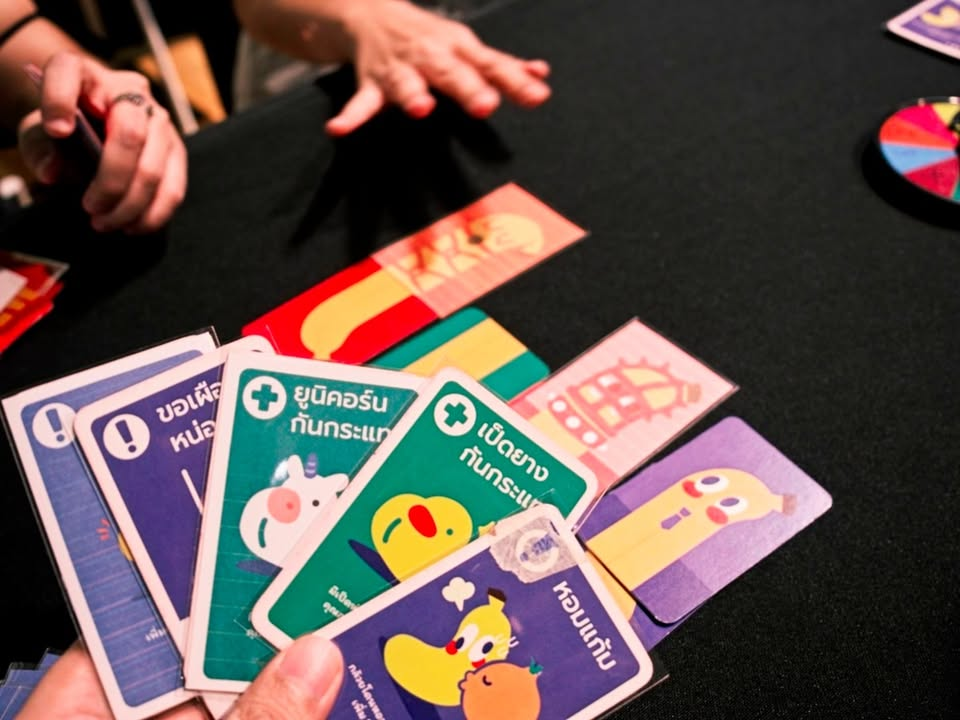
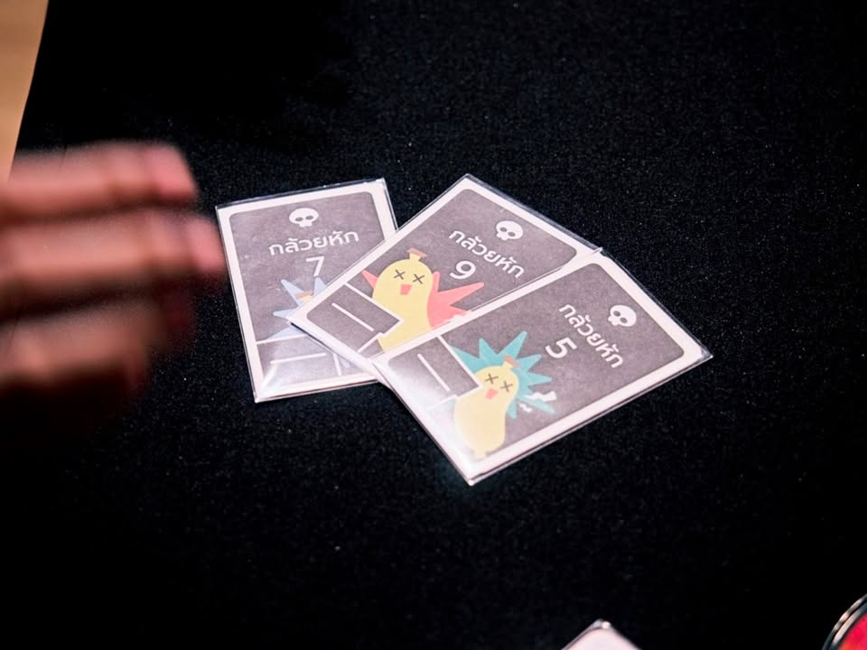
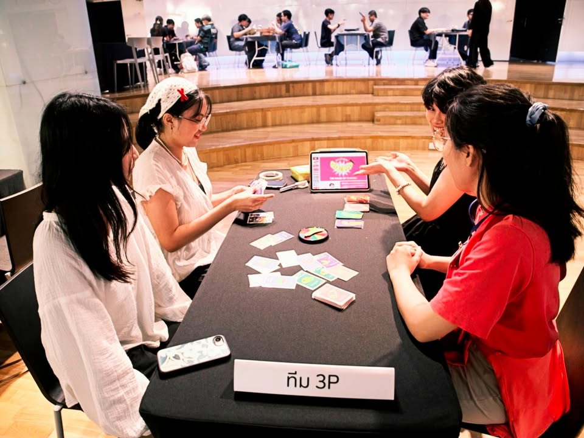
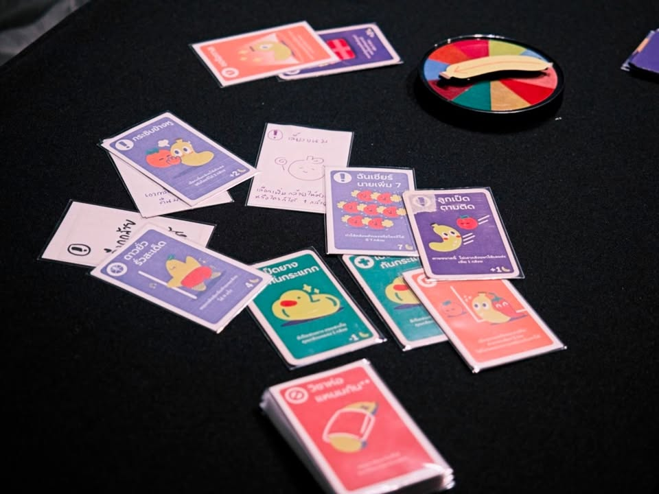

เล่าสั้นๆ (มากๆ) ถึงเกมที่ได้ไปเจอในการประกวด Book on Board ครั้งที่ 4 “เปลี่ยนหนังสือ(ไทย)ที่ชอบ เป็นบอร์ดเกม(ไทย)ที่ใช่”

---
เกม พระเจ้าช่วยกล้วยหัก! โดยทีม 3P จากหนังสือ พระเจ้าช่วยกล้วยหัก! โดย VAVEE

สิ่งที่ทำให้เกมจากทีมนี้น่าใจคือ

- พระเจ้าช่วยกล้วยหัก!  เป็นเวบตูนสายวาย ของชายนักบู๊ที่พลาดท่าเอาจอนจ้อนของตัวเองไปฟาดโต๊ะจนหัก

- เรื่องนี้เขียนโดยนักเขียนสาว

- ทีมที่ออกแบบเกมนี้เป็นผู้หญิงล้วน

- เอ๊ะ..... ขออ่านชื่อทีมอีกทีซิ....

---
ถึงจะฟังชวนฟุ้งซ่านแต่เกมเล่นกับความเดอตี้ได้คาวาอี้มากๆ ไอเดียของเกมคือผู้เล่นจะพยายามเล่นการ์ดที่มีความสามารถหลากหลายเพื่อต่อการ์ด  'กล้วย' ของเราให้ยาวกว่าคนอื่น ระหว่างนั้นก็จะมีการแกล้งลดขนาดเพื่อนบ้าง แข่งกันยืดบ้าง หรือช่วยให้เพื่อนยาวขึ้นก็มี เล่นการ์ดขวางกันก็ได้

กิมมิคที่น่าสนใจจะเป็นระบบ event 'กล้วยหัก' ที่ถ้าจั่วขึ้นมาจะเช็คว่าใครยาวถึงหรือเกินเลขที่กำหนดก็จะจบเกมทันทีแล้วผู้เล่นที่ยาวสุดที่เหลือรอดก็จะชนะไปแทน อารมณ์เกมปาร์ตี้ไม่คิดมากที่เล่นกับการแกล้งกันและวัดใจว่าจะรีบยืดให้ถึง 15 ใบหรือจะเล่นลีลารอจังหวะการ์ดกล้วยหักออกไปหมดก่อนดี

เป็นแนวปาร์ตี้ที่คิดว่าไปทำขายต่อหลังจบงานนี้ได้ไม่ยากเลย กำปุ้ง จาก mii2 games ที่มันชอบทำแนวเดอตี้ๆมีหนาวอ่ะ

---
disclaimer - เป็นเมนเทอร์ไปแนะนำเค้าอย่างเดียวไม่ได้เป็นกรรมการตัดสินหรือมีส่วนได้ส่วนเสียกับทีมไหน ผลงานยังไม่ final มีเวลาปรับแก้ครั้งสุดท้ายก่อนไปนำเสนอกรรมการ เพราะฉะนั้นก็เลยจะไม่เขียนถึงข้อดีหรือข้อเสียใดๆนะ

