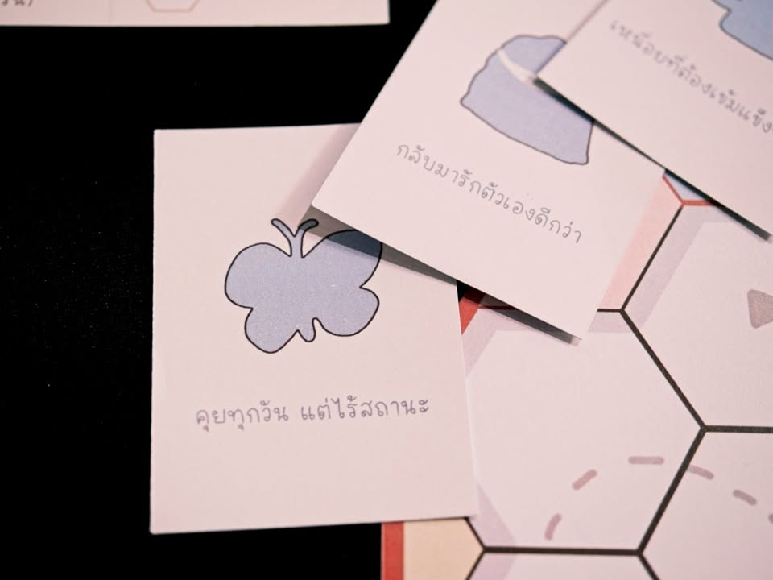
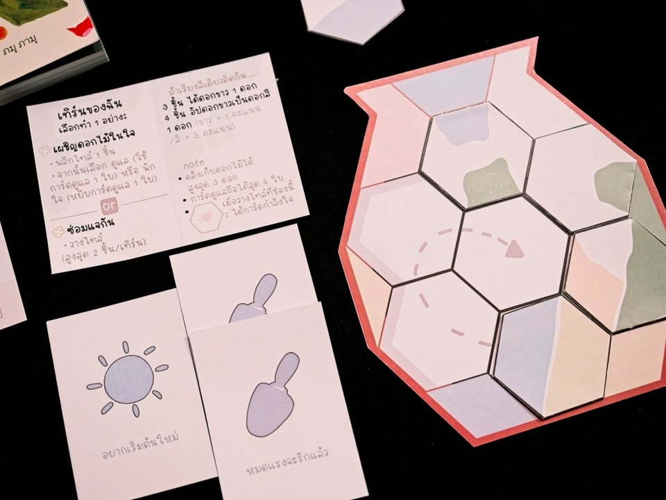

เล่าสั้นๆ (มากๆ) ถึงเกมที่ได้ไปเจอในการประกวด Book on Board ครั้งที่ 4 “เปลี่ยนหนังสือ(ไทย)ที่ชอบ เป็นบอร์ดเกม(ไทย)ที่ใช่”
---
เกม Pieces of Healing โดยทีม Remember Me จากหนังสือ Fallen เซรามิกแตกสลายและดอกไม้อื่น ๆ โดย ภมุ ภามุ

---
พอดีไม่ได้อ่านหนังสือมาเลยจะเล่าแค่ตัวเกม

ไอเดียจะคล้าย 'คินสึงิ' ที่เป็นการซ่อมแซมเซรามิคของญึ่ปุ่น แต่เกมนี้จะทำธีมเป็นซ่อมแจกันที่แตกหักโดยสื่อถึงการซ่อมแซมและรักตัวเอง โดยพื้นฐานก็คือเกมหยิบไทลมาต่อสีเรียงกันเพื่อให้ติดกัน 3-4 ไทล์เพื่อให้ได้รับดอกไม้มาเป็นคะแนน

กิมมิคคือการผสม memory element ที่เวลาเราอยากจะได้ไทล์ไหนเราต้องพลิกไปอีกด้านก่อนแล้วดูว่าเรามีสัญลักษณ์ที่จำเป็นในการเก็บไทล์ขึ้นมาไหม ถ้ามีก็ต้องจ่ายทิ้งแต่ถ้าไม่มีก็ต้องเลือกจั่วการ์ดสัญลัษณ์มาเก็บไว้

ระหว่างทางในการเก็บไทล์ถ้ารีบไปกลางทางเราจะได้ความสามารถพิเศษมาเพิ่ม และยิ่งตอนใกล้จบถ้ายังมีคนชักช้าจะโดนคนที่ไปถึงก่อนเอาไทล์ตะไคร้น้ำมาสัญลักษณ์บนไทล์เราทำให้เราปิดเกมได้คะแนนยากขึ้น

---
disclaimer - เป็นเมนเทอร์ไปแนะนำเค้าอย่างเดียวไม่ได้เป็นกรรมการตัดสินหรือมีส่วนได้ส่วนเสียกับทีมไหน ผลงานยังไม่ final มีเวลาปรับแก้ครั้งสุดท้ายก่อนไปนำเสนอกรรมการ เพราะฉะนั้นก็เลยจะไม่เขียนถึงข้อดีหรือข้อเสียใดๆนะ

