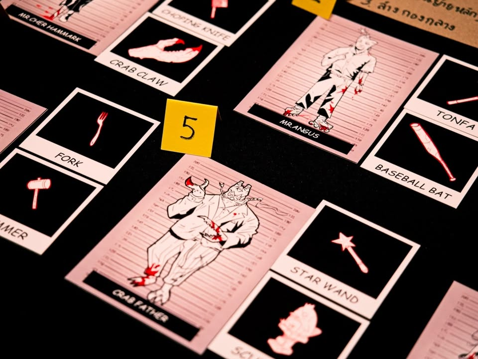
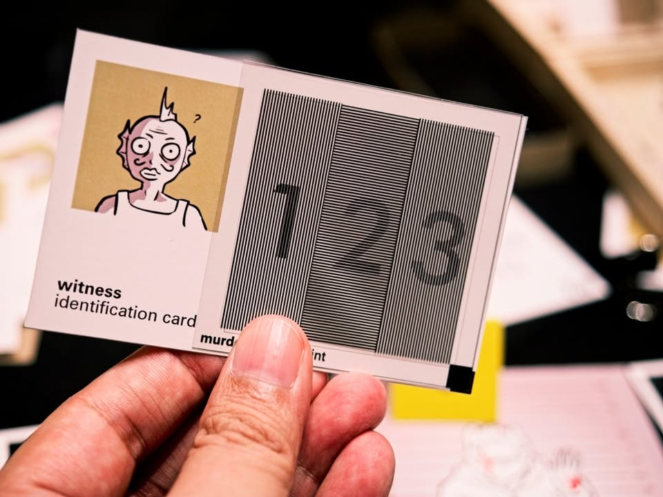
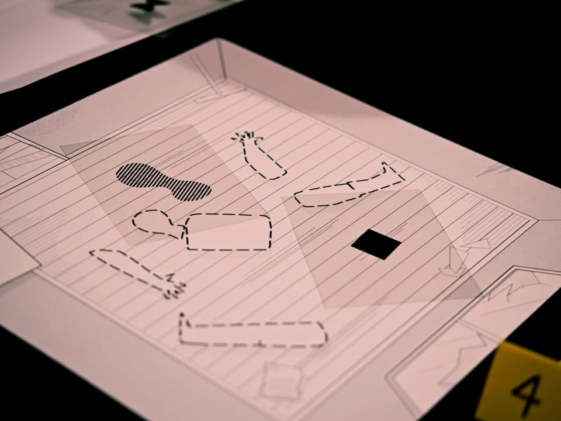
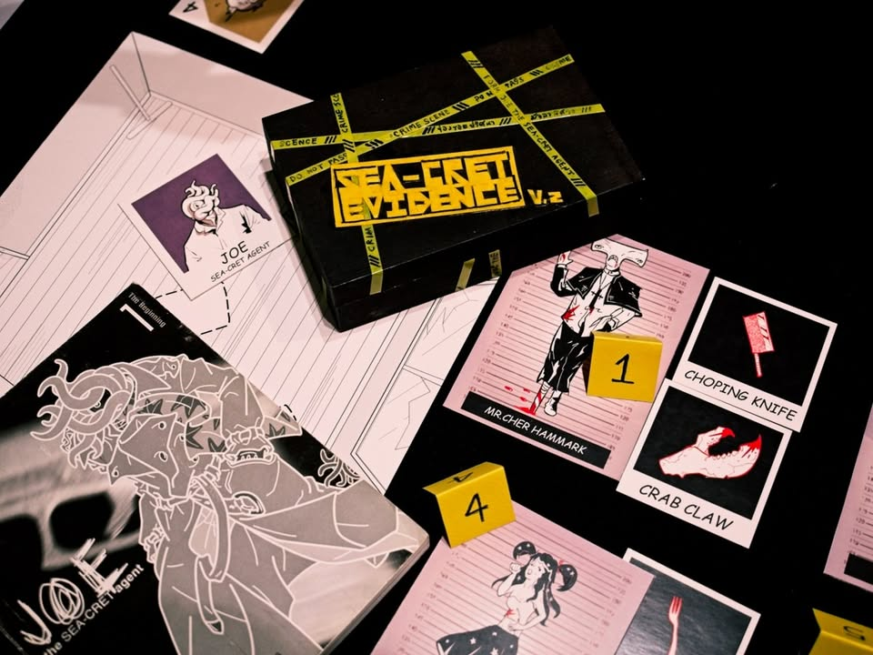
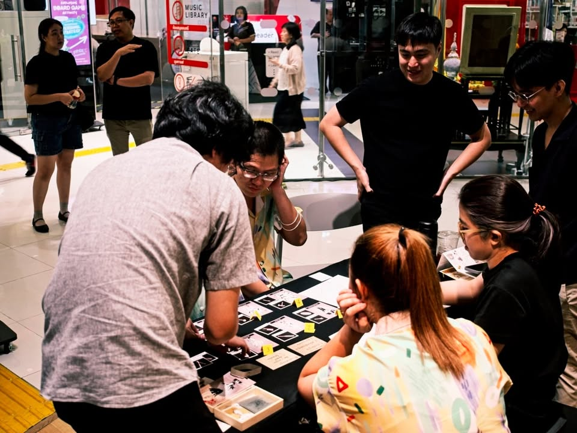

เล่าสั้นๆ (มากๆ) ถึงเกมที่ได้ไปเจอในการประกวด Book on Board ครั้งที่ 4 “เปลี่ยนหนังสือ(ไทย)ที่ชอบ เป็นบอร์ดเกม(ไทย)ที่ใช่”

---
เกม The SEA-CRET Crime โดยทีม Autocat Studio จากหนังสือ JOE the SEA-CRET Agent 01 / Plank ver. โดย สุทธิชาติ ศราภัยวานิช

---
คอมมิคเรื่อง SEA-CRET Agent เนี่ยสามารถเรียกได้ว่าคืองานระดับตำนานของวงการคอมมิค (การ์ตูนสไตล์อเมริกัน) ของคนไทยเลยนะ ว่าด้วยนักสืบโจในโลกที่สัตว์จากท้องทะเลมีขาเดินไปมา

เกมนี้เป็นแนวบลัฟและดีดักชั่น ผู้เล่นคนหนึ่งจะรับบทเป็นนักสืบโจโดยมีผู้เล่นที่เหลือเป็นพยาน ซึ่งทุกคนยกเว้นนักสืบจะเห็นเหมือนกันว่าใครคือคนร้าย ในแต่ละตาพยานจะหยิบรูปแผ่นใสมาวางทับในที่เกิดเหตุเพื่อชี้นำไปสู่คนร้ายคนนั้น

ทวิสที่สำคัญคือมันมีผู้ร้ายตัวจริงที่แฝงมาในหมู่พยานที่จะพยายามวางหลัก ฐานในเขว และทวิสซ้อนกันอีกครั้งที่ในบรรดาพยายานทุกคนก็ไม่แน่ใจว่าตัวเองนั้นเป็นพยานสายป้าข้างบ้านไม่เห็นจริงแต่ฟังเค้ามาเล่าหรือไม่ เพราะเกมมีระบบสุ่มตัวเลขที่ผู้เล่นที่พยาน 1 คนจะชี้ไปที่คนร้ายคนละตัว!!

---
disclaimer - เป็นเมนเทอร์ไปแนะนำเค้าอย่างเดียวไม่ได้เป็นกรรมการตัดสินหรือมีส่วนได้ส่วนเสียกับทีมไหน ผลงานยังไม่ final มีเวลาปรับแก้ครั้งสุดท้ายก่อนไปนำเสนอกรรมการ เพราะฉะนั้นก็เลยจะไม่เขียนถึงข้อดีหรือข้อเสียใดๆนะ

