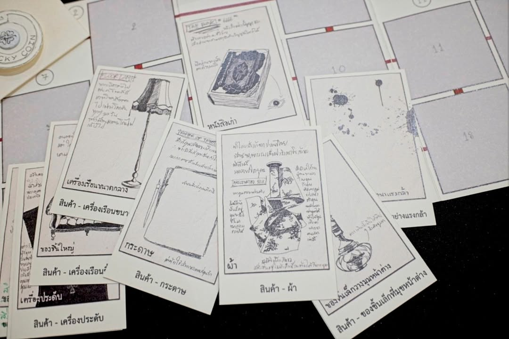
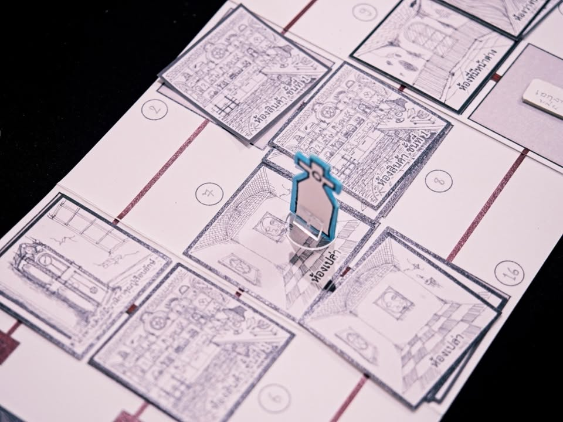
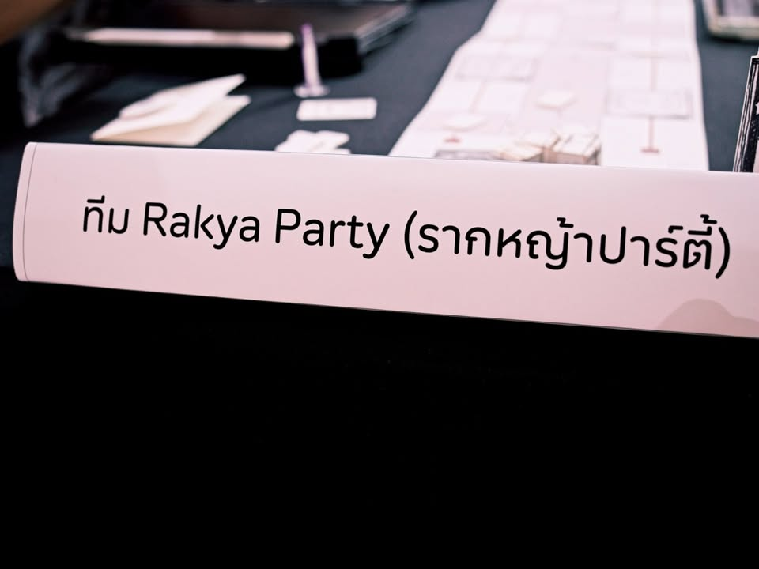

เล่าสั้นๆ (มากๆ) ถึงเกมที่ได้ไปเจอในการประกวด Book on Board ครั้งที่ 4 “เปลี่ยนหนังสือ(ไทย)ที่ชอบ เป็นบอร์ดเกม(ไทย)ที่ใช่”

---
เกม ร้านสุดท้ายที่ปลายถนนอัลเบียน (Den of Antiquities) โดยทีม Rakya Party (รากหญ้าปาร์ตี้) จากหนังสือ หากคุณหลงเข้าไปในร้านขายของเก่าแห่งนั้น เอกสารฉบับนี้อาจช่วยให้คุณรอดชีวิต โดย haveasunnydae

---
หนังสือที่เล่าถึงการที่คุณหลุดเข้าไปในร้านลึกลับที่การจะเอาตัวรอดออกมานั้นต้องทำตามขั้นตอนที่ถูกต้องจากเอกสารที่คุณบังเอิญพบเจอมันเท่านั้น

ไอเดียของเกมนี้ถ้าเรียกว่ามันเป็น choose your own advanture จะเหมาะสุดผู้เล่นจะได้ทำการปล่อยตัวสวมบทบาทในการเดินไปตามห้องต่างๆในร้านลึกลับพร้อมกับการทำตัวเลือกที่บีบคั้นแต่มันจะนำคุณไปสู่ทางออกจริงๆไหมนะ? แล้วคุณจะหลบเลี่ยงกับการเจอ 'มัน' ได้หรือปล่าว

จุดที่น่าสนใจคือระบบหนังสือคู่มือที่ทำลงตารางอย่างดีเอาไว้เทียบเช็คว่าห้องไหนจะเกิดอะไรจากผลของตัวเลือกแบบใด ทางทีมออกแบบก็ได้ทำระบบแอพง่ายๆเพื่อช่วยให้การดำเนินเกมเป็นไปได้ง่ายขึ้นไม่ต้องผลิกไปมา กับงานอาร์ทประกอบเกมที่วาดขึ้นใหม่อย่างใส่ใจรายละเอียดเอามากๆ

---
disclaimer - เป็นเมนเทอร์ไปแนะนำเค้าอย่างเดียวไม่ได้เป็นกรรมการตัดสินหรือมีส่วนได้ส่วนเสียกับทีมไหน ผลงานยังไม่ final มีเวลาปรับแก้ครั้งสุดท้ายก่อนไปนำเสนอกรรมการ เพราะฉะนั้นก็เลยจะไม่เขียนถึงข้อดีหรือข้อเสียใดๆนะ

