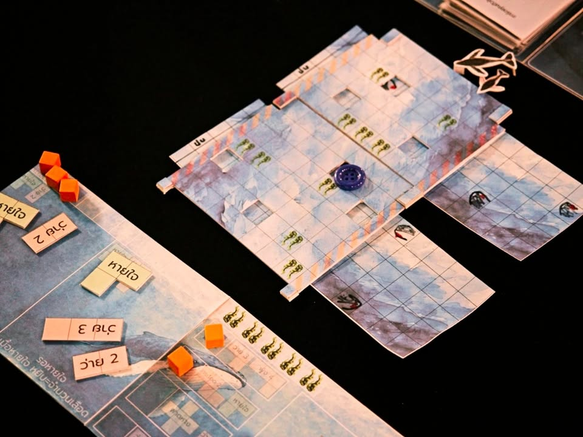
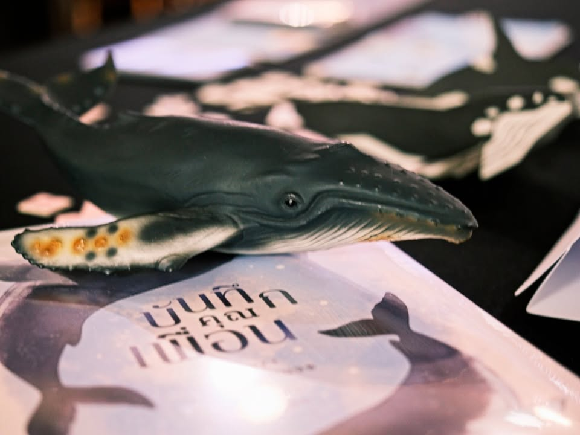
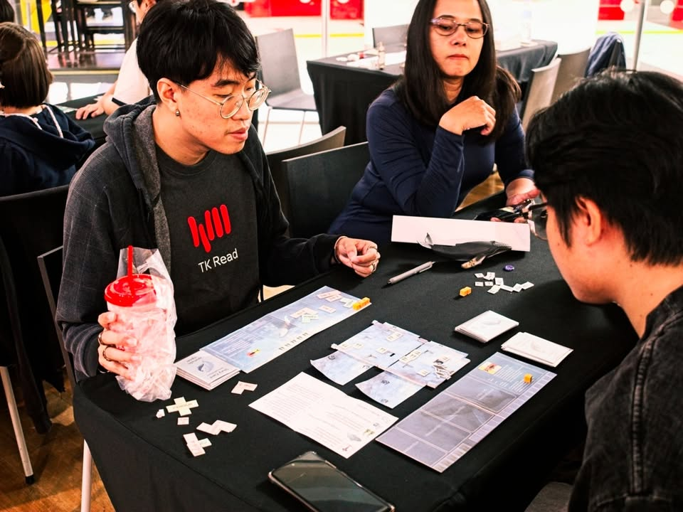

เล่าสั้นๆ (มากๆ) ถึงเกมที่ได้ไปเจอในการประกวด Book on Board ครั้งที่ 4 “เปลี่ยนหนังสือ(ไทย)ที่ชอบ เป็นบอร์ดเกม(ไทย)ที่ใช่”

---
เกม Bubble & Bliss - วาฬพา โดยทีม Vanta Studio จากหนังสือ #บันทึกคุณเพื่อน โดย สมุทรพเนจร

---
หนังสือเล่าเรื่องการเดินทางของวาฬสองตัว (เข้าใจว่าอารมณ์วาย แต่จริงๆมันน่าจะออกไปเชิง bromance เสียมากกว่า)

ตัวเกมนี้ผมไม่ได้เล่นเองก็จะมีแค่ overview คร่าวๆนะ (ขออภัยจังหวะเวลาไม่ตรงกันนักทั้งสองวันเลย) ว่าเป็นเกมแบบช่วยกันเล่น 2 คน ฝั่งหนึ่งจะเล่นการ์ดเพื่อแสดงรูปแบบการเคลื่อนที่แหละการขึ้นมาหายใจซึ่งมันจะเป็นช่อง puzzle ว่างๆ ส่วนอีกคนก็จะเป็นฝ่ายผลิตไทล์นี้มาให้อีกฝ่ายเติมเต็ม

จุดที่น่าสนใจคือแผนที่ในเกมที่มีการทำฉากเลื่อนดูมิติดี มีกิมมิคการว่ายผ่านอุปสรรคที่ทำให้การเดินทางยากขึ้น ทุกครั้งที่ผ่านฉากไปจะได้เปิดการ์ดอ่านเนื้อเรื่องที่ค่อยๆเผยออกมา

---
disclaimer - เป็นเมนเทอร์ไปแนะนำเค้าอย่างเดียวไม่ได้เป็นกรรมการตัดสินหรือมีส่วนได้ส่วนเสียกับทีมไหน ผลงานยังไม่ final มีเวลาปรับแก้ครั้งสุดท้ายก่อนไปนำเสนอกรรมการ เพราะฉะนั้นก็เลยจะไม่เขียนถึงข้อดีหรือข้อเสียใดๆนะ

