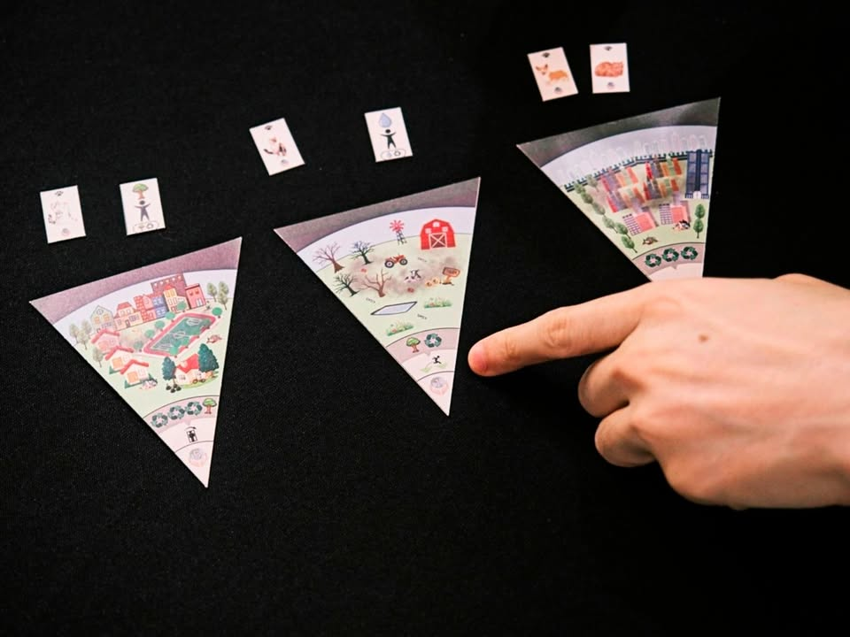

เล่าสั้นๆ (มากๆ) ถึงเกมที่ได้ไปเจอในการประกวด Book on Board ครั้งที่ 4 “เปลี่ยนหนังสือ(ไทย)ที่ชอบ เป็นบอร์ดเกม(ไทย)ที่ใช่”

---
เกม My world โดยทีม โลกสองใบ ให้เธอคนเดียว จากหนังสือ บ้านของเราสวยงามเหลือเกิน โดย วิรตี ทะพิงค์แก

---
หนังสือประกอบภาพสำหรับเด็กที่เล่าถึงโลกอันสวยงาม

ตัวเกมนี้ผมไม่ได้เล่นเอง (อีกแล้ว) ก็จะมีแค่ overview คร่าวๆนะ (ขออภัยจังหวะเวลาไม่ตรงกันนักทั้งสองวันเลย) ไอเดียของเกมคือผู้เล่นจะมาหยิบสิ้นส่วนสไลด์พิซซ่ามาประกอบเป็นลูกโลกเพื่อทำคะแนน ตัวคะแนนจะมีหลายลายมั้งทั้งหยิบมาต่อแล้วได้คะแนนจากจุดที่ติดกัน หรือต้องหยิบคนที่มาช่วยเติมเติมสิ่งที่ไทล์โลกของเราขาดไป

ใช้ระบบหยิบแบบจับคู่คน+ไทล์คล้ายๆกับเกม cascadia

---
disclaimer - เป็นเมนเทอร์ไปแนะนำเค้าอย่างเดียวไม่ได้เป็นกรรมการตัดสินหรือมีส่วนได้ส่วนเสียกับทีมไหน ผลงานยังไม่ final มีเวลาปรับแก้ครั้งสุดท้ายก่อนไปนำเสนอกรรมการ เพราะฉะนั้นก็เลยจะไม่เขียนถึงข้อดีหรือข้อเสียใดๆนะ

