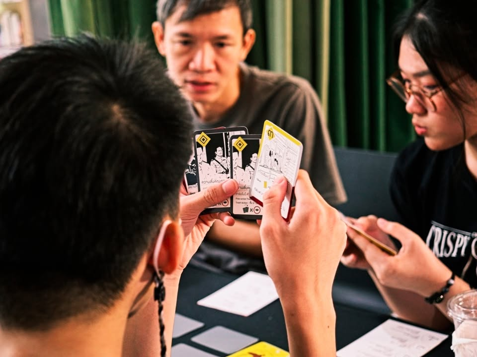
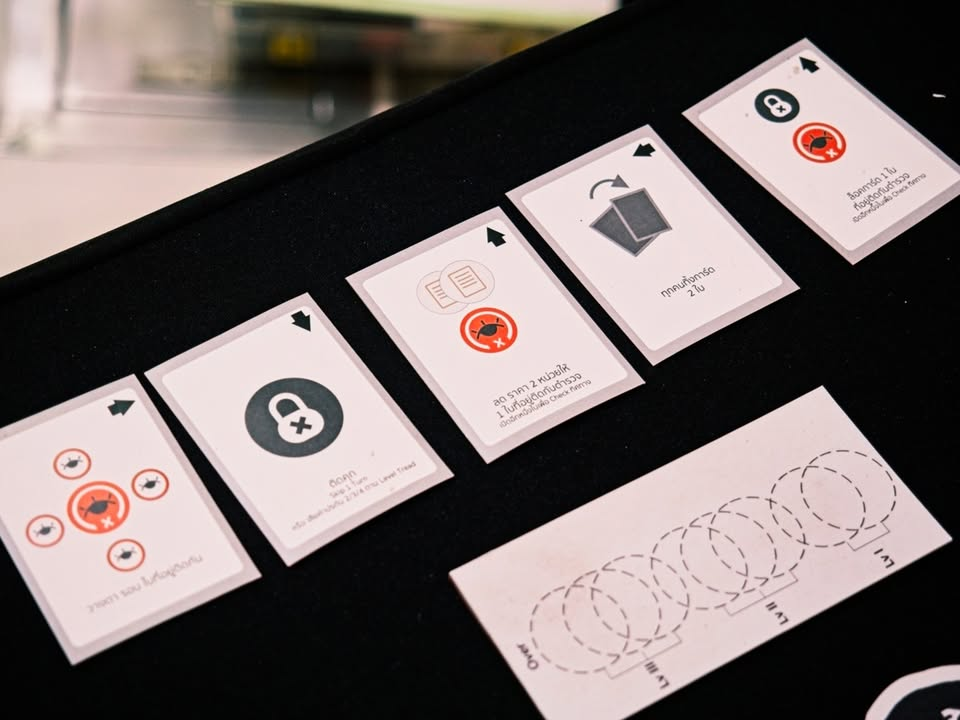
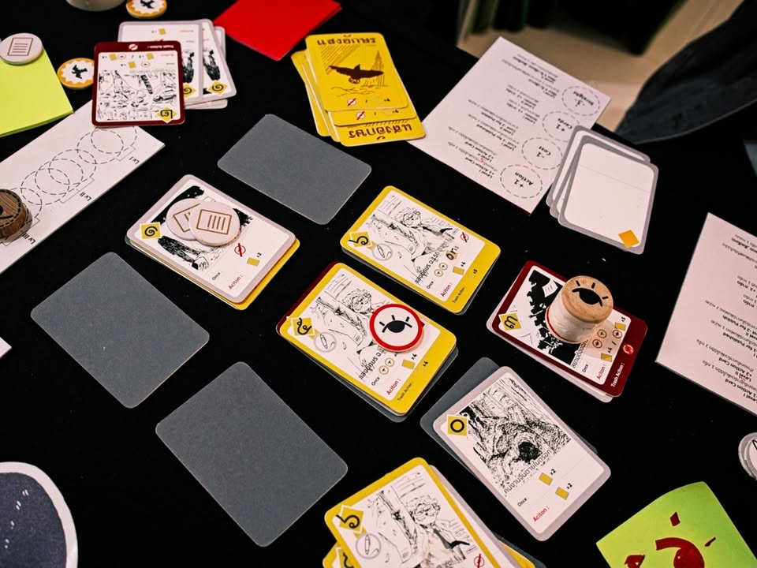
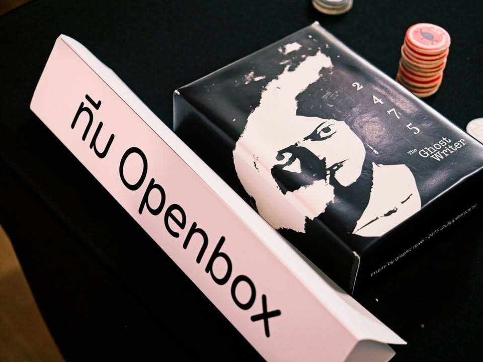

เล่าสั้นๆ (มากๆ) ถึงเกมที่ได้ไปเจอในการประกวด Book on Board ครั้งที่ 4 “เปลี่ยนหนังสือ(ไทย)ที่ชอบ เป็นบอร์ดเกม(ไทย)ที่ใช่”

---
เกม 2475 Ghost writer โดยทีม Openbox จากหนังสือ 2475 นักเขียนผีแห่งสยาม โดย สะอาด

---
หนังสือการ์ตูนที่เล่าถึงช่วงเวลาที่การเมืองเข้มข้นสุดๆของเมืองไทยและการต่อสู้ของนักเขียนที่ต้องการตีแผ่ความจริงและการปราบปรามจากรัฐบาลในยุคนั้น

ตัวเกมยังไม่นิ่งเท่าไรแต่ไอเดียคือเราจะเป็นนักข่าวในสมัยนั้นและได้รับการ์ดเหตุการณ์จั่วขึ้นมา ระหว่างเกมเราจะวางข่าวทั้งด้านข้อเท็จจริงที่ได้รับรู้หรือเหตุการณ์ที่รัฐบาลทำแอคชั่นบางอย่าง หากเราทำการเอิกเกริกเกินไปก็จะโดนเจ้าหน้าที่หมายตาทำให้อาจจะแพ้เกมได้

---
disclaimer - เป็นเมนเทอร์ไปแนะนำเค้าอย่างเดียวไม่ได้เป็นกรรมการตัดสินหรือมีส่วนได้ส่วนเสียกับทีมไหน ผลงานยังไม่ final มีเวลาปรับแก้ครั้งสุดท้ายก่อนไปนำเสนอกรรมการ เพราะฉะนั้นก็เลยจะไม่เขียนถึงข้อดีหรือข้อเสียใดๆนะ

