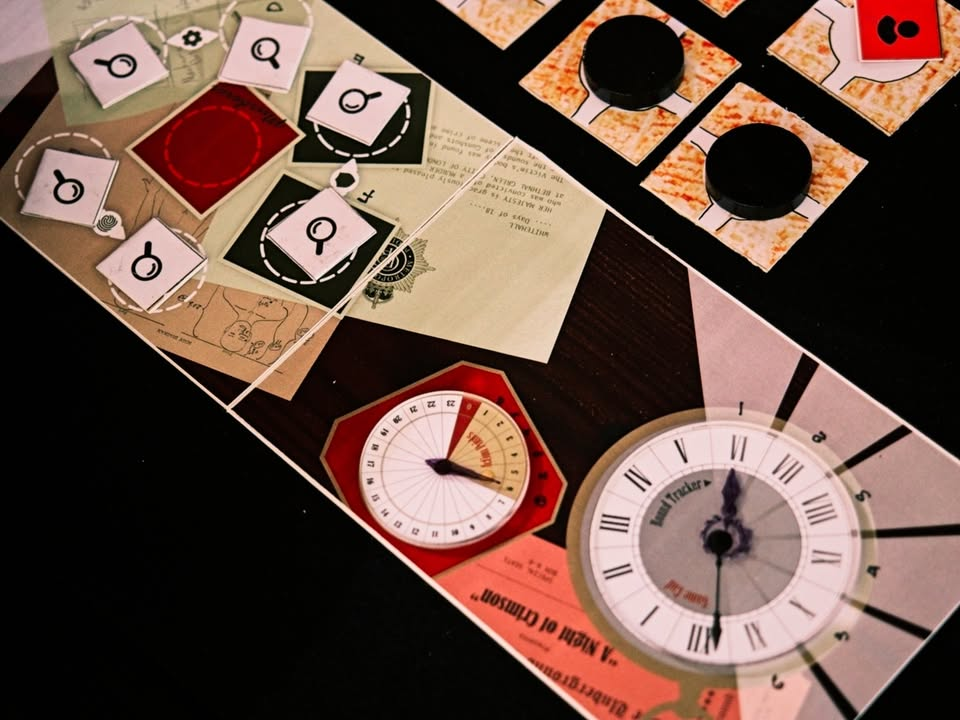
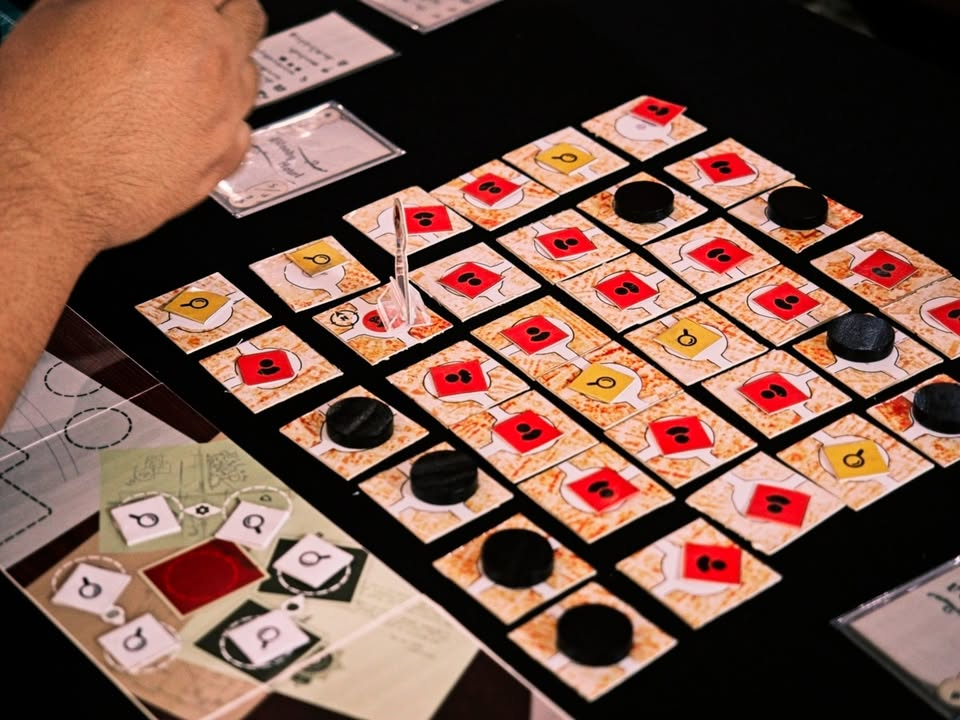

เล่าสั้นๆ (มากๆ) ถึงเกมที่ได้ไปเจอในการประกวด Book on Board ครั้งที่ 4 “เปลี่ยนหนังสือ(ไทย)ที่ชอบ เป็นบอร์ดเกม(ไทย)ที่ใช่”
---
เกม บันทึกคดีปีศาจ ตอน รัตติกาลสีชาด โดยทีม หมูมะนาว จากหนังสือ Phantom Case Files บันทึกคดีปิศาจ โดย Cat’s Box

---
เกมนี้ต้องขออภัยจริงๆที่หาจังหวะไปเทสเกมด้วยไม่ได้เลยครับ แต่ละ session คนเล่นยาวเลย เดินวนไปโต๊ะอื่นก็อ้าวมีคนเล่นต่อละวนลูป 

ไอเดียเกมเท่าที่ยืนฟังคือเป็นแนวช่วยกันเล่นแบบดีดักชั่นผู้เล่นสองฝั่งจะเล่นกันคนละมินิเกมเพื่อตามหาคนร้าย ฝั่งหนึ่งจะมีการมองหาข้อมูลในแผนที่ ส่วนอีกฝั่งจะหาข้อมูลจากการ์ด

---
disclaimer - เป็นเมนเทอร์ไปแนะนำเค้าอย่างเดียวไม่ได้เป็นกรรมการตัดสินหรือมีส่วนได้ส่วนเสียกับทีมไหน ผลงานยังไม่ final มีเวลาปรับแก้ครั้งสุดท้ายก่อนไปนำเสนอกรรมการ เพราะฉะนั้นก็เลยจะไม่เขียนถึงข้อดีหรือข้อเสียใดๆนะ

