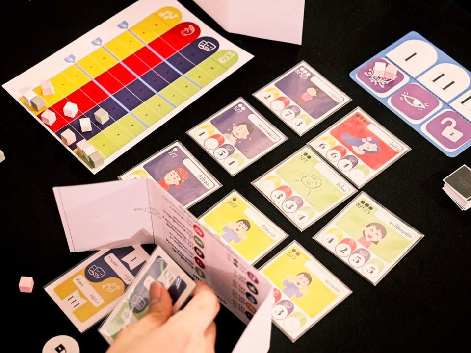
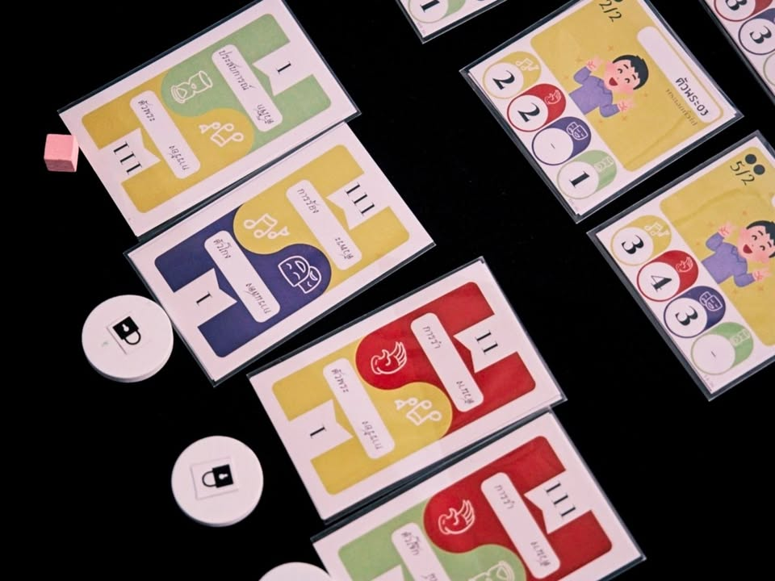

เล่าสั้นๆ (มากๆ) ถึงเกมที่ได้ไปเจอในการประกวด Book on Board ครั้งที่ 4 “เปลี่ยนหนังสือ(ไทย)ที่ชอบ เป็นบอร์ดเกม(ไทย)ที่ใช่”

---
เกม บอร์ดเกมลิเก โดยทีม 8 lab จากหนังสือ ลิเกเอไอไฉไลแม่เอ๊ย โดย Kwanrapee

---
หนังสือจะว่าด้วยตัวเอกที่พยายามฝึกเทรนเอไอเพื่อมาแสดงลิเก

เกมนี้แอบอธิบายยากนิดหน่อยเพราะเทสสองวันนี้คนละเกมเลย (ฮา) ก็ได้เห็นไดนามิคที่น่าสนใจของงานประกวดที่นักเขียนมีส่วนร่วมกับการออกแบบทำให้เกมมันมีทิศทางต่างไปจากการออกแบบตามปกติ

สำหรับฉบับวันที่สองจะเป็นการ์ดเกมระดับ thinky filler ที่ผู้เล่นจะผลัดกันเล่นการ์ดเพื่อเทรนเอไอในหมวดแทรคต่างๆพวกการพูด การแสดง การรำ แต่มันจะต้องคิดเยอะในแง่ว่าใบสุดท้ายที่เราเล่นนอกจากจะเอาไว้เดินแทรคแล้วอีกฝั่งยังเอาไว้ระบุว่าเราจะได้ปลดล็อกความสามารถพิเศษแบบไหน และจะเอาไปเคลมการ์ดการแสดงเพื่อทำคะแนนสีอะไร (ใบเดียวมีผล 3 แอคชั่น)

พอเล่นไปจากที่ใช้ 4 แถวบน + 1 แถวล่างเกมจะ progress ให้เราสามารถปลดความสามารถได้เพิ่มอีกทำให้เคลมการแสดงได้มากขึ้น แอคชั่นน้อยอยากทำเยอะสิ่งโดยเฉพาะใบสุดท้าย ตอนเล่นจบถ้าไม่ใช่สายเกมเมอร์ก็อาจจะมึนเล็กน้อย

---
disclaimer - เป็นเมนเทอร์ไปแนะนำเค้าอย่างเดียวไม่ได้เป็นกรรมการตัดสินหรือมีส่วนได้ส่วนเสียกับทีมไหน ผลงานยังไม่ final มีเวลาปรับแก้ครั้งสุดท้ายก่อนไปนำเสนอกรรมการ เพราะฉะนั้นก็เลยจะไม่เขียนถึงข้อดีหรือข้อเสียใดๆนะ

