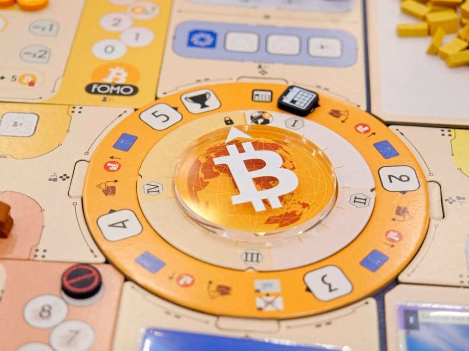
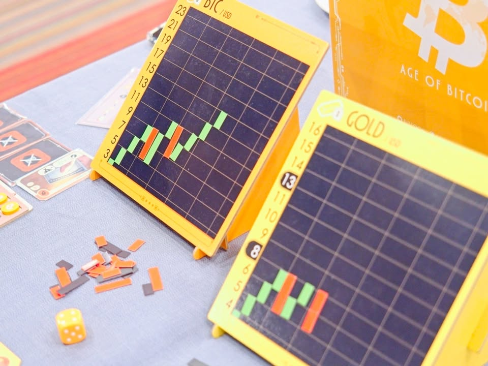
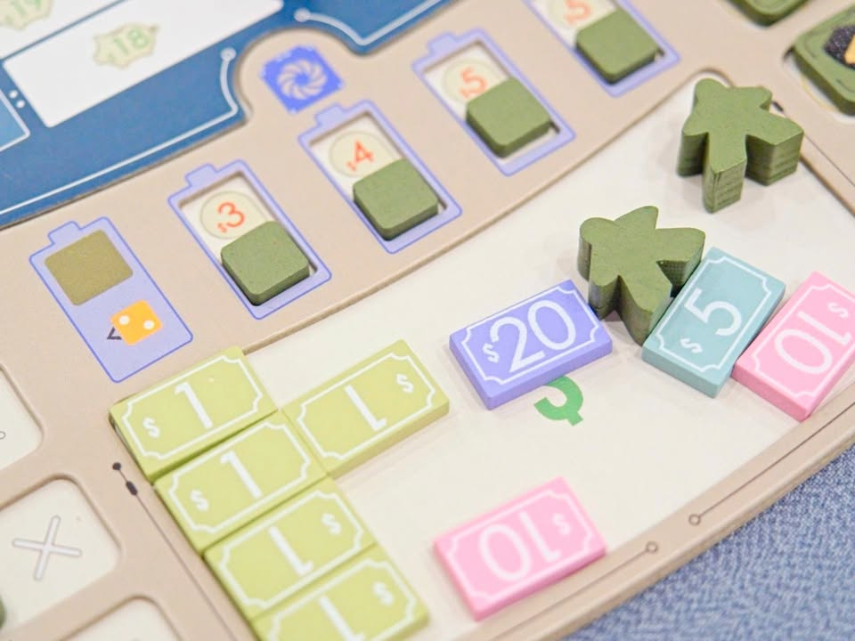
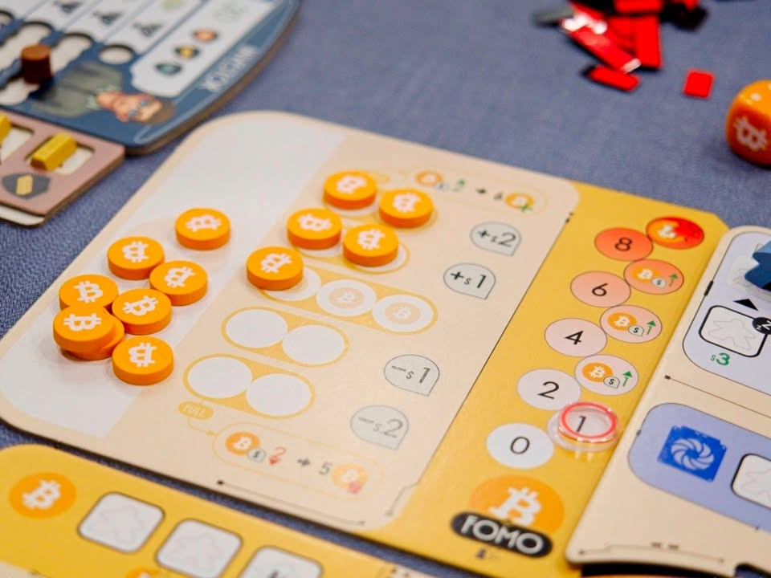
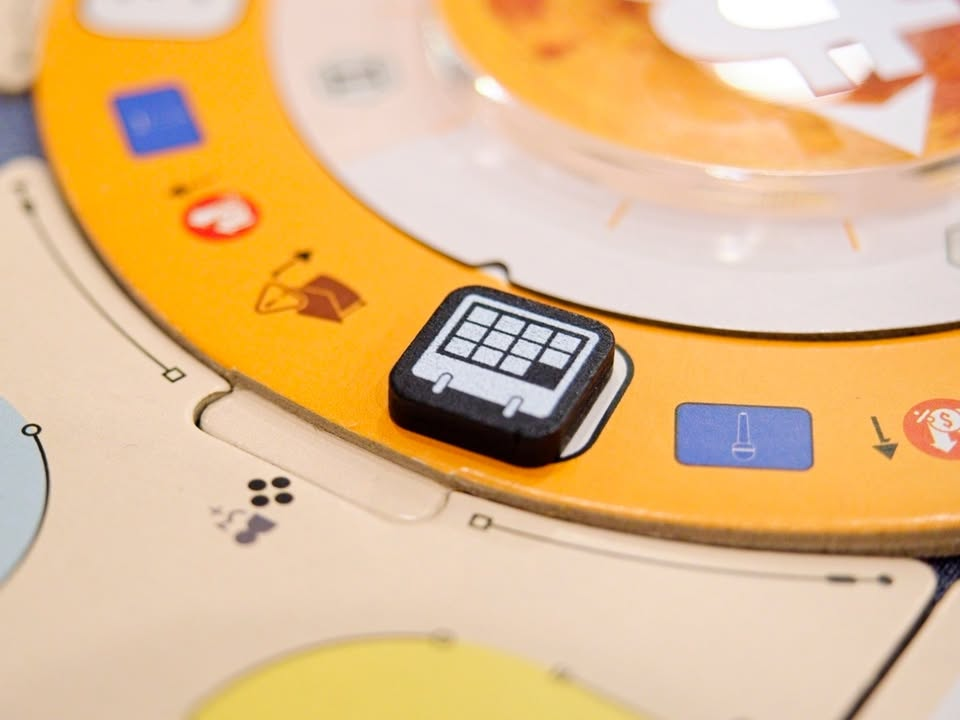

Age of BitCoin ฉบับโพสขายของ

---
โพสขายของที่ลงให้ด้วยความเสน่หากับค่าย 4 Comma ของแท้ไม่เติมเอส (แต่เกมออกแบบโดยทีมงาน BitToon นะ) ลงช้าเพราะเค้าล้านแตกไปแล้วฉันจะไปช่วยไรอี๊ก ตังไม่ได้ แต่เค้าชวนไปงานเปิดตัว ถ้าอยากให้ผมได้ตังกดเข้า ks ผ่านลิงค์นี้ได้ (ผมได้ 5% จากยอดไหนไม่รู้...)  - ถ้าจะซื้ออยู่แล้วก็ฝากด้วยฮะ https_://www.kickstarter.com/projects/whiteelephants/age-of-bitcoin?ref=5m7zgb

---
แม่งมีบรีฟอย่างยาว พวกวิธีเล่นกับ key message บลาๆแต่ผมโยนทิ้งเลยเอาเนื้อๆจากผมนี้แหละ

▪️ เอาสั้นๆคือถ้ามองหา mid light แนวซื้อถูกขายแพงที่ผู้เล่นในวงมีส่วนในการกำหนดราคาเกมนี้ก็ซื้อมาเล่นได้

▪️ เกมนี้เป็น mid light euro สายเกมยูโรเรียนรู้ได้ตามปกติ แนว worker placement มีช่องแอคชั่นให้ทำ 4 ช่องวนๆกับการซื้อขายเป็นทอง/bitcoin กับอีกสองอันคืออัพเทคกับซื้อสินทรัพย์มาเสริมพลังแบบ passive

▪️ ก็ mid light euro อ่ะนะคนธรรมดาก็สอนเล่นได้ อาจจะต้องมี learning curve นิดแต่ไม่ยาก

▪️เกมแอบใจดีไปหน่อยมีช่องลง = player - 1 ไม่มีบทลงโทษอะไรถ้าช้าแต่ถ้าผิดจังหวะเงินในการทำแอคชั่นอาจจะไม่พอทำให้ต้องโดนบังคับจบรอบก่อนชาวบ้าน

▪️จริงๆมันไม่มีอะไรแฟนซีคือมี currenrcy 3 สกุลคือเงินสด / ทอง / bitcoin ก็มี sense ของการได้มากับการจัดการตามธีมมัน

▪️ เกมไม่ได้มาลงลึกอะไรกับ bitcoin ในเชิงเทคนิคคอลคือไม่ต้องเก็ทอะไรมองเป็นของไว้ซื้อขายในเกมได้เลย เกมไม่ได้มาชวนเชื่อแบบอวยสุดติ่งอะไรแค่เล่าว่า what if โลกมา adopt ใช้ bitcoin อารมณ์ก็อาจจะไม่ต่างจากเล่นเกมย้อนยุคแล้วเราต้องไปทำแอคชั่นสกัดแร่เงินไรงี้

▪️บรีฟแม่งย้ำจังว่ะว่ากระดานแท่งเทียนแม่เหล็กใช้เป็นเกมแรก แต่เออๆ ถือว่า present สวยยอมให้ ตอนทุบกราฟตกนี้สะใจอยู่ 

▪️ ถึงเกมจะเหมือนง่ายแต่มันก็มีความเกมเมอร์เต็มเปี่ยมอยู่ใน weight class ของมันนะตอนเล่นคือสนุกดี สำหรับคนเล่นเกมหนักแล้วไม่มีอะไรให้ติเป็นพิเศษ (โอเคมันไม่ได้โดดเด่นทะลุว้าวอะไร แต่การไม่มีอะไรให้ติว่าน่าเบื่อหรือไม่สนุกก็แปลว่ามันถือว่าดีเลยนะใน target group คนทั่วไป)

---
▪️บรีฟย้ำแล้วย้ำอีกว่ากดใน KS ค่าส่งในไทยแค่ 3 ดอลลาร์หรือประมาณ 100 บาท ไม่ต้องตกใจราคามันก็ปกติเนี่ยแหละ

▪️เกมมัน funded ไปแล้วรอแอพส้มก็ได้ปล่าว? - 'เค้า' บอกว่ากดใน ks 3 วันแรกจะได้ promo มูลค่า 6usd ฟรี (แปลว่ารอทีหลังก็ได้เหมือนกันแต่ไม่ฟรี) แต่มัน(เออ... คุณโอ๊ต) ก็บอกว่าเดี๋ยวมีของแถมโน้นนี้อีกในฉบับ KS ที่จะไม่โผล่มาในเวอร์ชั่นรีเทล (ก็แปลว่ารอเดี๋ยวก็มีรุ่นพิมพ์ KS มาขายให้ซื้ออยู่ดี) แต่ใดๆเค้าก็บอกว่านี้ราคาดีแล้ว กับในบรีฟบอกจะมีของแถมเยอะมาก (ไปดูก็ไม่ได้แพงนะ ราคาบอร์ดเกมทั่วไปอุปกรณ์ดี) ก็ลองไปตัดสินใจดูเอาครับ

▪️สรุปเมิงจะช่วยเพื่อนขายของไหม? - ช่วยดิ ก็บอกแล้วว่าเกมมันสนุกเลยนะใน weight class แก๊งชาวบอร์ดเกมคุยกันก็ happy กันดี แต่จะให้เลียแล้วบอกโอ้โฮนี้มัน brass killer ก็ไม่ใช่ป่ะ? ย้ำอีกทีว่าสำหรับ mid light ที่อยากมองเกมในการ 'หาจังหวะ' ลงทุนเกมนี้ถือว่าสวย

---
ลง aff ให้อีกที - https_://www.kickstarter.com/projects/whiteelephants/age-of-bitcoin?ref=5m7zgb

