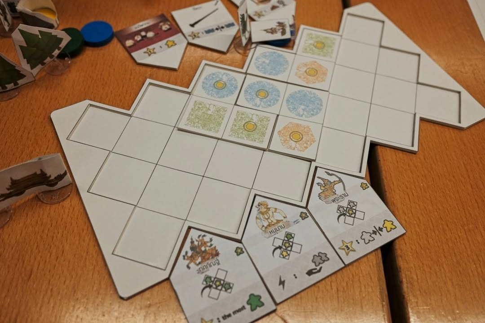
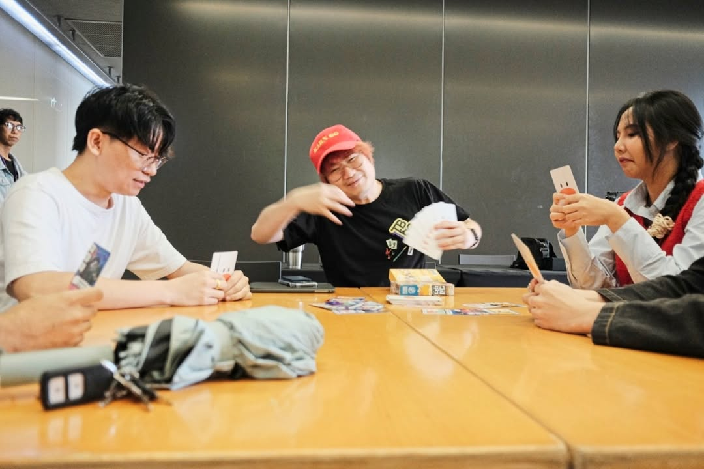
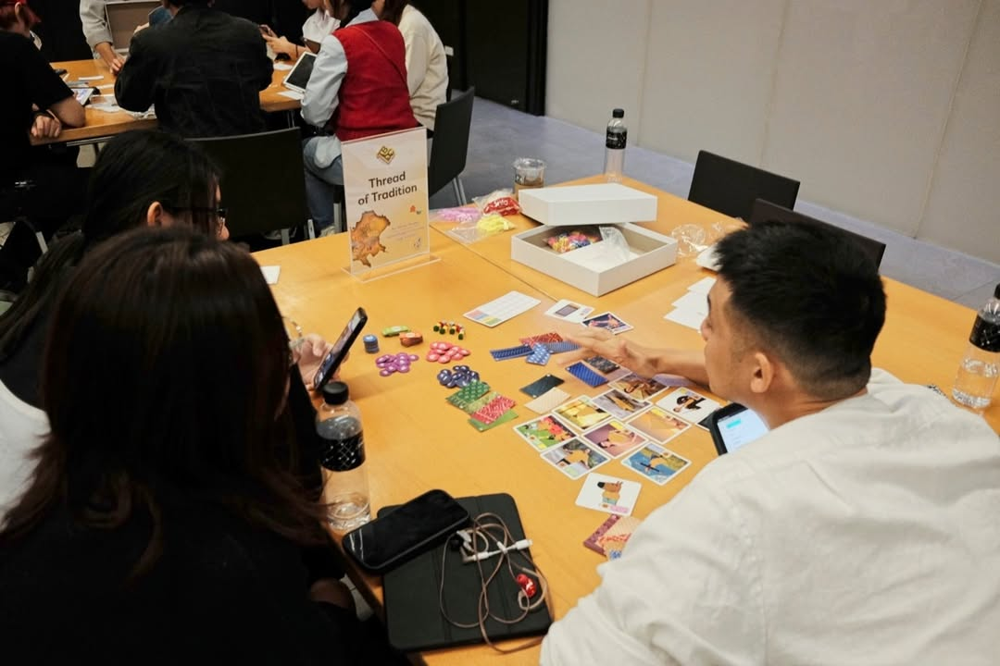
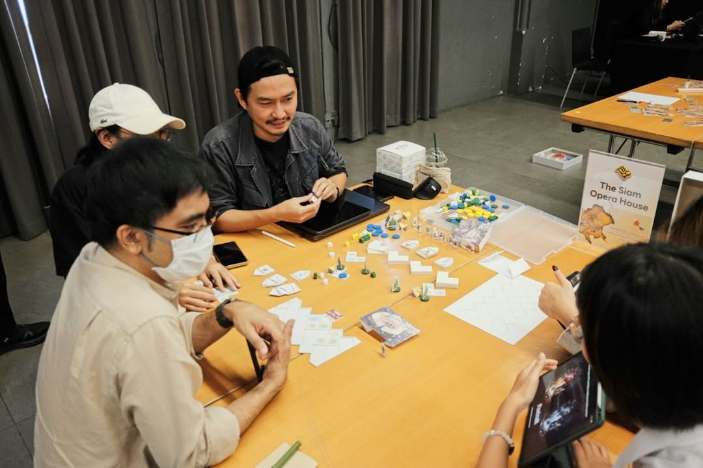
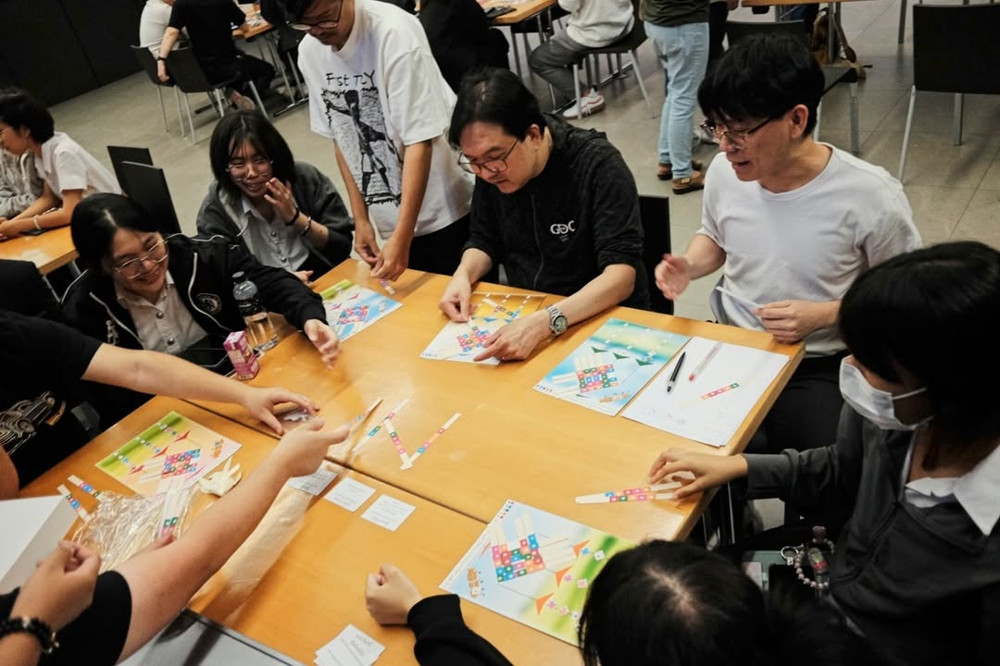
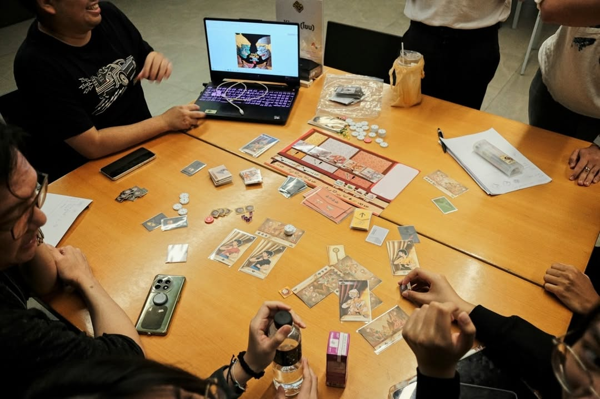
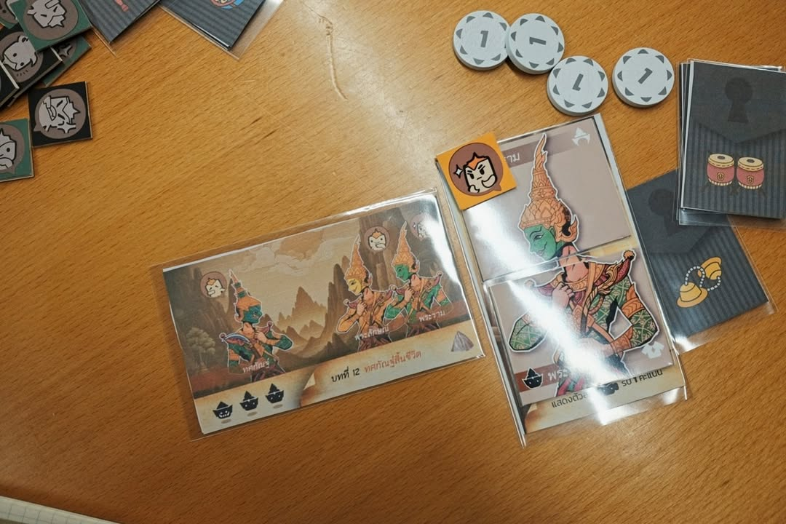

วันนี้ไปเป็น mentor ให้งาน TBDC มาครับ ซึ่งปีนี้จัดเป็นปีที่สองแล้ว เรื่องตลกของปีนี้คือเค้าใช้วิธีจับฉลากจับคู่ mentor กันเป็นทีม ซึ่งผมได้คู่กับอาร์ม DNR แล้วก็ให้แต่ละคนจับฉลากทีมประจำตัวอีกที ซึ่งผลที่ออกก็คืออออออออ ผมจับได้ทีมแชมป์เก่าปีที่แล้ว (ซึ่งก็เป็นกลุ่มเดิมที่ได้ดูกับพี่ตวงและอาจารย์ยุ้ยเมื่อปีที่แล้ว ดวงก็สมพงษ์เป็น content กันเกิ๊น) ก็ได้แต่มองหน้ากันเองว่าไม่เหลือที่ให้ถอยแล้วจ้าาาาาาาาาาาโม้เยอะจนคนหมั่นไส้ แต่ใดๆคือเราไม่เสียอะไรอยู่ละ ชนะก็โม้ต่อยาวๆ แพ้ก็บอกยินดีด้วยนะครับเมนเทอร์อันดับหนึ่งคนที่สอง คุณได้มาต่อท้ายแถวผมแล้ว...........

รอบนี้น่าสนใจตรงมีทีมงานนักศึกษามาช่วยประจำแต่ละทีมเพื่อช่วยพัฒนางานศิลป์ให้โดยตรงไม่ต้องผ่านการขึ้น prototype ผ่าน AI

---
เกมที่เข้ารอบมี 6 เกมแต่คิดว่าเดี๋ยวไปลงรายละเอียดก็ตอนเจอกันรอบสองที่เค้าปรับเกมแล้วดีกว่า ไอเดียน่าสนใจทุกเกม

เอาแบบไวๆ

ทีม MISCELLANEOUS - The Siam Opera House - จะมีอารมณ์ทรง Cascadia ที่ให้เราหยิบไทล์มาจัดฉากโรงละครโขน

ทีม Over the Moon - ตะเพียนพร - แนวจัดชุดเรียง pattern โดยการหยิบแผ่นไทล์ทรงยาวมาสานเป็นรูปปลาพร้อมกับทำคะแนนและโบนัส

ทีม Meeple Play - Khon (โขน) - แนว set collection ที่หยิบเอาตัวละครมาใส่หัวโขนและจัดชุดเพื่อทำเซ็ทให้เข้ากับฉาก

ทีม Vanta Studio - Thread of Tradition - แนว Tile Laying ที่ใช้ลายผ้า ในการประกบเป็นรูปแบบและเอาไทล์เจาะรูมาวางทับลายผ้าที่สร้างเอาไว้

ทีม Try Two Tiles  - Chalawan - อันนี้แบ่งเป็นสองทีมคือตัวจรเข้ไปสู้กับผู้เล่นอื่นแนวเดินอัพสกิลตัวละครแล้วมาตบตีแย่งกันคิลบอส

ทีม ทีมคณะหนังปลากรอบ - ตะลุงป่วน ก๊วนทายคำ - แนวใช้หนังตะลุงในการเล่าเรื่องใบ้คำ

