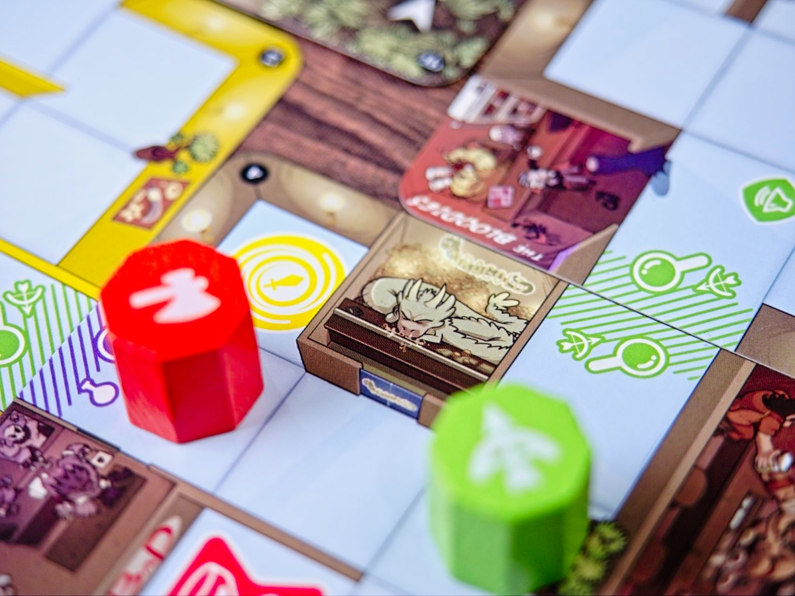
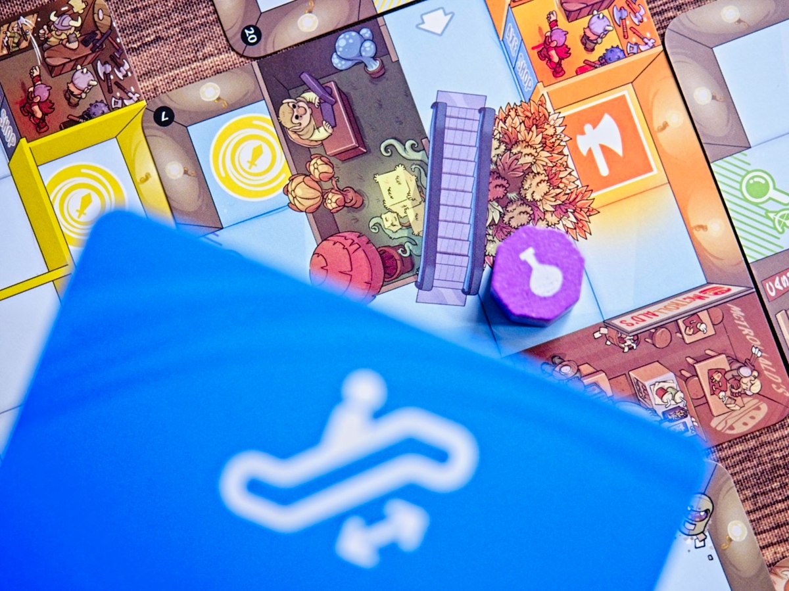
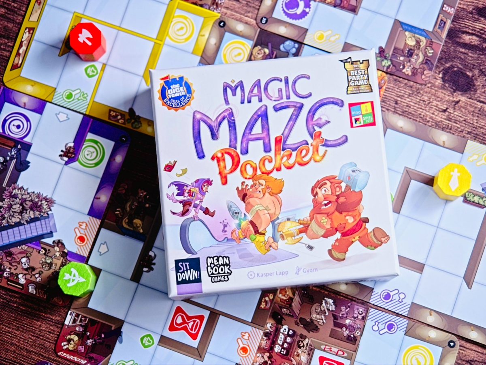

เมื่อเหล่ายอดนักรบได้ถูกดูดเข้าสู่เขาวงกตที่มองซ้ายมองขวาแล้วมันยังกะสรรพสินค้าเลยนิหว่าแถมหนทางซับซ้อนยิ่งกว่าห้าง One Bangkok จะเดินไงนิ - เอาละเรามา 'ชิง' ไอเทมประจำกายแล้วหอบหนีออกไปใช้ในเควสหน้ากันดีกว่า

เกมนี้เป็นแนว ช่วยกันเล่นแบบจับเวลาจริง - อย่าพึ่งหยุดอ่านเพราะมันน่าสนใจกว่าที่คุณคิด เพราะมันลบผู้เล่นสายผู้นำไปด้วยการบริหารจัดการทำหน้าที่ของตัวเองแยกกันชัดเจนและทุกคนต้องโฟกัสหน้าทีตัวเองไปพร้อมๆกับส่องดูเพื่อนๆให้มารับลูกกันอย่างเหมาะเจาะด้วยนะ โดยถ้ามันไม่รู้ตัวก็ต้องไปตบหัว เอ๊ย เคาะโต๊ะดังๆหน่อยให้รู้หน้าที่ซักที!!

---
เกมนี้จะมีฮีโร่อยู่ 4 สี เริ่มวางอยู่บนไทล์ ผู้เล่นจะได้แจกป้ายคำสั่งซึ่งจะมี เดินไปในทิศ ซ้าย ขวา บน ล่าง, เปิดแผนที่, ใช้ประตูวาร์ป,  แล้วก็ขึ้นลงบันได แอคชั่นมีแค่นี้แหละแต่ว่าป้ายคำสั่งจะอยู่กระจายไปตามผู้เล่น อย่างถ้าเล่น 4 คนก็อาจจะมีผู้เล่นคนหนึ่งขยับตัวลงได้อย่างเดียว + ขึ้นลงบันไดเลื่อน

ทีนี้เราก็จะขยับตัวฮีโร่เดินเอาตามที่เราทำได้นั้นแหละ เปิดแผนที่ไปเรื่อยพอเจออาวุธประจำตัวไปยืนครบก็ใส่เกียร์หมาวิ่งไปทางออกประจำตัวก็ถือว่าเคลียร์ แต่ว่าเกมมีการจับเวลาด้วยหมดเวลาก็แพ้แต่มันจะมีจุดให้เรากลับเวลาคว่ำใหม่อยู่เป็นระยะ แต่ว่าใช้ได้ครั้งเดียว 

ซึ่งผมลืมบอกไปว่าเกมนี้ห้ามคุยกันนะทำได้แค่ไปเคาะโต๊ะบอกหมายความว่าถ้าเล่นแบบไม่เผลอโกงแล้วมีคนสะดุดไม่รู้ว่าต้องขยับหน้าทีอะไรเกมจะยากขึ้นมาทันที และเราจะมีจังหวะให้หยุดคุยวางแผนกันแค่ตอนคว่ำเวลากับตอนที่ฮีโร่สีเขียวเปิดแผนที่ใหม่ (เล่นระดับความยากแรกจะยังใช้ไม่ได้นะ) ซึ่งกิมมิคที่ทำให้เกมไม่น่าเบื่อกับการยืนรอขยับอยู่ท่าเดียวคือทุกครั้งที่คว่ำเวลาเราต้องย้ายคำสั่งที่เราถือให้คนข้างๆด้วย ตอนเล่นๆไปเดี๋ยวจะมีคนงงแน่

เกมมีไต่ระดับระบบนิดหน่อยไม่แนะนำให้ข้าม ซึ่งมันจะค่อยๆขยับให้เราหัดใช้ความสามารถของฮีโร่เพิ่ม พอไปยากสุดจะขโมยของตรงๆไม่ได้ละต้องไปทำลายกล้องวงจรปิดก่อนงี้

---
ส่วนที่ชอบก็คงเป็นเรื่องขนาดที่เล็กลงพกง่ายมากๆโดยที่แทบไม่ต่างจากตัวกล่องใหญ่ ส่วนข้อเสียมันก็มีกับความที่เป็นการ์ดบางๆเวลารีบๆขยับมันก็เลื่อนง่ายไปหน่อย กับการใช้แอปจับเวลามันก็มีทั้งข้อดีข้อเสียละ แบบส่วนตัวอยากเห็นทรายไหลตามเวลาจริงมากกว่า แต่ใช้ตัวแอปช่วยจับก็สะดวกดี

---
🐸 ME - #กบโอเค สมัยที่ผมยังเล่นบอร์ดเกมไม่นานมาก (ยังเป็นช่วงเห่อเกมหนัก) แล้วเกมนี้ทำออกมา ว่ากันตรงๆตอนนั้นรู้สึกว่าเสียเวลากับหนวกหูฉิบโดยเฉพาะตอนที่เพื่อนมันเคาะโต๊ะรัวๆแล้วเราไม่รู้ว่าจะทำอะไรดี หรือไม่ก็ต้องเคาะเพื่อนแล้วทำไมเมิงไม่เก็ทททททททท  แต่วาร์ปมาตอนนี้ก็มองอีกแบบละว่ามันบันเทิงดีเวลาเอาไปเล่น session กับเพื่อน หรือไม่ก็น้องๆที่ office คือมันให้ความ tense จากการที่ต้องใช้สมาธิพร้อมกับความงุนงงว่าฉันทำอะไรผิดตอนเพื่อนกระหน่ำส่งซิกซ์ ตอนจังหวะหยุดพักเพื่อวางแผนนี้หายใจโล่งประหนึ่งนักประดาน้ำออกซิเจนหมดได้พักมางับอากาศหายใจ

ส่วนหนึ่งอาจจะเพราะมันกล่องเล็กพกง่ายเลยทำให้เรามองมันเป็นเกมคั่นเวลาไปโดยปริยายและการที่เอาไอ้ตัวเคาะๆออกแล้วให้ใช้มือแทนเนี่ยเผลอดีกว่าเดิมเพราะดูน่ารำคาญน้อยลง ฮา

🔴 expert  | 🟠 regular | : เกมเบาเน้นเอาไปคั่นเวลาไม่ก็หลอกเด็กใหม่นะ แต่ก็อย่าดูถูกไปเพราะถ้าไต่ระดับความยากไปเรื่อยๆนี้ยังไงก็ต้องมีหยุดพักวางแผนกันตลอดไม่งั้นแพ้แน่ เหนื่อยอยู่นะเกม

🟢casual/family | 🧸newbie : เกมเล่นง่ายแค่เปิดแผนที่แล้วขยับตัวเดินไปมาเท่านั้นเอง แต่การจะชนะเกมนั้นไม่ง่ายเลย แนะนำให้ค่อยๆเล่นไต่ระดับไปนะ กับเกมจะไม่เหมาะ (หรือเหมาะจะเอาไปฝึก) คนที่ลนง่ายเพราะจังหวะเวลามันบีบคั้นอยู่เหมือนกัน 

---
> 🐸 ME - ความเห็นส่วนตัวสำหรับตัวเองเพื่อตัวเอง
> 🔴 expert - ผ่านเกมมาเยอะ อ่านเกมใหม่ตลอด
> 🟠 regular - เล่นบ่อยเล่นประจำออกตระเวนเล่น
> 🟢casual/family - เล่นที่ร้านเล่นหรือกับครอบครัว
> 🧸newbie - มือใหม่พึ่งเข้าวงการผ่านเกมตามร้านมานิดหน่อย

---
this is a gifted product from MeanBook, no money changed hand for this content. ได้รับสินค้าโดยไม่มีค่าใช้จ่าย คอนเทนต์ทำเพื่อแสดงความเห็นส่วนตัวเกี่ยวกับเกมโดยไม่มีการจ้างวาน