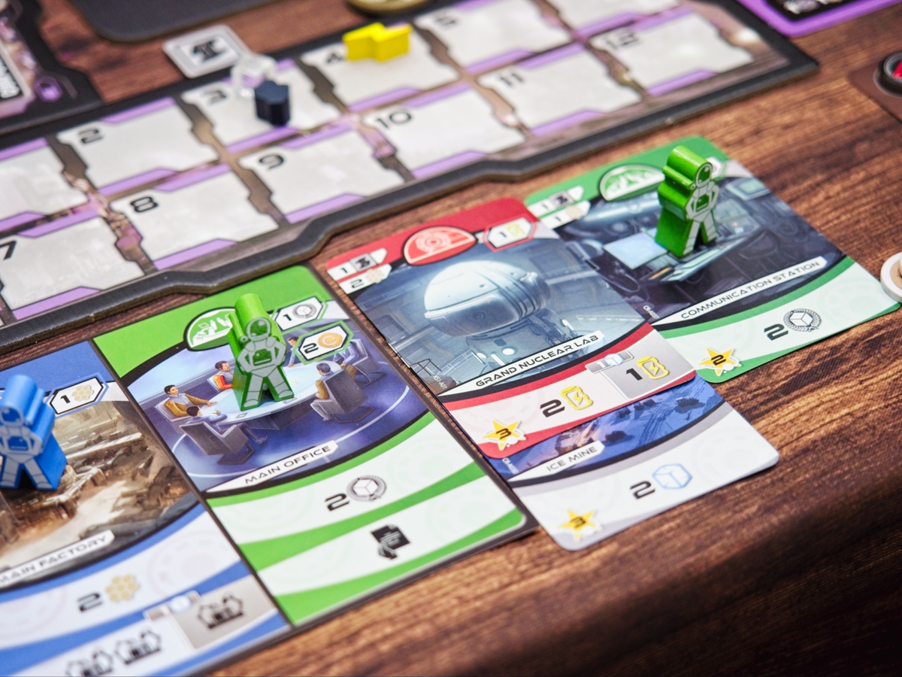
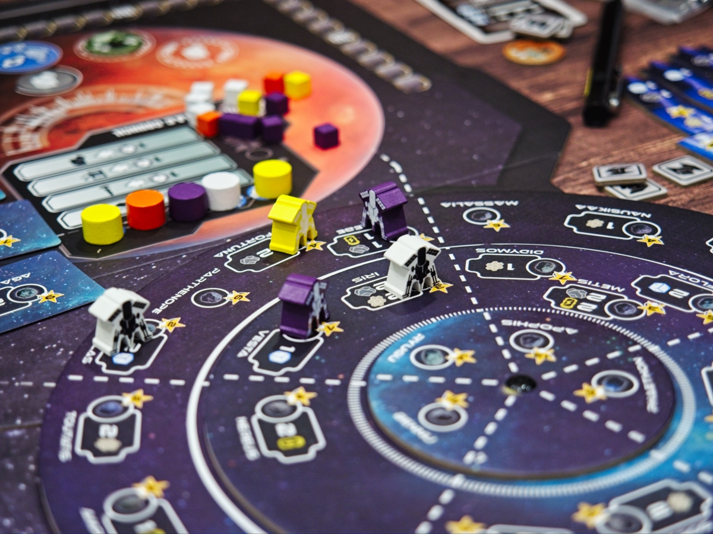

Ceres จำอะไรไม่ค่อยได้แต่อยากเล่าไว้หน่อย ไอเดียก็คือแนว Worker Placement ผสม Tableau Building หน่อยๆ ก็เป็นเกมหาทรัพยากรมาจ่ายแลกโน้นนี้ไปเรื่อยธีมไปสร้างอุตสาหกรรมบนดาวเคราะห์น้อยรอบดาวอังคารอีกที

ไอเดียที่ทำให้เกมนี้น่าสนใจคือตอนเริ่มเกมเราจะมีการ์ดตึกตั้งต้นอยู่ 4 สี ในรอบการเล่นนอกจากส่ง worker ไปทำแอคชั่นโน้นนี่แล้ว การหาทรัพยากรในเกมเราจะต้องหยิบตัววิศวะกรจากตลาดกลางมี 4 สีเหมือนกันเอามาวางบนตึกของเราเพื่อทำการแอคติเวทให้มันผลิตของ ส่วนที่เพิ่มมิติให้กับเกมก็คือเวลาซื้อตึกมาก็เอามาต่อข้างๆหรือต่อซ้อนกันก็ได้ เพราะวิศวะกรต่อรอบมันมีจำกัด

นอกจากตึกก็จะมีมินิเกมหน่อยๆให้เราสร้างจรวดกับหาพลังงานเพื่อยิงให้มันเดินทางไปจอดตามดาวเคราะห์น้อยเพื่อเอาโบนัสมาหมุนต่อ

---
🐸 ME - #กบโอเค ในภาพรวมคือมันสนุกจากเลือกลงแอคชั่นเบียดๆเผลอแป๊บเดียวช่องเต็มแบบ Worker Placement สลับกับแย่งหาการ์ดมาปั่น engine ผลิตของส่วนตัว ระบบหยิบนักบินสีต่างๆจากกองกลางมาแอคติเวทตึกก็ฉลาดดี ให้โอเคในแง่ว่ามันยังไม่โดดเด่นล้ำหน้าเกมที่มีอยู่แล้วอย่าง Terraforming Mars, SETI แต่ในอีกแง่ถ้าชอบอะไรทรงๆนี้เกมนี้ก็เป็นอีกตัวเลือกที่เติมเข้า collection ได้ ข้อดีของเกมนี้เทียบกับ TM, SETI ก็คงเป็นที่มันใช้ WP ทำให้แอคชั่นสั้นกระชับซึ่งผมชอบในจุดนี้นะ

🔴 expert  | 🟠 regular | : ระบบเกม solid มีกิมมิคของตัวเองแต่ในภาพรวมอาจจะไม่มีของใหม่ innovative จัดๆ

🟢casual/family | 🧸newbie : เป็นเกมที่มีระบบหลายชิ้นประกอบกัน ถือว่าอยู่ในหมวดซับซ้อน ถ้าพึ่งเริ่มเล่นลองก็ไปลองพวก Terraforming Mars ก่อนก็ได้

---
> 🐸 ME - ความเห็นส่วนตัวสำหรับตัวเองเพื่อตัวเอง
> 🔴 expert - ผ่านเกมมาเยอะ อ่านเกมใหม่ตลอด
> 🟠 regular - เล่นบ่อยเล่นประจำออกตระเวนเล่น
> 🟢casual/family - เล่นที่ร้านเล่นหรือกับครอบครัว
> 🧸newbie - มือใหม่พึ่งเข้าวงการผ่านเกมตามร้านมานิดหน่อย
