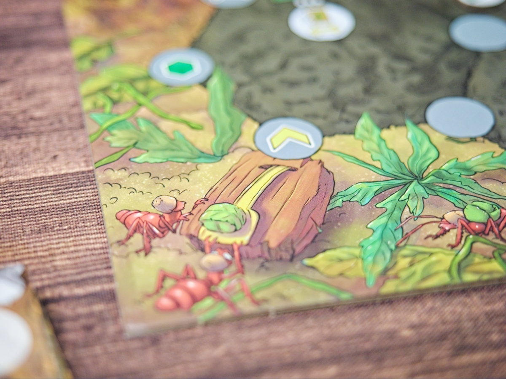
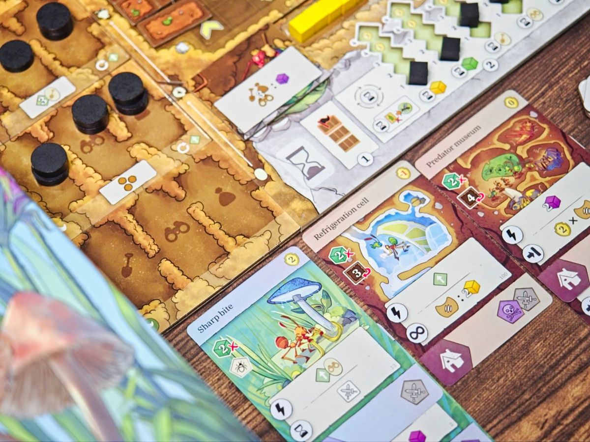
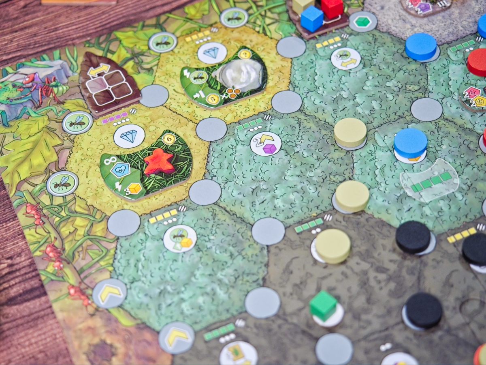
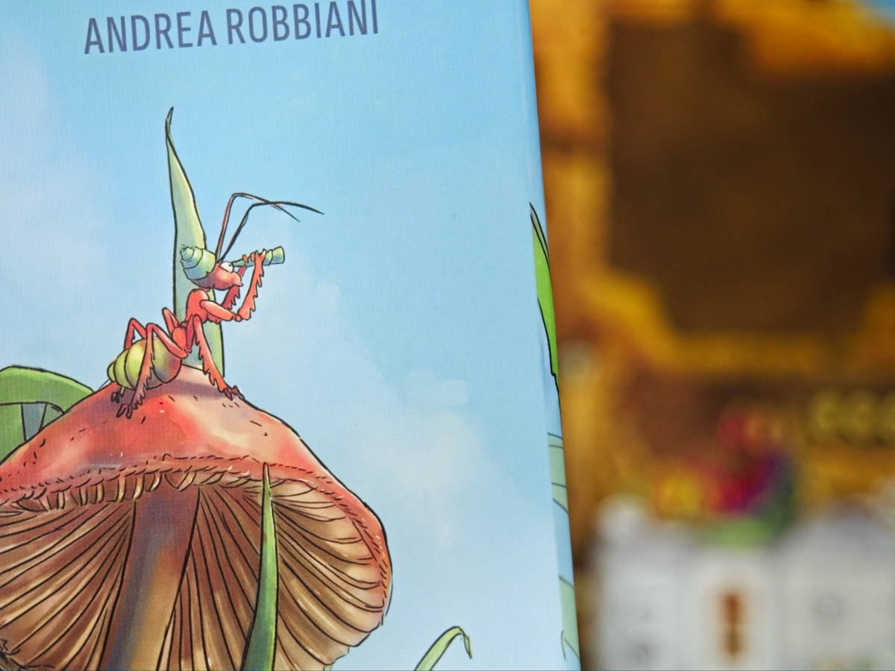

Ants เกมยูโรระดับกลางหนักที่จะให้เรามาขยับขยายโคโลนีของเราให้เกรียงไกลไปทั่วสวนหลังบ้าน

เอาจริงเป็นเกมที่อธิบายให้เห็นภาพรวมลำบากนิดหน่อยเพราะมันเป็นสไตล์มินิเกมหลวมๆที่มาขับเคลื่อนกระดานหลักที่ไม่ได้เด่นซักเท่าไร เริ่มจากแผนที่กลางมันจะแทนทีสวนหลังบ้านแห่งหนึ่งก็จะมีชนิดของพื้นดินหลายๆแบบต่อกันแบบตาราง 6 เหลี่ยม ตอนเราเล่นเนี่ยเราก็จะเอามดนักสำรวจไปวางตรงกลางตารางแล้วก็บู๊มมม เจออาหารบางใบไม้บ้างแล้วก็ศัตรูตามธรรมชาติเป็นแมลงโน้นนี้ หรือเราจะส่งมดหาอาหารไปวางรอบๆไทล์ที่เราหรือคนอื่นสำรวจเอาไว้แล้วก็ได้ เราก็จะได้อาหารที่มันตกตามพื้นมาเก็บไว้ หรือจะเอามดนักขุดไปขุดห้องว่างๆใต้ดินรอการปรับปรุงรังก็ได้ จริงๆไอเดียเกมก็จะวนๆอยู่แค่นี้แหละ

จากข้างบนจะเห็นว่ามันมีแอคชั่นหลักให้ทำก็คือเอามดงาน 3 ชนิดออกไปทำตามหน้าทีมัน เกมใช้ระบบว่ามดงานเราจะมี 3 สเตจชีวิตคือเริ่มจากไข่ไปเป็นตัวอ่อนแล้วค่อยเอาไปใช้ได้ ซึ่งเกมจะมีระบบ engine ให้เราผลิตไข่ทุกๆตา แต่เราต้องวางแผนเรื่องชนิดมดงานไว้ด้วย แล้วก็ทุกมดงานที่เกิดมันจะต้องการอาหาร เราก็ต้องลำบากวนออกไปสำรวจหาอาหารต่อไม่งั้นมดจะตายเอา

ระบบที่ทำให้เกมไดนามิกมากๆก็คือระบบการ์ด ซึ่งมันก็จะมีตลาดกลางที่ผู้เล่นจะได้หยิบมาเรื่อยๆทุกครั้งที่ส่งมดไปทำแอคชั่น ตัวการ์ดมีหลายหมวดทั้งแบบที่เป็น 'ห้อง' ที่เราต้องใช้พื้นที่ในรังของเราแต่มันก็จะให้ความสามารถต่างๆกับเรา บางอันก็เป็น 'เป้าหมาย' หรือตัวคูณคะแนนหรือเพิ่มศักยภาพเอนจิ้นอะไรก็ว่ากันไป

เกมนี้ไม่มี phase อะไรทุกคนผลัดวนกันทำแอคชั่นไปเรื่อยๆถ้ามดงานหมดก็จะเลือกทำแอคชั่น 'ฝักตัว' ที่มันจะให้เราผลิตทรัพยากรที่เรามีแล้วก็ได้แอคเฟคจากการ์ดไปตามเรื่อง คือมันไม่มีจุดสะดุดอะไรกับการเล่น เกมจบแบบตัดฉับเมื่อผู้เล่นทั้งวงเคลียร์เงื่อนไขต่างๆในเกมได้ถึงจำนวนที่กำหนด (ซึ่งแรกๆจะช้าหน่อยแต่ท้ายเกมจะเคลมกันเร็วแบบไม่ทันตั้งตัวเลยล่ะ)

---
🐸 ME - #กบชอบ ผมไม่ได้เจอเกมที่วางสัดส่วนของการทำเอนจิ้นและการทำแอคชั่นที่ฉับไวไม่ลีลาวนงึมงำมานานแล้ว ส่วนตัวมองว่ามันให้อารมณ์แบบ Terraforming Mars ในมุมของการหยิบการ์ดมาเล่นทำเอนจิ้นแล้วเอาทรัพยากรไปต่อยอดบนแผนที่กลางต่อ แต่ว่าเกมนี้กระฉับกว่ามาก

ข้อดีที่ผมชอบคือระบบตลาดการ์ด ที่แทนที่จะเป็นตลาดที่หยิบเข้ามือยากๆแบบใน Ark Nova (จริงๆระบบสร้างห้องกับเก็บไอคอนก็มีความเป็น Ark Nova lite อยู่จางๆ) หรือต้องรอจั่วแล้วดราฟแบบใน Terraforming Mars ระบบตลาดกลางที่ทุกคนเห็นแล้วสามารถจั่วได้เรื่อยๆทำให้เกมมีจังหวะของการที่ต้องปรับแผนอยู่เรื่อยๆ แล้วก็การที่เกมไม่มีการเดินเป็นเฟสก็ทำให้เกมมีจังหวะที่เดินหน้าไปเรื่อยๆไม่มีการ 'เล่านิทาน' ที่ผมไม่ค่อยชอบ

จุดที่ไม่ชอบนิดหน่อยก็คือแม้ระบบการทำรอบการเล่นจะฉับไว แต่มันก็ยังมีความเป็นเกมแนวเล่นกับตัวเองเยอะ บอร์ดตรงกลางแม้จะจิ๊ปากเวลาโดนแย่งแต่ก็ไม่ได้มี impact โหดๆที่ทำให้เราต้องเปลี่ยนแผนอะไรขนาดนั้น (แต่ก็มีมากพอที่ทำให้เราไม่รู้สึกว่ากำลังเล่นเกมงึมงำคนเดียว)  คือมันยังมีโทนของเกม multi-solitaire ที่เราอยากทำแอคชั่นตัวเองเร็วๆอยู่ทำให้รู้สึกว่าเกมน่าจะเบสที่ 3 แต่ยังโอเคที่จะเล่น 4 นะ (ผิดกับเกมสมัยนี้ส่วนมากที่ 4 ไม่อยากเล่นเลยเพราะรอนานมาก) กับบอร์ดกลางแม้จะมีธีมการเล่าเรื่องที่ดีแต่บอร์ดมัน present ได้จืดสนิท มองไม่ออกเลยว่าได้ขยับขยายอาณาจักรมด

จุดกลางๆคือแม้ตลาดกลางการ์ดจะเยอะแต่มิติของการได้ดราฟแข่งดักมันก็หายไปนะเกมจะไม่ได้มาเป็นทรงคอมโบไหลสวยๆอะไร ดวงของการเปิดการ์ดเข้าตลาดก็มีผลอยู่เพราะสายที่เราเล่นการ์ดอาจยะยังไม่มา และสิ่งที่สำคัญคือเกมมันตัดฉับเร็วมากก็เป็นจุดที่บางคนอาจจะไม่ชอบ

สรุปสำหรับผมก็คือเป็นเกมที่วางน้ำหนักของระบบต่างๆออกมาได้สวยในแบบที่เจอน้อยมากในช่วงหลายปีที่ผ่านมา ถ้าเป็นคนที่ชอบอะไรแนวๆ Terraforming Mars, Ark Nova ก็มาลองการตีความอีกแบบในเกมนี้ได้  (ไม่เหมือนนะ แค่กลิ่นกับทรงมันชวนให้นึกถึง)

🔴 expert  | 🟠 regular | : solid euro เกมที่วางส่วนผสมการทำ engine กับการสลับทำแอคชั่นได้ดี เล่นตามง่ายเป็นเกมใช้ความคิดที่ไม่รู้สึกเลยว่าเป็นเกมหนัก 

🟢casual/family | 🧸newbie : ถือเป็นกลุ่มเกมซับซ้อน ถ้าข้ามมาเล่นเลยอาจจะงงในหลายจุด แต่เกมมีระบบที่สมเหตุสมผลทำให้สามารถค่อยๆเล่นตามได้โดยไม่หลง

---
> 🐸 ME - ความเห็นส่วนตัวสำหรับตัวเองเพื่อตัวเอง
> 🔴 expert - ผ่านเกมมาเยอะ อ่านเกมใหม่ตลอด
> 🟠 regular - เล่นบ่อยเล่นประจำออกตระเวนเล่น
> 🟢casual/family - เล่นที่ร้านเล่นหรือกับครอบครัว
> 🧸newbie - มือใหม่พึ่งเข้าวงการผ่านเกมตามร้านมานิดหน่อย
