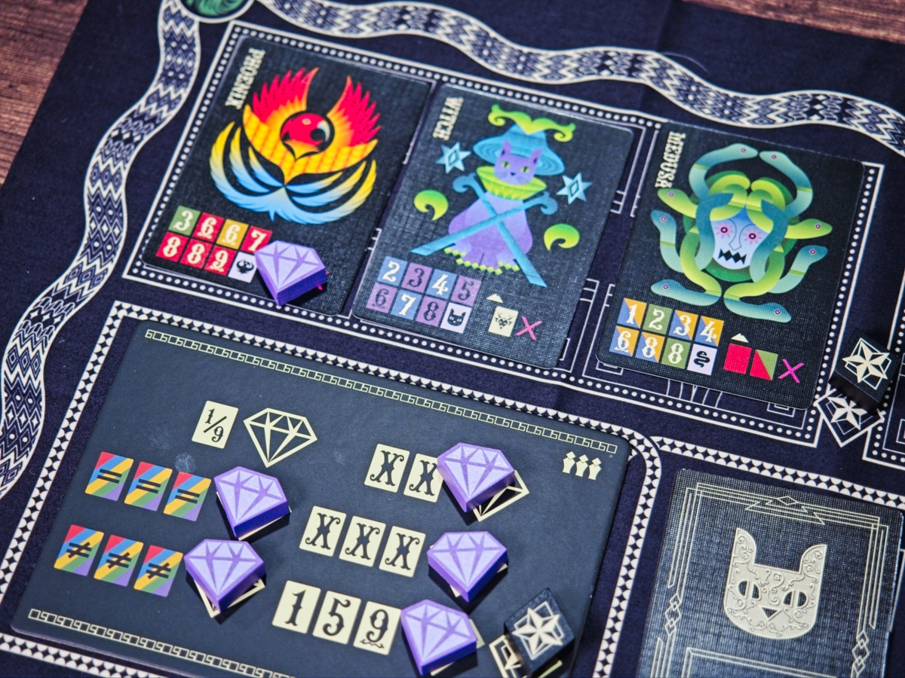
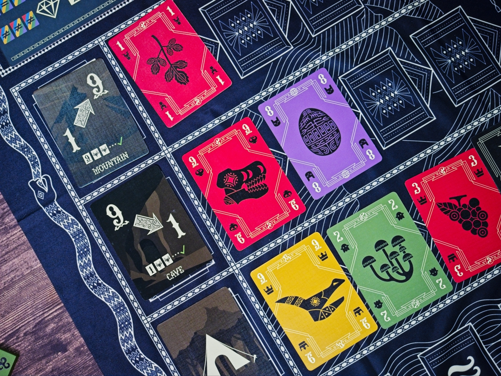
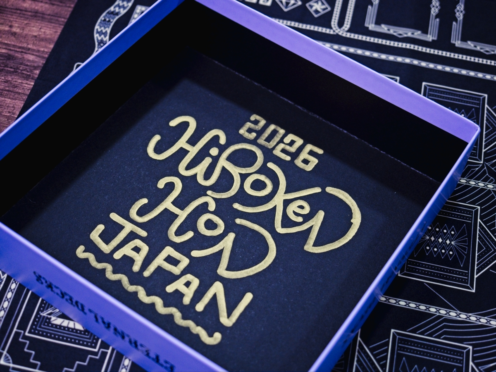

Eternal Decks  เล่าฟีลแบบสั้นๆนะเพราะรู้สึกยังเล่นไม่เยอะพอ ธีมเกมมันจะแนวแปะธีมแฟนตาซีที่ไม่ได้มีผลอะไรกับการดำเนินเกม (แต่งานอาร์ทก็ต้องยอมรับว่าสวยแปลกตา) ไอเดียประมาณว่าโลกมีเหตุการณ์แปลกๆเราเลยต้อง 'เดินทาง' ไปหาเหล่า Eternal ต่างๆเพื่อแก้ปัญหา

เกมเป็นแนวช่วยกันเล่นที่สอนการเล่นง่ายจนตกใจ ใน Stage 1 (เกมให้เราเล่น 6 Stage ที่มี setup และเงื่อนไขเล่นแตกต่างกัน และแต่ละ Stage จะมีกติกาความยากได้ 4 แบบ) เราจะมีเลนให้วางการ์ดอยู่ 3 แถว ผู้เล่นจะเริ่มจาก deck ที่มีเลข 1-5 ที่มีสีแตกต่างกัน จากนั้นสับและจั่วขึ้นมา 3 ใบ ในหนึ่งตาก็เล่นการ์ดคนละ 1 ใบไปเรื่อยๆเท่านั้นเอง และใช่ .... ห้ามคุยกันนะ

กติกาหลักของเกมคือ 'ห้ามเลขเดียวกันวางติดกัน' และ 'ห้ามสีเดียวกันวางติดกัน' โดยในแต่ละเลนจะมีกติกางอกมาอีกอย่างเช่นเลนแรกต้องวางจากมากไปน้อย อีกอันจากน้อยไปมาก จริงๆมีเลนที่สี่คือให้เราไปทิ้งการ์ดที่ไม่เข้าพวกใดๆทิ้งไปได้ แต่ทิ้งเยอะไปเดี๋ยวก็แพ้น่ะการ์ดไม่พอ

กติกาอีกอย่างคือถ้าเล่นการ์ดหมดมือแล้วไม่มีเล่นต่อก็แพ้ไปนะ.... แต่การ์ดมันมีแค่คนละ 5 ใบเองนะเห้ย!!

ปัญหานี้แก้โดยทุกครั้งที่เราเติมการ์ดครบเลน ผู้เล่นที่ปิดจบจะได้พบหยิบ Eternal ประจำแถวมา 1 กอง ซึ่งมันจะเขียนระบุไว้เรียบร้อยว่ามีกองการ์ดเลขและสีอะไรบ้างมาต่อชีวิตให้วง พร้อมกันนั้นน้องที่เราขโมยเด็คมาจะย้ายมาสาบเราต่อ ทำให้เงื่อนไขในการลงการ์ดของเราลงได้ยากขึ้น (อย่างบางตัวบอกต่อไปนี้ห้ามลงเลข 6 แล้วนะจ๊ะ) เกมก็จะมีกิมมิคในการเล่นการ์ดบางรูปแบบเพื่อสยบคำสาบของ Eternal และการสยบ Eternal ครบจำนวนก็จะนำไปสู่การปลดผลึกที่ทำให้เราชนะใน Stage 1

---
🐸 ME - #กบชอบ  ช่วงนี้ได้เล่น co-op ดีๆหลายเกมเลย เกมนี้ก็เป็นอีกหนึ่งที่โดดเด่นจากวิธีการเล่นที่เรียบง่ายแต่ตัว puzzle มีเงื่อนปมในการที่ต้องอ่านการ์ดในมือผู้เล่นคนอื่นรวมถึงการคุมจังหวะในการปิดเลนเพื่อให้คนในวงสามารถไปต่อได้ จังหวะการเล่นการ์ดเพื่อปิดคำสาปเพื่อให้เราไปข้างหน้าต่อได้ก็มีสัดส่วนของความลุ้นเล็กๆอยู่เหมือนกัน เป็นเกมที่เล่นจบแล้วรู้สึก satisfied ในการต่อสู้และพยายามของทีมดี เป็นเกมที่กติกาง่ายแต่ให้พื้นที่ผู้เล่นมาร่วมกันแก้ puzzle ได้น่าสนใจมากๆ 

แต่เกมก็มีข้อเสียที่ร้ายกาจอยู่อย่างหนึ่งคือตอนเล่นจบต้องมานั่งแยกการ์ดใหม่หมดตามกอง กับการ setup มันก็จุกจิกนิดนึงกับการต้องเลือกหยิบการ์ดมาเรียงๆ

🔴 expert  | 🟠 regular | : เกมช่วยกันเล่นที่กติกาง่ายแต่ puzzle ไม่ได้ผ่านได้อย่างสบายๆ ไม่รู้สึกว่าจะมี alpha player ได้นะ

🟢casual/family | 🧸newbie : ในเชิงกติกาแล้วเกมง่ายมาก แต่เกมมีรูปแบบการคิดที่อาจจะต้องการคนที่ชอบคิดเยอะทั้งวง ถ้าพึ่งเคยเล่นเกมแนวนี้อาจจะลอง Bomb Busters, Take Time ดูก่อน

---
> 🐸 ME - ความเห็นส่วนตัวสำหรับตัวเองเพื่อตัวเอง
> 🔴 expert - ผ่านเกมมาเยอะ อ่านเกมใหม่ตลอด
> 🟠 regular - เล่นบ่อยเล่นประจำออกตระเวนเล่น
> 🟢casual/family - เล่นที่ร้านเล่นหรือกับครอบครัว
> 🧸newbie - มือใหม่พึ่งเข้าวงการผ่านเกมตามร้านมานิดหน่อย
