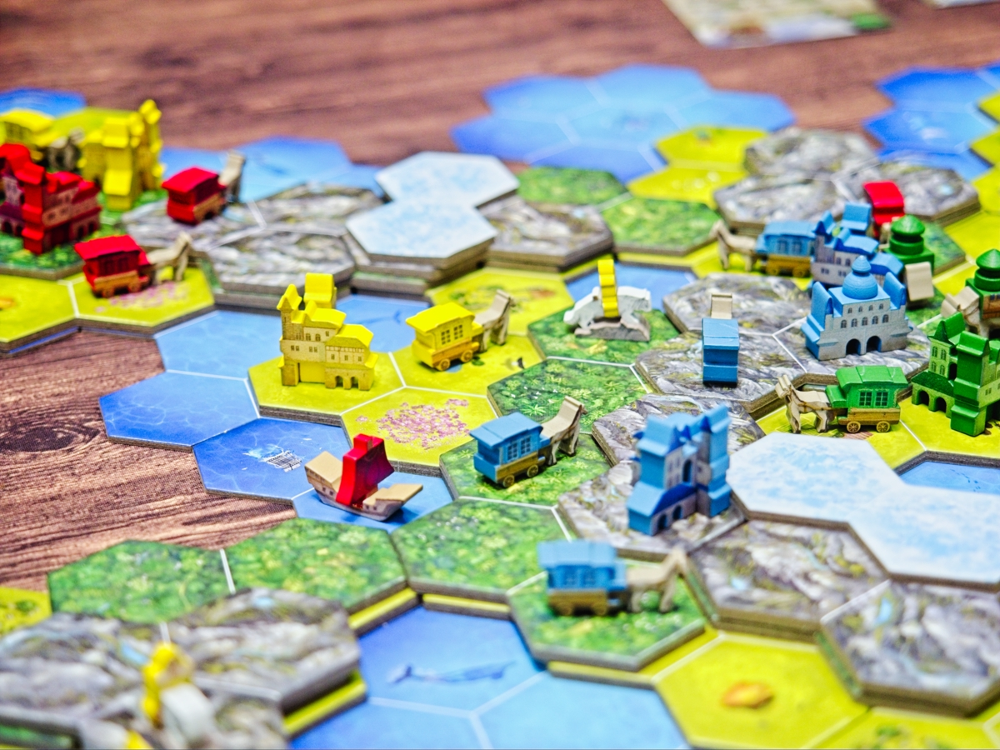
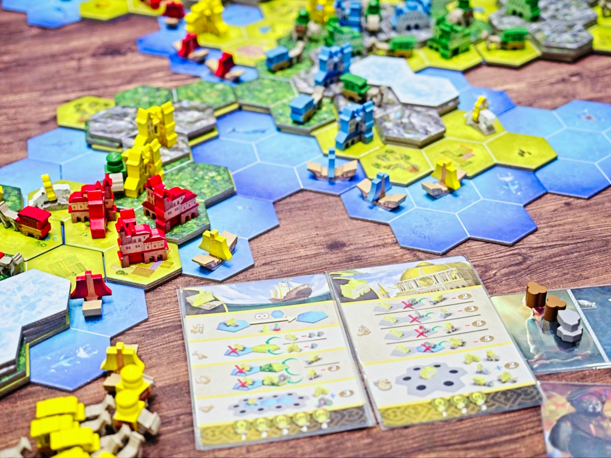
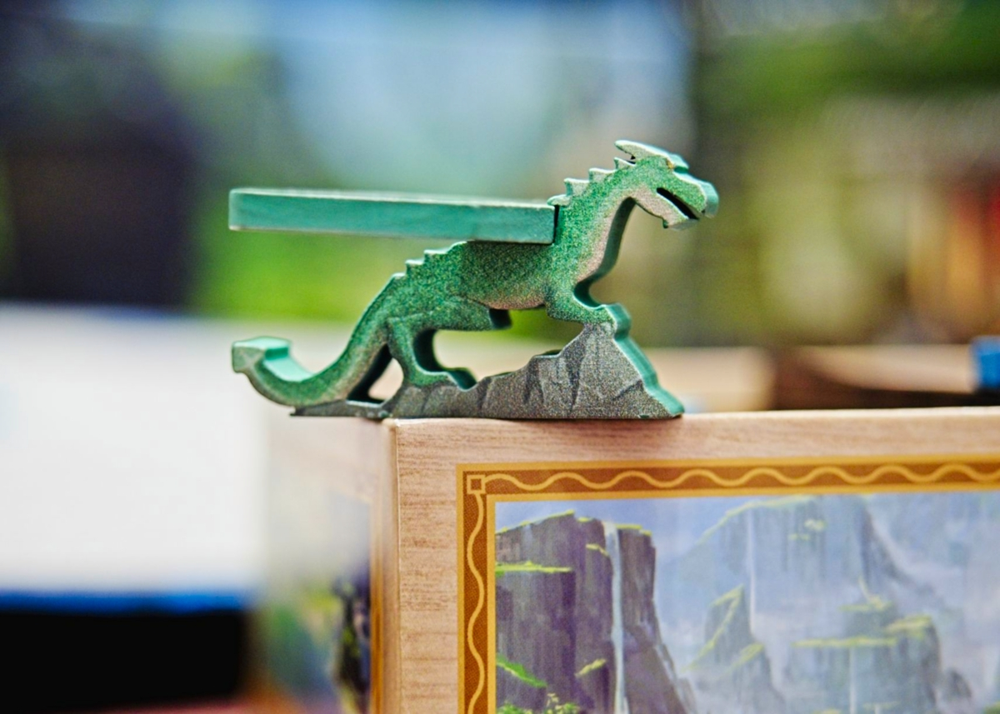

Rise & Fall - เกมแนว Civilization Building ที่จะให้เราพัฒนาอาณาจักรและยึดชิงอิทธิพลโดยปราศจากการสู้รบตบตี

เกมนี้ของสวยจัด แผนที่ในเกมจะเริ่มจากการที่ผู้เล่นผลัดกันวางไทล์เป็นพื้นน้ำจากนั้นผลัดกันวาที่ราบ - ป่า - ภูเขา - ยอดเขาตามลำดับเพื่อสร้างแผนที่ในเกมขึ้นมาใหม่ ก่อนจะเริ่มวางเมืองเพื่อเตรียมเริ่มเกม

ไอเดียหลักของเกมนี้คือการไปสร้างสิ่งปลูกสร้างต่างๆเพื่อให้มีคนของเราเยอะที่สุดในขอบเขตพื้นที่หนึ่งๆซึ่งจะกลับมาเป็นคะแนนตอนจบเกม ระบบการเล่นจะเป็นการเล่นการ์ดได้เฉพาะยูนิตที่เรามี (อย่างเช่นถ้าตอนนี้เรามีแค่เมืองกับคนเร่ร่อน เราก็จะได้เล่นการ์ดแค่สองใบ ที่เหลือเก็บไว้จนกว่าจะมียูนิต) เล่นแล้วใช้ซ้ำไม่ได้ต้องรอเล่นให้ครบทุกใบถึงจะได้รวบมือขึ้นมาเล่นใหม่ เล่นวนไปเรื่อยๆจนจบเกม

ความซับซ้อนของเกมจะมาจากการ์ดยูนิต 1 ใบนั้นทำได้หลากหลายมากๆ และการเล่นหนึ่งใบจะเป็นการใช้งานยูนิตชนิดนั้นๆทุกตัว (แต่ทำต่างกันได้) อย่างเช่นคนเร่ร่อนยูนิตพื้นฐานสุดของเกมนั้นเราจะมีตัวเลือกทั้ง เดิน-เก็บทรัพยากร-สร้างเมือง-อัพเกรดเป็นพ่อค้า/เรือ/วัด/คนภูเขา แต่ถ้าเราเดินก็จะไม่ได้เก็บของหรือสร้างเมืองไม่ได้ ต้องรอเล่นการใบอื่นๆก่อนเพื่อที่จะวนยกใบนี้มาเล่นใหม่ และถ้าเราขยายชนิดยูนิตเพิ่ม 'มือ' ของเราก็จะเยอะขึ้นทำให้กว่าจะวนกลับมาได้มันนานขึ้นอีก

กิมมิคที่คิดว่าน่าสนใจคือทุกครั้งที่มีผู้เล่นสร้างยูนิตชนิดใดครบทุกตัวก็จะมีการเคลมคะแนน objective และบังคับให้ผู้เล่นต้องทิ้งการ์ดยูนิต 1 ใบทำให้เล่นใบนั้นอีกไม่ได้ แต่เราจะแก้ได้ด้วยการต้องใช้เงินซื้อกลับมา แรกๆจะไม่เท่าไรแต่หลังๆมันแพงขึ้นเรื่อยๆจนทำให้เราต้องคิดเรื่อง trade off ล่ะ

---
🐸 ME - #กบโอเค อุปกรณ์โคตรสวย ระบบเกมเล่นง่าย แต่ในความเป็นจริงแล้วนี้คือเกม abstract ชิงพื้นที่ที่มีการตัด/บล็อคทางกันแบบโหดเหี้ยม วินาทีที่เล่นพลาดหรือเมื่อมีคนดักพื้นที่ของตัวเองไว้ได้แล้วก็แทบจะล็อกมงคนชนะไว้เรียบร้อย แน่นอนว่าเล่นแบบ enjoy ขยับไปเรื่อยๆก็ได้แหละแต่มันเป็นเกมที่ให้รางวัลกับการวางแผนล่วงหน้าอย่างเป็นระบบสูงมากเพราะมันไม่มีดวงมาเกี่ยวแล้ว เผ่าและความสามารถหวือหวาดีแต่ก็รู้สึกว่าบางอันก็เก่งไปหน่อยโดยเฉพาะกับเกม luckless แบบนี้

ส่วนที่ไม่ชอบเป็นการส่วนตัวก็เลยอยู่กับระบบเกมแบบ 'รอรวบกอง' ที่ทำให้เราทำแอคชั่นที่อยากทำซ้ำไม่ได้ พอรวมกับการที่ 1 ใบมันทำได้หลายอย่างมากๆแล้วอยากจะรีบทำบางอย่างเพื่อปรับแผนรับมือมันกลับทำอะไรไม่ได้เลย ซึ่งจริงๆมันก็เป็นประเด็นของเกมเลยละ แต่ผมไม่ค่อยชอบความอืดแบบอึดอัดทรงนี้เท่าไร

🔴 expert  | 🟠 regular | : เกมธีมสร้างเมืองไร้ดวงเน้นขยายเมืองเพื่อชิงพื้นที่ ระบบการเล่นไม่ซับซ้อนแต่ต้องการการวางแผนที่ดีเพราะถ้าเล่นมั่วจะโดนคนที่ทำดีกว่านำลิ้ว

🟢casual/family | 🧸newbie : ของสวยเข้าใจตามได้ไม่ยาก แค่เล่นครั้งแรกๆอาจจะงงกับการหยิบๆวางๆยูนิทว่าอยากจะสร้างอันนี้ต้องใช้ใบไหนกันนะนิดหน่อย เล่นตามจนจบได้ไม่ยากแต่จะโดนมือโปรตบยับง่ายหน่อย

---
> 🐸 ME - ความเห็นส่วนตัวสำหรับตัวเองเพื่อตัวเอง
> 🔴 expert - ผ่านเกมมาเยอะ อ่านเกมใหม่ตลอด
> 🟠 regular - เล่นบ่อยเล่นประจำออกตระเวนเล่น
> 🟢casual/family - เล่นที่ร้านเล่นหรือกับครอบครัว
> 🧸newbie - มือใหม่พึ่งเข้าวงการผ่านเกมตามร้านมานิดหน่อย
