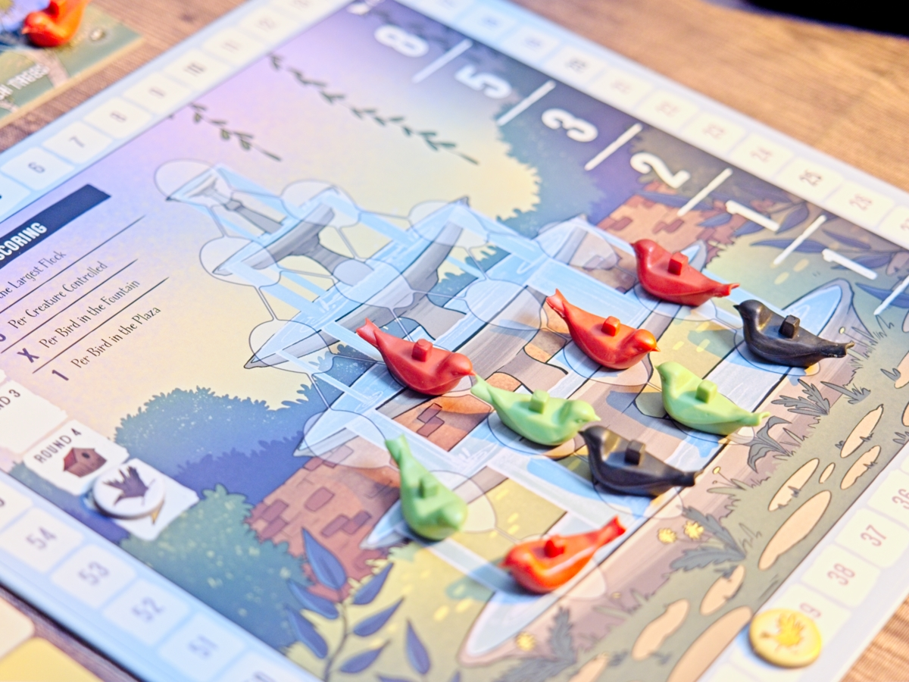
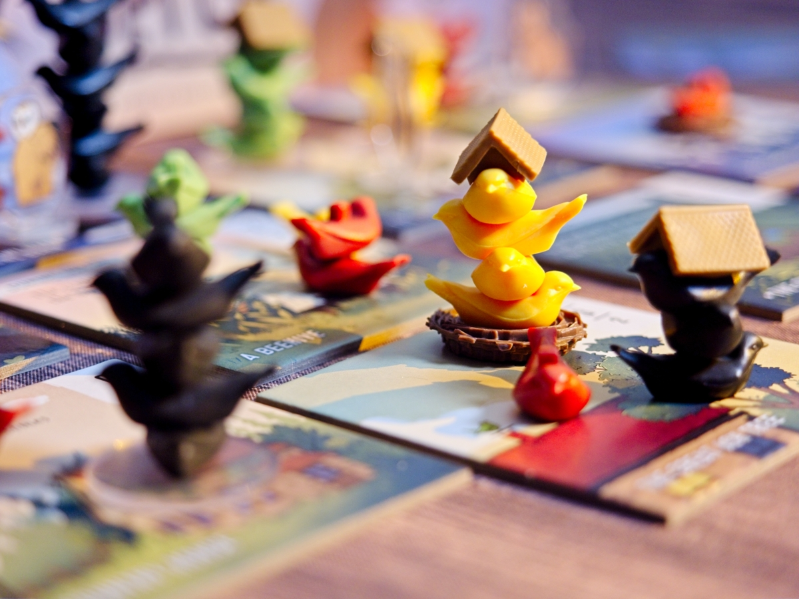
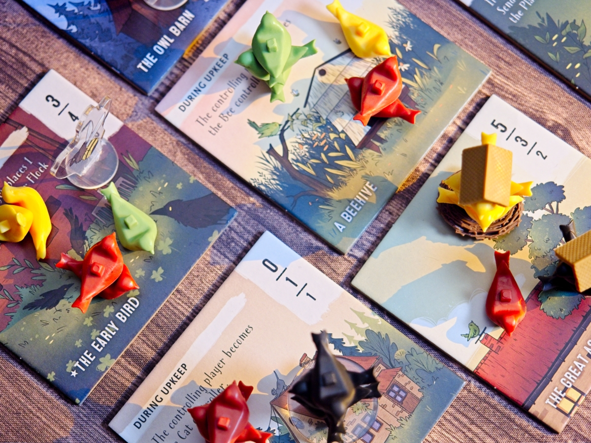
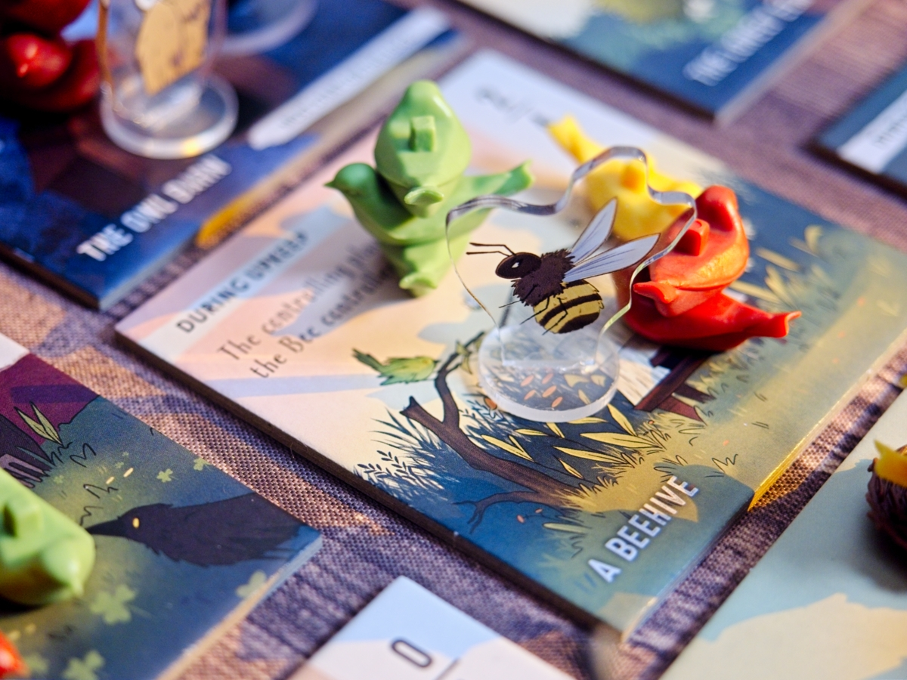

Perch เกมของสวยน่ารักว่าด้วยมวลหมู่นกในสวนหลังบ้าน แต่อย่าให้ภาพลวงตานี้หลอกคุณ เพราะนี้มันเกม 'คนจัญ' ที่ตัดกันเถื่อนกำหมัด เตือนแล้วนะ

ไอเดียหลักของเกมก็คือ Majority Control ทั่วไปนี้แหละ แต่จะสุ่มไทล์ออกมาแค่จำนวนหนึ่งต่อเกม ในแต่ละตาผู้เล่นจะได้รับนกสีของตัวเองไว้ 2 ตัว กับให้เอาของตัวเองอีกสองตัวไปใส่ถุงสุ่มแล้วเขย่าๆมาแจกกัน สรุปก็คือเราจะมีนกให้วางรอบละ 4 ตัว เป็นของเราแน่ๆครึ่งนึงอีกครึ่งก็แล้วแต่ดวง

ทีนี้ในตานึงเราก็แค่ผลัดกันเอานกที่อยู่ตรงหน้าเราไปวางในไทล์ทีละตัว วางครบทุกคนก็คิดคะแนนง่ายๆแค่นั้นเลย

แต่ความชั่วร้ายของเกมอยู่ในรายละเอียด..... ระบบคะแนนของเกมจะใช้ระบบว่าถ้ามีจำนวนนกเท่ากันในอันดับไหน อันดับนั้นไม่ต้องคิดคะแนน อย่างถ้าที่หนึ่งที่สองได้นกเท่ากันไอ้สองสีนั้นก็ไม่นับคะแนนใดๆ  แต่อันดับสามได้ตามปกติ แล้วถ้าคุณสังเกตจะพบว่าแต่ละคนมีนกจำนวนเท่ากันและมีจำนวนน้อยมากทำให้โอกาสที่มันจะเท่ากันเลยสูงเอามากๆ ยิ่งคุณได้รับโอกาสในวางนกสีคนอื่นด้วยยิ่งทำคุณสามารถสร้างสถานการณ์ขัดแต้มได้บ่อยจนน่าตกใจ นอกจากนี้เกมก็จะมีไทล์ที่แต่ละอันดับคะแนนไม่เรียงจากมากไปน้อย อย่างที่สองจะคะแนนมากกว่าที่หนึ่งอะไรแนวๆนั้น

พื้นที่ครึ่งหนึ่งจะไม่มีความสามารถพิเศษอะไร แต่อีกครึ่งจะเป็นแนวๆถ้าเป็น majority ตรงนี้จะได้สิทธิ์ในการควบคุมสัตว์พิเศษ (หมา, แมว, นกฮูก, เหยี่ยว , ผึ้ง ไรงี้ มีเยอะจัด) ที่ความสามารถหลักคือจะเดินไปมาแล้วไล่นกไปโน้นไปนี้ต่อ ทำให้การขยับนกในเกมนี้มัน chaotic เอามากๆ 

เกมเล่นแค่ 5 รอบจบก็จริง แต่จำนวนครั้งที่อยากหยุ่มหัวเพื่อนนี้มากกว่านั้นหลายเท่าอยู่

---
🐸 ME - #กบชอบ กติกาเรียบง่ายแต่ให้อารมณ์ของการปะทะกันที่ยุ่งเหยิงแต่มีการเจรจาด้วยตัวเลขระหว่างผู้เล่นที่สมเหตุสมผลดี (แม้ตอนทำแอคชั่นจะไม่ค่อยใช่ก็เถอะ!!) คือมันเป็นฌองที่ผมชอบอยู่แล้ว (ถ้าคุณคิดว่าคนเล่นยูโรมีแบบเดียวคือพวกงึมงำรำเชี้ยไรอยู่คนเดียวคุณคิดผิด! เกมมันต้องมีคนขยับแล้วมีคนร้องสิว่ะ!!!) 

ข้อพึ่งระวังก็น่าจะเป็นถ้ามองบางมุมเกมมัน dry กว่าที่ตาเห็นมาก ตัวเลขความคุ้มค่าเยอะแยะแต่ดันถูกมูฟคนอื่นขวางได้ง่ายมากๆ ถ้าเป็นคนไม่ชอบการเปลี่ยนแปลงแบบนี้หรืออ่อนไหวกับการถูกแกล้งก็ข้ามได้เลย เกมตัดกันเถื่อนแบบแห้งๆนี่แหละ

มีไม่ชอบเรื่องจุกจิกของ font บนไทล์กับการเรียบเรียงคู่มือนิดหน่อยแต่ค่อนข้าง minor

🔴 expert  | 🟠 regular | : เกม majority control กติกาเล่นง่าย วิธีคิดคะแนนจะตัดคนที่จำนวนเท่ากันให้ไม่ได้คะแนน เรามีสิทธิ์ในการวางคนงานสีคนอื่นด้วย เหมาะกับวงยูโรสายบวก

🟢casual/family | 🧸newbie : ในแง่กติกานั้นเล่นง่ายมาก แต่ mindset เกมมันชวนทะเลาะกันพอดูก่อนลองก็ระวังไว้นิสส์

---
> 🐸 ME - ความเห็นส่วนตัวสำหรับตัวเองเพื่อตัวเอง
> 🔴 expert - ผ่านเกมมาเยอะ อ่านเกมใหม่ตลอด
> 🟠 regular - เล่นบ่อยเล่นประจำออกตระเวนเล่น
> 🟢casual/family - เล่นที่ร้านเล่นหรือกับครอบครัว
> 🧸newbie - มือใหม่พึ่งเข้าวงการผ่านเกมตามร้านมานิดหน่อย
