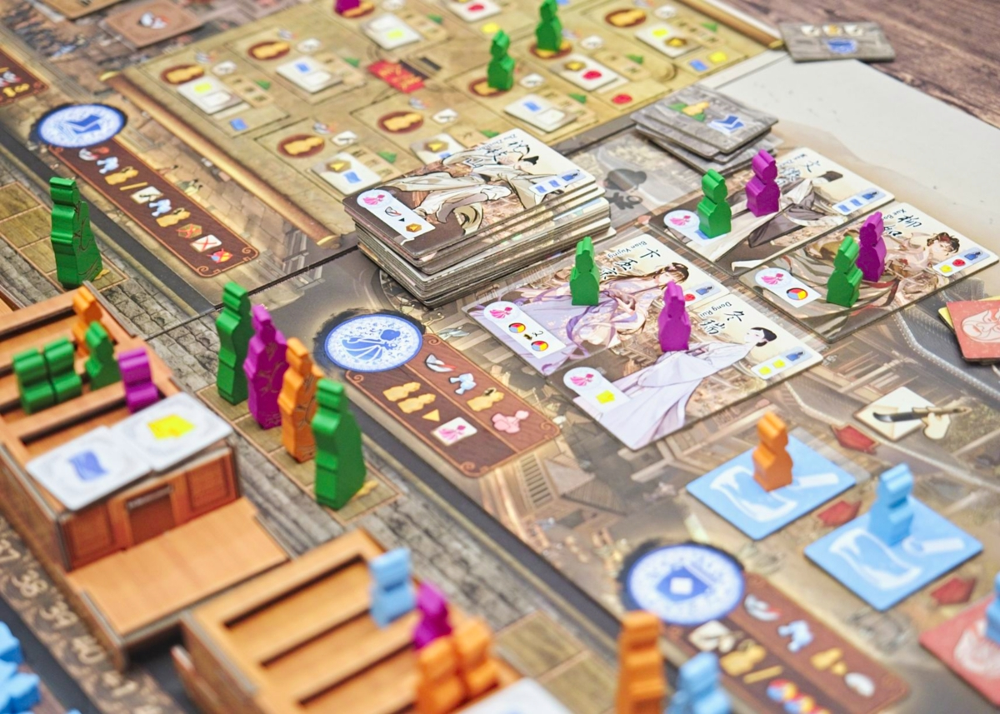
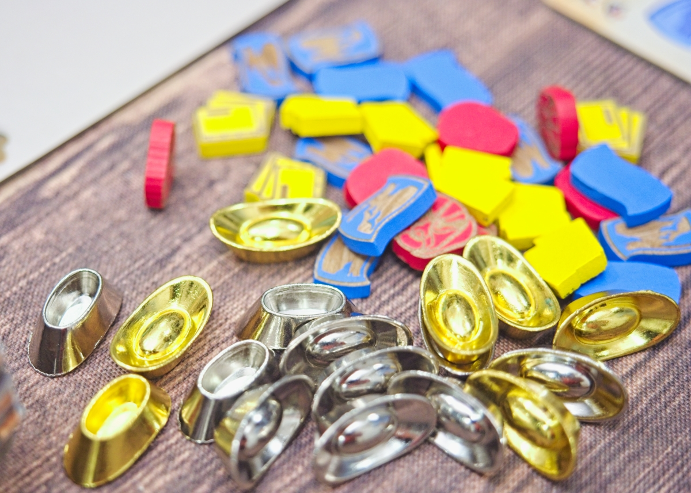
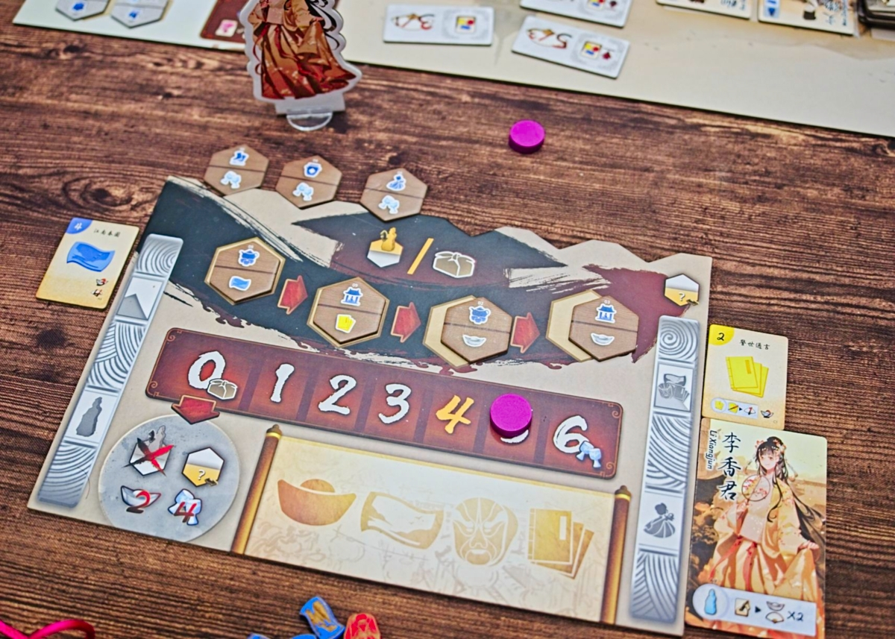

Jiangnan : Life of Gentry - เกม Worker Placement + Bag Building ที่จะให้เรารับบทเป็นผู้ดียุคราชวงศ์หมิงที่จะตามหาแรงแรงบันดาลใจในการผลิตงานของตัวเอง

ระบบหลักว่ากันง่ายๆก็ Worker Placement เก็บของแลกแต้มนั้นแหละ มีลูกเล่นเป็นของตัวเองพอควรเลยไม่ได้หยิบมาแลกให้จบๆไป แต่จุดที่น่าสนใจคือการทำแอคชั่นใดๆในเกมนั้นเราไม่สามารถส่งคนงานลงไปตรงๆได้ แต่เกมจะให้เราจั่วไทล์จากถุงที่บอกว่าเราจะทำแอคชั่นช่องไหนได้บ้างมาวางเรียงเป็นแถวตรงหน้าเรา พอถึงตาเราจะต้องเลือกหนึ่งไทล์อันไหนก็ได้เพื่อส่งคนงานลงไป แต่มันมีลูกเล่นซ้อนอีกชั้นว่านอกจากหยิบไทล์ทำแอคชั่นแล้วเราจะถูกบังคับให้ทิ้งไทล์ที่อยู่ด้านขวาสุดไปด้วยหนึ่งอัน แต่จะได้รับโบนัสประจำไทล์เป็นการตอบแทนมา

ความน่าสนใจของระบบนี้ก็เลยเป็นในช่วงแรกนั้นทุกคนมีจำนวนการทำชนิดแอคชั่นที่เท่ากันก็จริงแต่ว่าต้องมาบริหารการออกเอาหน้างานเพราะมันจั่วมา แถมบางทีก็จะมีจังหวะหยิบไทล์แล้วโดนบังคับทิ้งอันที่ไม่อยากทิ้งอะไรแบบนั้น แต่พอเล่นไปเรื่อยๆเราจะเริ่มได้สิทธิ์ในการเปลี่ยนไทล์ที่มีให้ดีและโฟกัสบางแอคชั่นได้มากขึ้น แต่เกมก็จะพยายามเกลี่ยๆให้เราเล่นทุกอันนั้นแหละ

อีกลูกเล่นแกนหลักที่น่าสนใจคือปกติเกมมันจะมีสุ่มหรือกำหนดพวกโบนัสคูณแต้มตอนจบมาให้ดูตอนเริ่มเกมใช่มะ? แต่เกมนี้ล้ำกว่านั้นเพราะใช้ระบบ majority ในการเลือกว่าหมวดไหนจะถูกคูณคะแนน

คือเกมนี้ช่องแอคชั่นมันจะวางต่อกันเป็นเส้นตรง แล้วมันก็จะมีส่วนของ 'เรือ' วางเรียงขนานกันอยู่เท่ากับจำนวนหมวดแอคชั่นนั้นแหละ บนเรือแต่ละลำจะมีไทล์ที่บอกว่าจะคูณแต้มหมวดไหนอยู่ 2 ชิ้น ตอนจบรอบใครลงคนงานในหมวดนั้นๆก็จะมีการเติมคนงานสีนั้นๆไปบนเรือ จากนั้นก็เลื่อนขบวนเรือไปข้างหน้า พอเรือลำไหนถึงปลายกระดานคนที่มีคนงานสีตัวเองเยอะสุดก็จะได้เป็นคนตัดสินใจว่าหมวดไหนในเรือลำนั้นจะถูกใช้ 

ตรงนี้มันเลยสนุกตรงต้องวางแผนเก็บของไปพร้อมๆกับค่อยๆปั้นสะสมคนงานในหมวดที่เราอยากให้มันคูณ ก็จะมีทั้งต้องมองเพื่อนประกอบกันด้วยว่าจะมาแย่งหรือมาร่วมคูณหมวดกับเรา

---
🐸 ME - #โอเค เอาจริงๆคือชอบเลยนะเกมนี้ แต่ส่วนตัวมันติดตรงแบบทำเกมไอเดียปั้นระบบคูณแต้มดีๆแบบนี้มาแล้วใส่ระบบ bag building ที่ทำให้เราควบคุมแอคชั่นที่อยากลงไม่ได้มาทำไมกันนะ? แบบแทนที่เราจะได้นั่งคิดดักทางแบบ worker placement คมๆว่าลงตรงนี้ดีไหมนะ เพื่อนจะแย่งหรือปล่าวช่องจะหมดแล้วววว กลายเป็นก็คิดแบบนั้นแหละแต่ไทล์มันไม่ออกทำไรได้อ่ะ ความชอบก็เลยดร๊อปลงจากตอนจะกดซื้อตั้งแต่ฟังกติกามาเหลือที่มีก็สนุกดีแต่ไม่มีก็ไม่เป็นไรแทน ซึ่งก็เสียดายอยู่เหมือนกัน

🔴 expert  | 🟠 regular | : Worker Placement + Bag Building ที่ระบบไม่ซับซ้อน ตอนเล่นต้องคิดปรับจังหวะตามหน้างานเยอะอยู่ ระบบ majority vote สำหรับหมวดคูณคะแนนก็สนุกดี

🟢casual/family | 🧸newbie : วิธีเล่นอาจจะเหมือนมีขยักลีลานิดหน่อย แต่เล่นตามไม่ยุ่งยากนะ ถ้าเคยเล่นเกมแนวๆนี้มาบ้างก็ไปต่อได้สบาย

---
> 🐸 ME - ความเห็นส่วนตัวสำหรับตัวเองเพื่อตัวเอง
> 🔴 expert - ผ่านเกมมาเยอะ อ่านเกมใหม่ตลอด
> 🟠 regular - เล่นบ่อยเล่นประจำออกตระเวนเล่น
> 🟢casual/family - เล่นที่ร้านเล่นหรือกับครอบครัว
> 🧸newbie - มือใหม่พึ่งเข้าวงการผ่านเกมตามร้านมานิดหน่อย
