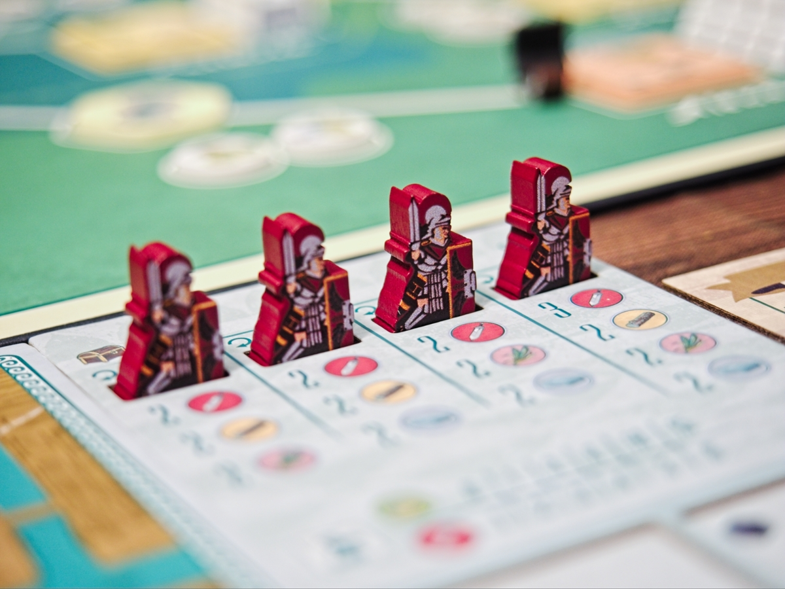
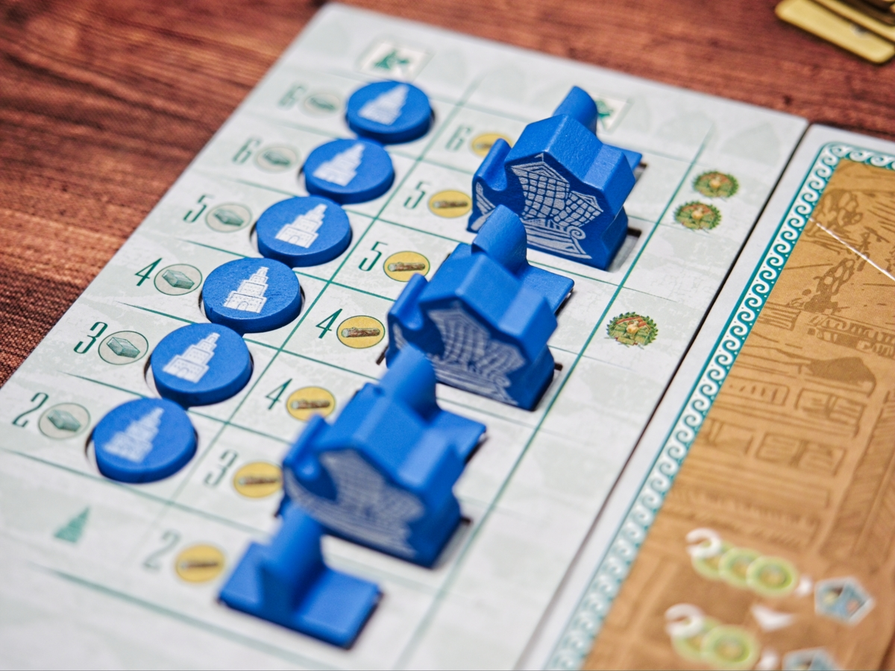
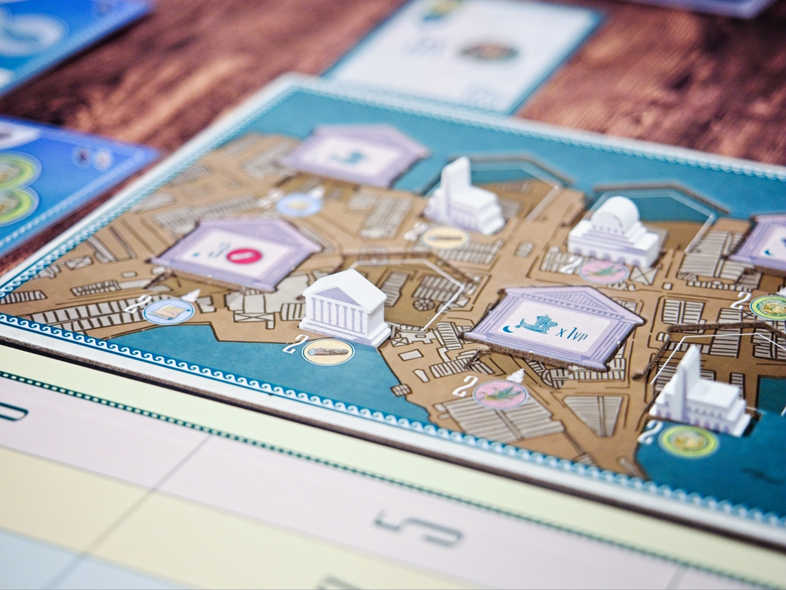
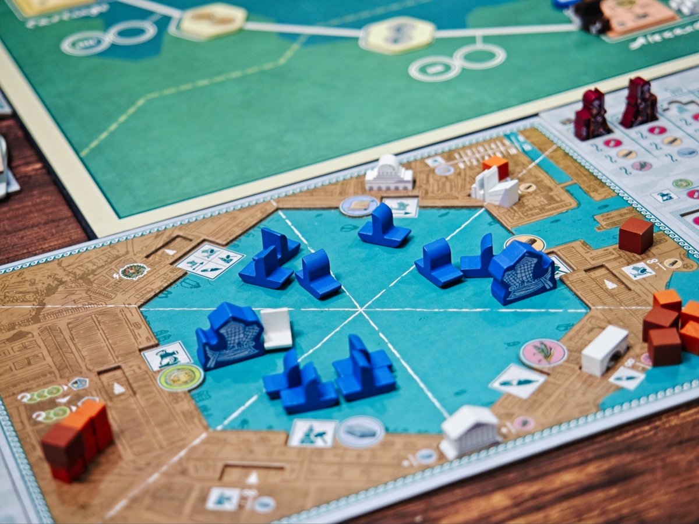
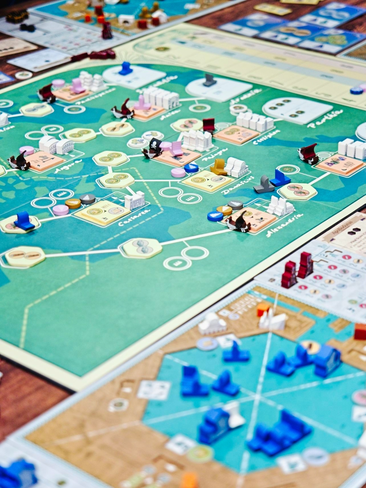

Ostia - เกมยูโรระดับกลางของสวย ธีมหลวมๆว่าด้วยการเดินทางไปทำการค้าในทะเลเมดิเตอร์เรเนียน

แกนหลักของเกมเดินด้วยระบบหมากหลุม ถ้าไม่รู้จักมันคือระบบที่ให้เราหยิบโทเคนทั้งกลุ่มมากำไว้แล้วก็ค่อยๆหยอดที่ละชิ้นไปข้างหน้าเรื่อยๆจนหมด เกมนี้ก็ใช้ระบบนี้แหละไปหยิบไปจบที่ช่องไหนก็ได้ทำแอคชั่นช่องนั้น แต่ส่วนที่เป็นทวิสสวยๆคือตอนจังหวะหยิบมันจะให้นับก่อนว่ามีโทเคนเรือกี่ชิ้นเราก็จะได้ทรัพยากรตรงกับช่องที่หยิบเท่านั้นชิ้น

คือในเชิงการออกแบบอุปกรณ์และระบบการเล่นมันฉลาดมาก ยกของตรงไหนได้ทรัพยากรนั้น แต่ถ้าเราอยากจะใช้ทรัพยากรนั้นๆไปทำแอคชั่นเราก็ต้องรอจนกว่าจะคำนวนแล้วหยอดวนกลับมาที่เดิมถึงจะได้ใช้ ทำให้จังหวะการทำแอคชั่นของเกมกระจายตัวได้สวยและสร้างความอึดอัดในการต้องคิดได้ดี อย่างถ้าเราอยากจะสร้างเรือเพิ่มต้องใช้ 3 ไม้ แปลว่าเราก็ต้องพยายามหยอดให้ช่องสร้างเรือมันมีเรือ 3 ลำก่อนเพื่อที่เวลายกไปทำแอคชั่นอื่นมันจะได้ผลิต 3 ไม้รอไว้

ไอเดียตอนเล่นจะมีเส้นทางการค้า 4 ทาง เราก็เดินเรือของเราแยกไป แต่ละจุดจะมีจุดท่าเรือให้เรามาสร้างตึกเพื่อเอาโบนัสพิเศษ ถ้าวิ่งไปจนสุดทางก็เพิ่มตัวคูณ ระหว่างทางก็มีแอคชั่นเก็บโน้นนี้สะสมทำคะแนนไปตามเรื่อง

ความดีงามของเกมนี้คือตัดจบแบบโหดร้าย คือทริคเกอร์แล้วจบนับคะแนนเลยไม่มีรอบแถม แล้วมันทริคเกอร์กันง่ายมาก ทำให้บรรยากาศมีความมองหน้าว่าอีกฝ่ายเริ่มจะคูณเยอะยังแล้วยังแข่งไหวไหม ตัดจบเลยดีปล่าวว่ะอยู่ตลอด ใครทำไม่ทันก็โอดโอยกันไป

ถ้าไม่มีตัวเสริมเกมก็ค่อนข้างเบสิคใสๆวิ่งแข่งปรู๊ดจบเกม แต่พอมีตัวเสริมครบก็มีโมดูลที่ทำให้มีบอดี้เยอะขึ้นจนเกือบจะกลายเป็นกลางหนัก ทั้งทรัพยากรตอนเริ่มที่เปลี่ยนไปกับวิธีทำแต้มใหม่ โดยเฉพาะตัวเสริม Pirates ที่สร้างตัวเบรคระหว่างทางในการเดินเรือที่ทำให้ผู้เล่นต้องเพิ่มจังหวะฟาร์มของมากขึ้นโดยที่ไม่ทำให้เกมรู้สึกลีลาเพราะว่ามันเพิ่มทางทำแต้มมาด้วย

---
🐸 ME - #กบโอเค ว่ากันตามตรงผมเป็นคนที่ไม่ได้ชอบเกมที่ใช้ระบบมาคาล่าซักเท่าไร ซึ่งไม่ใช่มันไม่ดีแต่ว่ามันเปิดโอกาสให้ผู้เล่นจมดิ่งอยู่กับความคิดของตัวเองเยอะมากจนรอนาน เกมนี้ก็ไม่พ้นลักษณะพิเศษนี้ (รอนาน) แต่ด้วยข้อดีของมันคือการลีนระบบให้วนอยู่แค่กับการทำแอคชั่นของตัวเองเพื่อทำการ racing เดินเรือกับพัฒนาบอร์ดกลางที่ให้มิติของการมีส่วนร่วมกันอยู่ แล้วก็ตัดฉับได้แบบปวดใจถ้าแข่งไม่ทันก็เลยทำให้ผู้เล่นรู้สึกไม่งึมงำเกินไปตรงนี้เลยคิดว่าทำมาได้ดีขี้นนะ แต่เกมก็ยังอยู่ในหมวดงึมงำอยู่ดีเพราะงั้นคงชอบที่ซักสามคนมากกว่า แบบบางแอคชั่นก็คืออยากทำอะไรก็ทำไปนะขอฉันทำแอคชั่นตัวเองเลยละกัน

🔴 expert  | 🟠 regular | : เกมยูโรระดับกลางของสวยกติกาคลีน ถ้าเล่นแค่ตัวหลักจะเป็นเกมเล่นกับตัวเองปั่นแอคชั่นเพื่อวิ่งแข่งเข้าเส้นชัย แต่ถ้าใส่ตัวเสริมเกมจะมีขยักบล็อกให้เกมช้าลงและต้องวนเก็บทรัพยากรทำเอนจิ้นมากขึ้น

🟢casual/family | 🧸newbie : ระบบเกมแม้จะมีรูปแบบที่ต้องศึกษาเพื่อทำคะแนนให้ดี แต่วิธีเล่นให้เป็นนั้นไม่ยุ่งยากจนเกินไปแค่ หยิบ--หยอด-ทำแอคชั่น

---
> 🐸 ME - ความเห็นส่วนตัวสำหรับตัวเองเพื่อตัวเอง
> 🔴 expert - ผ่านเกมมาเยอะ อ่านเกมใหม่ตลอด
> 🟠 regular - เล่นบ่อยเล่นประจำออกตระเวนเล่น
> 🟢casual/family - เล่นที่ร้านเล่นหรือกับครอบครัว
> 🧸newbie - มือใหม่พึ่งเข้าวงการผ่านเกมตามร้านมานิดหน่อย
