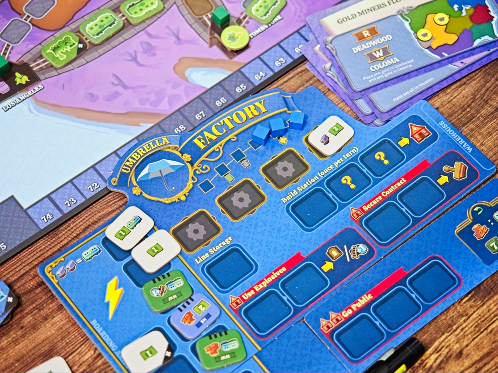
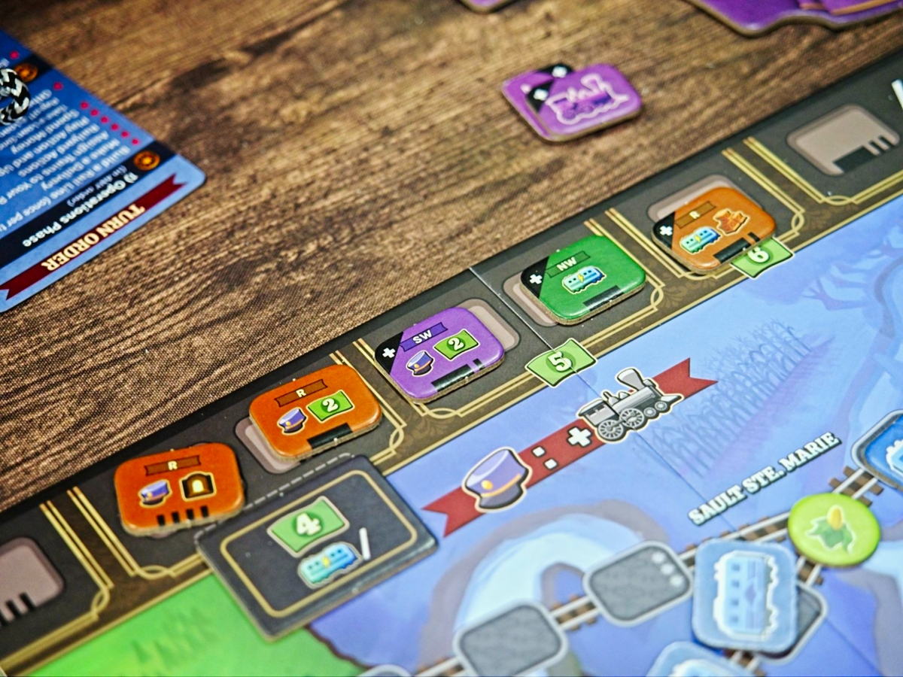
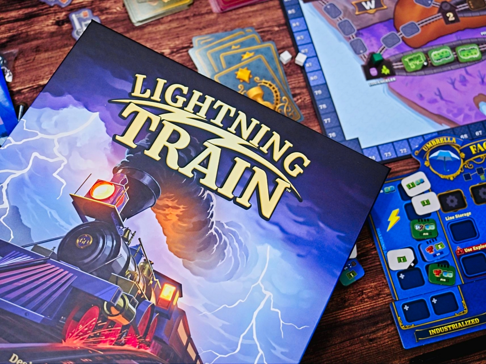

Lightning Train - เกมยูโรระดับกลางจากผู้สร้าง Crank! และ Dune: Imperium ที่รอบนี้เค้าจะเอาระบบ deck/bag building สุดถนัดมาให้เราแข่งกันกันสร้างรางรถไฟทั่วอเมริกา

ในเกมจะมีไทล์ที่ไอคอนแตกต่างกันโดยหลักๆเราจะพยายามสะสมตัวไทล์รถไฟเอาไว้เคลมเส้นทาง  (อารมณ์ Ticket To Ride น่ะ) แต่เกมเพิ่มไอเดียว่าเราสามารถเอาสร้างเมืองได้ด้วย ตัวเมืองก็จะมีความต้องการสินค้าที่ถ้าเรามีไอคอนส่งของก็สามารถหยิบสินค้ามาส่งได้ด้วยก็ได้แต้มไปตามเรื่อง แต่ว่าสินค้าในเกมมันจะค่อยๆโผล่มาแบบสุ่มทำให้ต้องปรับแผนตามหน้างานกันหน่อย

ระหว่างเล่นเราจะซื้อไทล์มาเติมในถุงได้เรื่อยๆความสามารถก็ว่ากันไป ระบบที่น่าสนใจคือตัวไทล์มันมีราคาเริ่มต้นอยู่แล้วจะค่อยๆถูกลงเรื่อยๆ ข้อดีคือลดดวงเวลาไทล์แรงๆมันออกมาแล้วคนแย่งซื้อไปจะได้เปรียบ กับเกมจะเน้นไอเดียเรื่องสิทธิ์ในการสร้างบนพื้นที่ต่างๆ ที่ทำให้การจะสร้างของบนพื้นที่โซนต่างๆนอกจากจะมีจำนวนรถไฟแล้วเราก็ต้องจั่วไทล์ที่เป็นสิทธิ์ในพื้นที่ด้วย กับระบบที่เราสามารถพักไทล์รถไฟเก็บไว้บนแอคชั่นที่อยากทำทิ้งไว้ก่อนได้ เผื่อรอบนี้ยังไม่พร้อมใช้ทำแอคชั่น

ซึ่งยิ่งเล่นไทล์ในถุงเราก็จะเริ่มแรงขึ้นก็วนๆทำ engine ไปจนเราต่อรางเชื่อมชายฝั่งตะวันออกและตะวันตกของอเมริกาได้สำเร็จ

---
🐸 ME - #กบเฉย ตอนอ่านรูลไม่แน่ใจ ตอนเรียงเสร็จแล้วสอนเพื่อนก็รู้เลยว่าไม่ใช่แนว.... คือมันเป็นเกมที่ใช้โครงจากเกมครอบครัว (Ticket To Ride) มาใส่วิธีเดินเกมแบบเกมเมอร์จ๋าหน่อย (Bag Building) ที่พอเล่นแล้วทำเกมมันแบบ ซับซ้อนเกินเกมครอบครัว แต่กันไม่ได้สนุกคุ้มกับความจุกจิกและวิธีคิดแบบเกมใช้ความคิดเท่าไร อยากจะวางรางเหรอ อ้าววว จั่วไม่ครบหว่ะโทดทีว่าวไปนะ ถึงจะบอกว่าให้อัพเกรดรอไปได้ก็เถอะ แต่ความสุ่มและการบริหารความเสี่ยงเพื่อวางรางแบบ Ticket To Ride อ่ะนะ? ทำไมเราต้องแทนที่การจั่วสีที่ทำแค่นั้นก็สนุกฉิบหายแล้วด้วยระบบ bag building ล่ะ?

พ่วงกับเอกลักษณ์ของระบบ bag building คือเกมมันงึมงำกับตัวเองเยอะ ถึงการที่ทุกคนจะต้องมาแย่งของกันในกระดานกลางที่นักออกแบบทำมาได้ดีใน Crank! กับ Dune แต่ เอ๊ะผมก็รำคาญการรอใน Crank! เหมือนกันนิหว่า.... เอาเป็นว่าถ้าไม่มีปัญหากับระบบ bag builder (ผมพบว่าคนจำนวนมากแบบมากจริงๆ ชอบระบบนี้ คือผมเป็นส่วนน้อยอ่ะนะ) เกมนี้อาจจะเป็น Ticket To Ride Level Up สำหรับหลายๆคนก็ได้

🔴 expert  | 🟠 regular | : Crank! but with Ticket To Ride map ถ้าชอบการจัดและลีน deck พร้อมกับแข่งกันเคลมของก็ลองเกมนี้ได้

🟢casual/family | 🧸newbie :  มีกติกาและลูกเล่นที่จุกจิกไปซักนิด แต่ถ้าผ่านรอบแรกไปก็จะสนุกกับเกมได้ละ ระบบไม่ได้ยุ่งยากแค่ผสมมาหลากหลายแล้วแอบ abstract อยู่พอตัว

---
> 🐸 ME - ความเห็นส่วนตัวสำหรับตัวเองเพื่อตัวเอง
> 🔴 expert - ผ่านเกมมาเยอะ อ่านเกมใหม่ตลอด
> 🟠 regular - เล่นบ่อยเล่นประจำออกตระเวนเล่น
> 🟢casual/family - เล่นที่ร้านเล่นหรือกับครอบครัว
> 🧸newbie - มือใหม่พึ่งเข้าวงการผ่านเกมตามร้านมานิดหน่อย
