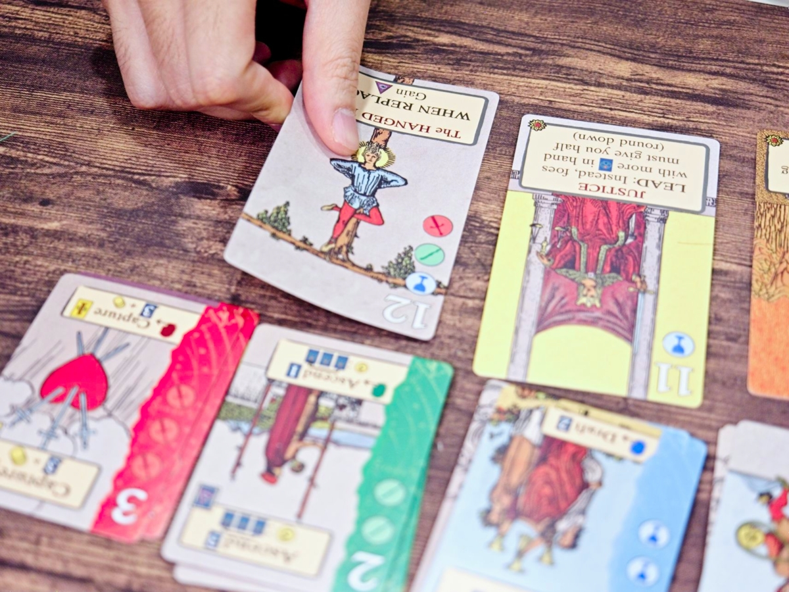
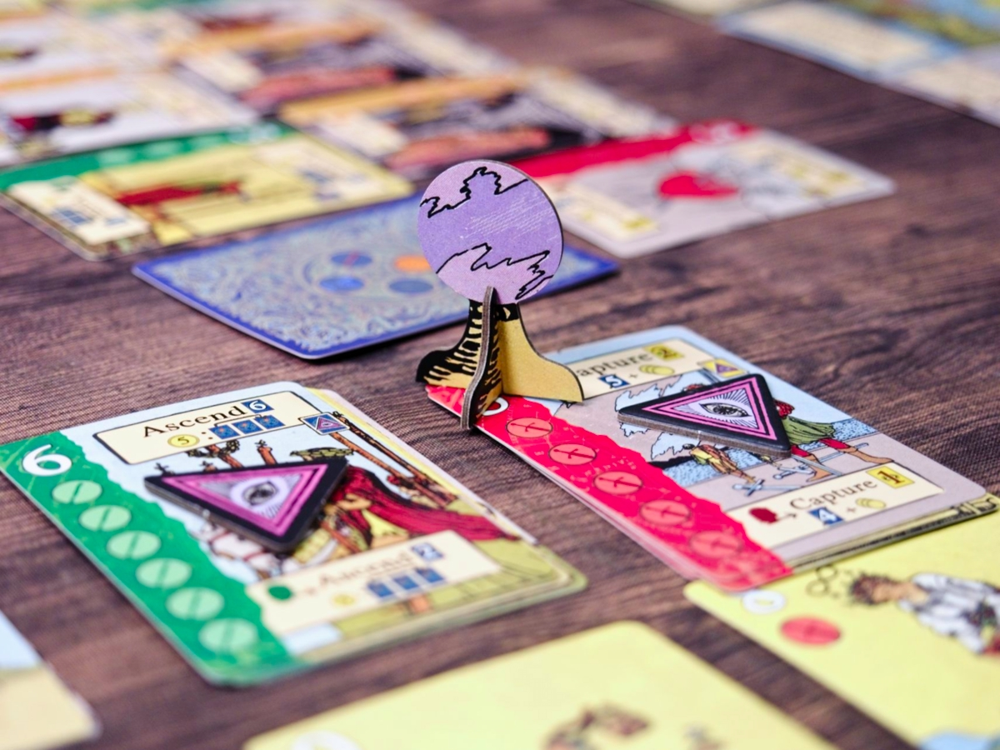
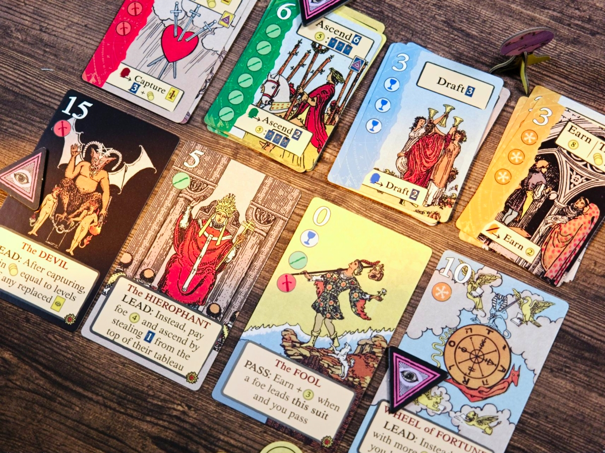

Soothsayers - เห้ยไพ่ทาโรต์มันไม่ได้เอาไว้แค่ดูดวงแต่มันสามารถ 'ถูกจับ' มาเสริมพลังเพื่อการควบคุมโชคชะตาได้นะเว้ย!!

ไอเดียหลักของเกมคือผู้เล่นจะต้องแข่งกันเคลมป้าย Fate ผ่านวิธีหลักคือมีเลขประจำ Suit สูงที่สุดถึงจำนวนที่กำหนดก่อน โดยจะเล่นกันผ่านระบบ Lead & Follow ผ่าน engine ของตัวเอง

ทั้งเกมในตาหนึ่งมีให้ทำแค่ 4 อย่าง อย่างแรกคือจั่วการ์ดจากกองกลาง , เอาการ์ดที่เก็บไว้มาเล่นซึ่งมันก็คือการ์ด 4 ชนิดแบบเดียวกับที่เรามีนั้นแหละแต่เบอร์มันสูงกว่าความสามารถก็แรงขึ้น เวลาลงอัพเกรดก็ต้องไล่เบอร์ขึ้นไป (แต่จ่ายเงินเพื่อข้ามสเต็ปได้) ถ้าเราลงแล้วเลขใหญ่สุดเราก็จะได้แย่งป้าย Fate มาวางไว้ ซึ่งการ์ดที่เราหยิบมาเล่นหมวดนี้จะเป็นพวก Minor Arcana แต่มีแค่เลข 1-6

นอกจากนั้นเกมจะให้เราแลกไพ่ที่เราเก็บไว้กับเงินมาทิ้งเพื่อทำการ 'จับ' การ์ด Major Arcana ที่มีความสามารถพิเศษโดยเราจะเก็บไว้ได้แค่ 4 ใบ ส่วนมากก็จะเอาไว้เสริมพลังใหักับการ์ดหลักใน Suit นั้นๆแหละ แล้วก็ด้วยความที่มีเลขกำกับก็แปลว่ามันเอาไว้วัดพลังแย่งชิง Fate ด้วย แอคชั่นสุดท้ายคือการได้เงิน ซึ่งมันใช้หลากหลายอยู่ 

ระบบ follow ของเกมตัวการ์ดที่เรามีจะกำหนดไว้ว่าเราทำอะไรได้แค่ไหน ถ้าเรา follow แล้วมีเลขที่สูงหรือเท่ากันเราจะได้ follow ฟรี แต่ถ้าเลขต่ำกว่าเราจะต้องจ่ายเงินส่วนต่างให้คนนำ แต่ถ้าเลือกไม่ทำตามเราก็จะได้เงินมาเก็บไว้แทน นอกจากนั้นก็มีเอาตังไปซื้อ fate ไม่ก็ใช้ effect ของ Major Arcana ก็ได้

---
🐸 ME - #กบชอบ สารภาพว่าซื้อมาเพราะคิดว่าอาร์ทมันแปลกดีเอาลายไพ่ทาโรต์มาใช้เลยจะเป็นยังไงกันนะ สำหรับเกมระดับ 30-45 นาทีแล้วผมชอบในไดนามิของการ Lead & Follow ที่ต้องคอยมองว่าคนอื่นจั่วอะไร เราอยากจะแข่งแต้มเพื่อแย่ง Fate ไหม กับมันมีความชี้ๆให้เพื่อนช่วยกันรุมแย่งคนนำ ซึ่งก็สนุกดี 

ถ้าเรียกว่ามันให้อารมณ์ Glory To Rome แบบ Tiny มากๆก็พอได้แหละ ตัวการ์ด effect แม้จะดูตายตัวแต่ effect มันก็มี depth ในการตัดสินใจอยู่ หลายครั้งก็ต้องเลือกระหว่าง effect หรือรีบเอาเลขมาเพื่อเคลม Fate ไรงี้ ก็น่าจะเป็น filler ที่ได้หยิบมากางบ่อยหน่อย แต่ก็มีข้อเสียจุกจิกนิดหน่อยตรงคนในวงต้องสนใจเกมจริงๆเพราะเวลาพูด Lead กับเลข คนเลขน้อยก็ต้องพร้อมบวกเลขแล้วจ่ายทันทีไม่ใช่มานั่งถามเลขให้เกมสะดุดไรงี้

🔴 expert  | 🟠 regular | : การ์ดเกม Lead & Follow ระบบหลักมีแค่ 4 แอคชั่นให้ทำเน้น Racing สะสมป้ายคะแนนที่สามารถถูกชิงไปได้ง่ายๆ

🟢casual/family | 🧸newbie : ระบบหลักเข้าใจตามได้ไม่ยาก แต่ด้วยความที่มันมี effect สไตล์การ์ดเกมก็อาจจะต้องใช้เวลาในการเรียนรู้จังหวะในการเลือกแข่งนิดหน่อย

---
> 🐸 ME - ความเห็นส่วนตัวสำหรับตัวเองเพื่อตัวเอง
> 🔴 expert - ผ่านเกมมาเยอะ อ่านเกมใหม่ตลอด
> 🟠 regular - เล่นบ่อยเล่นประจำออกตระเวนเล่น
> 🟢casual/family - เล่นที่ร้านเล่นหรือกับครอบครัว
> 🧸newbie - มือใหม่พึ่งเข้าวงการผ่านเกมตามร้านมานิดหน่อย

เดี๋ยวนี้เปิดระบบสมาชิกละครับ ซึ่งก็ว่ากันตรงๆว่าไม่มีสิทธิ์พิเศษอะไร แต่สำหรับคนอยากสนับสนุนค่ากาแฟและอาหารแมวให้กำลังใจครับ - https://www.facebook.com/boardnbon/subscribe/