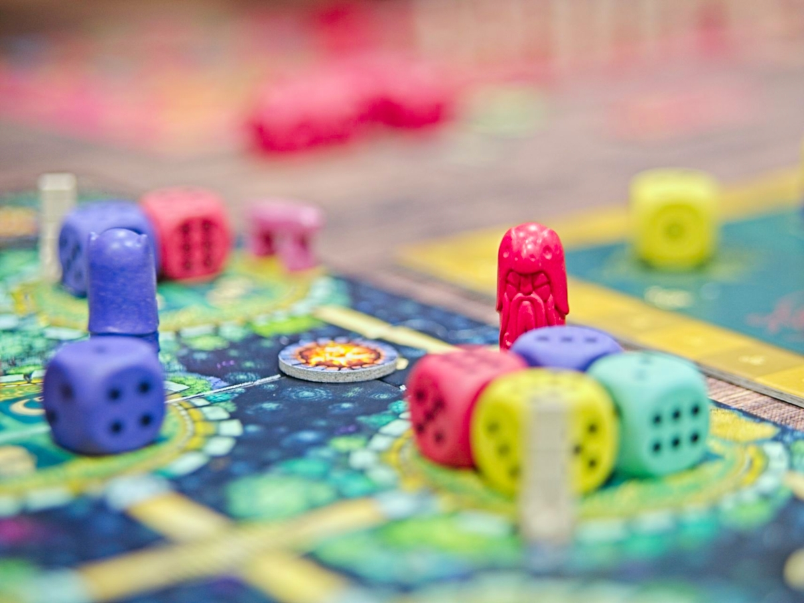
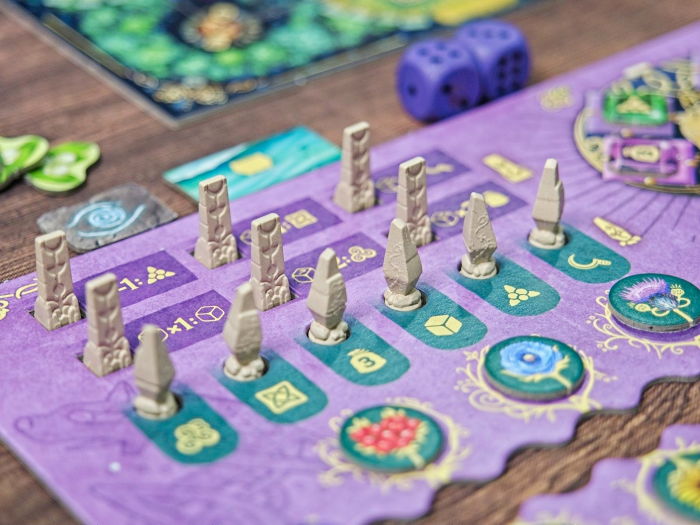
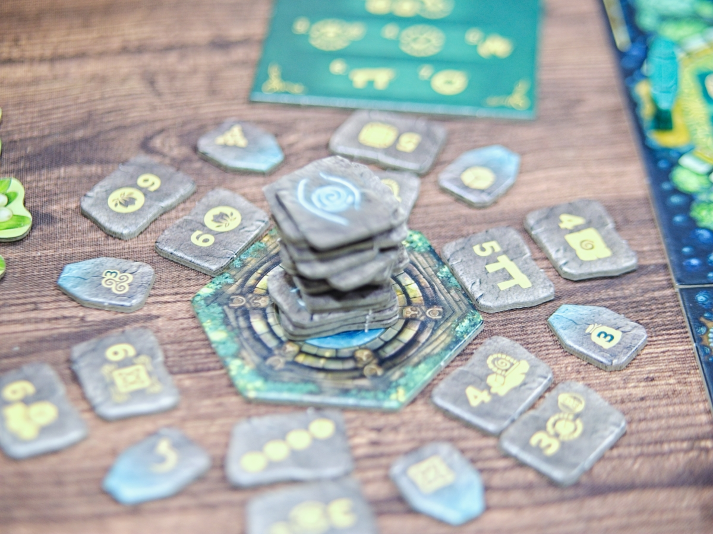
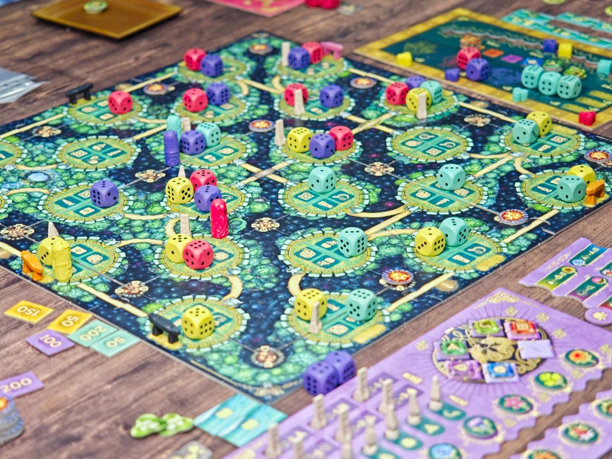

The Druids of Edora - เกมยูโรจากนักออกแบบเจ้าแห่ง Point Salad มาในธีมการเดินทางไปยังเหล่าวิหารโบราณที่อยู่ลึกในกลางป่าของกลุ่มผู้รู้แห่งพงไพร

ไอเดียหลักของเกมคือแผนที่ที่พอสุ่มออกมาแล้วจะเป็นถนนที่เดินวกไปวนมาอยู่ในป่า ถนนแต่ละเส้นก็จะมีจุดให้หยุดพักเป็นวิหารกลางป่ากระจายอยู่ทั่วแผนที่ ในตาหนึ่งของเกมมีสิ่งที่ให้ทำอยู่เพียงอย่างเดียวนั้นคือขยับเดินตัวดรูอิทที่มีเพียงตัวเดียวของเราเดินไปตามเส้นทางและเมื่อหยุดก็ให้เราเอาลูกเต๋าไปวางที่หนึ่งในสี่ช่องที่ยังเหลืออยู่และทำแอคชั่นประจำช่อง เล่นวนแบบนี้แค่ 12 รอบก็จบเกม

ความข้นทางการตัดสินใจของเกมจะมาจากช่องทำแอคชั่นตามรายทางและการที่เราต้องจ่ายอาหารในการเดิน ยิ่งเดินไกลยิ่งจ่ายเยอะ และการวางลูกเต๋าในเกมนั้นก็ต้องจ่ายอาหารเพิ่มตามเลขหน้าลูกเต๋าที่ถูกสุ่มมาตั้งแต่ต้นเกมอีก ทำให้ตอนเล่นต้องบริหารในเรื่องจังหวะการปลดลูกเต๋ามาใช้เพิ่ม (เพราะเริ่มเกมมีให้นิดเดียว) ผสมกับการหาอาหารมาจ่าย ตามด้วยการออกท่าเดินแทรคปลดล็อกพลังและแย่งกันเคลมโบนัส

แม้ไอเดียเกมจะดูเหมือนกับคิดทางเดินล่วงหน้าได้เกือบจบ แต่ตอนเล่นจริงช่องที่หายไปจากที่ที่มีคนเดินมาก่อน การทำแต้มจากการเอาเลขเต๋าที่เหนือกว่าไปวางเพื่อตัดสินแต้ม majority ที่จะไปคูณแต้มตอนจบเกม แล้วก็การทำคะแนนจากการเดินเชื่อมทางและโบนัสจากการวางล้อมกองไฟท่ามกลางเส้นทางที่ยุ่งเหยิงก็ทำให้เกมเดินตามทางที่ดูเรียบง่ายกลับมีไดนามิคระหว่างผู้เล่นได้อย่างน่าสนใจ

---
🐸 ME - #กบชอบ ยกให้เกมนี้เป็นเกมอันดับ 4 ที่ชอบของ Stanfan Feld เลย (ต่อจาก the castles of burgundy / bora bora / luna) ชอบในจุดที่แม้จะเป็นเกมที่เราวางแผน route ทางเดินคร่าวๆได้ตั้งแต่ต้นจนจบในใจแล้ว แต่ในจังหวะการคลายปมที่คิดไว้การเดินมาทับเส้นของเพื่อนก็ทำให้เราจิ๊ปากได้อยู่เสมอ ไม่ว่าแอคชั่นจะหายหรือโดนแย่งไทล์ที่อยากได้ก็ทำให้ต้องปรับแผนอยู่เรื่อยๆ

ส่วนที่อาจจะไม่ถูกใจนิดหน่อยจะออกไปในทางเกมมันเอืัอให้ AP อยู่เหมือนกันถ้าอยู่ผิดวง ก็เพราะด้วยความที่มันคำนวน (และต้องคำนวน) อะไรได้เกือบหมดรวมไปถึงว่าจะปลดอะไรไปเดินอะไร ก็อาจจะทำให้เกมมันนานกว่าที่ผมชอบไป ในแง่ scale ก็คิดว่าต้อง 4 แหละให้มันเดินเกะกะตัดกัน แต่ถ้าได้วงคิดไวก็ค่อนข้าง happy เลย

ขอบคุณลุงสเตฟานที่ยังไม่ขายวิญญาณไปจนหมดกับเกมซี่รีย์เมืองของค่าย Queen Games

🔴 expert  | 🟠 regular | : เกมระดับกลางที่ควรค่าแก่การมาแวะเล่นของ Stefan Feld  เกมมีแค่ เดิน+วางเต๋าทำแอคชั่นจากนั้นก็ปลดล็อกโน้นนี้ทำคะแนน ทำ balance ระหว่างคิดท่าส่วนตัวกับการจิ๊ปากเวลาโดนเพื่อนแย่งของที่อยากได้ค่อนข้างดี

🟢casual/family | 🧸newbie : วิธีการเล่นหลักเรียบง่าย แต่เป็นเกมที่ต้องทนนั่งฟังลูกเล่นการเคลมของและเดินแทรคคูณแต้มในการเรียนรู้ครั้งแรกเยอะอยู่สำหรับมือใหม่ ตัวเลือกก็ค่อนข้างหลากหลายอยู่

---
> 🐸 ME - ความเห็นส่วนตัวสำหรับตัวเองเพื่อตัวเอง
> 🔴 expert - ผ่านเกมมาเยอะ อ่านเกมใหม่ตลอด
> 🟠 regular - เล่นบ่อยเล่นประจำออกตระเวนเล่น
> 🟢casual/family - เล่นที่ร้านเล่นหรือกับครอบครัว
> 🧸newbie - มือใหม่พึ่งเข้าวงการผ่านเกมตามร้านมานิดหน่อย

---  

เดี๋ยวนี้เปิดระบบสมาชิกละครับ ซึ่งก็ว่ากันตรงๆว่าไม่มีสิทธิ์พิเศษอะไร แต่สำหรับคนอยากสนับสนุนค่ากาแฟและอาหารแมวให้กำลังใจครับ - https://www.facebook.com/boardnbon/subscribe/