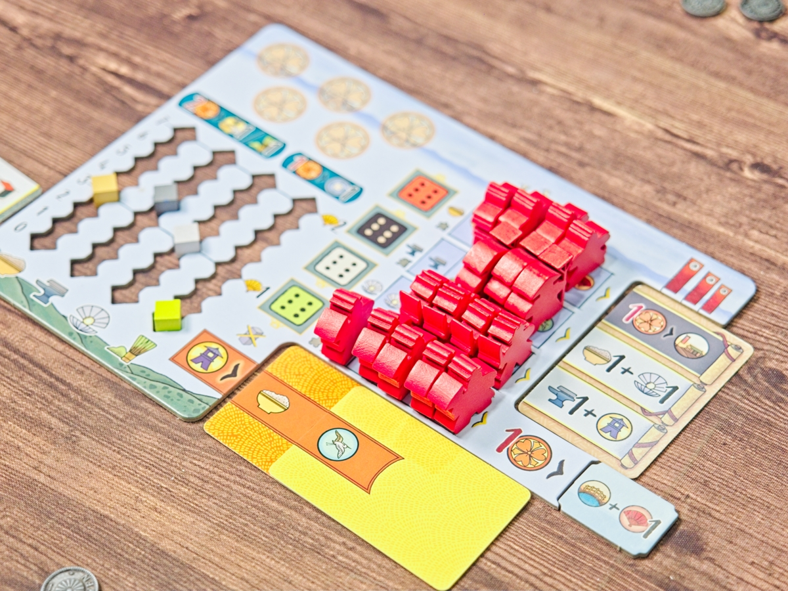
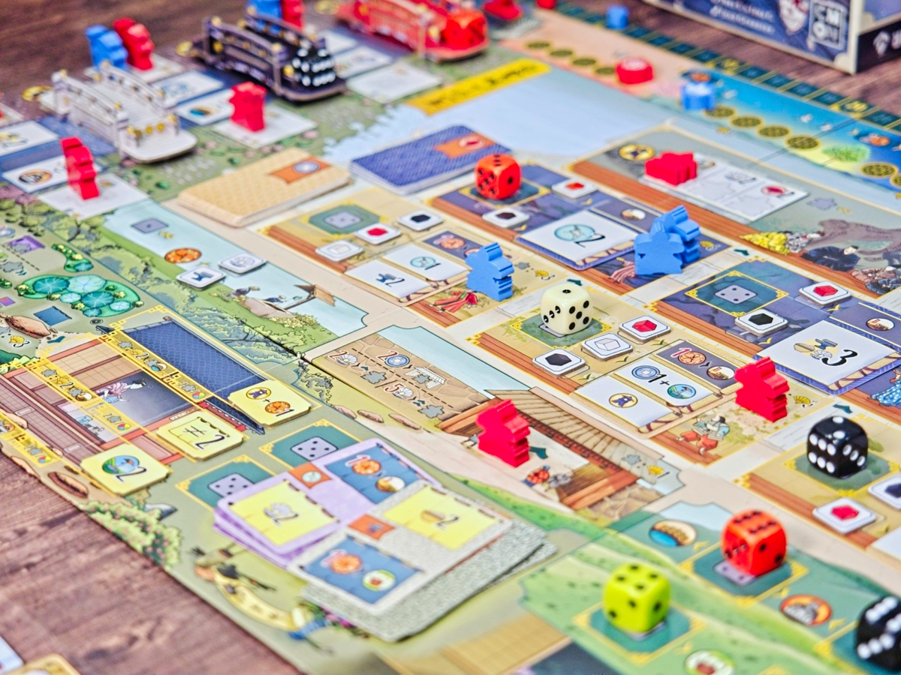
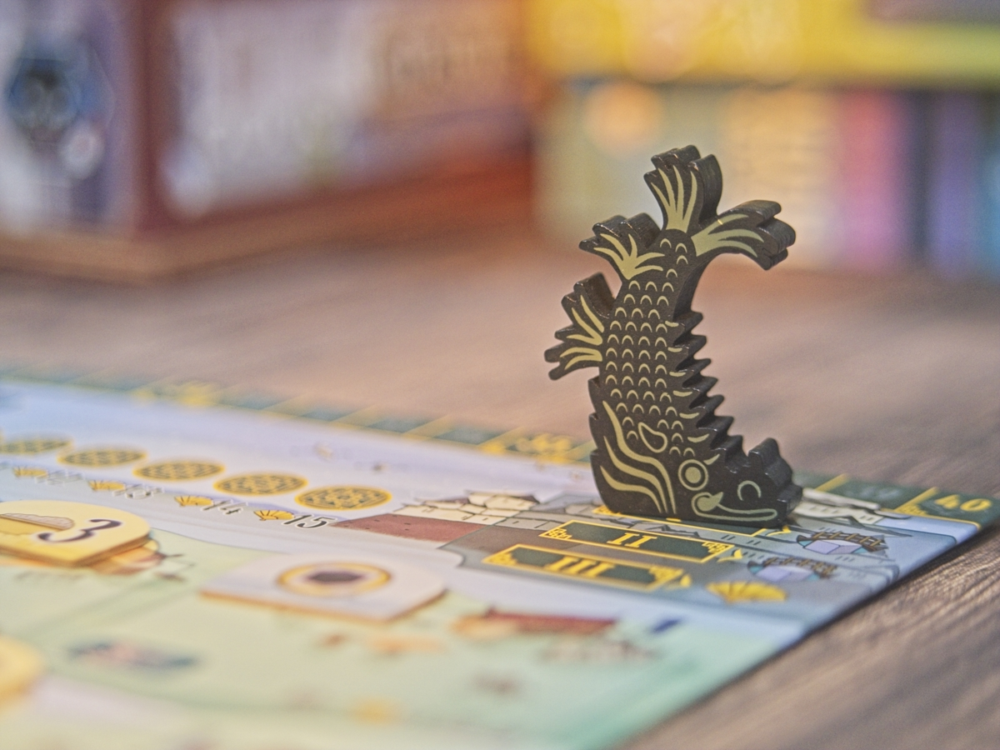

The White Castle - ประสาทกระสาขาวเล่าถึงทิวทัศและชีวิตของชาวญี่ปุ่นในพื้นที่ปราสาทผ่านระบบ Dice Drafting ที่มีเอกลักษณ์ของลูกเล่นเป็นของตัวเองสูง 

เกมแบ่งลูกเต๋าอีกเป็น 3 สี (4 สีถ้าใส่ตัวเสริม Matcha Expansion) ในแต่ละสีเวลาทอยออกมาแล้วจะถูกนำมาเรียงน้อยไปมาก เวลาหยิบเราจะหยิบได้แค่จากหัวหรือท้ายแถวเท่านั้น กิมมิคในการทำแอคชั่นคือช่องที่เราเอาไปวางถ้าเลขมากกว่าเต๋าที่มีอยู่ก่อนหน้าเราจะได้เงินส่วนต่าง แต่ในทางกลับกันถ้าเลขเราน้อยกว่าก็จะต้องจ่ายเงินแทน

แต่ละช่องเนี่ยลงได้แค่ 2 ลูกเต๋า (1 ถ้าเล่นสองคน) ทีนี้กิมมิคเรื่องสีคือในหลายๆช่องแอคชั่นมันจะเปลี่ยนของที่ทำได้ไปเรื่อยขึ้นอยู่กับการ์ดที่จั่วมา แล้วตัวการ์ดมันจะให้ผลต่างกันขึ้นอยู่สีของเต๋าที่เอามาลง แล้วตัวการ์ดเนี่ยเล่นๆไปก็อาจจะโดนผู้เล่นเปลี่ยนได้อีก เกมเลยค่อนข้างไดนามิคเยอะเพราะช่องที่ทำแอคชั่นได้มันดันไม่อยู่ที่เดิมตลอด

ส่วนที่น่าสนใจจริงๆของเกมจะอยู่ในการทำ engine ที่มาได้หลายทางมาก หนึ่งในการเล่นคือบอร์ดเราจะมีคนงานอยู่ 3 ชนิด (4 ถ้าใส่ตัวเสริม) เวลาเราทำแอคชั่นเราก็จะส่งคนงานไปตามพื้นที่ต่างๆของเกมมีคะแนนกับโบนัสไปตามเรื่อง แต่ทุกครั้งที่หยิบออกมันจะเปิดช่องโบนัสในกับเรา ทำให้เวลาเราหยิบเต๋ามาทำแอคชั่นส่วนตัวเราจะได้ของมาเยอะขึ้น รวมไปถึงแอคชั่นก็เปลี่ยนไปได้อีกจากการไปฉกมาจากกระดานกลาง และทุกครั้งที่ทำแบบนั้นการ์ดที่ถูกแทนที่จะไม่หายไปไหนแต่จะให้พลิกกลับมาเป็นโบนัสพิเศษให้เราสะสมรอจังหวะที่เราเลือกเต๋าที่น้อยที่สุดในแต่ละครั้ง

เกมยังซ่อน passive โบนับซ้อนไปอีกว่าพอจบรอบแล้วตรงไหนมีเต๋าเหลือ ผู้เล่นที่เอาชาวนาไปวางไว้ก็จะได้โบนัสพิเศษซ้ำอีกรอบด้วย  คือเกมมันฉลาดดีแบบทำอะไรก็ดูมีผลต่อเนื่องเล็กๆน้อยๆสะสมไปเรื่อยๆ ทั้งๆที่เกมมันสั้นมากเล่นกันแค่ 9 แอคชั่นและใช้ระยะเวลาในเกมสั้นมากๆ (ถ้าไม่ AP นะ) ซึ่งข้อเสียของเกมก็คือมัน AP ง่ายมากเนี่ยแหละ เนื่องจากมันมีออก chain combo ออกโน้นหยิบนี้ อยากลงช่องนี้แต่ของไม่พอมันก็ต้องไปเอาจากตรงโน้น แต่ แต่ แต่ วนไปเรื่อย คิดสนุกดี แต่ปัญหาคือทั้้งเกมมันมีแอคชั่นน้อยมาก แปลว่าพื้นที่ในการเล่นพลาดมันต่ำ สายคิดเยอะก็คิดวนไปเถอะ.....

---
🐸 ME - #กบโอเค ผมคิดว่ามันเป็นเกมที่ทำเยอะสิ่งได้ดีมาก ระบบการเล่นฉลาด กลไกต่อเนื่องกันสวย มี puzzle ที่ต้องขบคิดในทุกการเล่นและการขัดใจเวลาถูกแย่งช่อง weight/time/size/price 
ratio ก็ดี แต่มันมีข้อเอ๊ะใหญ่ข้อหนึ่งสำหรับผมคือ downtime คือรู้สึกว่าโอเคตอนเล่นสองคนที่เรากำลังขัดใจกับการถูกแย่งแอคชั่นแล้วต้องงึมงำแก้ทาง 

เพราะธรรมชาติของเกมที่แอคชั่นมีน้อยมาก เชนแอคชั่นทำโบนัสก็จำเป็นยิ่งยวด แต่ state ของบอร์ดกลับถูกเปลี่ยนได้เยอะจนต้องคิดใหม่ทุกรอบ ซึ่งเอาจริงๆมันก็ข้อดีแหละ แต่พอถูกทำให้รอในจำนวนคนที่มากกว่านั้นมันรู้สึกว่านานเกินไปมากๆสำหรับความชอบส่วนตัว ส่วนตัวให้ 2-3 คนน่าจะมากที่สุด ถ้าเล่น 4 ย้ายไปเล่นเกมใหญ่กว่านี้เถอะเล่นนานพอกันแต่ได้ขยับนิดเดียว

ตัวเสริมมัทฉะ ในหลายๆแง่แล้วมองว่าเป็น 10% ที่ถูกตัดออกเพื่อลดราคากับ weight ในตอนขายขั้นสุดท้าย พอใส่กลับมาก็ทำให้เกมอิ่มสมบูรณ์ขึ้น แต่มันจะมีอารมณ์แบบจะต้องมีดีไหมนะ ต้องมีหรือปล่าวโผล่ขึ้นมาเหมือนกัน ซึ่งส่วนตัวก็มองว่ามันคือเกมเต็มนั้นแหละ ไม่มีแล้วเหมือนสั่งรัมเรซินแต่ไม่มีลูกเกด

🔴 expert  | 🟠 regular | : dice drafting แอคชั่นน้อยแค่ 9 ครั้งต่อเกม แอคชั่นให้ทำไม่ยากแต่ช่องที่ทำแอคชั่นได้มันดันดิ้นได้ไปจนถึงโดนแย่งได้ง่ายๆ ระวัง downtime ถ้าจะเล่น 4 คน

🟢casual/family | 🧸newbie : เกมสนุกแต่ระบบเกมถือว่าอยู่ในหมวดซับซ้อนเทียบกับเกมที่เล่นกันตามร้าน ลองไปให้ร้านเค้าสอนเล่นดูก่อนตัดสินใจนะ

---
> 🐸 ME - ความเห็นส่วนตัวสำหรับตัวเองเพื่อตัวเอง
> 🔴 expert - ผ่านเกมมาเยอะ อ่านเกมใหม่ตลอด
> 🟠 regular - เล่นบ่อยเล่นประจำออกตระเวนเล่น
> 🟢casual/family - เล่นที่ร้านเล่นหรือกับครอบครัว
> 🧸newbie - มือใหม่พึ่งเข้าวงการผ่านเกมตามร้านมานิดหน่อย

---  

เดี๋ยวนี้เปิดระบบสมาชิกละครับ ซึ่งก็ว่ากันตรงๆว่าไม่มีสิทธิ์พิเศษอะไร แต่สำหรับคนอยากสนับสนุนค่ากาแฟและอาหารแมวให้กำลังใจครับ - https://www.facebook.com/boardnbon/subscribe/