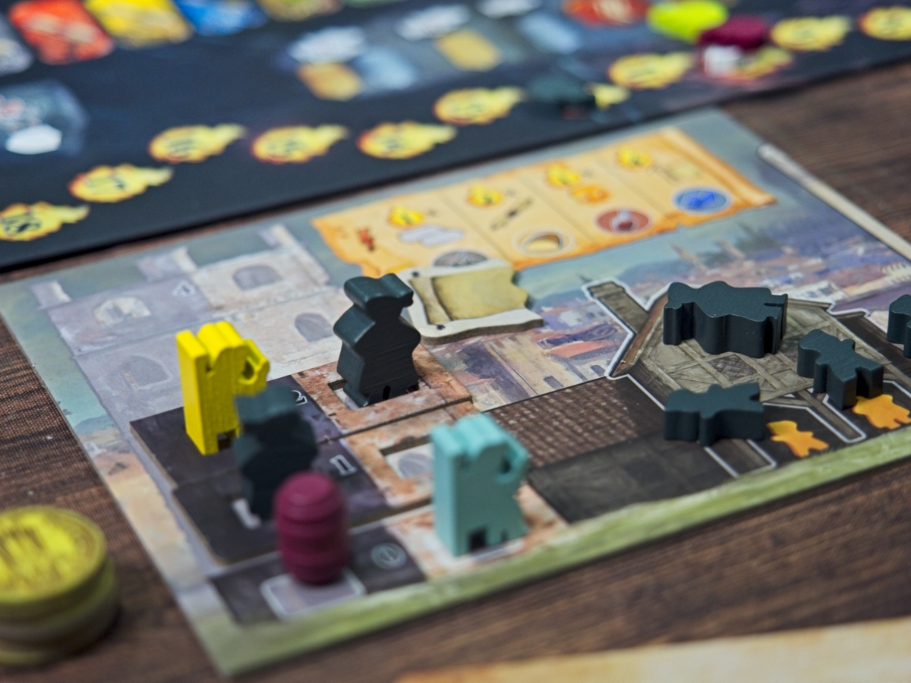
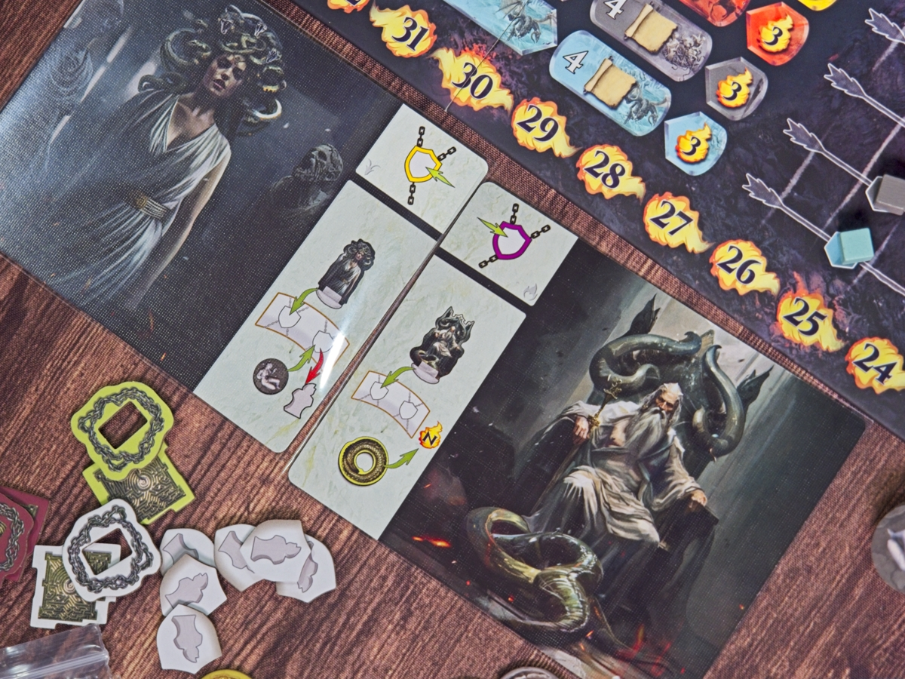
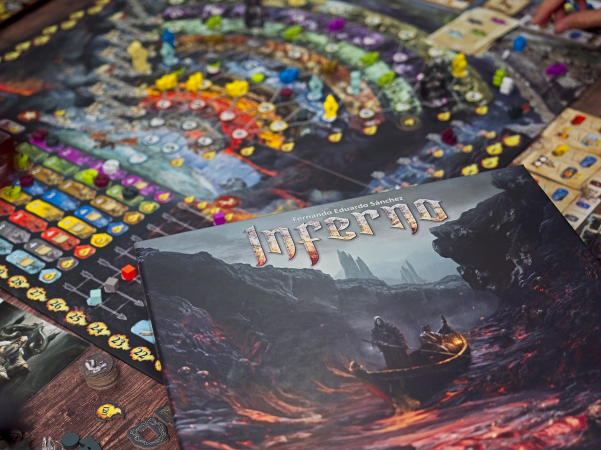

Inferno - ตอนแถวๆสมัยสุโขทัยบ้านเรา ตอนนั้นกวีเอกชาวเมืองฟลอเรนซ์ (ตอนนั้นยังไม่มีประเทศอิตาลี) นาม ดันเต อลิกิแยรี (ถ้ารู้สึกว่าชื่อยังกะตัวเอกเกม Devil May Cry ก็มาจากแหล่งนี้แหละ) แต่งเรื่องเกี่ยวกับการเดินทางของตัวเองไปยังปรภพ พร้อมกับบรรยายถึงการลงโทษจากบาปต่างๆในความเชื่อของชาวคริสต์ ซึ่งแบ่งนรกออกเป็นชั้นๆรูปทรงกรวยที่มี ลูซิเฟอร์ เทวดาตกสวรรค์รออยู่ในชั้นล่างสุด

ที่เล่ามาก็เกี่ยวกับเกมนิดเดียวนั้นคือนรกที่เป็นทรงกรวยและมีดันเตคอยเดินนับแทรคว่าจะจบเกมเมื่อไร.....

เกมนี้เราจะได้ควบคุมโลกสองฝั่ง นั้นคือโลกบนดินที่เราจะได้ทำแอคชั่นบริหารทรัพยากรไปตามเรื่องและโลกใต้ดินในนรกที่เราจะต้องนำทางวิญญาณบาปทั้งหลายให้เดินทางไปสู่จุดหมายปลายทาง

ระบบทีน่าสนใจของเกมคือเราต้องเริ่มจากการขยับวิญญาณในนรกก่อน จะหยิบจากสุสานพร้อมกับจ่ายเงินเป็นค่าเดินเรือข้ามแม่น้ำ หรือจะขยับตัวอื่นก็ได้ เกมมีวิญญาณบาปแยกสีกันตามแต่ชนิดบาปเป็นของส่วนกลางไม่มีเจ้าของ ถ้าขยับไปถึงนรกภูมิชั้นของตัวเองก็จะนอนจองที่อยู่ตรงนั้นไม่ไปไหนต่อและคนพามาถีงที่จะได้แต้ม แต่การหยิบมาวางมันจะมีสัญลักษณ์อยู่ 4 แบบตามพื้น เราเอาวิญญาณไปลงไอคอนไหน เราก็จะต้องไปทำแอคชั่นบนโลกมนุษย์ในโซนนั้น 

แอคชั่นบนโลกมนุษย์จะมีอยู่แค่ 8 โซน ระบบก็เรียกว่า worker placement ละกันแต่ใครลงก็ได้ไม่แย่งกัน หลักๆจะเป็นการหาทรัพยากรหาเหรียญทองแบบที่ใช้ในโลก พร้อมกับหาทางแปลงไปเป็นเงินสกุลกงเต็กสำหรับใช้ในปรโลก ก็หยิบของวนไปวนมาไปตามเรื่อง

ส่วนที่น่าสนใจในทางโลกมนุษย์ก็คือการ 'โบ๊ย' กล่าวหาว่าแกนั้นแหละคนร้าย!! เพียงชี้นิ้วเราก็จะมีวิญญาณบาปโผล่ขึ้นมาริมแม่น้ำแห่งความตายขึ้นมา 1 ea ซึ่งวิญญาณเป็นของกลางนะไม่มีเจ้าของ แต่ทุกครั้งที่เราทำการส่งวิญญาณไปลงนรกได้เราจะได้เดินแทรคแต้มบาปสีนั้นๆเอาไว้ทำแต้มคูณตอนจบเกม ซึ่งแต้มนี้มันจะมีไอเดียว่าตัวคูณก็ต้องเดิน โควต้าวิญญาณบาปก็ต้องพาไปส่งให้เต็มจะได้คูณเยอะๆ ซึ่งก็แปลว่าเราต้องส่งวิญญาณบาปชนิดนั้นไปเพิ่มวนไปดิ๊ อะไรแบบนั้น

ทุกครั้งที่เราทำการส่งวิญญาณไปดันเตก็จะค่อยๆกระดึบๆไต่ลงไปยังชั้นล่างสุดของนรกไปเรื่อยๆ ลงไปถึงปลายทางเมื่อไรก็จบเกมตอนนั้นแหละ

เกมมีกิมมิคเพิ่มอีกหน่อยคือมันมีการ์เดี้ยนคุมนรกด้วยจำนวนหนึ่ง ในเกมจะสุ่มมาครั้งละสองตัว  ความสามารถก็หลากหลายแต่หลักๆคือเอาไว้ทำให้การนำส่งวิญญาณมันลำบากมากขึ้น แบบเมดูซ่าจะสาบให้วิญญาณกลายเป็นหิน เหมาะเอาไว้ขวางไม่ให้เพื่อนเติมวิญญาณบาปครบแถวตัวคูณมันจะได้ไม่เยอะ

---
🐸 ME - #กบเฉย เป็นเกมที่แอบตั้งความหวังไว้นิดหน่อยเพราะเห็นมีแต่คนชม แต่เล่นจริงเจออารมณ์แบบที่โคตรเกลียดในเกมอย่าง Kanban นั้นคือเราเดินทำแอคชั่นแต่เพื่อนที่เล่นทีหลังเราแม่งดันได้แต้มไปเฉ๊ย.....หงุดหงิดฉิบหาย ถ้าไม่ติดว่าระบบเกมโดยรวมผูกออกมาได้ดี มี puzzle ในการแก้ปัญหาที่น่าสนใจ คงกระทืบเอาไปอยู่หมวดเผา.... ซึ่งจริงๆก็อยู่ปากเหวละ.........

เกมพยายามนำเสนอธีมของการนำวิญญาณคนบาปที่เราต้องนำทางลงไปก็จริงแต่ในเชิงการเล่ามันพิกลหน่อยๆ แบบเราเป็นใครนะถึงต้องเดินวนไปมาบนโลกเพื่อ 'โบ๊ย' ความผิดให้มีคนต้องม่องเพื่อให้มีวิญญาณให้เรานำทาง? วิธีการเล่นเองแม้จะสร้าง puzzle ในการบริหารจัดการทรัพยากรที่น่าสนใจแต่ตอนเล่นมันก็เหมือนทำแอคชั่นแปลงของวนไปไม่รู้สึกถึงธีมแต่อย่างใด แต่ไอเดียตอนคิดว่าจะเดินอะไรเพื่อให้มันลงช่องแบบไหนจะได้แอคชั่นยังไงก็สนุกอยู่นะ  แต่ถึงจะว่ายังงี้ผมก็คิดว่าธีมมันสดใหม่เอามากๆ

ปัญหาหลักที่ไม่ชอบเอามากๆ (มากๆๆๆๆ) เป็นการส่วนตัวคือเกมนี้เวลาจะเดินทำแอคชั่นเราต้องขยับวิญญาณให้ตรงไอคอนพื้นที่ แต่ถ้าใครย้ายวิญญาณตรงสีไปถูกขุมนรกของมันคนนั้นจะได้แต้ม ลูปที่เจอทั้งเกมคือตอนเราขยับเดินปุ๊บ คนถัดจากเราจะพูดว่าขอบคุณพร้อมกับหยิบวิญญาณตัวอื่นเดินไต่ข้ามฉับๆไปถึงที่พร้อมทำคะแนน บรรยาการมันเลยมัวแต่จมอยู่กับการระวังไม่ให้ใส่พานทางเดินดีๆให้คนอื่นมากกว่าจะมาคิดว่าตัวเองจะได้ทำแอคชั่นอะไร ซึ่งผมรำคาญเอามากๆ ยิ่งพอเล่นแบบ 4 คนที่ state เกมเปลี่ยนไปเยอะกว่าจะวนมาถึงเราเกมมันเลยดูมั่วๆไปหมดคิดอะไรต่อเนื่องไม่ค่อยได้เหมือนหลงอยู่ใน limbo ตลอดเวลา

🔴 expert  | 🟠 regular | : เกมบริหารทรัพยากรเพื่อนำทางวิญญาณสีตรงกันให้วิ่งลงไปยังนรกขุมสีตรง เกมเล่นกับความคิดสองจังหวะของการต้องมองแอคชั่นที่อยากจะเล่นแล้วขยับวิญญาณไปลงให้ตรงช่อง โดยที่ต้องระวังให้ไม่เผลออวยคนถัดไปได้ง่ายๆ

🟢casual/family | 🧸newbie : ระบบการเล่นมีขยักที่ไม่ตรงไปตรงมานักแม้ไอเดียหลักจะเข้าใจไม่ยาก แต่ใช้ขยักความคิดที่แอบจุกจิก ก็ยังไม่แนะนำสำหรับมือใหม่นะ

---
> 🐸 ME - ความเห็นส่วนตัวสำหรับตัวเองเพื่อตัวเอง
> 🔴 expert - ผ่านเกมมาเยอะ อ่านเกมใหม่ตลอด
> 🟠 regular - เล่นบ่อยเล่นประจำออกตระเวนเล่น
> 🟢casual/family - เล่นที่ร้านเล่นหรือกับครอบครัว
> 🧸newbie - มือใหม่พึ่งเข้าวงการผ่านเกมตามร้านมานิดหน่อย

---  

เดี๋ยวนี้เปิดระบบสมาชิกละครับ ซึ่งก็ว่ากันตรงๆว่าไม่มีสิทธิ์พิเศษอะไร แต่สำหรับคนอยากสนับสนุนค่ากาแฟและอาหารแมวให้กำลังใจครับ - https://www.facebook.com/boardnbon/subscribe/