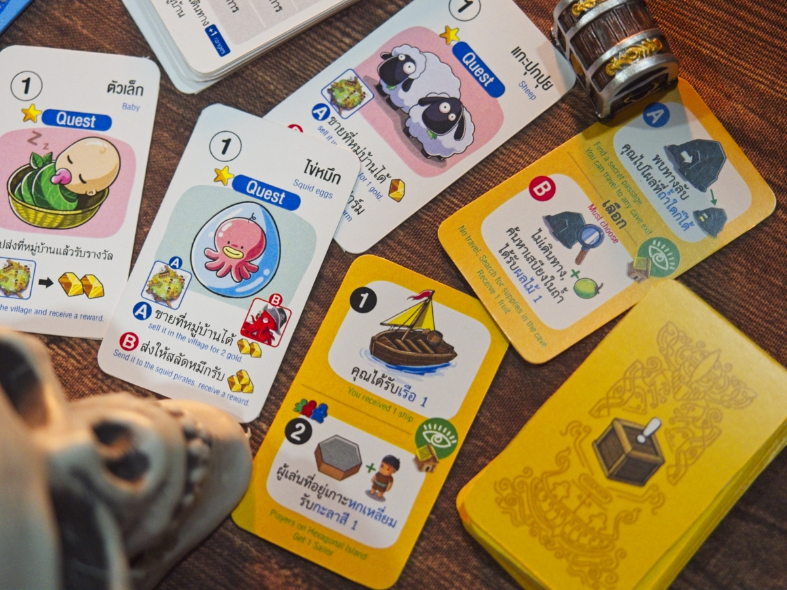
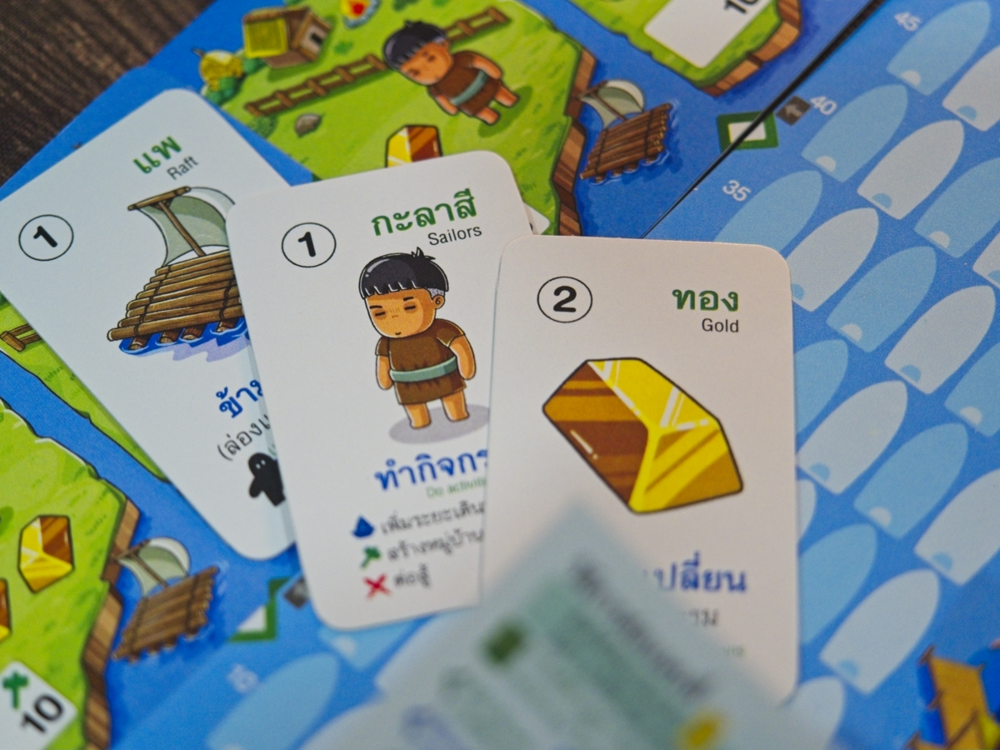
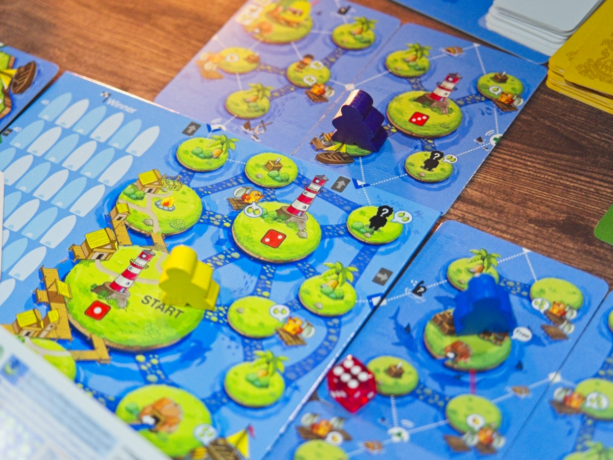
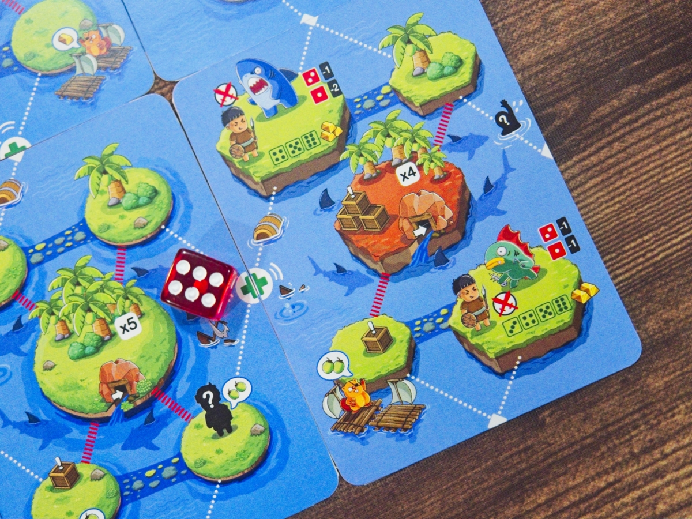

ขุมทรัพย์กะลาสี - ฉันจะเป็นเจ้าแห่งโจรสลัดให้ได้เลยยยยยยยยยยยยยยยย

เกมเป็นแนวเดินทางเปิดแผนที่สำรวจโลกของเกมที่จะสุ่มเส้นทางให้เราข้ามจากเกาะสู่เกาะประหนึ่งเดินในแกรนด์ไลน์ เป้าหมายคือการทำเควสตามรายทาง ไม่ก็สะสมทรัพยากรไปสร้างหมู่บ้าน

เป็นเกมที่อย่าพึ่งดูผ่านๆแล้วข้ามไปคิดว่าไม่มีอะไร การนำเสนอเกมมันหลอกตาเยอะอยู่  ในหนึ่งรอบผู้เล่นจะได้ทำแค่ 1 แอคชั่นเท่านั้นคือเดิน เกมจะมีเงื่อนไขนิดหน่อยให้เล่นการ์ดแพหรือเรือเพื่อเพิ่มจำนวนมูฟได้แล้วก็จะมีเส้นทางที่ต้องใช้ยานพาหนะเฉพาะแบบในการข้าม ถ้าไปสุดขอบแผนที่ก็จะให้จั่วแผนที่ใบใหม่มาวางต่อกันไปเรื่อยๆ 

การ์ดแผนที่แต่ละใบจะมีหลายเกาะ ซึ่งตัวเกาะก็คือแอคชั่นเลยมีตั้งแต่พื้นๆอย่างลงไปได้ของ (มีมะพร้าว, ทองคำ, กะลาสี) เกาะที่เอาของไปแลก ถ้ามีของครบจำนวนก็เอาไปเคลมมิชชั่นกลางที่เป็นการสร้างหมู่บ้าน ซึ่งนอกจากของธรรมดาๆพวกนี้มันจะมีลูกเรือที่มีความสามารถพิเศษ (ซึ่งต้องไปช่วยจากตอนกำลังจมน้ำ....) แล้วก็เควสส่งของไปตามเรื่อง 

ส่วนที่คิดว่าแบลนมาได้น่าสนใจของเกมก็คือพวกเกาะแอคชั่นแบบทอยเต๋าที่อย่าพึ่งยี้ คือแต่ละเกาะมันมีความน่าจะเป็นแบบถ่วงไว้อยู่ล่ะ ถ้าอยากเข้าแปลว่าสมัครใจไปเสี่ยงตารางก็มีบอก แต่จะเล่นเพลย์เซฟก็ได้ ลูกเรือที่ไปเก็บมาแต่ละตัวความสามารถก็กวนใช้ได้

เกมก็เล่นไปเรื่อยสะสมแต้มครบตัดจบเลย

---
🐸 ME - #กบโอเค  ฟังแล้วอาจจะโอเว่อร์ไปซักหน่อย แต่ผมคิดว่ามันเป็นการทำเกมขายในแบบที่ เห้ย! เกมไทยมันก็ทำแบบนี้ได้เว้ย! คือในความดูเหมือนเกมไม่มีอะไร แต่มันมีความเอนจิเนียร์ที่จะทำเกมเล่นง่ายๆแต่ต่อสู้กับข้อจำกัดเรื่องงบประมาณได้แบบสู้มือ (และฉลาด แถมพ่วงไม่มาพร่ำบ่น) คือเป็นเกมที่พยายามนำเสนอระบบหนักแน่นมากมายแบบที่เกมสมัยใหม่มีในคราบที่ดูตอนแรกนึกว่าเกมเดินทอย (ที่จริงๆไม่ได้เป็นเกมทอยเดิน) 

แน่ละว่าไม่ใช่เกมที่อยู่ๆผมจะหยิบมาเล่นเอง แต่มันมีภาพของกลุ่มเด็กประถมอยากเล่นเกมที่มันดูมีสตอรี่ย์มีการเดินทาง แล้วยังได้ทอยเต๋าลุ้นตลกๆ แต่ในฐานะที่เราเป็นสายเกมเมอร์เราก็ไม่อยากให้ลูกหลานเล่นเกมที่มันวินเทจเกินไปใช่ป่ะ เกมนี้คือนำเสนอจุดร่วมที่ผมคิดว่าดีนะ แบบเกมอย่าง Quest Master เนี่ยมันคือวินเทจไปทุกสิ่ง แต่เกมนี้คือหน้าตานึกว่าวินเทจแต่ใส่แนวคิดของเกมสมัยใหม่เข้าไปแนบเนียนพอตัว การสุ่มโน้นนี้สำหรับผมคือกำลังตลกดีสำหรับเกมเด็ก

ส่วนที่เป็นข้อเสียจริงๆของเกมถ้าไม่นับตัวหนังสือที่ตัวเล็กเกิ๊นนน (เกมให้เด็กเล่นก็จริงแต่คนอ่านเป็นผู้ใหญ่นะเฟ้ย)  ก็คือความดื้อที่อยากจะระบบมากมายและความอยากยัดวิธีการเล่นให้มันหลากหลายมาเนี่ยแหละทำให้ตัวคู่มือมันต้องเขียนเบียดๆกันประหนึ่งโน็ตที่อาจารย์บอกให้จดใส่กระดาษได้ 1 แผ่น คือมันแน่น แบบแน่นเกิ๊นนนนน อ่านแบบเกมเมอร์ก็ยังปวดหัว อ่านแบบคนไม่เล่นเกมนี้ยังนึกไม่ออกว่าจะได้เล่นไหมนะ

เรื่องคู่มือก็ติอีกนิดคือวิธี setup เขียนงงเกิ๊น คือเข้าใจแหละว่ามีการถ่วงกับจัดกลุ่มมาละ แต่อธิบายได้งงเกินไป (ตัวอย่างคือบอกให้เอาการ์ดเกาะทรงกลมวางแยกไว้ด้านบน แต่เกาะกลมกับเกาะไม่กลมนี้แยกกันแทบไม่ออก....)

ในแง่การออกแบบผมชอบไอเดียแผนที่เป็นการ์ดมากๆ คือมันเป็นวิธีการแก้ปัญหาที่ง่ายและฉลาดดี ทำให้เกมมีความสุ่มไม่ตายตัว แล้วก็ชอบในความ production แบบตั้งใจทำราคาให้ต่ำแบบอยากให้มันเข้าถึงง่ายๆแล้วไปลดต้นทุนของที่ไม่จำเป็นแบบกดสุดแล้วสุดอีก (ภาพหลังการ์ดเควสยังไม่พิมพ์เลย) แต่ยังดื้อฉิบหายไม่ออกแบบเกมแบบลวกๆใส่ความติสที่อยากจะเล่าไว้เต็มที่

🔴 expert  | 🟠 regular | 🟢casual/family | 🧸newbie : เกมธีมผจญภัยสำหรับเด็กประถมที่ไม่มีการแกล้งขัดขากันโหดๆ มีแกล้งกันจางๆแต่เน้นเปิดแผนที่สำรวจเส้นทางเก็บของแลกรางวัล 

---
> 🐸 ME - ความเห็นส่วนตัวสำหรับตัวเองเพื่อตัวเอง
> 🔴 expert - ผ่านเกมมาเยอะ อ่านเกมใหม่ตลอด
> 🟠 regular - เล่นบ่อยเล่นประจำออกตระเวนเล่น
> 🟢casual/family - เล่นที่ร้านเล่นหรือกับครอบครัว
> 🧸newbie - มือใหม่พึ่งเข้าวงการผ่านเกมตามร้านมานิดหน่อย

---  
this is a gifted product from Goddice Game no money changed hand for this content. ได้รับสินค้าโดยไม่มีค่าใช้จ่าย คอนเทนต์ทำเพื่อแสดงความเห็นส่วนตัวเกี่ยวกับเกมโดยไม่มีการจ้างวาน

เดี๋ยวนี้เปิดระบบสมาชิกละครับ ซึ่งก็ว่ากันตรงๆว่าไม่มีสิทธิ์พิเศษอะไร แต่สำหรับคนอยากสนับสนุนค่ากาแฟและอาหารแมวให้กำลังใจครับ - https://www.facebook.com/boardnbon/subscribe/